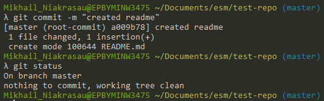
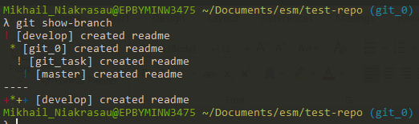
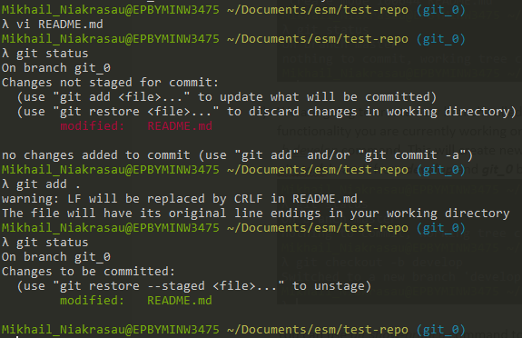

# GIT

## Materials
1. [The most useful git commands](https://orga.cat/posts/most-useful-git-commands)
2. [Vim](https://docs.oracle.com/cd/E19683-01/806-7612/editorvi-5/index.html)
3. [Official resource to learn git](https://git-scm.com/doc)
4. [Git online sandbox](https://learngitbranching.js.org/)

## Practice

### Task 1
We are going to set up simple git branching strategy.

1. Create empty git repository with *git init* command. Also read up about --bare option and bare repositories themselves.

2. Let us create new file with *touch README.md* command.

3. To modify the existing file, we will use VIM text editor. This editor is widely used for rebasing and other git activities so every developer should get used to it. Type vim README.md command to open vim text editor. Press letter *i* to enter the insert mode. Type in “Hello World” or something you like. Press *escape* on the keyboard to exit from insert mode and go to the command mode. In the command mode press *shift + ZZ* to save current file and exit.

\
In the bottom left corner of the above screenshot you can see that currently the editor is in insert mode.

4. To check the progress type *git status* command. You should see that readme file is untracked now. You should check for a status as often as it is possible. If you always read status carefully enough, you will never end up in strange unpredictable situations.\

5. To track readme you can use *git add .* command. This will track and stage all the files in the current directory. Now you should see that your readme file is green which means it is also staged. Take a moment to read about tracking and staging and how they are different with each other.\

6. It is time to commit changes. To create commit use *git commit -m “created readme”* command which will create commit with corresponding message. Your working tree should be clean now.

7. We are going to create new branch called develop, which will contain all the functionality you are currently working on. To create a new branch, execute *git checkout -b develop* command. This will create new branch from the current (master). Create ***git\_task*** branch from ***develop*** and ***git\_0*** branch from ***git\_task***.
\
You can use *git show-branch* command to view all branches at once. The branch you are currently working with is marked with ***\**** symbol.\

8. Now we will add some changes to README.md, with ***vim***, check status, stage changes with *git add README.md* command, commit changes, check the result (status) then checkout to ***git\_task*** branch (with *git checkout git\_task* command) and **merge** changes from ***git\_0*** branch with *git merge git\_0 --no-ff* command. Take some time to read about merging and **no-ff** option. This is usually the default pull request merging behavior so you will work with it on you daily basis.
\
Also note that you can view staged changes with *git diff --cached* command. For example tere we can see that new line “changes from git\_0” was added to the file.\

\
Also note that you can view your latest changes with *gitk* command (which should invoke gitk tool). If this command does nothing or returns error, this usually means that you do not have gitk installed by default (e.g. working from mac). This tool is not necessary and is the matter of choice.\
\
You can also use *git show-branch* command (or even *git log* command) to quickly look through your recent work.

9. Now repeat merging process to get your commit to ***master*** (through ***develop*** of course) branch. When you finish, you can use something this *git log --all --graph --decorate --oneline --simplify-by-decoration* or this *git log --graph --oneline –all* command. These commands were found on the stackoverflow as an answer to a question of viewing git history as a tree. This is not the best solution but it is more than enough for our needs. You output should look similar to this:
\
From this picture you can see that the HEAD is currently looking at the master’s latest commit. We have created 5 commits: 2 with actual edits and 3 merge commits.

**The idea here is simple.** You should always develop you features in custom branches made from ***develop*** branch. When you feature is ready it goes to the ***develop*** branch (usually with pull request instead of merge). When the release time has come, all the merging to the ***develop*** branch should stop (or you may create custom ***pre\_release*** branches with locked functionality). ***develop*** branch (or ***pre\_release***) should be tested and stabilized. As soon as the branch is stable, it goes to the ***master*** branch (or you may have different ***release*** branches and even don’t have a ***master***, or don’t use ***master*** branch at all). This procedure might differ from project to project and always should be designed with the respect to the concrete project and goals. All this helps to keep the repository clean and always have some stable versions for the production.

### Task 2

#### Part 1
We are going to practice some skills obtained in the previous task. If you come across something you still don’t know, please use links provided in the descriptions, internet search, other mentees and you mentor as sources of knowledge and help.
For this task you will create two separate branches ***git\_1*** and ***git\_2*** in your remote repository and local tracked branches with same names. Both these branches should be made of the ***git\_task*** branch.
1. ***git\_1***: Add and commit *firstFile.txt* file with 10 lines.
2. ***git\_1***: Add and commit *secondFile.txt* file with 10 lines.
3. Merge branch ***git\_1*** to ***git\_2***
4. ***git\_2*:** Update and commit any **two** lines in *secondFile.txt*.
5. ***git\_1*:** Update and commit **the same** 2 lines with the different info in *secondFile.txt*
6. Merge branch ***git\_2*** to ***git\_1*,** resolve conflict. Left **all** (4) modified lines. Commit.
7. ***git\_1***: Update and commit 1.txt file, modify two lines.
8. ***git\_1***: Update and commit 1.txt file, modify **another** two lines.
9. Transfer changes of commit from Step 7 only to ***git\_2*,** using **format patch**.
10. Transfer changes of commit from Step 8 only to ***git\_2*,** using **cherrypick** command.
11. ***git\_2*:** Concatenate the last two commits using ***reset** + **commit*** commands.
12. ***git\_2*:** Change date, author and message of the last commit and add non-empty *thirdFile.txt* file to it.
13. ***git\_2***: Create a **new** commit that *reverts* changes of the last one.
14. ***git\_2*:** Create and commit *thirdFile.txt* file.
15. ***git\_2***: Run command that removes all changes of the last two commits.
16. Synchronize ***git\_1*** and ***git\_2*** with a remote repository.
17. Clone your project to another folder.
18. **folder2: *git\_1*:** Change two lines in *firstFile.txt*. **Commit** + **Push**.
19. **folder1: *git\_1*:** Change **another** two lines in *firstFile.txt*.
20. **folder1: *git\_1*:*   
    * Change **another** line in *firstFile.txt* (not the same as in 18, 19).
    * **Merge** changes from Step 18 (pull) **without** committing changes from Step 19 and any additional commits.
    * **Push**.
    * Return local state of Step 19. (***stash***)

#### Part 2
For this task you should learn how to use **interactive rebase**, thus other ways of achieving the same are prohibited. Show the following steps to your mentor during the demo:
1. Create ***git\_3*** branch from ***git\_task***. Checkout to ***git\_3***.
2. Add new empty file *doubtingFile.txt* and commit it.
3. Add a line to a file and commit changes. Do it 5 times. You should end up with 5 lines in a file and 6 commits: 1 for creating an empty file and 5 for adding a line.
4. Check you log and copy it somewhere.
5. Launch interactive rebase for 5 last commits, squash all the latest commits into the first one. Reword first commit. You should end up with 2 commits: 1 for creating an empty file and second for adding 5 lines. Second commit should have new commit message.
6. Check you log and compare it with the previous one. Look at the hash, date, commit message. Explain what changed and why.
7. Check you reflog. Explain to you mentor what you can see and why.

## Demo

### Practical Part
Mentee should be able to demonstrate Task 2 on demo session.

### Theoretical Part
Mentee should be able to answer questions during demo session.

## Extra Materials

1. [Useful git commands](https://davidwalsh.name/git-commands)
2. [Vim commands cheat sheet](https://www.fprintf.net/vimCheatSheet.html)
3. [Vim basics](https://youtu.be/zNnsNtBF80g)
4. [vim adventures](https://vim-adventures.com/)
5. [Epam learning git](https://learn.epam.com/detailsPage?id=601f195a-d408-4439-a16d-0630ed2a412e)
6. [Git optional](https://try.github.io/)
7. [Git videos](https://youtu.be/jUlT-zQ-mbk)
8. [10-minutes git concepts video](https://youtu.be/8KCQe9Pm1kg)
9. [Mastering git](https://youtu.be/ZgCCnv9LxzA)
