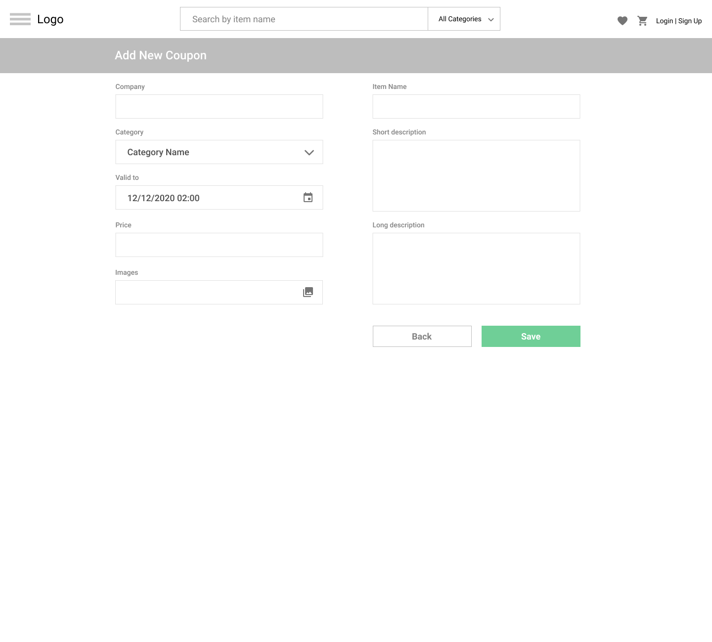

# READING

1. [How to structure your HTML page](https://developer.mozilla.org/en-US/docs/Learn/HTML/Introduction_to_HTML/Document_and_website_structure)
2. [HTML/CSS basics tutorial](https://www.internetingishard.com/html-and-css/)
3. [Mozilla CSS Guide](https://developer.mozilla.org/en-US/docs/Learn/CSS)
4. [CSS property definitions with a visualization](https://cssreference.io)
5. [Flexbox guide](https://css-tricks.com/snippets/css/a-guide-to-flexbox)
6. [Flexbox exercise](https://flexboxfroggy.com)
7. [HTML/CSS Style Guideline](https://google.github.io/styleguide/htmlcssguide.html)

# PRACTICE
## Example

### User Login

### Register

### Add New Item

### Main Page

### Item Details

### Checkout

## Task

In this task, you need to create basic pages for your future web application. All pages must be created using plain HTML and CSS. Styles that are similar between the pages might be extracted into separate files in order to avoid copy-paste. 

### Application requirements

1. Use [Material](https://material.io/resources/icons) as a source of svg icons.
2. Using CSS preprocessors like Sass or Less is allowed and advisable.

### Application restrictions

1. 3rd party web component libraries (i.e. Bootstrap, Foundation, Polymer) are **not** allowed.

# DEMO
## Practical part

Mentee should be able to demonstrate his test project.

## Theoretical part

Mentee should be able to answer questions during demo session.