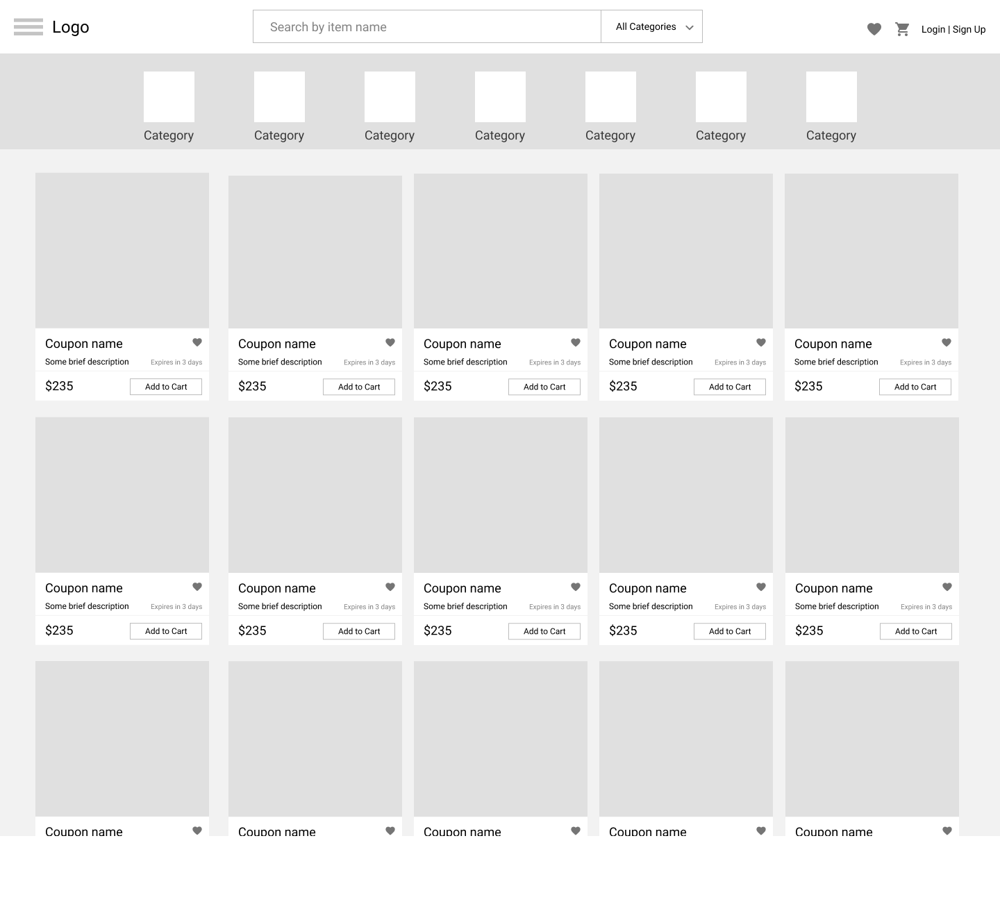
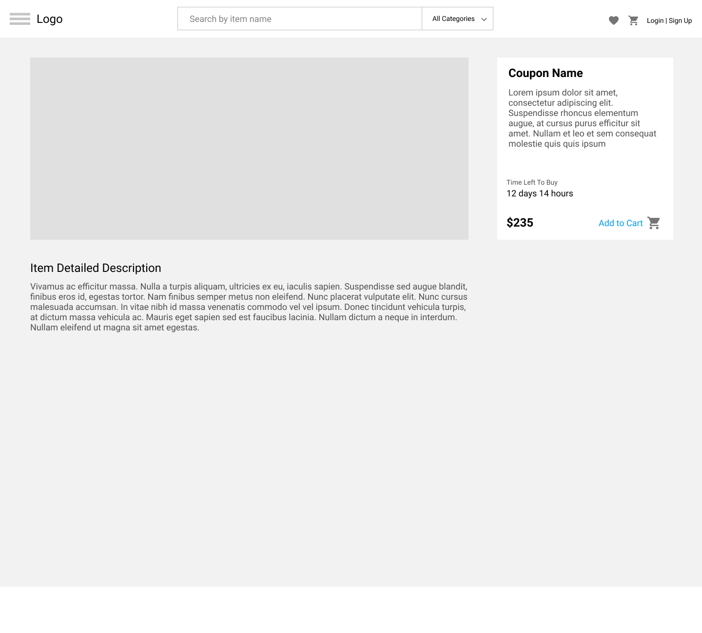

# HTML Task

## Description

In this task, you need to create basic pages for your future web application. All pages must be created using plain HTML and CSS. Styles that are similar between the pages might be extracted into separate files in order to avoid copy-paste. 

## Prerequisites

* 3rd party web component libraries (i.e. Bootstrap, Foundation, Polymer) are **not** allowed.
* Use [Material](https://material.io/resources/icons) as a source of svg icons.
* Using CSS preprocessors like Sass or Less is allowed and advisable.

## Useful Links
Here's a list of usful materials that might help you in the process:

* [How to structure your HTML page](https://developer.mozilla.org/en-US/docs/Learn/HTML/Introduction_to_HTML/Document_and_website_structure)
* [HTML/CSS basics tutorial](https://www.internetingishard.com/html-and-css/)
* [Mozilla CSS Guide](https://developer.mozilla.org/en-US/docs/Learn/CSS)
* [CSS property definitions with a visualization](https://cssreference.io)
* [Flexbox guide](https://css-tricks.com/snippets/css/a-guide-to-flexbox)
* [Flexbox exercise](https://flexboxfroggy.com)
* [HTML/CSS Style Guideline](https://google.github.io/styleguide/htmlcssguide.html)

## Application Pages

### User Login

### Register

### Add New Item

### Main Page

### Item Details

### Checkout

