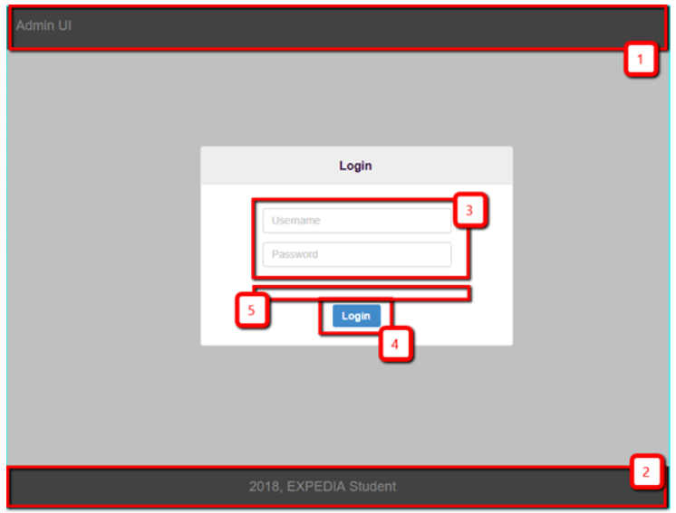
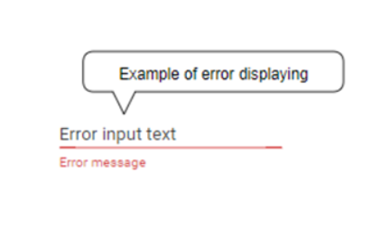
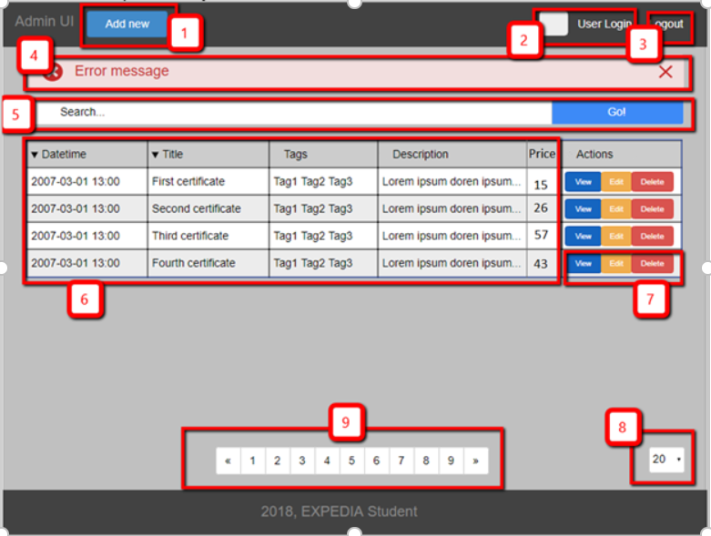
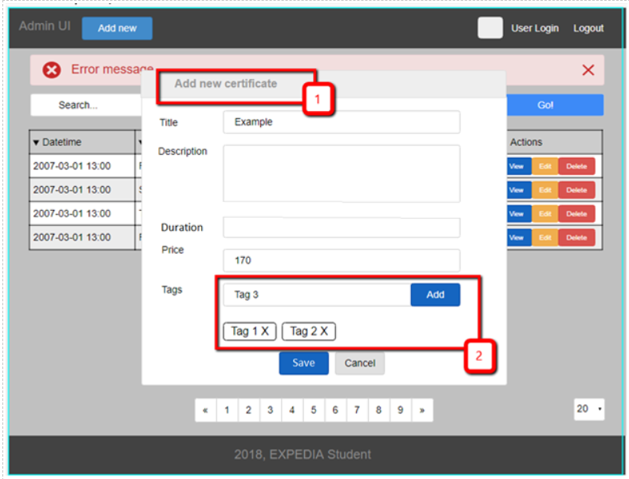
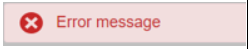
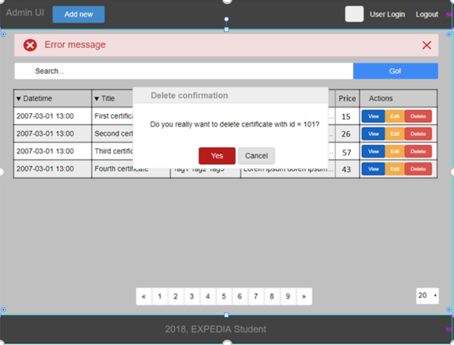

# READING

1. [Getting started with web. Reading (10 min)](https://developer.mozilla.org/en-US/docs/Learn/Getting_started_with_the_web) 
2. [Installing basic software. Reading (10 min)](https://developer.mozilla.org/en-US/docs/Learn/Getting_started_with_the_web/Installing_basic_software) 
3. [Website overview. Reading (10 min)](https://developer.mozilla.org/en-US/docs/Learn/Getting_started_with_the_web/What_will_your_website_look_like)
4. [Website structure. Reading (10 min)](https://developer.mozilla.org/en-US/docs/Learn/Getting_started_with_the_web/Dealing_with_files)
5. [HTML basics. Reading (20 min)](https://developer.mozilla.org/en-US/docs/Learn/Getting_started_with_the_web/HTML_basics)
6. [CSS basics. Reading (20 min)](https://developer.mozilla.org/en-US/docs/Learn/Getting_started_with_the_web/CSS_basics)
7. [JavaScript basics. Reading (20 min)](https://developer.mozilla.org/en-US/docs/Learn/Getting_started_with_the_web/JavaScript_basics) 
8. [JavaScript intermediate (re-introduction). Reading (40 min)](https://developer.mozilla.org/en-US/docs/Web/JavaScript/A_re-introduction_to_JavaScript) 
9. [Publishing site. Reading (10 min)](https://developer.mozilla.org/en-US/docs/Learn/Getting_started_with_the_web/Publishing_your_website)
10. [Simplified view of webpage in the browser. Reading (5 min)](https://developer.mozilla.org/en-US/docs/Learn/Getting_started_with_the_web/How_the_Web_works)

# PRACTICE
## Getting started

1. Read INSTALLATION and MAIN CONCEPTS guide: https://reactjs.org/docs/getting-started.html 
    
    * !Note: we’ll use create-react-app, so follow instructions on: https://github.com/facebook/create-react-app to create new React app 

2. Complete tutorial: https://reactjs.org/tutorial/tutorial.html 

React application usually contains not only React dependencies. Some third party libraries may be useful for solving specific problems. You are not limited to this set of technologies, but this is a recommended setup:
     1. Routing in application. Transitions between pages handled by a special component. https://reacttraining.com/react-router/native/guides/quick-start
     2. Data fetching. HTTP requests to server: https://developer.mozilla.org/en-US/docs/Web/API/Fetch_API
     3. Site theme & UI components: Bootstrap (https://getbootstrap.com/) or React Versions (React Bootstrap https://github.com/react-bootstrap/react-bootstrap or Reactstrap  
     4. Data storage in UI application: redux(https://redux.js.org/)

## Task
### Application requirements

1. EcmaScript, JSX (https://reactjs.org/docs/introducing-jsx.html)
2. Development Environment: Visual Studio Code or any
3. create-react-app https://github.com/facebook/create-react-app
4. The Latest version of React 
5. Node & NPM
6. HTML5
7. The Latest version of CSS

### General requirements

1. Include UI in an executable jar. Running on local dev server only for development purposes. 
2. Bootstrap can be used.
3. Refreshing of a page should not affect pagination.
4. Duplication of browser’s tab should lead to exactly the same page (pagination, etc.). Modals may be hidden. Local storage may be used only for security and profile info purposes. All search state should be in url. 
5. Styles of header and footer should be implemented according to the mockups, should be static and be stuck to the top and on the bottom of the page.
6. Code should be readable, easy maintainable and reusable. 
7. Follow component-based application structure.
8. Screenshots of working application should be attached to a merge request. 
9. In scope of this task backend may be changed a bit, but without rewriting significant amount of code 

## Example

1. Login page (localhost:<port>/login)

1. Navbar fixed to top 
2. Footer on bottom 
3. Login and password input fields 
4. Login button. When login successful, redirect to “Certificate List page”. 
5. Error returned from server area. (such as “Login or Password is not found” 

Input fields should be validated, and inline error messages should be displayed according to the following rules:  
     a. No blank fields
     b. Login field length must not be less than 3 characters and greater than 30 characters 
     c. Password length must not be less than 4 characters and greater than 30 characters 

Example of field inline validation error (valid for all forms):

2. Certificate list page (localhost:<port>/certificates)

1. Add new. Open “Add or edit” modal 
2. Current user login and picture (picture is optional) 
3. Logout action. Go to “Login page” after successful logout 
4. Error message in case server returned error. Closeable. *Autohide (Optional)
5. Search field and action. User can filter data by tags, title, description.
For example, fluffy #(little cat) #(fun) - find certificates that correspond all statements below:
        * have tags “little cat” and “fun” 
        * contain “fluffy” in title or description.
6. By default, data is ordered by creation date. Sort icon show current sort order (asc, desc), ex: . Clicking on icon trigger sort by corresponding field.
7. Go to “Add or edit” or “Delete” Modal Views
8. Page size. Values: 10, 20, 50.
9. Paging. First and last page should be always accessible. A current page is highlighted.

3. Add or Edit certificate

1. Title is “Add New Certificate” or “Edit certificate with ID = <id>”. In case of Edit data must be pre-populated. 
2. Create your own component /or reuse something like https://www.npmjs.com/package/react-tag-input. Title, description and price fields are required and should be validated according to the following rules:  
     * No blank fields
     * Title field must not be less than 6 and greater than 30 characters
     * Description field must not be less than 12 and greater than 1000 characters
     * Price must be a number or float and be greater than 0
Duration must be a number. 0 – indicates this is an infinite certificate
Otherwise, if one of the conditions is not met, inline validation error shown in component, like. 'Tag' field is optional, but tag name should be not less than 3 and greater than 15 characters. After submit, modal must be hidden and data in table reloaded. This action should reload current page. In case of error show inline error shown under modal header, like:

4. Delete certificate

Modal confirmation. If user click ‘Yes’, certificate must be deleted, modal hidden and data in table reloaded.

# DEMO
## Practical part

Mentee should be able to demonstrate his test project.

## Theoretical part

Mentee should be able to answer questions during demo session.