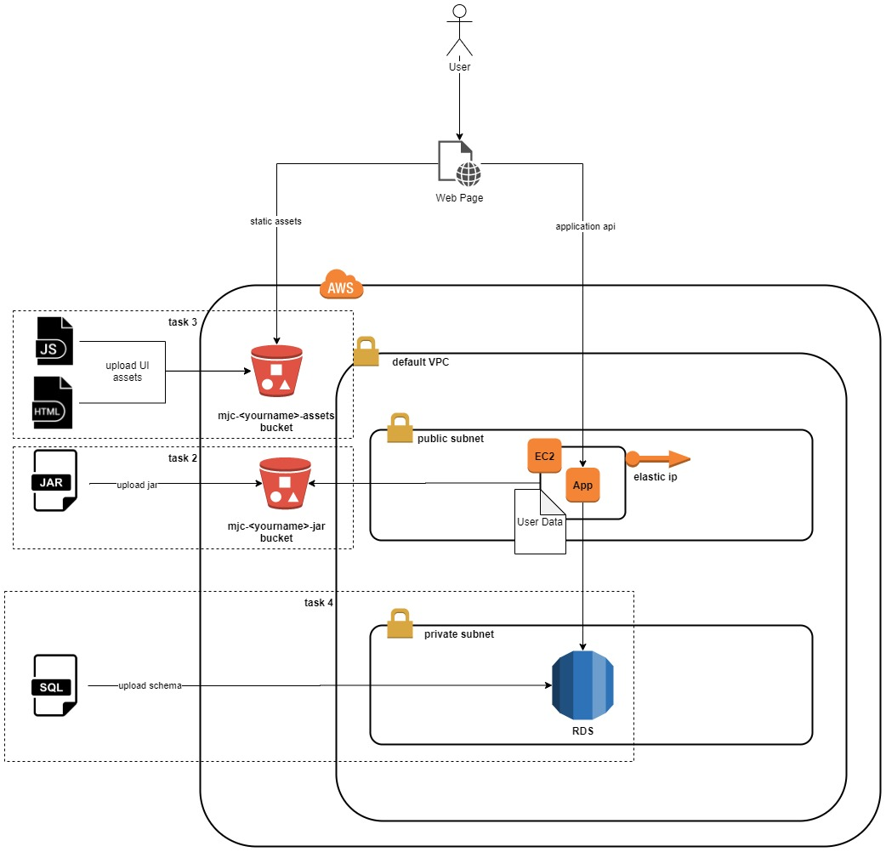

# AWS Introduction
The goal of the module is to make you familiar with the Cloud computing concepts, main features and patterns, give you the feeling what are the benefits it brings and when it's worth using in real life. Being most widely spread Amazon Web Services (AWS) cloud provider is to be used as main source of knowledge and tasks for the given module.

## Materials
* [Cloud Computing Fundamentals](https://youtu.be/uroryFU78gM)
* [AWS Official Documentation](https://docs.aws.amazon.com/index.html)
* [AWS Essentials](https://www.youtube.com/playlist?list=PLv2a_5pNAko0Mijc6mnv04xeOut443Wnk)
* [AWS Tutorial for Begginers](https://youtu.be/IT1X42D1KeA)
* [AWS Concepts](https://www.youtube.com/playlist?list=PLv2a_5pNAko2Jl4Ks7V428ttvy-Fj4NKU)
* [AWS Identity and Access Management (IAM)](https://aws.amazon.com/iam/)
* [Best Practices in IAM](https://docs.aws.amazon.com/IAM/latest/UserGuide/best-practices.html)
* [Amazon S3](https://aws.amazon.com/s3/)
* [Getting started with S3](https://docs.aws.amazon.com/AmazonS3/latest/gsg/GetStartedWithS3.html)
* [Amazon Relational Database Service (RDS)](https://aws.amazon.com/rds/)
* [Getting Started with Amazon RDS](https://docs.aws.amazon.com/AmazonRDS/latest/UserGuide/CHAP_GettingStarted.html)
* [Amazon EC2](https://aws.amazon.com/ec2/)
* [Setting up with Amazon EC2](https://docs.aws.amazon.com/AWSEC2/latest/UserGuide/get-set-up-for-amazon-ec2.html)
* [Tutorial: Getting started with Amazon EC2 Linux instances](https://docs.aws.amazon.com/AWSEC2/latest/UserGuide/EC2_GetStarted.html)
* [Regions, Availability Zones, and Local Zones](https://docs.aws.amazon.com/AWSEC2/latest/UserGuide/using-regions-availability-zones.html)
* [Running commands on your Linux instance at launch](https://docs.aws.amazon.com/AWSEC2/latest/UserGuide/user-data.html)
* [Amazon Virtual Private Cloud](https://aws.amazon.com/vpc/)
* [What is Amazon VPC?](https://docs.aws.amazon.com/vpc/latest/userguide/what-is-amazon-vpc.html)
* [Getting started with Amazon VPC](https://docs.aws.amazon.com/vpc/latest/userguide/vpc-getting-started.html)
* [Examples for VPC](https://docs.aws.amazon.com/vpc/latest/userguide/VPC_Scenarios.html)
* [Elastic IP addresses](https://docs.aws.amazon.com/AWSEC2/latest/UserGuide/elastic-ip-addresses-eip.html)

## Disclaimer
**Before starting the module please make sure you understand the principles of [AWS cloud pricing](https://aws.amazon.com/pricing/services).** 
Pay attention to resources that you create, the module should be accomplished using [AWS Free Tier](https://aws.amazon.com/free). **It's your responsibility** to take care of the costs minimization. If you are not sure about the costs of some resource/service please contact your mentor.
Please never commit your account credentials into the git. Do not keep EC2 instances running, stop or terminate instances if you don’t use them.

## Tasks
The goal of the exercise to make your familiar with AWS console, base components available in AWS such as Virtual Private Cloud (VPC), Security Group, EC2, RDS and S3. You also are expected to deploy you application within cloud facilities: web application on top of EC2 instance and static assets within S3 bucket. It also required to integrate with managed database instance (RDS). The deployment flow is not expected to be fully automated and most provision is to be done manually.

### 1. AWS Account Creation
AWS gives you an option to create a free account to browse, discover and use the main services it offers.
To accomplish the  task follow the link [AWS Free Tier](https://aws.amazon.com/free) and complete registration.
### 2. Application Role Creation
In order to access S3 bucket from within your application deployed in EC2 you must make it under authorized identity.
The common approach is to assign a service role that we are to create beforehand.
1. Go to IAM section and navigate to Roles section.
2. Under the section Common use cases select EC2 and assign AmazonS3ReadOnlyAccess permission policy on Role.
3. Save just created Role.
### 3. Upload Application Jar to AWS S3
1. Create mjc-<yourname>-jar S3 bucket.
2. Make sure the bucket is available for the role created on the step above only. It might be achieved through Bucket Policy.
3. Upload your application jar file to the newly created bucket.
### 4. Upload Application UI Files to AWS S3
1. Create mjc-<yourname>-assets S3 bucket.
2. Make sure the bucket is publicly available.
3. Upload your application static content to the newly created bucket.
### 5. Launch RDS instance
1. Start launching RDS instance available within Free Tier (MySQL or PostgreSQL).
2. Select default VPC, Subnet and Security Group. 
3. Make sure Security Group is configured to permit access by port your database is running on.
4. Configure your database with application specific data: schema, tables, data.
### 6. Launch EC2 instance
1. Start launching t2.micro EC2 instance based on Amazon Linux 2 image with default VPC settings. 
2. Assigne the Role created in step 2.
3. Within User Data section add the script that downloads your application from S3 bucket and launchs it. Use aws cli command: aws s3 cp s3://BUCKET-NAME/FILENAME . 
4. In security group settings open the port your application will be running on.
### 7. Terminate or remove all created resources/services once you finished the module and showed a demo.
  
## Questions
1. What is IAM? Please describe shortly what you can do using IAM?
2. What is an IAM User? What is User Group in IAM? What is an IAM Role? What are Policies?
3. What is S3 service in AWS? What is S3 bucket?
4. What is Region?  What is Availability Zone?
5. What is EC2 service? 
6. What is EC2 instance? What types of EC2 instances do you know?
7. What is Private and Public Key during instance creation?
8. What is EC2 instance lifecycle? If we stop and start the server what will happen? What will happen during reboot operation?
9. What is instance user data? How can you make sure that your bootstrapping script completed without errors? 
10. What is AWS RDS? What engines does it support?
11. What is AWS VPC? What are the main components of AWS VPC?
12. How do instances in a VPC access the Internet? What IP types do you know? What will happen with IP during reboot, stop, start?
13. What is the range of IP addresses in VPC? What is CIDR block?
