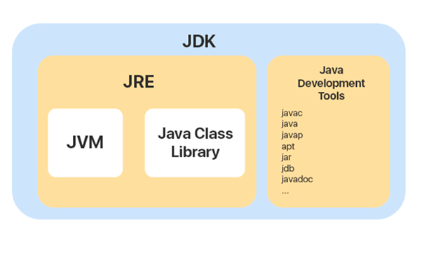

# Infrastructure, AutoCode
## Must have to read
- [JVM vs. JRE vs. JDK: What is the Difference?](https://www.ibm.com/cloud/blog/jvm-vs-jre-vs-jdk "JVM vs. JRE vs. JDK: What's the Difference?")
- [Differences between JDK, JRE and JVM](https://www.geeksforgeeks.org/differences-jdk-jre-jvm/ "Differences between JDK, JRE and JVM")

## Setting up an environment. JDK/JRE/JVM

### JDK
An essential toolkit for Java development. The JDK includes:
an environment for executing Java programs called JRE. If you only need to run Java programs, without writing Java code, you can install the JRE separately.
a set of necessary utilities (javac, java debuggers, java docs, etc.). For example, the javac utility converts written code into intermediate byte code.

### JRE
Runtime environment for Java programs. Included in JDK by default. JRE contains core libraries, class loader, and JVM.

### JVM
A virtual machine that runs Java programs. It is part of the JRE. For each separate running Java program, its own JVM instance is created.

### Installing JDK
JDK is required for Java developers. It contains a Java compiler that allows you to compile your code written in Java in the byte code that JVM can understand. It also contains everything that you need to run Java applications.
#### To install JDK follow the next steps:
1. Go to https://www.oracle.com/java/technologies/downloads/. On the page, you can see there are several options. You can install the latest JDK version (currently it is JDK 18) or choose the earlier ones. I would recommend installing the latest one. You will have a new feature introduced in the latest version, and you will be able to run code from the previous versions like Java 8.
2. Choose a system you are working on. On the page, you will see Linux/macOS/Windows sections. Choose an appropriate one.
3. Find an option to download. You can download Java as an archive or as an installer.
4. Install or archive the downloaded file.
5. After installing, whether it is an archive or not, check the PATH environment variable. It should contain a path to the JDK bin directory. An example in window systems C:\java\jdk1.8.0_202\bin. The details may be found by the link
6. Set JAVA_HOME environment variable. Some third-party programs (for example IntelliJ Idea) expect this environment variable to be set to the installation directory of the JDK. JAVA_HOME should not include a bin directory in the path. An example in window systems C:\java\jdk1.8.0_202
7. Open Command Prompt and do the following commands (both the commands should run successfully and return the current version of the java installed in a system):
    - javac -version
    - java -version

### Installing IDE
IntelliJ Idea is the most popular IDE in the modern Java world, so in this section, we will consider installing this IDE. The IDE can be downloaded as Community or paid Ultimate version. All the most important features, that may need in development, exist in the Community version.

So, it is enough to install the Community version for now by the following steps:
1. Go to https://www.jetbrains.com/ru-ru/idea/download/
2. Choose your system Windows/macOS/Linux and a file type .exe or .zip and press the Download button for the Community version.
3. After it is downloaded, run the installer or archive in the appropriate folder.
4. After it finishes installing, you can run IntelliJ Idea and create your first project. Details may be found by the link

##
### Installing Git
The next important tool that should be installed is Git. Git is distributed version control system. Such web services like GitHub, GitLab, and others, where you can search committed code, are based on Git. Thus, installing Git is a required step if you want to push/pull any changes from a remote repository. It also might be useful when you are just working locally and would like to store the history of the changes.

To install Git on Windows, follow the next steps:
1. Go to https://git-scm.com/download/win and the download will start automatically.
2. Run the installer. Leave checkboxes and other settings as they are by default.
3. After the installing is done, run Command Prompt and perform the following command to make sure that Git was installed successfully:
    - git --version
      For other systems like Linux or macOS, the instructions may be found by the [link](https://git-scm.com/book/en/v2/Getting-Started-Installing-Git "link").

### Installing Maven
Last but not the least tool that should be installed is Maven. Maven is a framework for project build automation. In short, it allows you to specify dependencies of your code in one place (pom.xml) and then compile your code with those dependencies by running tasks. With Maven, you can simply run the "compile" task that will compile your project’s code. If you did it manually, you would have to run the javac command with all the dependencies listed in the classpath.
1. Go to https://maven.apache.org/download.cgi
2. In the Files sections, find and download Binary zip archive (currently it is apache-maven-3.8.3-bin.zip)
3. After it is downloaded, unzip the archive into any folder.
4. Create MAVEN_HOME and M2_HOME environment variables which will point out to maven directory (an example: C:\tools\maven)
5. Add a path to maven bin directory to a Path environment variable (an example: C:\tools\maven\bin)
6. Open Command Prompt and perform the next command:
    - mvn -v

### Git. Version of control
Version control system is a necessary tool for maintaining the history of changes in your files. After editing and saving the files, we want to see who made the changes and when, as well as be able to revert to any of the previous versions. For this, we need a version control system that allows us to navigate through the history of changes.

#### What is Git
Git is a free and open source distributed version control system designed to handle everything from small to very large projects with speed and efficiency.
**Source:** https://git-scm.com/

#### Gitlab and Github
**GitLab**: GitLab is a repository hosting manager tool that is developed by GitLab Inc and is used for the software development process. It provides a variety of management by which we can streamline our collaborative workflow for completing the software development lifecycle. It also allows us to import the repository from Google Code, Bitbucket, etc.

**GitHub**: GitHub is a repository hosting service tool that features collaboration and access control. It is a platform for programmers to fix bugs together and host open-source projects. GitHub is designed for the developers and to help them track their changes into a project through the repository. Following are some features of GitHub

You can see detailed difference using this [link](https://www.geeksforgeeks.org/difference-between-gitlab-and-github/ "link").

### Unit testing. Junit
A unit test is a way of testing a unit - the smallest piece of code that can be logically isolated in a system. In most programming languages, that is a function, a subroutine, a method or property.

JUnit is a unit testing framework for Java programming language. It plays a crucial role test-driven development, and is a family of unit testing frameworks collectively known as xUnit. JUnit promotes the idea of "first testing then coding", which emphasizes on setting up the test data for a piece of code that can be tested first and then implemented. This approach is like "test a little, code a little, test a little, code a little." It increases the productivity of the programmer and the stability of program code, which in turn reduces the stress on the programmer and the time spent on debugging.

**Sources:**
- https://smartbear.com/learn/automated-testing/what-is-unit-testing/
- https://www.tutorialspoint.com/junit/junit_overview.htm