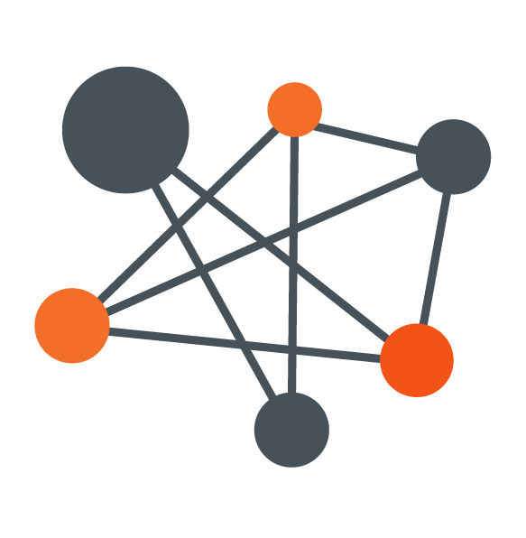

<h1 align="center">Algorithms. Data structures</h1>

## Contents

1. [Intro to algorithms](/lesson%20#01%20Intro%20to%20algorithms/README.md)
2. [Algorithmic complexity. Big-O notation](/lesson%20#02%20Algorithmic%20complexity.%20Big-O%20notation/README.md)
3. [Linear search. Binary search](/lesson%20#03%20Linear%20search.%20Binary%20search/README.md)
4. [Data structures (Intro)](</lesson%20#04%20Data%20structures%20(Intro)/README.md>)
5. [Data structures (Linear)](</lesson%20#05%20Data%20structures%20(Linear)/README.md>)
6. [Data structures (Non-Linear)](</lesson%20#06%20Data%20structures%20(Non-Linear)/README.md>)
7. [Recursion](/lesson%20#06%20Recursion/README.md)
8. [Sorting algorithms](/lesson%20#07%20Sorting%20algorithms/README.md)

## Algorithms

A fundamental understanding of various algorithms and data structures better equips a software developer to use them properly. Software Engineering is learnt and mastered through practice, so an examination of different problem-solving techniques better prepares you to handle challenges in the future. Eventually, you begin to recognize patterns and that helps you transfer your knowledge and understanding across various domains and problem sets.

Algorithms are just like Granny's recipe book that contains all the steps required to make that special delicacy. In more technical terms, they are “well-defined **computational procedures** that takes some value, or set of values, as **input** and produces some value, or set of values as **output**.

One thing that makes algorithms worth studying is that in most cases, there exists more than one algorithm capable of handling the task at hand as in the library case above. Again in this context, efficiency is key and is determined by considering Time complexity(the execution time of an operation) and Space complexity(memory usage of an operation) of an algorithm.

## Data Structures

A data structure is simply an organized way of storing data for use by computer processes. It is a pattern of collecting and organizing data for performing various operations correctly and efficiently.

Often, the need to handle complex data results in the creation of **Abstract Data Types(ADT)** which are designed to create a logical description of how data is viewed and the operations that can be carried out on them. These **ADTs** allow us handle data more efficiently such that we worry about what the data represents and not how it is constructed. This process is known as Data Encapsulation. Examples of such data types include the **Array**, **List**, **Map**, **Queue**, **Set**, **Stack**, **Table**, **Tree**.
