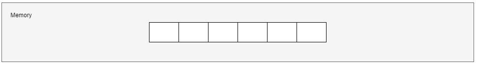
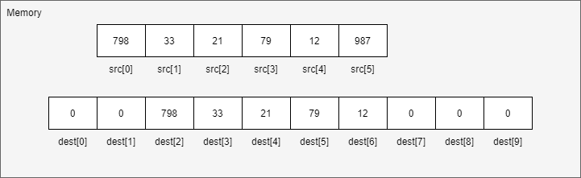

# Algorithms and Data Structures

## Algorithms overview
### What is algorithm?
An _**algorithm**_ is a set of instructions to solve a particular problem. Any code may be called an algorithm. Computer algorithms work via input and output. They take the input and apply each step of the algorithm to that information to generate an output. For example, a search engine is an algorithm that takes a search query as an input and searches its database for items relevant to the words in the query. It then outputs the results.


### Measuring algorithm performance 
While writing a solution we need to find the most efficient algorithm, when a word "efficient" means "running the least time".

In computer science, a term that describes the amount of time it takes to run an algorithm is called "_**Time Complexity**_". Time complexity is commonly estimated by counting the number of elementary operations performed by the algorithm. It is supposed that each elementary operation lasts a fixed amount of time. Thus, in order to measure "time complexity", we should take into account:
* the amount of time taken by an algorithm;
* the number of elementary operations performed by it.

#### Big O Notation
The time complexity is commonly expressed using "Big O notation" (Landau's symbol). It is a special notation that tells you how fast an algorithm is. It’s called "Big O notation" because you put a “big O” in front of the number of operations.


As regards an origin of "Big O notation", it is used in complexity theory, computer science, and mathematics to describe the asymptotic behavior of functions, and it tells you how fast a function grows or declines (you are not supposed to know it, just for your information). Letter "O" is used because the rate of growth of a function is called its ***O***rder.

#### Big O Complexity Chart


"Big O notation" tells us a number of operations, which an algorithm will perform.
There are the following most common types of complexities (from fastest to slowest):
- "O(1)", also known as (henceforce - a.k.a) "_constant time_": the number of operations, which are needed to complete an algorithm, is fixed and doesn't depend on the input number;
- "O(log n)", a.k.a "logarithmic time": the ratio of the operations number to the input size decreases and tends to zero when "n" increases, i.e. the more input is, the less time is needed;
- "O(n)", a.k.a "linear time": running time increases with the size of the input in the linear way, i.e.  ;
- "O(n * log n)", a.k.a "linearithmic time": the "n log n" running time is simply the result of performing a "Θ(log n)" operation "n" times;
- "O(n^2)", a.k.a "quadratic time": the number of operations it performs scales in proportion to the square of the input;
- "O(2^n)", a.k.a "exponential time": any time an input unit increases by 1, it causes you to double the number of operations performed;
- "O(n!)", a.k.a "factorial time": the number of operations it performs scales in proportion to the result of multiplication of all positive integers less than or equal to the input.

"Big O notation" focuses on the "worst-case" scenario. For example, there is a problem, which is to find a contact in your phone book. We choose the following algorithm: look through the phone book from the very beginning to the end. Let's assume that the number of contacts in the phone book is 100 (n=100), and we are looking for a contact named as "Alexandra". It turned out that "Alexandra" is the first entry in the phone book, so in this case the time complexity will be "O(1)" (we performed a constant number of operation: "1", it will be the "best-case" scenario). Now let's find "Yevgeny", who is the last 100th contact (time complexity will be "O(n)"). This case should be considered as the "worst-case" scenario, when we have to look at each contact in the phone book. Thus, the "worst-case" scenario is a concept describing the maximum time complexity for an algorithm.

### Summary
- algorithm is a method for solving a problem;
- algorithm's speed is measured in growth of the number of operations, not in seconds;
- algorithm's execution time is expressed in "Big O notation".

## Data structures
### Overview
Data structures are methods of organizing, processing, retrieving and storing data in a computer system so that operations can be performed upon them more efficiently. More precisely, a data structure is a collection of data values.

There are several basic and advanced types of data structures, all of them are designed to arrange data to match a specific purpose. Data structures allows users to easily access and work with the data they need in appropriate ways. Data structures define the organization of information, in order that both machines and humans can better understand it. 

A data structure may be selected or designed to store data for the purpose of using it with various algorithms. It is not only important to use data structures, but it is also important to choose the proper data structure for each task.

Data structures are divided into two categories:
- Linear data structure (the elements are arranged in sequence one after the other, for example, arrays, linked lists, etc.);


- Non-linear data structure (the elements are arranged in a hierarchical manner where one element will be connected to one or more elements, for example, hash table, tree, etc.).

[comment]: <> (TODO copywriting)


### Arrays
#### Overview 
An array is a linear data structure:
1) which occupies contiguous area of memory:


- a size of an array is defined while its creation;

2) which consists of equal-type elements:



- all elements of an array have the same type;

3) which elements are indexed by contiguous integers:


- every element of an array has its own index. Each element can be accessed by index;
- The first element of an array has a "zero" index in Java.  

4) which has a fixed size:


- a size of an array is defined at array's creation and can't be changed further;
- in order to increase a size of an array, a new array with a desired size should be created, and it is necessary to copy elements there.


#### Need of Arrays
In computer programming, the most of the cases requires to store the large number of data of similar type. To store such amount of data, we need to define a large number of variables. It would be very difficult to remember names of all the variables while writing the programs. Instead of naming all the variables with a different name, it is better to define an array and store all the elements into it.

### Arrays in Java
#### Definition
Arrays are defined and used with the square-brackets _indexing operator_ "**[]**".
In order to define an array reference, 
1) we should just write a desired type with empty square brackets:
```
int[] arrayOfIntegers; // declares an array of integers
```
2) we can also place the square-brackets after the identifier:
```
int arrayOfIntegers[]; // declares an array of integers
```

The above two definitions of an arrays have exactly the same meaning.
But defining an array doesn't mean that we created an array, when array creation means allocating space in memory for storing elements. In order to create an array, we must write an initialization expression.

#### Creation and Initialization
There are several ways to create an array in Java:
1) the most generic way is to use an operator "new" followed by a desired type with a desired array sized surrounded by square brackets

```
int[] arr;        // declares an array of integers
arr = new int[6]; // creates an array of integers
```


It is worth noting that arrays of elements, which are of primitive type, are initialized with default values (in our case each element of an array of integers is initialized with zeros).

2) the special creation way is to write a set of values, which are separated from each other by commas and which are surrounded altogether by curly braces

```
int[] arr;                     // declares an array of integers
arr = {12, 14, 1, 3, 16, 27};  // creates and initializes an array of integers
```


In this case while array creation, its elements will be initialized with desired values.

3) the special creation way has an optional extension: before the aforementioned set of elements in curly braces we can write an operator "new" followed by a desired type and empty square-brackets

```
int[] arr;                              // declares an array of integers
arr = new int[] {12, 14, 1, 3, 16, 27}; // creates and initializes an array of integers
```


An array can be defined, created and initialized in one statement, instead of several: definition and initialization.
```
int[] arr1 = new int[6];                       // declares, creates an array of integers (also initializes implicitly with zeros, only for primitive types)
int[] arr2 = {12, 14, 1, 3, 16, 27};           // declares, creates and initializes an array of integers
int[] arr3 = new int[] {12, 14, 1, 3, 16, 27}; // declares, creates and initializes an array of integers
```

#### Length 
All arrays have an intrinsic member (whether they are arrays of objects or arrays of primitives) that you can query to tell us how many elements there are in the array. This member is "length". Length can not be changed. In order to refer the last element of an array, we should use an index "length - 1".
```
int[] arr = {1, 10, 100};
int a = arr.length;
System.out.println(a);
// Output: 3
```

#### Accessing Array's Elements
In order to access an element of an array, we should write an array's variable and an element's index encapsulated in square braces.

```
int element = arr[5];
System.out.println(element);
// Output: 27
```
When accessing an element, if the index is negative or greater or equal to "length", Java will throw an "ArrayIndexOutOfBoundException".

#### Assigning a value to array's elements
We can assign a value to an array's element by writing an array's variable name followed by an element's index, then use an assignment operator "=" and define a compatible value.
```
int[] arr = new int[6];
arr[5] = 27;
```


#### Iterating Through an Array
We can iterate through an array with the help of an array's "length" property and "for", "while", "do-while" statements.
```
int[] ints = {3, 2, 1};

// "for" statement
for (int i = 0; i < ints.length; i++) {
    int element = ints[i];
    System.out.print(element);
}

// "while" statement
int index = 0;
while (index < ints.length) {
    int element = ints[i];
    System.out.print(element);
    index++;
}

// "do-while" statement
int i = 0;
do {
    System.out.print(ints[i]);
    i++;
} while (index < ints.length);

// Output:
123123123
```

#### Copying an Array
The System class has an arraycopy method that you can use to efficiently copy data from one array into another:
```
public static void arraycopy(Object src, int srcPos, Object dest, int destPos, int length)
```
The 1st Object argument specifies an array "to copy from", the second one defines an array "to copy to". An argument "srcPos" specifies the starting position in the array "to copy from" (source array), "destPos" defines the starting position in the array "to copy to" (destination array), "length" is the number of array's elements, which should be copied.
```
int[] src = {798, 33, 21, 79, 12, 987};
int[] dest = new int[9];
System.arraycopy(src, 0, dest, 2, 5)
```


#### Multidimensional Arrays
Arrays we have mentioned till now are called one-dimensional arrays. However, we can declare multidimensional arrays in Java. A multidimensional array in Java is an array of arrays, that is, each element of a multidimensional array is an array itself.

### Summary
- Data structures should be treated as a method to store information;
- !!!To be filled in the future

## References
1. [[BOOK] Grokking Algorithms An illustrated guide for programmers and other curious people](https://www.manning.com/books/grokking-algorithms?gclid=EAIaIQobChMIiMvGzdvU8wIVjbWyCh3XkgpuEAAYASAAEgKvDfD_BwE)
2. [Time complexity](https://en.wikipedia.org/wiki/Time_complexity)
3. [Big O Notation, Massachusetts Institute of Technology](https://web.mit.edu/16.070/www/lecture/big_o.pdf)