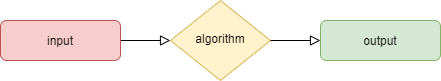

<h1 align="center">Intro to algorithms</h1>

## What is algorithm

An _**algorithm**_ is a set of instructions to solve a particular problem. Any code may be called an algorithm. Computer algorithms work via input and output. They take the input and apply each step of the algorithm to that information to generate an output. For example, a search engine is an algorithm that takes a search query as an input and searches its database for items relevant to the words in the query. It then outputs the results.

- **Input**: What we already know or the things we have to begin with.
- **Algorithm**: A set of sequenced steps that we need to follow one by one.
- **Output**: The expected results we need to achieve in the end.

Apart from mathematics or computer programming, we see algorithms in everyday life. Let’s say you want to cook a dish. Now, you can begin with some ingredients (**the input**) and will follow the recipe. The recipe will have different steps (**the algorithm**) that you can follow to make the dish (**the output**).

## Qualities of good algorithms

- Input and output should be defined precisely.
- Each step in the algorithm should be clear and unambiguous.
- Algorithms should be most effective among many different ways to solve a problem.
- The algorithm must be finite, i.e. it should not end up in an infinite loops or similar.
- The algorithm must be simple, generic and practical, such that it can be executed upon with the available resources. It must not contain some future technology, or anything.
- The Algorithm designed must be language-independent, i.e. it must be just plain instructions that can be implemented in any language, and yet the output will be same, as expected.

#### Advantages of Algorithms

:heavy_plus_sign: It is easy to understand.

:heavy_plus_sign: Algorithm is a step-wise representation of a solution to a given problem.

:heavy_plus_sign: In Algorithm the problem is broken down into smaller pieces or steps hence, it is easier for the programmer to convert it into an actual program.

#### Disadvantages of Algorithms:

:heavy_minus_sign: Writing an algorithm takes a long time so it is time-consuming.

:heavy_minus_sign: Branching and Looping statements are difficult to show in Algorithms.

## Types of algorithms and their uses

It is important to know that algorithms can be classified in different forms. Therefore, you can explore the following types of algorithms and learn how to implement them in possible scenarios.

- **Brute force algorithm:** The general logic structure is applied to design an algorithm. It is also known as an exhaustive search algorithm that searches all the possibilities to provide the required solution. Such algorithms are of two types:
    - **Optimizing**: Finding all the solutions of a problem and then take out the best solution or if the value of the best solution is known then it will terminate if the best solution is known.
    - **Sacrificing**: As soon as the best solution is found, then it will stop.

- **Backtracking algorithm:** This is a modified form of Brute Force in which we backtrack to the previous decision to obtain the desired goal.

- **Randomized algorithm:** As we have seen in a regular algorithm, we have predefined input and required output. Those algorithms that have some defined set of inputs and required output, and follow some described steps are known as deterministic algorithms. What happens that when the random variable is introduced in the randomized algorithm?. In a randomized algorithm, some random bits are introduced by the algorithm and added in the input to produce the output, which is random in nature. Randomized algorithms are simpler and efficient than the deterministic algorithm.

- **Recursive algorithm:** This follows a loop, in which we follow a pattern of the possible cases to obtain a solution.

- **Greedy algorithm:** In this, we make a decision by considering the local (immediate) best option and assume it as a global optimal.

- **Divide and conquer algorithm:** This type of algorithm will divide the main problem into sub-problems and then would solve them individually.

- **Dynamic programming algorithm:** This is an advanced algorithm in which we remember the choices we made in the past and apply them in future scenarios.

### The major categories of algorithms are given below:
- **Sort:** Algorithm developed for sorting the items in a certain order.
- **Search:** Algorithm developed for searching the items inside a data structure.
- **Delete:** Algorithm developed for deleting the existing element from the data     structure.
- **Insert:** Algorithm developed for inserting an item inside a data structure.
- **Update:** Algorithm developed for updating the existing element inside a data structure.

## One problem, multiple solutions:

One of the really interesting aspects of algorithms is that, for any given problem, there are numerous solutions. Whether they be simple, elegant, speedy, or inefficient, they are all valid, as long as they produce the desired outputs.

In a group of learners, it’s entirely possible to get a different, but correct, algorithm created by each of them. At this point, it’s important to acknowledge their correctness, but also to encourage conversations and compare the merits of each approach. It’s this higher-order thinking that programmers need, in order to evaluate the ‘best’ approach whilst being aware of alternatives.

## References

1. [What is an Algorithm](https://www.javatpoint.com/data-structure-algorithm)
2. [Most important type of Algorithms](https://www.geeksforgeeks.org/most-important-type-of-algorithms/)
