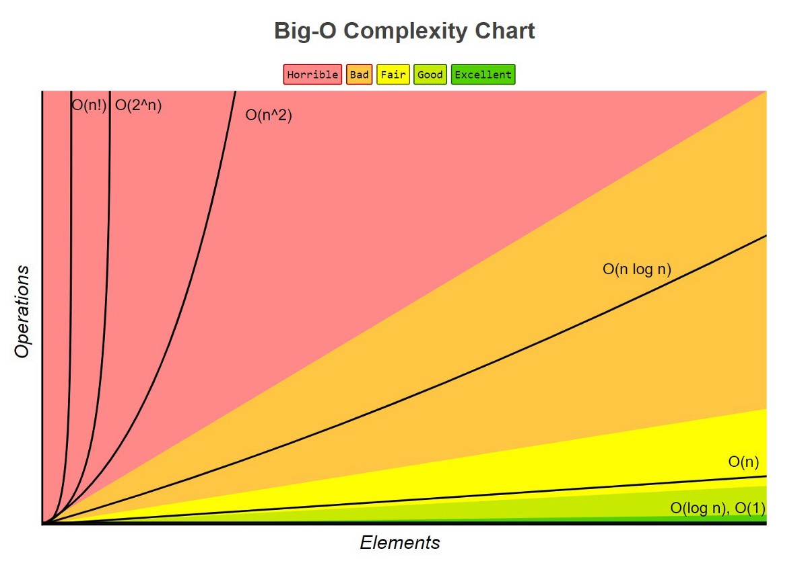
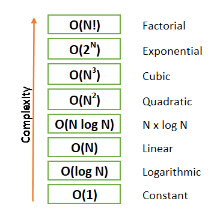
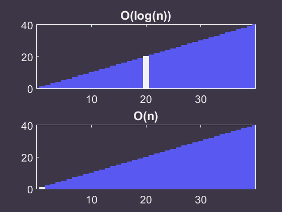
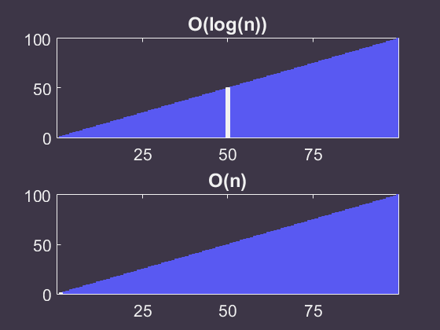
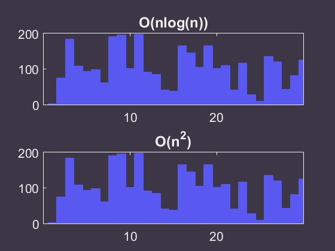

<h1 align="center">Algorithmic complexity. Big-O notation</h1>

## Measuring algorithm performance

While writing a solution we need to find the most efficient algorithm, when a word "efficient" means "running the least time".

In computer science, a term that describes the amount of time it takes to run an algorithm is called "_**Time Complexity**_". Time complexity is commonly estimated by counting the number of elementary operations performed by the algorithm. It is supposed that each elementary operation lasts a fixed amount of time. Thus, in order to measure "time complexity", we should take into account:

- the amount of time taken by an algorithm;
- the number of elementary operations performed by it.

An algorithm may not have the same performance for different types of inputs. With the increase in the input size, the performance will change.

The study of change in performance of the algorithm with the change in the order of the input size is defined as asymptotic analysis.

## Asymptotic Notations

Asymptotic notations are the mathematical notations used to describe the running time of an algorithm when the input tends towards a particular value or a limiting value.

For example: In **bubble sort**, when the input array is already sorted, the time taken by the algorithm is linear i.e. the best case.

But, when the input array is in reverse condition, the algorithm takes the maximum time (quadratic) to sort the elements i.e. the worst case.

When the input array is neither sorted nor in reverse order, then it takes average time. These durations are denoted using asymptotic notations.

There are mainly three asymptotic notations:

- Big-O notation
- Omega notation
- Theta notation

### Big-O Notation (O-notation)

The time complexity is commonly expressed using **"Big-O notation"** (Landau's symbol). It is a special notation that tells you how fast an algorithm is. It’s called "Big-O notation" because you put a “big O” in front of the number of operations.

Big-O notation represents the **upper bound of the running time** of an algorithm. Thus, it gives the worst-case complexity of an algorithm.

As regards an origin of "Big O notation", it is used in complexity theory, computer science, and mathematics to describe the asymptotic behavior of functions, and it tells you how fast a function grows or declines (you are not supposed to know it, just for your information). Letter "O" is used because the rate of growth of a function is called its **O**rder.

#### Big-O Complexity Chart

**"Big-O notation"** tells us a number of operations, which an algorithm will perform.
There are the following most common types of complexities (**from fastest to slowest**):

- **O(1)** - **_constant time_**: the number of operations, which are needed to complete an algorithm, is fixed and doesn't depend on the input number;
- **O(log n)** - **_logarithmic time_**: the ratio of the operations number to the input size decreases and tends to zero when "n" increases, i.e. the more input is, the less time is needed;
- **O(n)** - **_linear time_**: running time increases with the size of the input in the linear way, i.e. ;
- **O(n \* log n)** - **_linearithmic time_**: the "n log n" running time is simply the result of performing a "Θ(log n)" operation "n" times;
- **O(n2)** - **_quadratic time_**: the number of operations it performs scales in proportion to the square of the input;
- **O(2n)** - **_exponential time_**: any time an input unit increases by 1, it causes you to double the number of operations performed;
- **O(n!)** - **_factorial time_**: the number of operations it performs scales in proportion to the result of multiplication of all positive integers less than or equal to the input.

**"Big-O notation"** focuses on **the worst-case** scenario. For example, there is a problem, which is to find a contact in your phone book. We choose the following algorithm: look through the phone book from the very beginning to the end. Let's assume that the number of contacts in the phone book is 100 (n=100), and we are looking for a contact named as "Alexandra". It turned out that "Alexandra" is the first entry in the phone book, so in this case the time complexity will be **O(1)** (we performed a constant number of operation: "1", it will be the "best-case" scenario). Now let's find "Yevgeny", who is the last 100th contact (time complexity will be **O(n)**). This case should be considered as the "worst-case" scenario, when we have to look at each contact in the phone book. Thus, the "worst-case" scenario is a concept describing the maximum time complexity for an algorithm.

### Omega Notation (Ω-notation)

Omega notation represents the lower bound of the running time of an algorithm. Thus, it provides **the best case** complexity of an algorithm.

### Theta Notation (Θ-notation)

Theta notation encloses the function from above and below. Since it represents the upper and the lower bound of the running time of an algorithm, it is used for analyzing **the average-case** complexity of an algorithm.

---

**_
But in most cases, you won't need to consider anything other than Big-O notation
_**

---

## Visualization

1. Each algorithm attempts to find the number 29 in a set of 40 numbers sorted from low to high. Algorithms have **O(n)** and **O(log(n))** complexity. Each step of the algorithm **takes 1 second** in the gif below, and the current location is highlighted:

2. Each algorithm attempts to find the number 83 in a set of 100 numbers sorted from low to high. Each step of the algorithm **takes 0.5 seconds** in the gif below, and the current location is again highlighted.

3. And the last one. Consider two sorting algorithms with complexities of **O(n \* log(n))** (e.g Quick Sort) and **O(n2)** (e.g Bubble Sort). Let's say they sort items in some Array.

Hopefully this gives a sense of the differences in algorithm complexities. Choosing a better algorithm can greatly increase the speed of your code which is generally extremely important. Note also that complexity term was used to mean 'time complexity' here. There are also memory and space complexities that were ignored here.

### Summary

- Algorithm is a method for solving a problem;
- Algorithm's speed is measured in growth of the number of operations, not in seconds;
- Algorithm's execution time is expressed in **Big-O / Omega / Theta** notations.

## References

1. 
2. 
3. 
