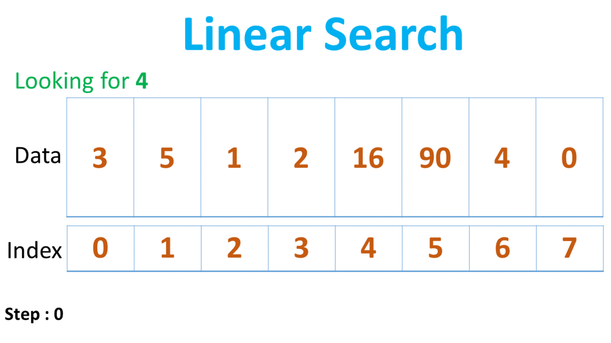
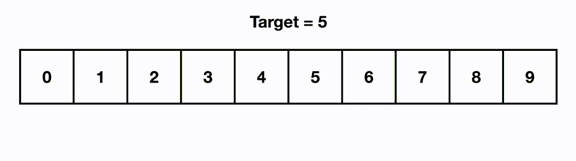
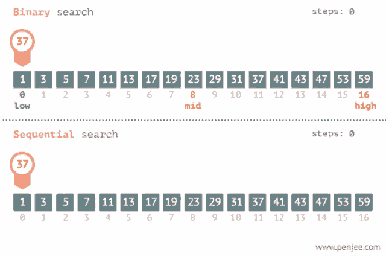

<h1 align="center">Linear search. Binary seacrh</h1>

Two popular search methods are **Linear Search** and **Binary Search**. So, here we will discuss the popular searching technique, i.e., **Linear Search Algorithm**.

## Linear Search

Linear search is also called as **sequential search algorithm**. It is the simplest searching algorithm. In Linear search, we simply traverse the list completely and match each element of the list with the item whose location is to be found. If the match is found, then the location of the item is returned; otherwise, the algorithm returns **NULL**.

It is widely used to search an element from the unordered list, i.e., the list in which items are not sorted. The worst-case time complexity of linear search is **O(n)**.

### Linear Search approach:

- We have to traverse the array elements using a **for** loop.
- In each iteration of for loop, compare the search element with the current array element, and:
  - If the element matches, then return the index of the corresponding array element.
  - If the element doesn't match, then move to the next element.
- If there is no match or the search element is not present in the given array, return -1.

### Visualization

<p align="center"></p>

### Linear Search complexity

Now, let's see the time complexity of linear search in the best case, average case, and worst case.

| Case         | Time Complexity |
| :----------- | :-------------: |
| Best Case    |    **O(1)**     |
| Average Case |    **O(n)**     |
| Worst Case   |    **O(n)**     |

- **Best Case Complexity** - In Linear search, best case occurs when the element we are finding is at the first position of the array. The best-case time complexity of linear search is **O(1)**.
- **Average Case Complexity** - The average case time complexity of linear search is **O(n)**.
- **Worst Case Complexity** - In Linear search, the worst case occurs when the element we are looking is present at the end of the array. The worst-case in linear search could be when the target element is not present in the given array, and we have to traverse the entire array. The worst-case time complexity of linear search is **O(n)**.
  The time complexity of linear search is **O(n)** because every element in the array is compared only once.

### Example in Java

```java
class LinearSearch {
  public static int linearSearch(int array[], int x) {
  int n = array.length;

  // Going through array sequencially
  for (int i = 0; i < n; i++) {
    if (array[i] == x)
    return i;
  }
  return -1;
  }

  public static void main(String args[]) {
  int array[] = { 2, 4, 0, 1, 9 };
  int x = 1;

  int result = linearSearch(array, x);

  if (result == -1)
    System.out.print("Element not found");
  else
    System.out.print("Element found at index: " + result);
  }
}
```

## Binary Search

Binary search is the search technique that works efficiently on **sorted lists**. Hence, to search an element into some list using the binary search technique, we **must ensure that the list is sorted**.

Binary search follows the divide and conquer approach in which the list is divided into two halves, and the item is compared with the middle element of the list. If the match is found then, the location of the middle element is returned. Otherwise, we search into either of the halves depending upon the result produced through the match.

### Binary Search aproach

Binary Search is a searching algorithm used in a sorted array by repeatedly dividing the search interval in half. The idea of binary search is to use the information that the array is sorted and reduce the time complexity to **O(log n)**. The basic steps to perform Binary Search are:

- Begin with an interval covering the whole array.
- If the value of the search key is less than the item in the middle of the interval, narrow the interval to the lower half.
- Otherwise, narrow it to the upper half.
- Repeatedly check until the value is found or the interval is empty.

### Visualization

<p align="center"></p>

### Binary Search complexity

Now, let's see the time complexity of Binary search in the best case, average case, and worst case.

| Case         | Time Complexity |
| :----------- | :-------------: |
| Best Case    |    **O(1)**     |
| Average Case |  **O(log n)**   |
| Worst Case   |  **O(log n)**   |

- **Best Case Complexity** - In Binary search, best case occurs when the element to search is found in first comparison, i.e., when the first middle element itself is the element to be searched. The best-case time complexity of Binary search is **O(1)**.
- **Average Case Complexity** - he average case time complexity of Binary search is **O(log n)**.
- **Worst Case Complexity** - In Binary search, the worst case occurs, when we have to keep reducing the search space till it has only one element. The worst-case time complexity of Binary search is **O(logn)**.

### Example in Java (Iterative Method)

```java
class BinarySearch {
  int binarySearch(int array[], int x, int low, int high) {

    // Repeat until the pointers low and high meet each other
    while (low <= high) {
      int mid = low + (high - low) / 2;

      if (array[mid] == x)
        return mid;

      if (array[mid] < x)
        low = mid + 1;

      else
        high = mid - 1;
    }

    return -1;
  }

  public static void main(String args[]) {
    BinarySearch ob = new BinarySearch();
    int array[] = { 3, 4, 5, 6, 7, 8, 9 };
    int n = array.length;
    int x = 4;
    int result = ob.binarySearch(array, x, 0, n - 1);
    if (result == -1)
      System.out.println("Not found");
    else
      System.out.println("Element found at index " + result);
  }
}
```

## Binary Search vs Linear Search(Sequential)

### Important Differences

- Input data needs to be sorted in Binary Search and **not** in Linear Search
- Linear search does the sequential access whereas Binary search access data randomly.
- Time complexity of linear search - **O(n)** , Binary search has time complexity **O(log n)**.
- Linear search performs equality comparisons and Binary search performs ordering comparisons

<p align="center"></p>

## References

1. []()
2. []()
3. []()
