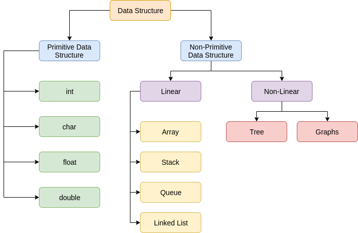

<h1 align="center">Data structures (Intro)</h1>

**Data structures** are the ways of organizing and storing data in a computer so that we can perform several operations efficiently on it. It is widely used in every aspect of computer science.

There are several basic and advanced types of data structures, all of them are designed to arrange data to match a specific purpose. Data structures allows users to easily access and work with the data they need in appropriate ways. Data structures define the organization of information, in order that both machines and humans can better understand it.

A data structure may be selected or designed to store data for the purpose of using it with various algorithms. It is not only important to use data structures, but it is also important to choose the proper data structure for each task.

> **Note:** Data structure and data types are slightly different. Data structure is the collection of data types arranged in a specific order.

_
P.S The diagram doesn't reflect the full structure of all possible data structures. This is just an example of the basic and most commonly used data structures
_

### Data structures are primarily categorized into two parts:

- **Primitive Data Structure** - these are the predefined way of storing data in the system. All sets of operations are pre-defined. Char, int, float, double are examples of primitive data structures.

- **Non-Primitive Data Structure** - the data structures which are designed using primitive data structures are called non-primitive data structures. They are used to store a collection of data. It can be categorized into two parts:
  - Linear data structure
  - Non-Linear data structure

### Data structures can also be classified as:

- **Static data structure:** It is a type of data structure where the size is allocated at the compile time. Therefore, the maximum size is fixed.
- **Dynamic data structure:** It is a type of data structure where the size is allocated at the run time. Therefore, the maximum size is flexible.

### The following are the advantages of a data structure:

:heavy_plus_sign: **Efficiency:** If the choice of a data structure for implementing a particular ADT is proper, it makes the program very efficient in terms of time and space.

:heavy_plus_sign: **Reusability:** The data structure provides reusability means that multiple client programs can use the data structure.

:heavy_plus_sign: **Abstraction:** The data structure specified by an ADT also provides the level of abstraction. The client cannot see the internal working of the data structure, so it does not have to worry about the implementation part. The client can only see the interface.

## Linear data structures

In linear data structures, the elements are arranged in sequence one after the other. Since elements are arranged in particular order, they are easy to implement as computer memory is also sequential.

However, when the complexity of the program increases, the linear data structures might not be the best choice because of operational complexities.

## Non-Linear data structures

Unlike linear data structures, elements in non-linear data structures are not in any sequence. Instead they are arranged in a hierarchical manner where one element will be connected to one or more elements.

Non-linear data structures are further divided into graph and tree based data structures.

Such data structures supports multi-level storage and often cannot be traversed in single run. Such data structures are not easy to implement but are more efficient in utilizing computer memory.

## Differences between the Linear data structure and non-linear data structure

|                        |                                             Linear Data structure                                             |                                                  Non-Linear Data structure                                                  |
| :--------------------- | :-----------------------------------------------------------------------------------------------------------: | :-------------------------------------------------------------------------------------------------------------------------: |
| **Basic**              |       In this structure, the elements are arranged sequentially or linearly and attached to one another       |                      In this structure, the elements are arranged hierarchically or non-linear manner                       |
| **Implementation**     |                                Linear data structures are easier to implement                                 |         Non-linear data structures are difficult to understand and implement as compared to linear data structures          |
| **Traversal**          |      As linear data structure is a single level, so it requires a single run to traverse each data item       | The data items in a non-linear data structure cannot be accessed in a single run. It requires multiple runs to be traversed |
| **Arrangement**        |                           Each data item is attached to the previous and next items                           |                                          Each item is attached to many other items                                          |
| **Levels**             | This data structure does not contain any hierarchy, and all the data elements are organized in a single level |                         In non-linear data structure, data elements are present at multiple levels                          |
| **Memory utilization** |         Linear data structures are not very memory friendly and are not utilizing memory efficiently          |                                   Non-linear data structures uses memory very efficiently                                   |
| **Time complexity**    |                Time complexity of linear data structure often increases with increase in size                 |                       Time complexity of non-linear data structure often remain with increase in size                       |
| **Applications**       |                      Linear data structures are mainly used for developing the software                       |                     Non-linear data structures are used in image processing and Artificial Intelligence                     |

## References

1. 
2. 
3. 
