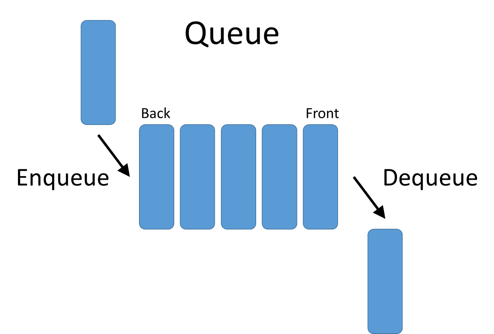

<h1 align="center">Data structures (Linear)</h1>

It is a type of data structure where the arrangement of the data follows a linear trend. The data elements are arranged linearly such that the element is directly linked to its previous and the next elements. As the elements are stored linearly, the structure supports single-level storage of data. And hence, traversal of the data is achieved through a single run only.

## Array
An array is a structure of fixed-size, which can hold items of the same data type. It can be an array of integers, an array of floating-point numbers, an array of strings or even an array of arrays (such as 2-dimensional arrays). Arrays are indexed, meaning that random access is possible.

We can access the element of the array by the index of elements. In an array, the index always starts at 0. To prevent memory wastage, users should create an array of dynamic sizes.

### Arrays can be of 3 types:
- Single Dimensional Arrays
- Two-dimensional Arrays
- Multi-dimensional arrays

### Arrays operations
- **Traverse:** Go through the elements and print them.
- **Search:** Search for an element in the array. You can search the element by its value or its index
- **Update:** Update the value of an existing element at a given index

**Inserting** elements to an array and deleting elements from an array cannot be done straight away as arrays are fixed in size. If you want to insert an element to an array, first you will have to create a new array with increased size **(current size + 1)**, copy the existing elements and add the new element. The same goes for the deletion with a new array of reduced size.

### Time complexities for array operations:

- Accessing elements: **O(1)**
- Searching:
  - For Sequential Search: **O(n)**
  - For Binary Search [If Array is sorted]: **O(log n)**
- Insertion: **O(n)**
- Deletion: **O(n)**

### Applications of arrays
- Used as the building blocks to build other data structures such as array lists, heaps, hash tables, vectors and matrices.
- Used for different sorting algorithms such as insertion sort, quick sort, bubble sort and merge sort.

## Linked List

A linked list is a sequential structure that consists of a sequence of items in linear order which are linked to each other. Hence, you have to access data sequentially and random access is not possible. Linked lists provide a simple and flexible representation of dynamic sets.

Let’s consider the following terms regarding linked lists.
- Elements in a linked list are known as **nodes**.
- Each node contains a **key** and a pointer to its successor node, known as **next**.
- The attribute named **head** points to the first element of the linked list.
- The last element of the linked list is known as the **tail**

Following are the various types of linked lists available.
- **Singly-linked list** — Traversal of items can be done in the forward direction only.
- **Doubly-linked list**— Traversal of items can be done in both forward and backward directions. Nodes consist of an additional pointer known as prev, pointing to the previous node.
- **Circular linked lists** — Linked lists where the prev pointer of the head points to the tail and the next pointer of the tail points to the head (It can also be singly or doubly linked).

### Singly-linked list

A singly-linked list is a linked list that stores data and the reference to the next node or a null value. Singly-linked lists are also known as one-way lists as they contain a node with a single pointer pointing to the next node in the sequence.

There is a START pointer that stores the very first address of the linked list. The next pointer of the last or end node stores NULL value, which points to the last node of the list which does not point to any other node.

### Doubly-linked list

It is the same as a singly-linked list with the difference that it has two pointers, one pointing to the previous node and one pointing to the next node in the sequence. Therefore, a doubly-linked list allows us to traverse in both the directions of the list.

### Circular Linked List

In the Circular Linked List, all the nodes align to form a circle. In this linked list, there is no NULL node at the end. We can define any node as the first node. Circular linked lists are useful in implementing a circular queue.

### Linked list operations
- **Search:** Find the first element with the key k in the given linked list by a simple linear search and returns a pointer to this element
- **Insert:** Insert a key to the linked list. An insertion can be done in 3 different ways; insert at the beginning of the list, insert at the end of the list and insert in the middle of the list.
- **Delete:** Removes an element x from a given linked list. You cannot delete a node by a single step. A deletion can be done in 3 different ways; delete from the beginning of the list, delete from the end of the list and delete from the middle of the list.

### Time complexities for linked-list operations:
- Traversing elements: **O(n)**
- Searching an element: **O(n)**
- Insertion: **O(1)**
- Deletion: **O(1)**

### Applications of linked lists
- Used for symbol table management in compiler design.
- Used in switching between programs using Alt + Tab (implemented using Circular Linked List).

Linked lists overcome the drawbacks of arrays because in linked lists there is no need to define the number of elements before using it, therefore the allocation or deallocation of memory can be during the processing according to the requirement, making the insertions and deletions much easier and simpler.

## Stack
A stack is a **LIFO** (Last In First Out — the element placed at last can be accessed at first) structure which can be commonly found in many programming languages. This structure is named as “stack” because it resembles a real-world stack — a stack of plates.

It can be physically implemented as an array or as a linked list. Insertion and deletion of elements in a stack occur at the top end only. An insertion in a stack is called **pushing** and deletion from a stack is called **popping**.

### Common operations on a stack are:
- **Push:** Adds an item to the top of the stack
- **Pop:** Removes the item from the top of the stack
- **Peek:** It tells us what is on the top of the stack without removing it. Sometimes, we can also call it top()
- **isEmpty**: Check if the stack is empty

### Applications of stacks
- Used for expression evaluation (e.g.: shunting-yard algorithm for parsing and evaluating mathematical expressions).
- Used to implement function calls in recursion programming.

## Queue

A queue is a **FIFO** (First In First Out — the element placed at first can be accessed at first) structure which can be commonly found in many programming languages. This structure is named as “queue” because it resembles a real-world queue — people waiting in a queue. 

Whatever way we use to implement a queue, insertions always take place at the **“rear”** end and deletions always from the **“front”** end of the queue.

### Queue operations
- **Enqueue:** Insert an element to the end(rear) of the queue.
- **Dequeue:** Delete the element from the beginning(front) of the queue.

Two popular variations of queues are **Circular queues** and **Dequeues (Double-ended queues)**.

### Circular Queues

Circular Queues are the queues implemented in circle form rather than a straight manner. Circular queues overcome the problem of unutilized space in the linear queues that we implement as arrays.

### Dequeues (Double-ended queues)

A double-ended queue or a dequeue is a refined queue in which can add or remove the elements at either end but not in the middle.

### Applications of queues
- Used to manage threads in multithreading.
- Used to implement queuing systems (e.g.: priority queues).

## Hash Table

Hash Table is a data structure which stores data in an associative manner. In a hash table, data is stored in an array format, where each data value has its own unique index value. Access of data becomes very fast if we know the index of the desired data. 

The position of the data within the array is determined by applying a hashing algorithm to the key - a process called hashing. The hashing algorithm is called a hash function.

Thus, it becomes a data structure in which insertion and search operations are very fast irrespective of the size of the data. Hash Table uses an array as a storage medium and uses hash technique to generate an index where an element is to be inserted or is to be located from.

### The Hash table data structure stores elements in key-value pairs where
- Key - unique integer that is used for indexing the values
- Value - data that are associated with keys.

### Associative Array
It is an abstract data type, containing "key/value" pairs, when each possible key can appear only once in the collection. The size of this array must be planned carefully, because it must be big enough to store all data, but it must not be so large to waste space.

### Load Factor
Load Factor allows us to determine a right size of an associative array. The load factor of a hash table can be defined as:
`loadFactor=n/k`
where `k` is a total number of nodes (positions) in the array and `n` is a number of occupied nodes. Keeping the load factor at around `0.75` is optimal.

### Hash Function
Hash function is an algorithm, which converts a key to a "hash value", that is an encrypted number, which should be consistent: a key should always have the same hash value after applying the same hash function. On the basis of hash value, hash function determines an exact index of an associative array, where data should be stored. Hash function provided only valid indices.

### Hash Table Activity Diagram

### Hash Table Operations
Hash tables offer a combination of efficient search, insert and delete operations.
In order to insert data into a hash table, it is necessary to use a hash function, so that to generate an array index, which will be used to store the data.
In order to retrieve a value from a hash table, it is also to apply hash function to a key, so that to generate an index for a position within the array, then access the index and retrieve a value. Thus, data can be retrieved in a single operation without a necessity to carry out binary or other searches: we just refer to a correct position within an array.

### Collisions
The most common problem of hash tables is collisions. Collisions occur when a hash function produces the same "hash value" for two different key/value pairs. Every hash function is likely to produce such issues, and it doesn't matter how good it is read. Therefore, in order to implement a hash table, it is necessary to handle collisions.
The most popular way of dealing with collisions is "Chaining", when a "key/value" element of an associate array (Node) contains a pointer to the next element with the same "hash value".

### Time complexities for Hash Table operations:
- Searching (by key): **O(1)**
- Insertion: **O(1)**
- Deletion (by key): **O(1)**

### Applications of hash tables
- Used to implement database indexes.
- Used to implement associative arrays.
- Used to implement the “set” data structure.

## References

1. [Array & Linked list extra materials (Java related)](./arrays-linked-lists-extra.md)
2. 
3. 