## Arrays

#### Overview 
An array is a linear data structure:
1) which occupies contiguous area of memory:

<p align="center"></p>

- a size of an array is defined while its creation;

2) which consists of equal-type elements:

<p align="center">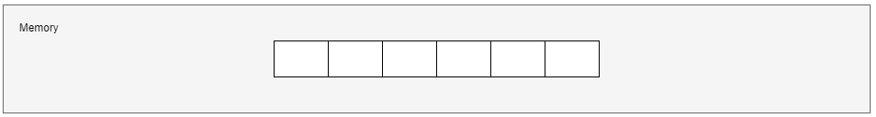</p>


- all elements of an array have the same type;

3) which elements are indexed by contiguous integers:

<p align="center">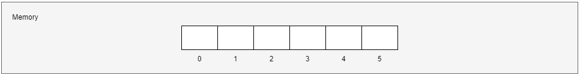</p>


- every element of an array has its own index. Each element can be accessed by index;
- The first element of an array has a "zero" index in Java.  

4) which has a fixed size:

<p align="center">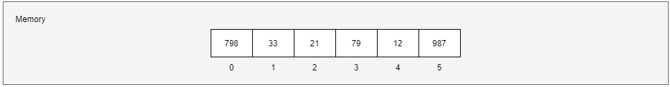</p>


- a size of an array is defined at array's creation and can't be changed further;
- in order to increase a size of an array, a new array with a desired size should be created, and it is necessary to copy elements there.

<p align="center"></p>

<p align="center">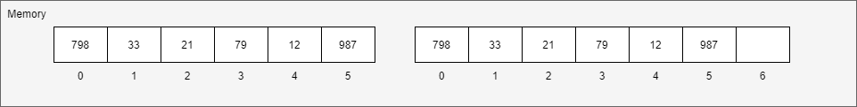</p>


#### Need of Arrays
In computer programming, the most of the cases requires to store the large number of data of similar type. To store such amount of data, we need to define a large number of variables. It would be very difficult to remember names of all the variables while writing the programs. Instead of naming all the variables with a different name, it is better to define an array and store all the elements into it.

### Arrays in Java
#### Definition
Arrays are defined and used with the square-brackets _indexing operator_ "**[]**".
In order to define an array reference, 
1) we should just write a desired type with empty square brackets:

```java
int[] arrayOfIntegers; // declares an array of integers
```
2) we can also place the square-brackets after the identifier:
```java
int arrayOfIntegers[]; // declares an array of integers
```

The above two definitions of an arrays have exactly the same meaning.
But defining an array doesn't mean that we created an array, when array creation means allocating space in memory for storing elements. In order to create an array, we must write an initialization expression.

#### Creation and Initialization
There are several ways to create an array in Java:
1) the most generic way is to use an operator "new" followed by a desired type with a desired array sized surrounded by square brackets

```java
int[] arr;        // declares an array of integers
arr = new int[6]; // creates an array of integers
```

<p align="center"></p>

It is worth noting that arrays of elements, which are of primitive type, are initialized with default values (in our case each element of an array of integers is initialized with zeros).

2) the special creation way is to write a set of values, which are separated from each other by commas and which are surrounded altogether by curly braces

```java
int[] arr;                     // declares an array of integers
arr = {12, 14, 1, 3, 16, 27};  // creates and initializes an array of integers
```
<p align="center"></p>

In this case while array creation, its elements will be initialized with desired values.

3) the special creation way has an optional extension: before the aforementioned set of elements in curly braces we can write an operator "new" followed by a desired type and empty square-brackets

```java
int[] arr;                              // declares an array of integers
arr = new int[] {12, 14, 1, 3, 16, 27}; // creates and initializes an array of integers
```

<p align="center"></p>

An array can be defined, created and initialized in one statement, instead of several: definition and initialization.

```java
int[] arr1 = new int[6];                       // declares, creates an array of integers (also initializes implicitly with zeros, only for primitive types)
int[] arr2 = {12, 14, 1, 3, 16, 27};           // declares, creates and initializes an array of integers
int[] arr3 = new int[] {12, 14, 1, 3, 16, 27}; // declares, creates and initializes an array of integers
```

#### Length 
All arrays have an intrinsic member (whether they are arrays of objects or arrays of primitives) that you can query to tell us how many elements there are in the array. This member is "length". Length can not be changed. In order to refer the last element of an array, we should use an index "length - 1".

```java
int[] arr = {1, 10, 100};
int a = arr.length;
System.out.println(a);
// Output: 3
```

#### Accessing Array's Elements
In order to access an element of an array, we should write an array's variable and an element's index encapsulated in square braces.

<p align="center"></p>

```java
int element = arr[5];
System.out.println(element);
// Output: 27
```

When accessing an element, if the index is negative or greater or equal to "length", Java will throw an "ArrayIndexOutOfBoundException".

#### Assigning a value to array's elements
We can assign a value to an array's element by writing an array's variable name followed by an element's index, then use an assignment operator "=" and define a 
compatible value.

```java
int[] arr = new int[6];
arr[5] = 27;
```

<p align="center">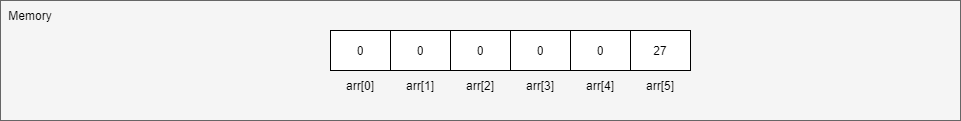</p>


#### Iterating Through an Array
We can iterate through an array with the help of an array's "length" property and "for", "while", "do-while" statements.

```java
int[] ints = {3, 2, 1};

// "for" statement
for (int i = 0; i < ints.length; i++) {
    int element = ints[i];
    System.out.print(element);
}

// "while" statement
int index = 0;
while (index < ints.length) {
    int element = ints[i];
    System.out.print(element);
    index++;
}

// "do-while" statement
int i = 0;
do {
    System.out.print(ints[i]);
    i++;
} while (index < ints.length);

// Output:
123123123
```

#### Copying an Array
The System class has an arraycopy method that you can use to efficiently copy data from one array into another:

```java
public static void arraycopy(Object src, int srcPos, Object dest, int destPos, int length)
```
The 1st Object argument specifies an array "to copy from", the second one defines an array "to copy to". An argument "srcPos" specifies the starting position in the array "to copy from" (source array), "destPos" defines the starting position in the array "to copy to" (destination array), "length" is the number of array's elements, which should be copied.

```java
int[] src = {798, 33, 21, 79, 12, 987};
int[] dest = new int[9];
System.arraycopy(src, 0, dest, 2, 5)
```
<p align="center">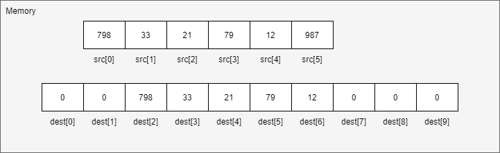</p>

#### Multidimensional Arrays
Arrays we have mentioned till now are called one-dimensional arrays. However, we can declare multidimensional arrays in Java. A multidimensional array in Java is an array of arrays, that is, each element of a multidimensional array is an array itself.

A two-dimensional array is the simplest form of multi-dimensional arrays, in other words, it is an array of one-dimensional arrays. it is stored in the form of rows and columns.
```java
int[][] arr;                 // defines a two-dimensional array
arr = new int[2][5];         // creates a two-dimensional array definition with "2" rows and "5" columns
```

<p align="center">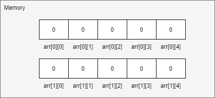</p>

```java
int[][] arr = new int[][] {  // creates a two-dimensional array definition with "2" rows and "5" columns and initializes it with values
  {1, 2, 3, 4, 5},     // the first row 
  {11, 12, 13, 14, 15} // the second row
}                                  
```

<p align="center">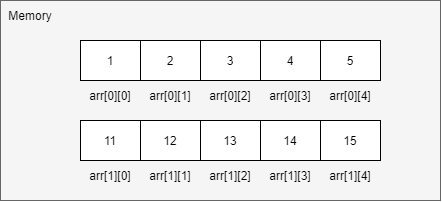</p>

#### Ragged Arrays
An array will be called as "ragged", when it doesn't have a form of "rectangular" and the number of columns may not be fixed. In this case during its definition we specify only the 1st "dimension" and another "dimensions" are left unknown. 

```java
int[][] arr = new int[3][]; // creates a two-dimensional "ragged" array
arr[0] = new int[3];        // initializes the first row
arr[1] = new int[2];        // initializes the second row
arr[2] = new int[1];        // initializes the third row
```

<p align="center">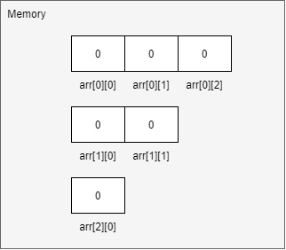</p>

```java
int[][] arr = new int[3][];  // creats a two-dimensional "ragged" array
arr[0] = new int[]{1};       // initializes the first row
arr[1] = new int[]{1, 2};    // initializes the second row
arr[2] = new int[]{1, 2, 3}; // initializes the third row
```
<p align="center">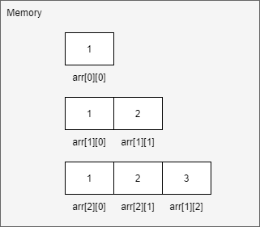</p>

## Linked List

#### Overview
A linked list is a linear data structure, which that includes a sequence of connected nodes: each node has the data and the address (reference/link) of the next node in the linked list. Such an address is called a "next pointer". Linked lists have a special member called "Head", which gives the address of the first node. If a linked list is empty, a value of "head" will point at "nowhere", e.g. "null". The last node is always points at "null" (as we already discussed at "nowhere"). In other works, a linked list is a bunch of randomly organized memory addresses, which are linked together. Linked list is the second most-used data structure after an array.

<p align="center">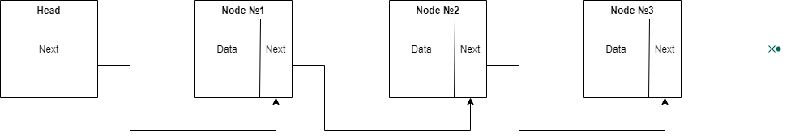</p>

### Need of Linked Lists
With linked lists, you never have to move your items: linked lists have the ability to break the chain and rejoin it. In other words, if you wanted to put a new element between Node №1 and Node №2, the steps would be:
- Create a new Node and allocate memory to it;

<p align="center">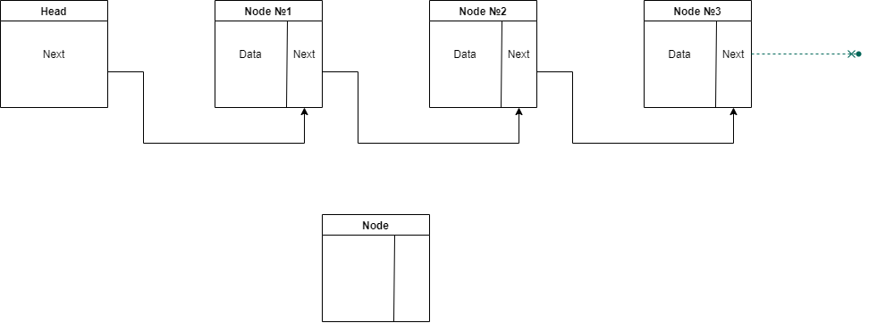</p>

- Add a new "data" value;

<p align="center">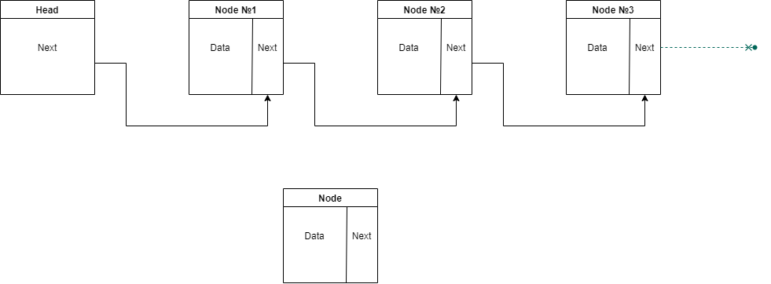</p>

- Point its "next" pointer to Node №2;

<p align="center">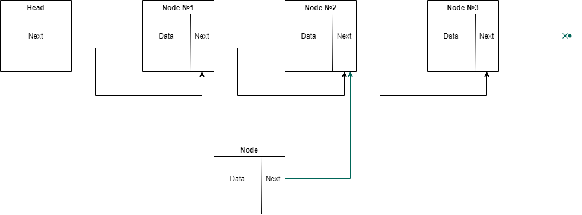</p>

- Change the "next" pointer of Node №1 to a newly created Node.

<p align="center">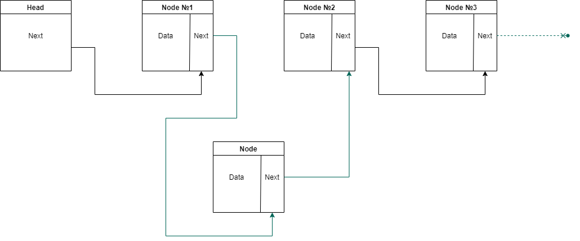</p>

Doing something similar in an array would have required shifting the positions of all the subsequent elements.

### Pros and Cons of Arrays and Linked Lists
Which data structure should we use: arrays or linked lists? It depends only on a particular use case and goals, which we intend to resolve. In order to make a balanced decision, we should know pros and cons of these data structures.

#### Situation №1: Read of the last element
A read operation is heavily tied to type of access. There are two types of access to elements of a data structure: random access and sequential access.
Sequential access means reading all elements one by one starting from the 1st element. Random access means that we can reach a needed element directly. Linked lists can only perform sequential access, when arrays can do both sequential and random types of access.

Reading of the last element may be a quite heavy operation for a linked list: we can't just read it, because you don't know what address it has. We have to go to Node №1 to get the address for Node №2, then until we get to the last Node. Thus, linked lists are great if we are going to read all the Nodes one at a time, and they are terrible, if we are planning to jump around its Nodes: first, access the last element, then the 3rd element, then the last once again.

Regarding arrays, we know the address for each element, therefore arrays are great if we want to read random elements, because you can look up any element in your array instantly.

#### Situation №2: Insert a new element
Let's suppose a situation when we should insert a new element in a collection. As concerns linked lists, this operation will be very cheap, because we should just make a previous node point at a newly created node. An example of insertion can be found [here](#need-of-linked-lists).

Regarding arrays, while inserting an element into an array, we have to shift the rest of elements one step down. It means that if there are other elements after an element, which is to be inserted, we have to place each of these elements to an array's cell on the right. 

<p align="center">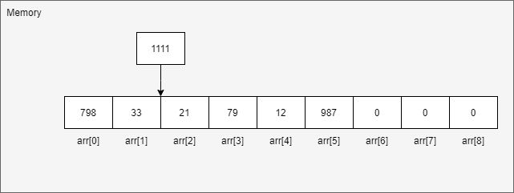</p>
<p align="center">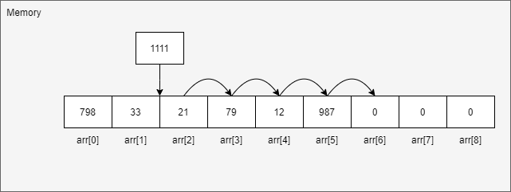</p>
<p align="center">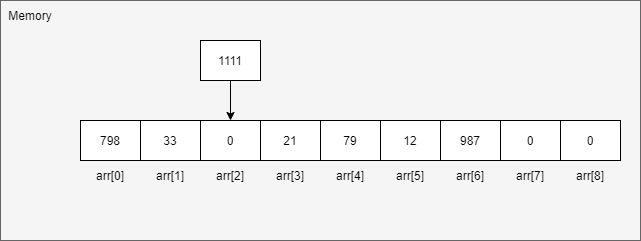</p>
<p align="center">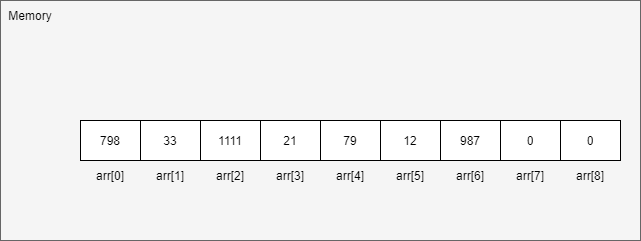</p>

If there are no vacant cells in an array, besides "shifting elements down", we will also have to copy contents of an initial array to another location. An example of copying an array can be found [here](#copying-an-array).

<p align="center">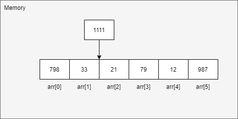</p>
<p align="center">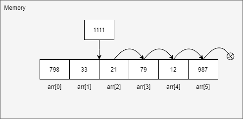</p>
<p align="center">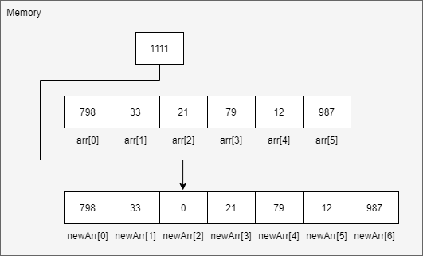</p>
<p align="center">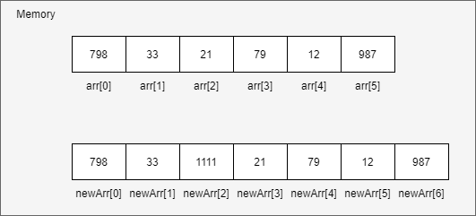</p>

Thus, linked lists are better than arrays if we want to insert elements into the middle. 

#### Situation №3: Delete an element
As concerns deleting an element for linked lists, we should just make the previous node point at the next node, and we should delete a pointer from a node, which is being deleted.

<p align="center">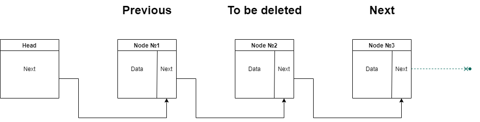</p>
<p align="center">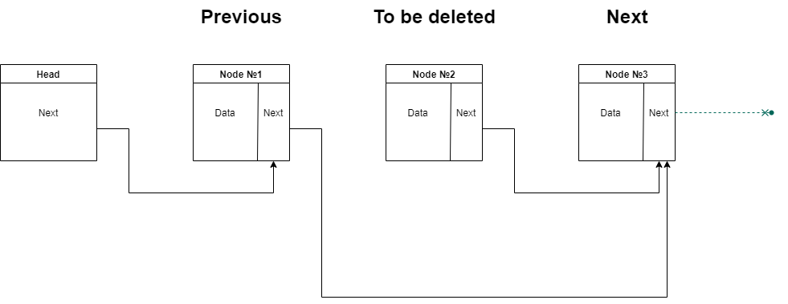</p>
<p align="center">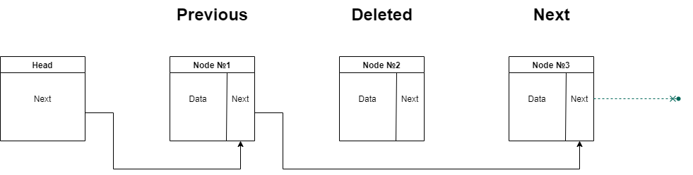</p>

While speaking about arrays, we should wipe an element by shifting all elements on the right one step up. It means that if there are other elements after an element, which is to be deleted, we have to place each of these elements to an array's cell on the left.


<p align="center">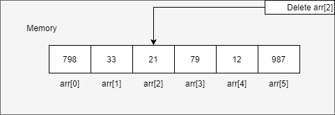</p>
<p align="center">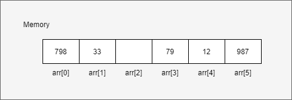</p>
<p align="center">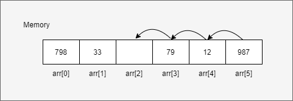</p>
<p align="center">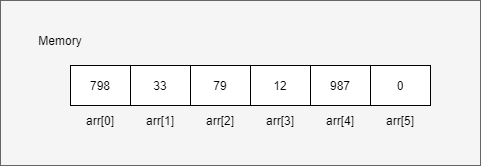</p>


Thus, linked lists are also better than arrays if we want to delete elements from the middle.

#### Arrays and Linked Lists Time Complexity
Summarizing the aforementioned situations, here is provided "Time Complexity Chart" for main operations with arrays and linked lists. It can be used while choosing between arrays and linked lists depending on a task, which is being solved.  

| Operation | Arrays | Linked Lists |
| --- | --- | --- |
| Reading | O(1) | O(n) |
| Insertion | O(n) | O(1) |
| Deletion | O(n) | O(1) |

### Summary
- Data structures should be treated as a method to store information;
- Arrays and linked lists are used, when it is necessary to store multiple elements; 
- Arrays and linked lists are basic data structures and are used to implement other data structures too;
- Elements of arrays are stored next to each other in memory;
- Elements of linked lists are allocated in memory with no order and contain only a reference to a next element;
- Arrays provide fast read operations;
- Linked Lists provide fast insert and delete operations.
