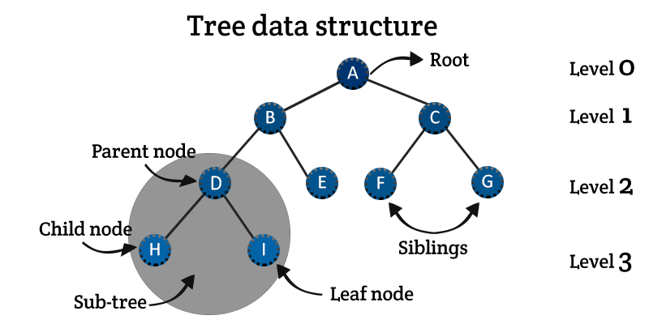
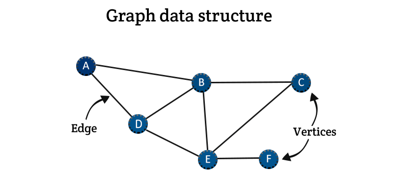
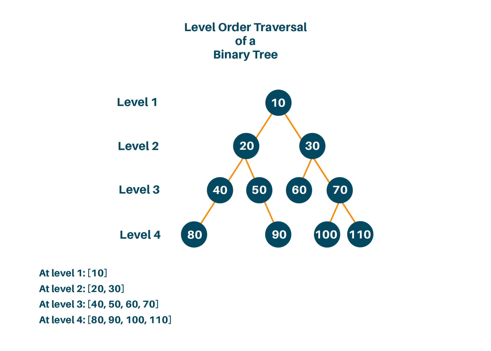
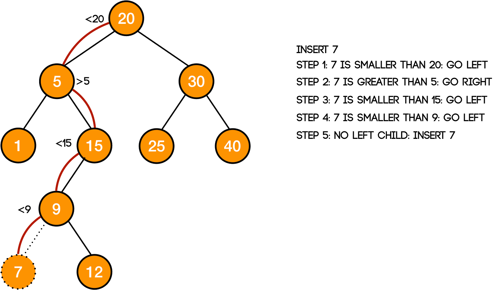
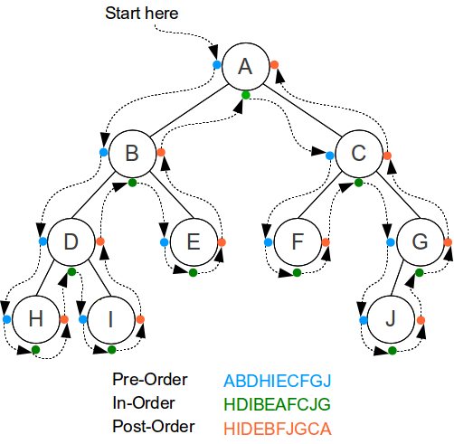
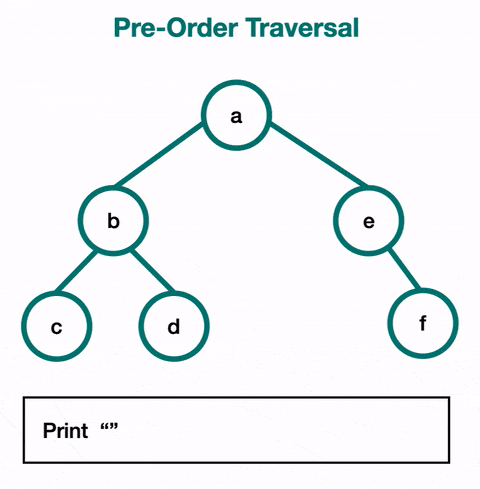
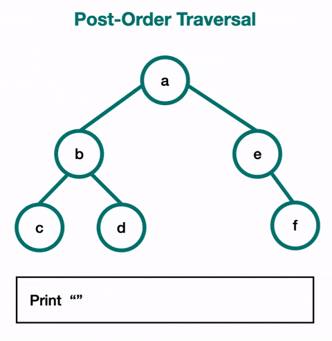
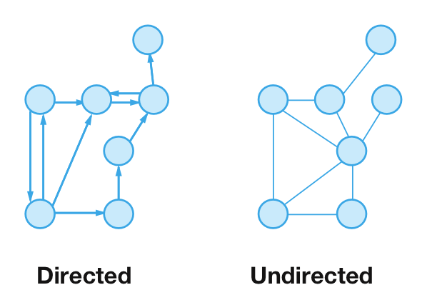
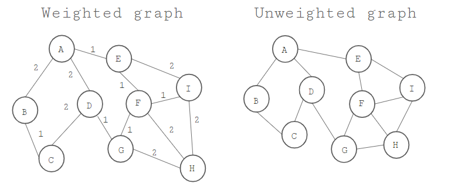

<h1 align="center">Data structures (Non-Linear)</h1>

The data structure where data items are not organized sequentially is called **Non-linear data structure**. In other words, A data elements of the non linear data structure could be connected to more than one elements to reflect a special relationship among them. All the data elements in Non-linear data structure can not be traversed in single run.

Examples of most popular Non-linear data structures are **Trees** and **Graphs**.

A **Tree** is collection of nodes where these nodes are arranged hierarchically and form a parent child relationships. (_Note_: any tree is a bipartite Graph)

A **Graph** is a collection of a finite number of _vertices_ and an _edges_ that connect these vertices. Edges represent relationships among vertices that stores data elements.

## Tree
A tree is a hierarchical structure where data is organized hierarchically and are linked together. This structure is different from a linked list whereas, in a linked list, items are linked in a linear order.

Various types of trees have been developed throughout the past decades, in order to suit certain applications and meet certain constraints. Some examples are binary search tree, B tree, treap, red-black tree, splay tree, AVL tree etc.

### Binary tree
A **Binary Tree** is a structure in which each node can have at most two children (child nodes). In a Binary tree, there exists a unique path from the root node to every other node.

The topmost **node** of a binary tree is called the **root node** or the parent node, and the nodes coming from the root node are called the **child nodes**.

A binary tree is either empty (which is called a null tree), or it consists of a root node along with the remaining two nodes, each being a binary tree itself.

Each node in a binary tree can have zero, one or maximum two successors or child nodes: left successor or child node and right successor or child node. A terminal node (that is, a node with n successor) is called a **leaf node**.

Representation of Binary Trees
Each object in a binary tree is represented by a pointer on the topmost node along with the two references of the left node and the right node of the tree. If the nodes in the tree are empty, that is, leaf node, then it’s left and right references are **NULL**.

The parts of the binary tree are:
- Data
- Reference to the left child
- Reference for the right child

In a binary tree, there is a **level number** for each node. The Root node is at level 0, then each child having the level number one more than the level number of its parent node.

### Binary search tree (BST)
A binary search tree (BST), as the name suggests, is a binary tree where data is organized in a hierarchical structure. This data structure stores values in sorted order.

Every node in a binary search tree comprises the following attributes:
- **key:** The value stored in the node.
- **left:** The pointer to the left child.
- **right:** The pointer to the right child.
- **p:** The pointer to the parent node.

A binary search tree exhibits a unique property that distinguishes it from other trees. This property is known as the **binary-search-tree property**.

Let **x** be a node in a binary search tree.
If **y** is a node in the **left** subtree of **x**, then **y.key ≤ x.key**
If **y** is a node in the right subtree of **x**, then **y.key ≥ x.key**

### Traversing Binary Trees
The tree traversal is the process of going through a tree, in such a way it visits each node only once. There are three standard ways of traversing a binary tree which are:
- **Preorder** Traversal
- **Inorder** Traversal
- **Postorder** Traversal

#### In-Order Traversal
In-order traversal is the most common and visits the nodes in ascending order. If it were a binary search tree, this will start with the smallest value at the left-most node and end at the largest value at the right-most node.

#### Pre-Order Traversal
Pre-order traversal will always visit the current node before visiting its children. The root is the first node visited. It follows the left path and visits each node as it encounters them. After that, it follows the right paths and still visits the nodes as it encounters them before continuing on with the path.

#### Post-Order Traversal
For post-order traversal, you visit a node's children before visiting that node. This means that you will use it when you want to reach the leaves first. You visit the entire left subtree, then the entire right subtree, and then the root node of the subtree.

### Complexities of all operations

| OPERATION | WORST CASE | AVERAGE CASE | BEST CASE | SPACE |
|:----------|:-------------:|:-------------:|:-------------:|------:|
| **Search** | O(N) | O(logN) | O(1) | O(N) |
| **Insert** | O(N) | O(logN) | O(1) | O(N) |
| **Delete** | O(N) | O(logN) | O(N) | O(N) |

### Applications of trees
- **Binary Trees:** Used to implement expression parsers and expression solvers.
- **Binary Search Tree:** used in many search applications where data are constantly entering and leaving.
- **Heaps:** used by ***JVM*** (Java Virtual Machine) to store Java objects.
Treaps: used in wireless networking.

## Graph

A graph consists of a finite set of **vertices** or **nodes** and a set of **edges** connecting these vertices.
The order of a graph is the number of vertices in the graph. The **size** of a graph is the number of edges in the graph.

Two nodes are said to be **adjacent** if they are connected to each other by the same edge.

A graph is a non-linear data structure and the following components define it:
- A set of a finite number of **vertices** which we call as **nodes**
- An edge with a finite set of ordered pairs which is in the form **(u, v)**
- **V** represents the Number of Vertices
- **N** represents the Number of Edges

### Classification of a Graph
Graph Data Structures in Java can be classified on the basis of two parameters: **direction** and **weight**.

### Direction 
On the basis of direction, the graph can be classified as a **directed** graph and an **undirected** graph.

#### Directed graph 

A directed graph is a set of nodes or vertices connect together with each other and all the edges have a direction from one vertex to another. There is a directed edge for each connection of vertices.

#### Undirected graph

An undirected graph is a set of nodes or vertices which are connected together, with no direction. 

### Weight
On the basis of weight, the graph can be classified as a **weighted** graph and an **unweighted** graph.

#### Weighted graph 
A weighted graph is a graph in which the weight is present at every edge of the graph. A weighted graph is also a special type of labeled graph.

#### Unweighted graph 
An unweighted graph is the one in which there is no weight present on any edge. The figure below shows weighted / unweighted graph:

### Graph Operations
The most common graph operations are:

- Check if the element is present in the graph
- Graph Traversal
- Add elements(vertex, edges) to graph
- Finding the path from one vertex to another

### Applications of graphs
- Used to represent social media networks. Each user is a vertex, and when users connect they create an edge.
- Used to represent web pages and links by search engines. Web pages on the internet are linked to each other by hyperlinks. Each page is a vertex and the hyperlink between two pages is an edge. Used for Page Ranking in Google.
- Used to represent locations and routes in GPS. Locations are vertices and the routes connecting locations are edges. Used to calculate the shortest route between two locations.

## References

1. 
2. 
3. 
