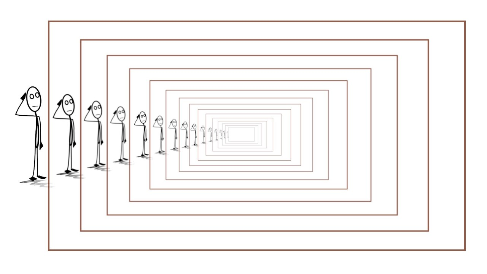
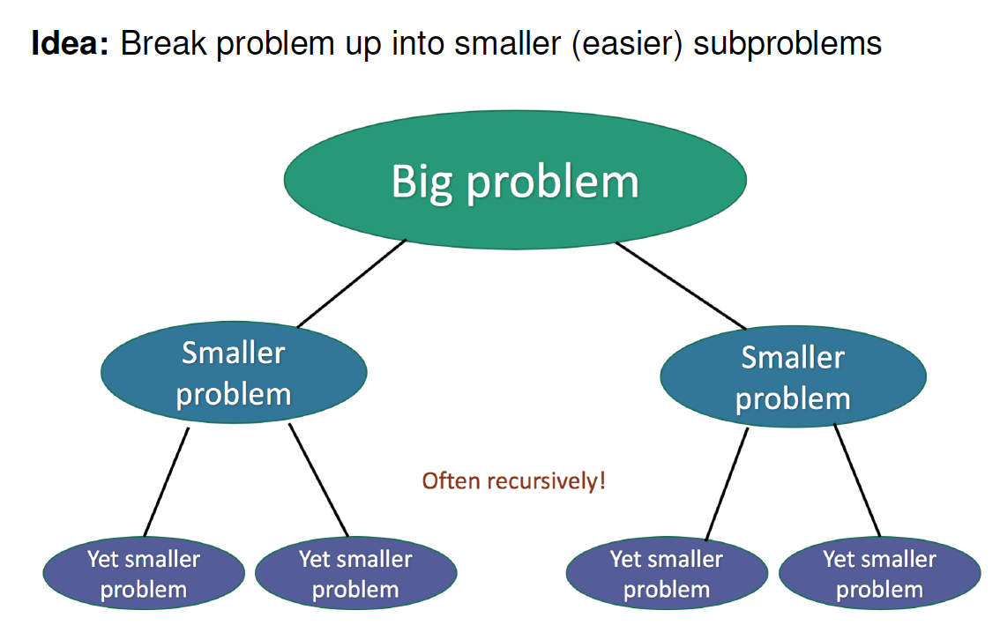
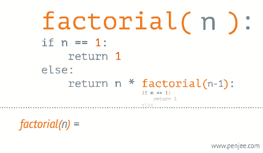

<h1 align="center">Recursion</h1>

## To Understand Recursion, You Must First Understand Recursion

<p align="center"></p>

Recursion is a programming technique using function or algorithm that calls itself one or more times until a specified condition is met, wherein the result is processed beginning from the repetition, which is last called, to the repetition, which is called first. Problems, which are solved by recursion, can also be resolved by iteration, i.e. using loops (for, while, do-while). But recursion solutions tend to have fewer steps than non-recursive solutions: this means that they are easier for humans to read.

Every recursion function consists of two parts:
- **base case**: the function, which produces a result without recurring;
- **recursive case**: a call of itself with the another.

**Base case** terminates the chain of recursion. The job of the recursive cases can be seen as breaking down complex inputs into simpler ones.

### Recursive Functions & Divide-and-Conquer algorithms
In some programming problems, we know the goal we want to achieve, but **might not know the number of steps required**, or the correct path to take. This is because the environments change and robust algorithm should work even regardless of environment. This is where recursion can help us solve these big problems.

**Divide-and-conquer** is a technique for solving problems, when algorithm recursively breaks down a problem into two or more sub-problems of the same or related type, until they become simple enough to be solved directly. Then the solutions to the sub-problems are combined to give a solution to the original problem.

While implementing a **Divide-and-conquer** algorithm, we should define the following its main steps:

1. _Divide_ a problem into a number of sub-problems that are smaller instances of the same problem;
2. _Conquer_ sub-problems by solving them recursively: a sub-problem is small enough, when it can be salved as a base case;
3. _Combine_ solutions to sub-problems into solution to an original problem.

**Divide and conquer** algorithm design paradigm is the basis of _**efficient**_ algorithms for many problems, such as searching and sorting.

<p align="center"></p>

### How a particular problem is solved using recursion
The idea is to represent a problem in terms of one or more smaller problems, and add one or more base conditions that stop the recursion. For example, we compute factorial n if we know factorial of (n - 1). The base case for factorial would be n = 0. We return 1 when n = 0. 

```java
// Java Program to Find Factorial of a Number
 
// Method 1
// To calculate factorial
static int factorial(int n) {

    // Handling base case
    // If value of n = 1 or n = 0 we return 1
    if (n == 0 || n == 1) {
        return 1;
    }
        
    // Generic case computation math
    // Otherwise we do n * (n - 1)!
    return n * factorial(n - 1);
}

// Method 2
// Main driver method
public static void main(String[] args) {

    // Calling Method 1 and
    // storing the result into variable
    int ans1 = factorial(5);
    int ans2 = factorial(10);

    // Print and display the factorial of 5
    System.out.println("Factorial of 5 is : " + ans1);

    // Similarly, Print and display the factorial of 10
    System.out.println("Factorial of 10 is : " + ans2);
}
```

<p align="center"></p>

### Disadvantages of recursive programming over iterative programming
Note that both recursive and iterative programs have the same problem-solving powers, i.e., every recursive program can be written iteratively and vice versa is also true. The recursive program has greater space requirements than iterative program as all functions will remain in the stack until the base case is reached. It also has greater time requirements because of function calls and returns overhead.

### Advantages of recursive programming over iterative programming
Recursion provides a clean and simple way to write code. Some problems are inherently recursive like tree traversals, Tower of Hanoi, etc. For such problems, it is preferred to write recursive code. We can write such codes also iteratively with the help of a stack data structure. 

### Detailed difference between the recursive and iterative approaches

1. **Time Complexity:** Finding the Time complexity of Recursion is more difficult than that of Iteration.
    - **Recursion:** Time complexity of recursion can be found by finding the value of the nth recursive call in terms of the previous calls. Thus, finding the destination case in terms of the base case, and solving in terms of the base case gives us an idea of the time complexity of recursive equations. Please see Solving Recurrences for more details. 
 
    - **Iteration:** Time complexity of iteration can be found by finding the number of cycles being repeated inside the loop. 

2. **Usage:** Usage of either of these techniques is a trade-off between time complexity and size of code. If time complexity is the point of focus, and number of recursive calls would be large, it is better to use iteration. However, if time complexity is not an issue and shortness of code is, recursion would be the way to go.
    - **Recursion:** Recursion involves calling the same function again, and hence, has a very small length of code. However, as we saw in the analysis, the time complexity of recursion can get to be exponential when there are a considerable number of recursive calls. Hence, usage of recursion is advantageous in shorter code, but higher time complexity. 
 
    - **Iteration:** Iteration is repetition of a block of code. This involves a larger size of code, but the time complexity is generally lesser than it is for recursion. 

3. **Overhead:** Recursion has a large amount of Overhead as compared to 
    - **Recursion:** Recursion has the overhead of repeated function calls, that is due to repetitive calling of the same function, the time complexity of the code increases manyfold. 

    - **Iteration:** Iteration does not involve any such overhead. 


4. **Infinite Repetition:** Infinite Repetition in recursion can lead to CPU crash but in iteration, it will stop when memory is exhausted. 

    - **Recursion:** In Recursion, Infinite recursive calls may occur due to some mistake in specifying the base condition, which on never becoming false, keeps calling the function, which may lead to system CPU crash. 
 
    - **Iteration:** Infinite iteration due to mistake in iterator assignment or increment, or in the terminating condition, will lead to infinite loops, which may or may not lead to system errors, but will surely stop program execution any further. 
 


### Example
Imagine a problem of calculating the sum of natural numbers from 1 to "7". The sum of such number will be "28": "1 + 2 + 3 + 4 + 5 + 6 + 7=28".

#### With Recursion
```java
public static int sum(int n) { // recursion function "sum" 
    if(n == 1) {
        return 1;              // base case
    }
    return n + sum(n-1);       // recursive call
}
```

```java
int sumFrom1To7 = sum(7);          // calculates recursively the sum
System.out.println(sumFrom1toTo7); // print the sum

// Output: 28
// 1 call: sum(7) → 7 + sum(6) //                          7 + 21 = 28
// 2 call: sum(6) → 6 + sum(5) //                      6 + 15 = 21 (↑)
// 3 call: sum(5) → 5 + sum(4) //                  5 + 10 = 15 (↑)
// 4 call: sum(4) → 4 + sum(3) //               4 + 6 = 10 (↑) 
// 5 call: sum(3) → 3 + sum(2) //        3 + 3 = 6 (↑) 
// 6 call: sum(2) → 2 + sum(1) // 2 + 1 = 3 (↑)
// 7 call: sum(1) → 1          //  1 (↑)
```

#### With Iteration

```java
private static int sum(int maxNumber) {
    int sum = 0;
    for (int i = 0; i <= maxNumber; i++) {
        sum = sum + i;
    }
    return sum;
}
```

```java
int sumFrom1To5 = sum(5);
System.out.println(sumFrom1To5);

// Output: 15
// int = 0: 0 + 0 = 0 (↓)
// int = 1:            0 + 1 = 1 (↓) 
// int = 2:                       1 + 2 = 3 (↓)
// int = 3:                                  3 + 3 = 6 (↓)
// int = 4:                                             6 + 4 = 10 (↓)
// int = 5:                                                         10 + 5 = 15
```

### How to create a recursion function
1. Create a regular function with a base case that can be reached with its parameters (Recursion functions can have more than one base case).
2. Pass arguments into the function that immediately trigger the base case
3. Pass the next arguments that trigger the recursive call just once.


## References

1. [The Art of Recursion; a connection to infinity](https://towardsdatascience.com/the-art-of-recursion-a-connection-to-infinity-622292be0089)
2. [Recursion](https://www.cpp.edu/~ftang/courses/CS240/lectures/recursion.htm)