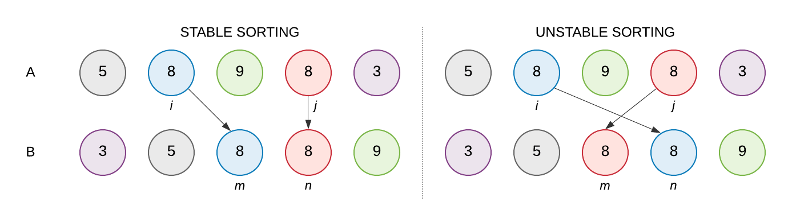
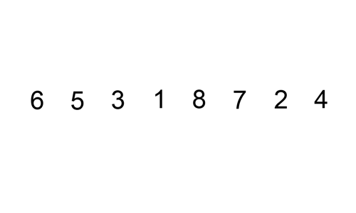
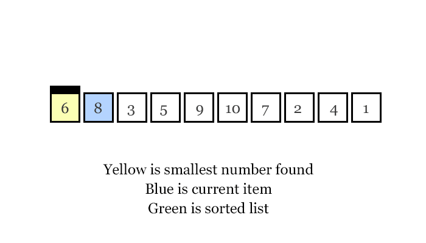
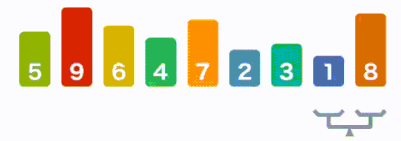
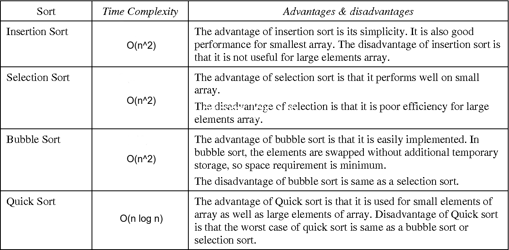

<h1 align="center">Sorting Algorithms</h1>

Sorting is a very classic problem of reordering items (that can be compared, e.g., integers, floating-point numbers, strings, etc) of an array (or a list) in a certain order (increasing, non-decreasing (increasing or flat), decreasing, non-increasing (decreasing or flat), lexicographical, etc).

There are many different sorting algorithms, each has its own advantages and limitations.

Sorting is commonly used as the introductory problem in various Computer Science classes to showcase a range of algorithmic ideas.

### In-place Sorting and Not-in-place Sorting

Sorting algorithms may require some extra space for comparison and temporary storage of few data elements. These algorithms do not require any extra space and sorting is said to happen in-place, or for example, within the array itself. This is called in-place sorting. Bubble sort is an example of **in-place sorting**.

However, in some sorting algorithms, the program requires space which is more than or equal to the elements being sorted. Sorting which uses equal or more space is called **not-in-place sorting**. Merge-sort is an example of not-in-place sorting.

### Stable and Not Stable Sorting

If a sorting algorithm, after sorting the contents, does not change the sequence of **similar**content in which they appear, it is called **stable sorting**.

If a sorting algorithm, after sorting the contents, changes the sequence of similar content in which they appear, it is called **unstable sorting**.

Stability of an algorithm matters when we wish to maintain the sequence of original elements, like in a tuple for example.

<p align="center"></p>

### Adaptive and Non-Adaptive Sorting Algorithm

A sorting algorithm is said to be **adaptive**, if it takes advantage of already 'sorted' elements in the list that is to be sorted. That is, while sorting if the source list has some element already sorted, adaptive algorithms will take this into account and will try not to re-order them.

A **non-adaptive** algorithm is one which does not take into account the elements which are already sorted. They try to force every single element to be re-ordered to confirm their sortedness.

### Online / Offline technique

A sorting technique is considered Online if it can accept new data while the procedure is ongoing i.e. complete data is not required to start the sorting operation.

Among the comparison based techniques discussed, only **Insertion Sort** qualifies for this because of the underlying algorithm it uses i.e. it processes the array (not just elements) from left to right and if new elements are added to the right, it doesn’t impact the ongoing operation.

---

Mainly there are five basic algorithms used and you can derive multiple algorithms using these basic algorithms. Each of these algorithms has some pros and cons and can be chosen effectively depending on the size of data to be handled.

1. Insertion Sort
2. Selection Sort
3. Bubble Sort
4. Merge Sort
5. Quick Sort

## Insertion Sort

Insertion sort is a sorting algorithm that places an unsorted element at its suitable place in each iteration.

Insertion sort works similarly as we sort cards in our hand in a card game.

We assume that the first card is already sorted then, we select an unsorted card. If the unsorted card is greater than the card in hand, it is placed on the right otherwise, to the left. In the same way, other unsorted cards are taken and put in their right place.

A similar approach is used by insertion sort.

### Visualization

<p align="center"></p>

### Time Complexity

|           Case           |     Performance      |
| :----------------------: | :------------------: |
|  Worst case performance  | **O(n<sup>2</sup>)** |
|  Best case performance   |       **O(n)**       |
| Average case performance | **O(n<sup>2</sup>)** |
|     Auxiliary Space      |       **O(1)**       |

### Properties

- **Boundary Cases:** Insertion sort takes maximum time to sort if elements are sorted in reverse order. And it takes minimum time (Order of n) when elements are already sorted.
- **Algorithmic Paradigm:** Incremental Approach
- **Sorting In Place:** Yes
- **Stable:** Yes
- **Online:** Yes
- **Uses:** Insertion sort is used when number of elements is small. It can also be useful when input array is almost sorted, only few elements are misplaced in complete big array.

### Java Example

```java
void sort(int arr[]) {
    int n = arr.length;

    for (int i = 1; i < n; ++i) {
        int key = arr[i];
        int j = i - 1;

        // Move elements of arr[0..i-1], that are
        // greater than key, to one position ahead
        // of their current position 
        while (j >= 0 && arr[j] > key) {
            arr[j + 1] = arr[j];
            j = j - 1;
        }
        arr[j + 1] = key;
    }
}
```

## Selection Sort

The selection sort algorithm sorts an array by repeatedly finding the minimum element (considering ascending order) from the unsorted part and putting it at the beginning. The algorithm maintains two subarrays in a given array:

- The subarray which is already sorted
- Remaining subarray which is unsorted

In every iteration/pass of selection sort, the minimum element (considering ascending order) from the unsorted subarray is picked and moved to the sorted subarray. The selection sort has the property of minimizing the number of swaps. Therefore, it is the best choice when the cost of swapping is high.

### Visualization

<p align="center"></p>

### Time Complexity

|           Case           |     Performance      |
| :----------------------: | :------------------: |
|  Worst case performance  | **O(n<sup>2</sup>)** |
|  Best case performance   | **O(n<sup>2</sup>)** |
| Average case performance | **O(n<sup>2</sup>)** |
|     Auxiliary Space      |       **O(1)**       |

### Java Example

```java
void sort(int arr[]) {
    int n = arr.length;

    // One by one move boundary of unsorted subarray
    for (int i = 0; i < n-1; i++) {

        // Find the minimum element in unsorted array
        int min_idx = i;
        for (int j = i+1; j < n; j++) {
            if (arr[j] < arr[min_idx]) {
                min_idx = j;
            }
        }

        // Swap the found minimum element with the first element
        int temp = arr[min_idx];
        arr[min_idx] = arr[i];
        arr[i] = temp;
    }
}

```

## Bubble Sort

Bubble Sort is the sorting algorithm that works by repeatedly swapping the adjacent elements if they are in the wrong order. After each iteration or pass, the largest element reaches the end (in case of ascending order) or the smallest element reaches the end (in case of descending order). The pass through the list is repeated until the list is sorted. This algorithm is not suitable for large data sets as its average and worst-case complexity are of **Ο(n<sup>2</sup>)** where n is the number of items

### Visualization

<p align="center"></p>

### Time Complexity

|           Case           |     Performance      |
| :----------------------: | :------------------: |
|  Worst case performance  | **O(n<sup>2</sup>)** |
|  Best case performance   |       **O(n)**       |
| Average case performance | **O(n<sup>2</sup>)** |
|     Auxiliary Space      |       **O(1)**       |

### Java Example

```java
void sort(int arr[]) {
    int n = arr.length;

    for (int i = 0; i < n-1; i++) {
        for (int j = 0; j < n-i-1; j++) {
            if (arr[j] > arr[j+1]) {
                // swap arr[j+1] and arr[j]
                int temp = arr[j];
                arr[j] = arr[j+1];
                arr[j+1] = temp;
            }
        }
    }
}
```

## Merge Sort

Merge Sort is a **Divide and Conquer** algorithm that continually splits a list in half and then merge the sublists in a sorted way.
A single most important advantage of merge sort over quick sort is its stability: the elements compared equal retain their original order.

### Visualization

<p align="center"></p>

### Time Complexity

|           Case           |  Performance   |
| :----------------------: | :------------: |
|  Worst case performance  | **O(n log n)** |
|  Best case performance   | **O(n log n)** |
| Average case performance | **O(n log n)** |
|     Auxiliary Space      |    **O(n)**    |

### Java Example

```java
// Main function that sorts arr[l..r] using merge()
void sort(int arr[], int l, int r) {
    if (l < r) {
        // Find the middle point
        int m = l + (r-l)/2;

        // Sort first and second halves
        sort(arr, l, m);
        sort(arr, m + 1, r);

        // Merge the sorted halves
        merge(arr, l, m, r);
    }
}

// Merges two subarrays of arr[].
// First subarray is arr[l..m]
// Second subarray is arr[m+1..r]
void merge(int arr[], int l, int m, int r) {
    // Find sizes of two subarrays to be merged
    int n1 = m - l + 1;
    int n2 = r - m;

    /* Create temp arrays */
    int L[] = new int[n1];
    int R[] = new int[n2];

    /*Copy data to temp arrays*/
    for (int i = 0; i < n1; ++i) {
        L[i] = arr[l + i];
    }
    for (int j = 0; j < n2; ++j) {
        R[j] = arr[m + 1 + j];
    }

    // Merge the temp arrays

    // Initial indexes of first and second subarrays
    int i = 0;
    int j = 0;

    // Initial index of merged subarray array
    int k = l;
    while (i < n1 && j < n2) {
        if (L[i] <= R[j]) {
            arr[k] = L[i];
            i++;
        }
        else {
            arr[k] = R[j];
            j++;
        }
        k++;
    }

    /* Copy remaining elements of L[] if any */
    while (i < n1) {
        arr[k] = L[i];
        i++;
        k++;
    }

    /* Copy remaining elements of R[] if any */
    while (j < n2) {
        arr[k] = R[j];
        j++;
        k++;
    }
}
```

> **Note:** If you are interested, you can search for recursive modifications of this sort and compare it with the current version.

## Quick Sort

Quick Sort is also a **Divide and Conquer** algorithm. It picks an element as a **pivot** and partitions the given array around the picked pivot such that all the smaller elements are to the left of the pivot and all the greater elements are to the right of the pivot. There are many different versions of quickSort that pick pivot in different ways:

- Always pick the first element as a pivot.
- Always pick the last element as the pivot (implemented below).
- Pick a random element as a pivot.
- Pick the median as a pivot.

Quick Sort is a recursive sorting algorithm that is more effective than other **O(n log n)** algorithms for large datasets that fit in memory, but is unstable. Quick Sort **in general does not requiere extra space** while Merge Sort requires **O(n)** extra storage.

### Visualization

<p align="center"></p>

### Time Complexity

|           Case           |     Performance      |
| :----------------------: | :------------------: |
|  Worst case performance  | **O(n<sup>2</sup>)** |
|  Best case performance   |    **O(n log n)**    |
| Average case performance |    **O(n log n)**    |
|     Auxiliary Space      |    **O(log(n))**     |

### Java Example

```java
// The main function that implements QuickSort
// arr[] --> Array to be sorted,
// low --> Starting index,
// high --> Ending index
void quickSort(int[] arr, int low, int high) {
    if (low < high) {
            
        // pi is partitioning index, arr[p]
        // is now at right place
        int pi = partition(arr, low, high);

        // Separately sort elements before
        // partition and after partition
        quickSort(arr, low, pi - 1);
        quickSort(arr, pi + 1, high);
    }
}

// This function takes last element as pivot, places
// the pivot element at its correct position in sorted
// array, and places all smaller (smaller than pivot)
// to left of pivot and all greater elements to right
// of pivot 
int partition(int[] arr, int low, int high) {

    // pivot
    int pivot = arr[high];
     
    // Index of smaller element and
    // indicates the right position
    // of pivot found so far
    int i = (low - 1);
 
    for(int j = low; j <= high - 1; j++) {
        
        // If current element is smaller
        // than the pivot
        if (arr[j] < pivot) {
             
            // Increment index of
            // smaller element
            i++;
            swap(arr, i, j);
        }
    }
    swap(arr, i + 1, high);
    return (i + 1);
}

// A utility function to swap two elements
void swap(int[] arr, int i, int j) {
    int temp = arr[i];
    arr[i] = arr[j];
    arr[j] = temp;
}
```

## Comparison Sorting Algorithms

<p align="center"></p>

## Other Sorting Algorithms

Sorting is a vast topic and it is not possible to cover every Sorting Algorithm in this single post. It is also very popular research topic in academia and people are coming up with new sorting algorithms every year.

## References

1. [Sorting Algorithms](https://www.interviewbit.com/tutorial/sorting-algorithms/)
2. [Sorting Algorithms](https://www.geeksforgeeks.org/sorting-algorithms/)
