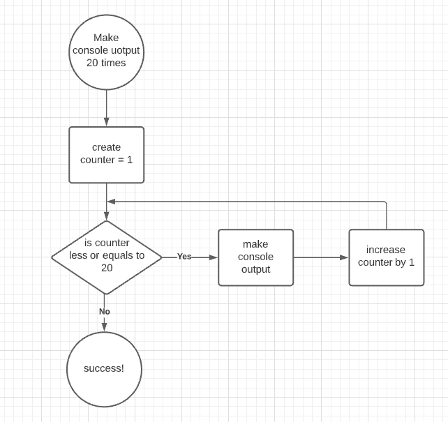
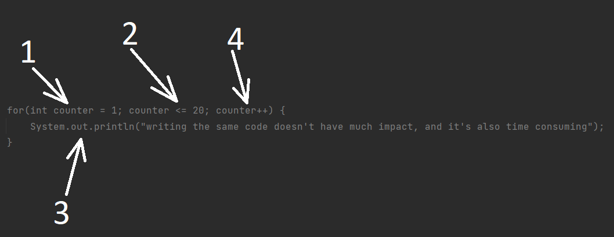
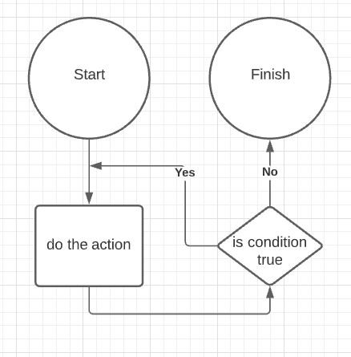
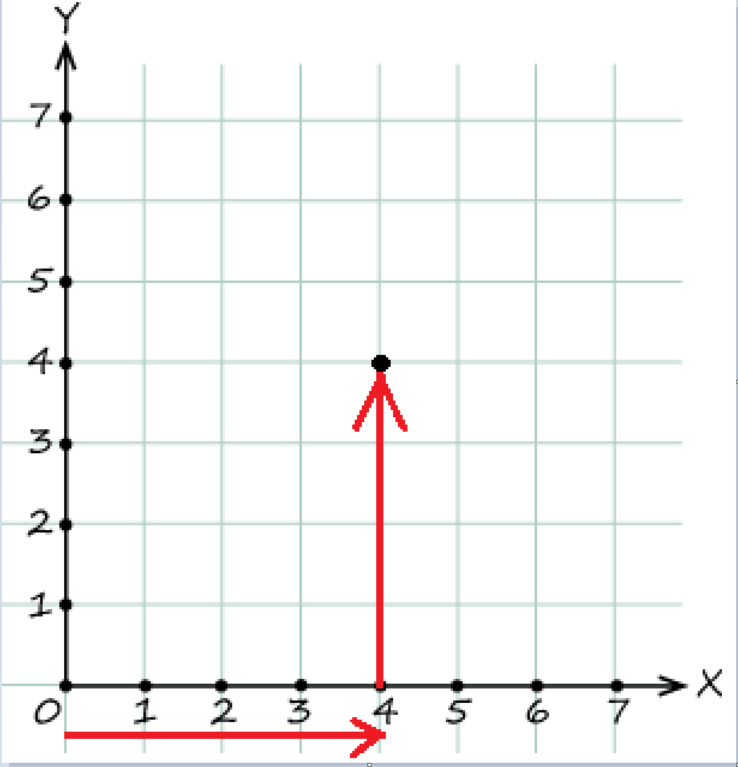
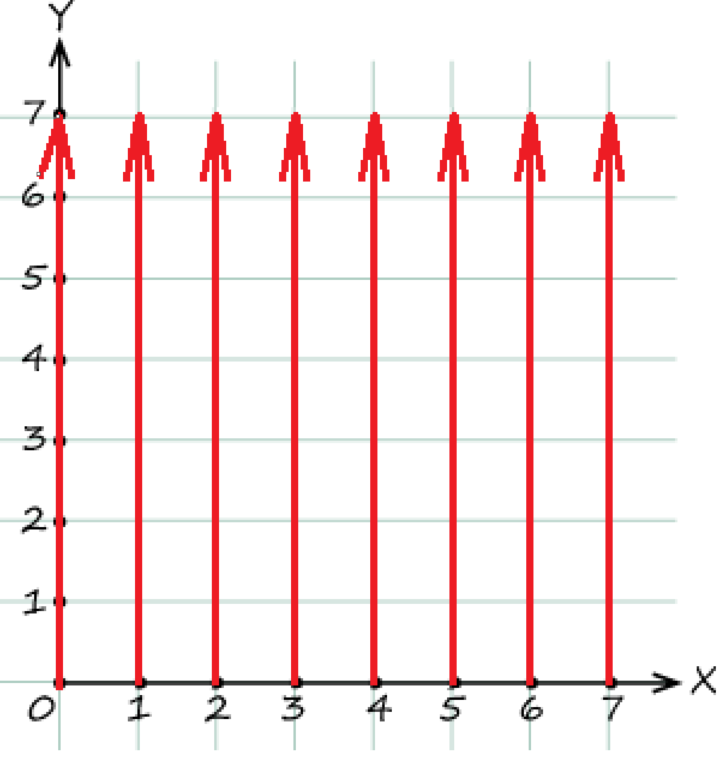
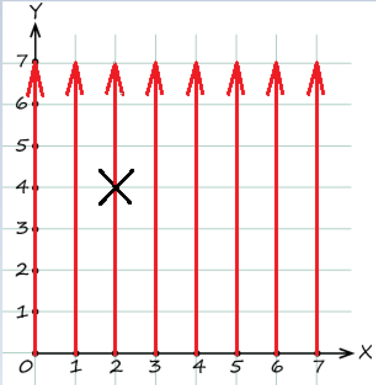

#Introduction
Before diving into "loops", make the console output with the words: "writing the same code doesn't have much impact, and
****it's also time-consuming" for 20 times.

### Plain task solution
You must have got something like this:

    System.out.println("writing the same code doesn't have much impact, and it's also time consuming");
    System.out.println("writing the same code doesn't have much impact, and it's also time consuming");
    System.out.println("writing the same code doesn't have much impact, and it's also time consuming");
    System.out.println("writing the same code doesn't have much impact, and it's also time consuming");
    System.out.println("writing the same code doesn't have much impact, and it's also time consuming");
    System.out.println("writing the same code doesn't have much impact, and it's also time consuming");
    System.out.println("writing the same code doesn't have much impact, and it's also time consuming");
    System.out.println("writing the same code doesn't have much impact, and it's also time consuming");
    System.out.println("writing the same code doesn't have much impact, and it's also time consuming");
    System.out.println("writing the same code doesn't have much impact, and it's also time consuming");
    System.out.println("writing the same code doesn't have much impact, and it's also time consuming");
    System.out.println("writing the same code doesn't have much impact, and it's also time consuming");
    System.out.println("writing the same code doesn't have much impact, and it's also time consuming");
    System.out.println("writing the same code doesn't have much impact, and it's also time consuming");
    System.out.println("writing the same code doesn't have much impact, and it's also time consuming");
    System.out.println("writing the same code doesn't have much impact, and it's also time consuming");
    System.out.println("writing the same code doesn't have much impact, and it's also time consuming");
    System.out.println("writing the same code doesn't have much impact, and it's also time consuming");
    System.out.println("writing the same code doesn't have much impact, and it's also time consuming");
    System.out.println("writing the same code doesn't have much impact, and it's also time consuming");
    System.out.println("writing the same code doesn't have much impact, and it's also time consuming");

There's something wrong with that code, isn't it? Imagine that you were to make this action not for 20 times, but
for a hundred, a thousand... a million. That would take eternity to do that with almost no impact, and what is more 
that code will become unreadable. As you must have already mentioned the whole point of this code is just REPEATING 
THE SAME block of code over and over again.  

# The most basic loops

##While

As you can see the whole point of this example above is just REPEATING THE SAME block of code over and over again no
matter how many times we repeat that. For cases when we have to repeat certain action several times in all c-like 
languages there's a loop construction, which provides a developer with an ability to extract repeatable action to some 
block and declare amount of times for that action to be executed. The following diagram illustrates  the algorithm: 

The main idea of that algorithm is to make console output for 20 times, and to do so as you can see we need to declare
the variable through which we will be able to have overall control over the loop itself, which is (in our case):
- int counter = 1, this variable is necessary to know how many times we have already gone through the loop.
- is counter less or equal to 20, at this point we are checking the amount of times that we have already gone through
    the loop, and there are after that checking 2 possible options:
  - counter is less or equals to 20, which means that we need to execute the code, which basically is:
    - make console output, the code itself
    - increase counter by 1, which means that actual iteration of code execution is over
  - counter is more than 20 which means that we shouldn't do anything else as we have reached the amount of necessary 
     repetitions

There are 3 (actually 4 but in the fourth one we will get acquainted in the future modules) main type of loop 
constructions:"while", "for", "do-while". We will begin with the "while" loop, and the task with console output becomes:

    int counter = 1
    while (counter <= 20) {
        System.out.println("writing the same code doesn't have much impact, and it's also time consuming");
        counter++;
    }

And that is all! This seems to be much better and much more laconic, isn't it? Let's take a look under the hood:
1) Just like in th block scheme we define the counter.
2) Condition checking. The keyword "while", which literally says: until the counter is less than 20 do the following:
3) Make the console output:System.out.println("writing the same code doesn't have much impact, and it's also time-consuming");.
3.1) Increase the counter by one.
4) AND as the condition checking in the 2nd step was true(the counter is still less than 20), and we got to this block 
of code, we have to return to the 2nd step to check the condition once again, and it goes on until we reach 21 with our 
counter.

After taking a look at "while" loop, this task becomes much less time-consuming, and also we almost don't have 
limitations on the amount of repetitions, which can save much time for us.

***
## For

"while" loop looks much better than just copy-pasting the same code line/s required amount of times(and you are less likely
to make mistakes), but in this case we had to take some additional space to **define**, **check** and **increase** the
variable that will give us the control, there's a way to make this even shorter, which is basically "for" loop, which
looks like this:

    for(int counter = 1; counter <= 20; counter++) {
        System.out.println("writing the same code doesn't have much impact, and it's also time consuming");
    }

The code has become even shorter, as we have extracted all the code that is responsible to control the "loop" flow into 
one block(or even one line), but the principle is still the same:

1) Define the counter(just like before).
2) Go to the following statement, which is checking the condition.
3) Execute the code block is condition is true.
4) Increase the variable counter.
5) execute the 2 step and so on until false is met. 

Tricky point here is that if the condition is true it appears to be logical to increment the counter and only after that
go to the code block execution, but it doesn't work like this, as the increment (counter++) statement is executed only 
after the code block with the logics itself is finished.
Also, the last "increment" statement usually interacts with the counter, to be able to break the loop once we need,
those interactions can be different: we can multiply, divide , decrease the counter(any math operation can be applied).

***
###While vs For
So when to use while and when is it preferable to use for loops? The answer is simple: when you know the final amount 
of iterations it's better(simpler) to use "for", and when you have to check something which amount cannot be easily
determined better to use "while", another point worth mentioning is that if you are to interact with the variable that 
has already been defined it's also "while" use-case:

    int toBeChanged = 742;
    ... //actions with the toBeChanged which eventually change the value to minus 5
    while(toBeChanged > toBeChanged * 5) {
        System.out.println(toBeChanged);
        toBeChanged++;
    }

In this case we are not sure how many times those operations will be executed until we meet the condition, and also our 
variable was defined long before the loop itself. As the value of toBeChanged is equal to -5 when it's multiplied by 5 
we get -25 which is less than -5 and that goes on until 0 is met.
For loops can be used when we need to count something:
 
Count the amount of even numbers from -5 to 17:

    int counter = 0;
    for(int iterator = -5; iterator < 18; iterator++) {
        if(iterator % 2 == 0) {
            counter++;
        }
    }
    System.out.println(counter);

Here we go from -5 to 17 inclusive and each time the number is even we increase counter.

***
## Do-while
Do-while loop is a bit different from "while" and "for" as this loop literally says:" before checking the condition 
execute the code block":

In this case the action block will be executed before the condition checking, which literally means that: even if the 
condition is false => the action block will be executed AT LEAST once. Only after that condition is checked.
And do-while block has the following structure:

    int counter = 0
    do {
        System.out.println(counter);
        counter++;
    } while (conter > 0 && counter < 10);

In this case console output will be from 0 to 9, as the number is printed before the increment statement, and if here we
used simple while loop (or for) the code block wouldn't be executed as the condition check would be performed before the 
action block, which means that counter would still remain 0, which is obviously not more than 0.
"Do-while" block is not met that often as "while" and "for" are, because it has a bit different use-case scenarios, it's 
usually used when we need to perform some action at least once before checking some condition, like in cases when we 
have to get some data from anywhere (if the data can be provided continuously), we have to try to get this data and 
while we are receiving this data, we continue(pseudocode example):

    do {
        boolean isThereStillData = //actions to get data
    } while (isThereStillData);

This example can be rewritten with "while" loop:

    boolean isThereStillData = //actions to get data
    while (isThereStillData) {
        isThereStillData = //actions to get data
    }

But now we are to write the same block twice which is not that efficient. 

***
## Continue
Sometimes it's necessary to skip some iterations if a specific condition is met, like, if we have numbers from zero to 
nine, and we want to print all numbers, but 5, we can do the following:

    for (int i = 0; i < 10; i++) {
        if (i == 5) {
            continue;
        }
        System.out.println(i);
    }
    //output will be: 0,1,2,3,4,6,7,8,9

This operator is responsible for stopping executing the rest of the code for CURRENT iteration, which means that overall 
loop execution will be proceeded. Literally that means that we do not want to execute the iteration anymore, (the code 
execution is skipped until the brace which closes the loop is met) and we want to continue with the next one. **But in 
case of "for" loop, as you know after executing the block of code, before checking the condition java goes to increasing
iterator statement and only after that it proceeds with the condition check.**

The example above also can be changed to something like:

    for(int i = 0; i < 10; i++) {
        if(i != 5) {
            System.out.println(i);
        }
    }

Seems that it's even better right? But tricky point here is that as the amount of nested blocks of code is increasing, we
are running into situations where we have 5 or even 6 times nested blocks of code, which makes it hard to read, 
understand, and maintain. The less nested blocks we have the better it is. Even though this operator is not used super 
often

***
###Break
There can be situations when we do not want to proceed loop execution, because of different facts, for example if the 
data that our program consumes is unexpected (if we are expecting to get only positive numbers, but the number we receive 
is zero or below), for that particular case java offers you "break" keyword:

    for (int i = 0; i < 10; i++) {
        if (i == 5) {
            break;
        }
        System.out.println(i);
    }
    //output will be: 0,1,2,3,4

The example above describes what actually "break" keyword does, it just skips code that would have been executed if 
"break" were not present. So the operator is responsible for "ending" current loop, which means that even if this 
statement is used within "for" loop increment statement will not be executed, as java just skips everything within the 
loop.

We have already seen this "break" keyword in switch statements and there, the role of this key word was the same. It was
the command (or the flag) for java to stop code execution within switch statement and proceed outside of switch, and 
here the logics is the same.

***
###Infinite loops
Basically, the main job of any loop is to run the same block of code definite amount of times, this is achieved
through iterator, as it helps us to know current number of iteration. And it works perfectly while we are controlling 
this iterator. But what happens if we stop counting each iteration:

        int counter = 1
        while (counter <= 20) {
            System.out.println(i);
        }

What do you think will happen in this case? The program will get stuck and will be printing to the console "1" infinite
amount of times (or until it is terminated), this happens because the condition is always true, as our counter is never 
increased. 

The same situation is with "for" loops, ignoring increasing statement will make the program stack just like "while" loops:

    for (int i = 0; i < 10;) {
        if (i == 5) {
            break;
        }
        System.out.println(i);
    }

As you can see increment statement is omitted here which means that our iterator will never change and the condition is 
always true, so this will proceed until termination is performed. Besides, this example shows that some statements is for
loops can be skipped, and infinite loop can be achieved with the following syntax:

    for (;;) {
        System.out.println("i");
    }

This looks a bit weird but it works! There's no iterator, condition is always true, and no increment statement, which 
makes java iterate over and over again. 

There's also another way to create such loop with "while":
    
    while (true) {
        System.out.println('i');
    }

This loop is infinite is because the condition is always true, and never changed. So you have to always control this 
iterator so that not let your code get stuck at any point. 

***
###Nested loops
We've already got acquainted with basics of loops, those were just 1 dimension loops, but there can situations where we 
need to take a "step" in depth of a loop, as if we have 2 dimensioned square, on the coordinate plane, and if you want 
to get to the middle of it you are to shift on X coordinate to middle, and after that the same with Y coordinate:

In this case we were moving on Y coordinate ONLY WHEN X = 4, but to be able to do so we have the coordinate plane which 
consists of 7 X points and 7 Y points, and in real world we don't create these fields manually, but what does when the 
following construction is met:

    for(int x = 0; x < 8; x++) {
        for(int y = 0; y < 8; y++) {
        }
    }    

What actually happens is:

On each X step it does 8 steps on Y coordinate and then goes to the next X step. By doing so we can achieve deeper 
dimensions and have overall control over them(this will be super useful when later you will be dealing with arrays of 
arrays and different).

It's necessary to understand that those 2 loops are independent, the example above is just an illustration  of how it 
works, and those iterators can have different counts, steps, and can work with different data structures and types, the 
only common thing is that inner loop executes all its steps on EACH step of outer loop. And outer one is a "counter" for
the inner one. Having this information about iteration step of inner and outer one, we can access any point of the 
"coordinate plane" in the example above, e.g.: if we need to reach point (2, 4), it looks like this:

Iterations will proceed running until the conditions are true, but controlling those iterators we can reach any point 
of the plane.

***
## Go to 
There was such an operator in procedural programming such as go to, (which made program go to a certain point of code and
proceed execution there) but later programmers decided to get reed of that because it made the code less readable and 
maintainable this is why such decision was made. And java doesn't have this operator, but it has something similar which
are labels, we will not study them in terms of this course, as they are not used in modern programming at all, and their
usage is harmful for common programming principles, you should avoid using them when writing code, and creating your 
architecture, to not use them at all, but at the same time you should be aware of it. If you want to know about 
them more, do some research on your own.
