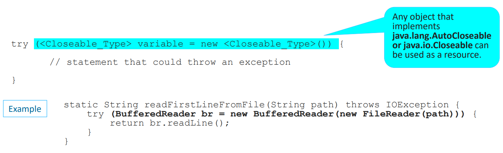

# Exceptions


## Lesson Agenda
+ What is an Exception?
+ The Three Kinds of Exceptions
+ How to Catch and Handle Exceptions?
+ The Exceptions Thrown by a Method
+ How to write your own exception classes?
+ Materials


## What is an Exception?

### Throwing an exception
**An exception** is an event that occurs during the execution of a program that disrupts the normal flow of instructions.

**Throwing an exception** is the process of creating an exception object and handing it to the runtime system.


### The call stack
**The call stack** is the ordered list of methods that had been called to get to the method where the error occurred.


### A stack trace
**A Stack trace** is an information on the execution history of the current thread and lists the names of the classes and methods that were called at the point when the exception occurred.


## The Three Kinds of Exceptions

### Checked, Unchecked Exception and Error
**A Checked Exception** is an exceptional condition that a well-written application should anticipate and recover from. If your code invokes a method which is defined to throw checked exception, your code MUST provide a catch handler. The compiler generates an error if the appropriate catch handler is not present.

**An Error** is an exceptional condition that is external to the application, and that the application usually cannot anticipate or recover from.

**A Runtime Exception** is an exceptional conditions that is internal to the application, and that the application usually cannot anticipate or recover from.

**An Unchecked Exception** is the exception indicated by Errors and Runtime Exceptions.

### Exception Hierarchy


## How to Catch and Handle Exceptions?

### Try Catch Finally syntax


A __try__ block can be followed by one or more __catch__ blocks, each specifying a different type. The first catch block that handles the exception class or one of its superclasses will be executed. So, make sure to catch the most specific class first.

If an exception occurs in the __try__ block, the exception is thrown to the first __catch__ block. If not, the Java exception passes down to the second __catch__ statement. This continues until the exception either is caught or falls through all catches.


### Try-with-resources syntax
**The Try-with-resources statement** is a try statement that declares one or more resources. It
ensures that each resource is closed at the end of the statement. A try-with-resources
statement can have catch and finally blocks just like an ordinary try statement. In a try-with-resources statement, any catch or finally block is run after the resources declared have been
closed.



## The Exceptions Thrown by a Method

### Throws and Throw syntax


### Exceptions and Method Overriding

To handle the exception while you overriding a method in Java, you will have to follow three important rules. They are
as follows:

1. If an overridden method does not throw an exception using throws clause then

    + The overriding method can not throw any checked or compile-time exception.
    + The overriding method can throw any unchecked or runtime exception.

2. If an overridden method throws an unchecked or runtime exception then

    + The overriding method can throw any unchecked or runtime exception.
    + The overriding method can throw the same exception which is thrown by the overridden method.
    + The overriding method can ignore the method level exception.

3. If the superclass method throws checked or compile-time exception then

    + Subclass method can throw an exception which is a subclass of the superclass method’s exception.
    + Subclass method cannot throw the exception which is a superclass of the superclass method’s exception.
    + Subclass method can throw any unchecked or runtime exception.

Look at the below figure to understand better.


Let’s take different types of example programs based on these rules.

```java
public class Parent {
  // Overridden method is not throwing an exception. 
  void msg() {
    System.out.println("msg-Parent");
  }
}

public class Child extends Parent {
  void msg() throws IOException // Compile-time error because the overriding method is throwing a checked exception. 
  {
    System.out.println("msg-Child");
  }

  public static void main(String[] args) throws IOException {
    Parent p = new Child();
    p.msg();

    Child c = new Child();
    c.msg();
  }
}
```

```Output: 
Unresolved compilation problem: Exception IOException is not compatible with throws clause in Parent.msg()
```

In the above example program, if overriding method throws an unchecked exception, there will be no compile-time error.
Look at the program source code.

```java
public class Parent {
  // Overridden method is not throwing an exception. 
  void msg() {
    System.out.println("msg-Parent");
  }
}

public class Child extends Parent {
  void msg() throws ArithmeticException // No compile-time error because the overriding method is throwing an unchecked exception. 
  {
    System.out.println("msg-Child");
  }

  public static void main(String[] args) throws IOException {
    Parent p = new Child();
    p.msg();
    Child c = new Child();
    c.msg();
  }
}
```

```
Output: 
       msg-Child 
       msg-Child
```

In the above example program, if overriding method throws an unchecked exception, there will be no compile-time error.
Look at the program source code.

## How to write your own exception classes?

### Intro

In the article **How to Catch and Handle Exceptions?** and **The Exceptions Thrown by a
Method**, you know how to catch throw and catch exceptions which are defined by JDK such
as `IllegalArgumentException`, `IOException`, `NumberFormatException`, etc.

What if you want to throw your own exceptions? Imagine you’re writing a student management program and you want to throw
`StudentException`, `StudentNotFoundException`, `StudentStoreException` and the like?

So it’s time to create new exceptions of your own.

We will call JDK’s exceptions **built-in exceptions** and call our own exceptions **custom exceptions**.

Let me tell you this: Writing custom exceptions in Java is very easy, but the important thing is, you should ask
yourself this question:

### Why do I need custom exceptions?
_Why do we need to create a new exception, instead of using the ones defined by JDK?_

The answer could be very simple: When you couldn’t find any relevant exceptions in the JDK, it’s time to create new ones
of your own.

But, how do we know which exception is relevant, which is not? By looking at the names of the exceptions to see if its
meaning is appropriate or not. For example, the `IllegalArgumentException` is appropriate to throw when checking
parameters of a method; the `IOException` is appropriate to throw when reading/writing files.

From my experience, most of the cases we need custom exceptions for representing business exceptions which are, at a
level higher than technical exceptions defined by JDK. For example: InvalidAgeException, LowScoreException,
TooManyStudentsException, etc.

### Writing your own exception class
Now, let’s see how to create a custom exception in action. Here are the steps:

+ Create a new class whose name should end with `Exception` like `ClassNameException`. This is a convention to
  differentiate an exception class from regular ones.

+ Make the class extends one of the exceptions which are subtypes of the `java.lang.Exception` class. Generally, a
  custom exception class always extends directly from the Exception class.

+ Create a constructor with a `String` parameter which is the detail message of the exception. In this constructor,
  simply call the super constructor and pass the message. That’s it. The following is a custom exception class which is
  created by following the above steps:

That’s it. The following is a custom exception class which is created by following the above steps:

```java
public class StudentNotFoundException extends Exception {

  public StudentNotFoundException(String message) {
    super(message);
  }

}
```

And the following example shows the way a custom exception is used is nothing different than built-in exception:

```java
public class StudentManager {

  public Student find(String studentID) throws StudentNotFoundException {
    if (studentID.equals("123456")) {
      return new Student();
    } else {
      throw new StudentNotFoundException(
          "Could not find student with ID " + studentID);
    }
  }
}
```

And the following test program handles that exception:

```java
public class StudentTest {
  public static void main(String[] args) {
    StudentManager manager = new StudentManager();

    try {

      Student student = manager.find("0000001");

    } catch (StudentNotFoundException ex) {
      System.err.print(ex);
    }
  }
}
```

Run this program and you will see this output:

```
StudentNotFoundException: Could not find student with ID 0000001
```

### Re-throwing an exception which is wrapped in a custom exception
It’s a common practice for catching a built-in exception and re-throwing it via a custom exception. To do so, let add a
new constructor to our custom exception class. This constructor takes two parameters: the detail message and the cause
of the exception. This constructor is implemented in the `Exception` class as following:

```java
public Exception(String message,Throwable cause)
```

Besides the detail message, this constructor takes a Throwable’s subclass which is the origin (cause) of the current
exception. For example, create the `StudentStoreException` class as following:

```java
public class StudentStoreException extends Exception {

  public StudentStoreException(String message, Throwable cause) {
    super(message, cause);
  }
}
```

And the following example shows where the `StudentStoreException` gets thrown:

```java
public void save(Student student) throws StudentStoreException {
    try {
        // execute SQL statements..
    } catch (SQLException ex) {
        throw new StudentStoreException("Failed to save student", ex);
    }
}
``` 

Here, suppose that the `save()` method stores the specified student information into a database using JDBC. The code can
throw `SQLException`. We catch this exception and throw a new `StudentStoreException` which wraps the `SQLException` as its
cause. And it’s obvious that the save() method declares to throw `StudentStoreException` instead of `SQLException`.

So what is the benefit of re-throwing exception like this?

Why not leave the original exception to be thrown?

Well, the main benefit of re-throwing exception by this manner is adding a higher abstraction layer for the exception
handling, which results in more meaningful and readable API. Do you see `StudentStoreException` is more meaningful than
`SQLException`, don’t you?

However, remember to include the original exception in order to preserve the cause so we won’t lose the trace when
debugging the program when the exception occurred.

And the following code demonstrates handling the `StudentStoreException` above:

```java
StudentManager manager = new StudentManager();

try {

    manager.save(new Student());

  } catch (StudentStoreException ex) { 
    System.err.print(ex); 
  }
``` 

That’s about the lesson of writing custom exceptions in Java.

### Best practices for custom exceptions
**Prefer Specific Exceptions.** The more specific the exception that you throw is, the better. Always try to find the
class that fits best to your exceptional event and first look at existing Exceptions before creating your own.

**Follow the naming convention.** Append the string Exception to the names of all classes that inherit (directly or
indirectly) from the Exception class.

**Provide Javadoc comments** for your exception class. The Javadoc should describe the general meaning of the exception
and the situations in which it might occur. The goal is to help other developers to understand your API and to avoid
common error scenarios.

**Provide a constructor that sets the cause.** You should implement at least one constructor that gets the causing
Throwable as a parameter and sets it on the superclass

## Materials

https://docs.oracle.com/javase/tutorial/essential/exceptions/index.html

https://www.geeksforgeeks.org/exceptions-in-java

https://www.javatpoint.com/exception-handling-in-java