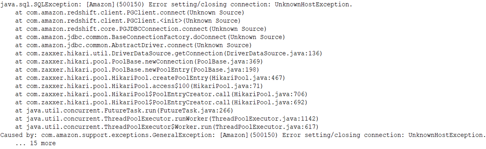

# What is an Exception?

## Lesson Agenda
+ Throwing an exception
+ The call stack
+ A stack trace

### Throwing an exception

**An exception** is an event that occurs during the execution of a program that disrupts the normal flow of instructions.

**Throwing an exception** is the process of creating an exception object and handing it to the runtime system.

### The call stack

**The call stack** is the ordered list of methods that had been called to get to the method where the error occurred.

### A stack trace
**A Stack trace** is an information on the execution history of the current thread and lists the names of the classes and methods that were called at the point when the exception occurred. 

## Homework
* Solve problems: TODO -- add link to autocode?

