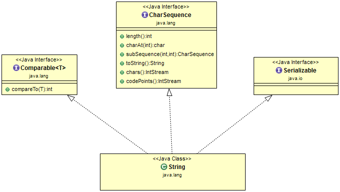

# String (java.lang.String)

## Overview
The String class represents character strings.

**For example:**
```
  String str = "Geeks";
```


**Creation**

**Strings could be created in two ways:**

1. Declaring String variable and assigning a value to it (value in double quotes is called string literal):
```
  String str1 = "Autumn";
```

2. With new keyword (i.e. calling a constructor):
```
  String str2 = new String("Winter");
  
  char data[] = {'S', 'p', 'r', 'i', 'n', 'g'};
  String str3 = new String(data);
```

**Hierarchy:**

String implements several interfaces, and have all their methods inherited:



In addition to the methods defined by **Serializable**, **CharSequence**, **Comparable<String>**,
**String** defines some of its own, which are summarized in the following table.

| Method                                                                                     | Description                                                                                                                                 |
|--------------------------------------------------------------------------------------------|---------------------------------------------------------------------------------------------------------------------------------------------|
| char charAt(int index)                                                                     | Returns the char value at the specified index.                                                                                              |
| int compareTo(String anotherString)                                                        | Compares two strings lexicographically.                                                                                                     |
| int compareToIgnoreCase(String str)                                                        | Remove all of the elements from this list.                                                                                                  |
| String concat(String str)                                                                  | Concatenates the specified string to the end of this string.                                                                                |
| boolean contains(CharSequence s)                                                           | Returns true if and only if this string contains the specified sequence of char values.                                                     |
| boolean contentEquals(StringBuffer sb)                                                     | Compares this string to the specified StringBuffer.                                                                                         |
| static String copyValueOf(char[] data, int offset, int count)                              | Equivalent to valueOf(char[], int, int).                                                                                                    |
| boolean endsWith(String suffix)                                                            | Tests if this string ends with the specified suffix.                                                                                        |
| boolean equalsIgnoreCase(String anotherString)                                             | Compares this String to another String, ignoring case considerations.                                                                       |
| static String format(String format, Object... args)                                        | Returns a formatted string using the specified format string and arguments.                                                                 |
| int indexOf(String str, int fromIndex)                                                     | Returns the index within this string of the first occurrence of the specified substring, starting at the specified index.                   |
| String intern()                                                                            | Returns a canonical representation for the string object.                                                                                   |
| boolean isEmpty()                                                                          | Returns true if, and only if, length() is 0.                                                                                                |
| static String join(CharSequence delimiter, CharSequence... elements)                       | Returns a new String composed of copies of the CharSequence elements joined together with a copy of the specified delimiter.                |
| int lastIndexOf(String str, int fromIndex)                                                 | Returns the index within this string of the last occurrence of the specified substring, searching backward starting at the specified index. |
| int length()                                                                               | Returns the length of this string.                                                                                                          |
| boolean matches(String regex)                                                              | Tells whether or not this string matches the given regular expression.                                                                      |
| boolean regionMatches(boolean ignoreCase, int toffset, String other, int ooffset, int len) | Tests if two string regions are equal.                                                                                                      |
| String replace(char oldChar, char newChar)                                                 | Returns a string resulting from replacing all occurrences of oldChar in this string with newChar.                                           |
| String replaceAll(String regex, String replacement)                                        | Replaces each substring of this string that matches the given regular expression with the given replacement.                                |
| String replaceFirst(String regex, String replacement)                                      | Replaces the first substring of this string that matches the given regular expression with the given replacement.                           |
| String[] split(String regex, int limit)                                                    | Splits this string around matches of the given regular expression.                                                                          |
| boolean startsWith(String prefix, int toffset)                                             | Tests if the substring of this string beginning at the specified index starts with the specified prefix.                                    |
| String substring(int beginIndex, int endIndex)                                             | Returns a string that is a substring of this string.                                                                                        |
| char[] toCharArray()                                                                       | Converts this string to a new character array.                                                                                              |
| String toLowerCase(Locale locale)                                                          | Converts all of the characters in this String to lower case using the rules of the given Locale.                                            |
| String toUpperCase(Locale locale)                                                          | Converts all of the characters in this String to upper case using the rules of the given Locale.                                            |
| String trim()                                                                              | Returns a string whose value is this string, with any leading and trailing whitespace removed.                                              |
| static String valueOf(Object obj)                                                          | Returns the string representation of the Object argument.                                                                                   |

Constructors of **String**:

| Constructor                                  | Description                                                                                                                                                                                 |
|----------------------------------------------|---------------------------------------------------------------------------------------------------------------------------------------------------------------------------------------------|
| String()                                     | Initializes a newly created String object so that it represents an empty character sequence.                                                                                                |
| String(byte[] bytes)                         | Constructs a new String by decoding the specified array of bytes using the platform's default charset.                                                                                      |
| String(byte[] bytes, int offset, int length) | Constructs a new String by decoding the specified subarray of bytes using the platform's default charset.                                                                                   |
| String(char[] value)                         | Allocates a new String so that it represents the sequence of characters currently contained in the character array argument.                                                                |
| String(char[] value, int offset, int count)  | Allocates a new String that contains characters from a subarray of the character array argument.                                                                                            |
| String(String original)                      | Initializes a newly created String object so that it represents the same sequence of characters as the argument; in other words, the newly created string is a copy of the argument string. |
| String(StringBuffer buffer)                  | Allocates a new string that contains the sequence of characters currently contained in the string buffer argument.                                                                          |
| String(StringBuilder builder)                | Allocates a new string that contains the sequence of characters currently contained in the string builder argument.                                                                         |

## Important points about Java String:

String is Immutable class: It means, that String object cannot be changed after creation. However, a new value can be assigned to the String reference

```
  String a = "a";
  Stirng b = "b";
  
  a = b; // references a and b now both point to String object with value "b". 
```
 
Sequence of characters: String stores its value as array of bytes.

String pool: In Java, Strings are 'pooled', this concept is explained below.

Concatenation operator '+': In Java, plus operator support String operands. If operands of '+' are Strings, they are concatenated and returned as a new String. If only one operand is a String, the other one is converted to String before concatenation. 

```
    String text1 = "Message";
    
    String text2 = text1 + ": ";      
                                      // text2 is "Message: "
    
    String text3 = text2 + 12         // 12 is converted to "12"         
                                      // text3 is "Message: 12"
```

## String pool

### Overview

The **String** is the most widely used data structure. Caching the String literals and reusing them
saves a lot of heap space because different String variables refer to the same object in the String
pool. String intern pool serves exactly this purpose.

## Important points about Java String pool:
- Security
- Synchronization
- Hashcode Caching
- Performance

Java String Pool is the special memory region where Strings are stored by the JVM. Since Strings are
immutable in Java, the JVM optimizes the amount of memory allocated for them by storing only one
copy of each literal String in the pool. This process is called interning:

```
    String s1 = "Hello World";
    String s2 = "Hello World";

    assertThat(s1 == s2).isTrue();       // s1 and s2 point to same object
```

Because of the presence of the String pool in the preceding example, two different variables are
pointing to same String object from the pool, thus saving crucial memory resource.


If you want to store this string in the constant pool then you will need to “intern” it.

**For example:**
```
    String internedString = str.intern();
    // this will add the string to string constant pool.
```

## Security
If Strings were mutable, then by the time we execute the update, we can't be sure that the String we
received, even after performing security checks, would be safe. The untrustworthy caller method
still has the reference and can change the String between integrity checks. Thus making our query
prone to SQL injections in this case. So mutable Strings could lead to degradation of security over
time.

It could also happen that the String userName is visible to another thread, which could then change
its value after the integrity check.

## Synchronization
Being immutable automatically makes the String thread safe since they won't be changed when accessed
from multiple threads.

Hence, immutable objects, in general, can be shared across multiple threads running simultaneously.
They're also thread-safe because if a thread changes the value, then instead of modifying the same,
a new String would be created in the String pool. Hence, Strings are safe for multi-threading.

## Hashcode Caching
The immutability guarantees Strings that their value won’t change. So the hashCode() method is
overridden in String class to facilitate caching, such that the hash is calculated and cached during
the first hashCode() call and the same value is returned ever since.

This, in turn, improves the performance of collections that uses hash implementations when operated
with String objects.

## Performance
As we saw previously, String pool exists because Strings are immutable. In turn, it enhances the
performance by saving heap memory and faster access of hash implementations when operated with
Strings.

Since String is the most widely used data structure, improving the performance of String have a
considerable effect on improving the performance of the whole application in general.

## Materials
<https://docs.oracle.com/javase/8/docs/api/java/lang/String.html>

<https://www.geeksforgeeks.org/strings-in-java/>

<https://www.javatpoint.com/java-string>

<https://www.baeldung.com/java-string-immutable>
###
