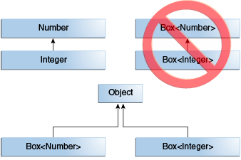

# Generic classes

## Overview
A generic type is a generic class or interface that is parameterized over types.

A generic class is implemented exactly like a **non-generic class**. The only difference is that it contains a type
parameter section. There can be more than one type of parameter, separated by a comma. The classes, which accept one or
more parameters, are known as parameterized classes or parameterized types.

### Creating a generic class:
```
    class MyGen<T>{  
        T obj;  
        void add(T obj) {this.obj=obj;}  
        T get() {return obj;}  
    }
```

### Using generic class:
Let's see the code to use the generic class.
```
    class TestGenerics{  
        public static void main(String args[]){  
            MyGen<Integer> m=new MyGen<Integer>();  
            m.add(2);  
            // m.add("vivek"); Compile time error  
            System.out.println(m.get());  
        }
    }
```

### Multiple Type Parameters:
```
    public interface Pair<K, V> {
        public K getKey();
        public V getValue();
    }
```

## Generics and Primitive Data Types
One restriction of generics in _Java_ is that **the type parameter cannot be a primitive type**.

For example, the following doesn't compile:
```
    List<int> list = new ArrayList<>();
    list.add(17);
```
To understand why primitive data types don't work, let's remember that generics are a compile-time feature, meaning the
type parameter is erased and all generic types are implemented as type `Object`.

Let's look at the add method of a list:
```
    List<Integer> list = new ArrayList<>();
    list.add(17);
```

The signature of the add method is:
```
    boolean add(E e);
```

and will be compiled to:
```
    boolean add(Object e);
```

Therefore, type parameters must be convertible to `Object`. Since primitive types don't extend `Object`, we can't use
them as type parameters.

However, _Java_ provides boxed types for primitives, along with autoboxing and unboxing to unwrap them:
```
    Integer a = 17;
    int b = a;
```

But primitive type arrays can be passed to the type parameter because arrays are reference types.
```
    ArrayList<int[]> a = new ArrayList<>();
```

## Generics, Inheritance, and Subtypes



Given two concrete types **A** and **B** (for example, `Number` and `Integer`), `MyClass<A>` has no relationship to
`MyClass<B>`, regardless of whether or not **A** and **B** are related. The common parent of `MyClass<A>` and
`MyClass<B>` is `Object`.

Now consider the following method:
```
    public void boxTest(Box<Number> n) { /* ... */ }
```

What type of argument does it accept? By looking at its signature, you can see that it accepts a single argument whose
type is `Box<Number>`. But what does that mean? Are you allowed to pass in `Box<Integer>` or `Box<Double>`, as you might
expect? The answer is **"no"**, because `Box<Integer>` and `Box<Double>` are not subtypes of `Box<Number>`.

### Generic Classes and Subtyping
You can subtype a generic class or interface by extending or implementing it. The relationship between the type
parameters of one class or interface and the type parameters of another are determined by the `extends` and `implements`
clauses.

Now imagine we want to define our own list interface, `PayloadList`, that associates an optional value of generic type
**P** with each element. Its declaration might look like:
```
    interface PayloadList<E,P> extends List<E> {
        void setPayload(int index, P val);
    }
```

The following parameterizations of `PayloadList` are subtypes of `List<String>`:
- `PayloadList<String,String>`
- `PayloadList<String,Integer>`
- `PayloadList<String,Exception>`


## Materials
<https://docs.oracle.com/javase/tutorial/java/generics/types.html>

<https://www.baeldung.com/java-generics>

<https://www.geeksforgeeks.org/generics-in-java/>

<https://www.javatpoint.com/generics-in-java>
###
