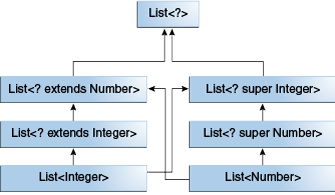

# Wildcard

## Overview
The **?** (question mark) symbol represents the _wildcard element_. It means any type. If we write `<? extends Number>`,
it means any child class of `Number`, e.g., `Integer`, `Float`, and `Double`. Now we can call the method of `Number`
class through any child class object.

We can use a wildcard as a type of a _parameter_, _field_, _return type_, or _local variable_. However, it is not
allowed to use a wildcard as a type argument for a _generic method invocation_, a _generic class instance creation_, or
a _supertype_.

### Unbounded Wildcards
#### Revisit Unbounded Wildcard `< ? >`
Clearly, `< ? >` can be interpreted as `<? extends Object>`, which accepts ALL _Java_ classes. You should use `< ? >`
only if:
- The implementation depends only on methods that provided in the `Object` class.
- The implementation does not depend on the type parameter.

#### Example:
```
    public void display(List<?> list) {  
        for(Object o:list) {  
            System.out.println(o);  
        }    
    }  
```

### Upper Bounded Wildcards
The purpose of upper bounded wildcards is to decrease the restrictions on a variable. It restricts the unknown type to
be a specific type or a subtype of that type. It is used by declaring wildcard character ("?") followed by the extends
(in case of, class) or implements (in case of, interface) keyword, followed by its upper bound.

The sumOfList method returns the sum of the numbers in a list:
```
    public static double sumOfList(List<? extends Number> list) {
        double s = 0.0;
        for (Number n : list)
            s += n.doubleValue();
        return s;
    }
```

The following code, using a list of `Integer` objects, prints `sum = 6.0`:
```
    List<Integer> li = Arrays.asList(1, 2, 3);
    System.out.println("sum = " + sumOfList(li));
```

A list of `Double` values can use the same `sumOfList` method. The following code prints `sum = 7.0`:
```
    List<Double> ld = Arrays.asList(1.2, 2.3, 3.5);
    System.out.println("sum = " + sumOfList(ld));
```

### Lower Bounded Wildcards
The purpose of lower bounded wildcards is to restrict the unknown type to be a specific type or a supertype of that
type. It is used by declaring wildcard character **("?")** followed by the super keyword, followed by its lower bound.

A lower bounded wildcard is expressed using the wildcard character **('?')**, following by the super keyword, followed
by its lower bound: `<? super A>`.
```
class WildcardDemo {
    public static void main(String[] args) {
        // Lower Bounded Integer List
        List<Integer> list1 = Arrays.asList(4, 5, 6, 7);
        // Integer list object is being passed
        printOnlyIntegerClassorSuperClass(list1);
        // Number list
        List<Number> list2 = Arrays.asList(4, 5, 6, 7);
        // Integer list object is being passed
        printOnlyIntegerClassorSuperClass(list2);
    }
 
    public static void printOnlyIntegerClassorSuperClass(List<? super Integer> list) {
        System.out.println(list);
    }
}
```

**Note: You can specify an upper bound for a wildcard, or you can specify a lower bound, but you cannot specify both.**

## Subtyping
Given the following two regular (non-generic) classes:
```
    class A { /* ... */ }
    class B extends A { /* ... */ }
```

It would be reasonable to write the following code:
```
    B b = new B();
    A a = b;
```

This example shows that inheritance of regular classes follows this rule of subtyping: class **B** is a subtype of class
**A** if **B** extends **A**. This rule does not apply to generic types:
```
    List<B> lb = new ArrayList<>();
    List<A> la = lb;   // compile-time error
```

Although `Integer` is a subtype of `Number`, `List<Integer>` is not a subtype of `List<Number>` and, in fact, these two
types are not related. The common parent of `List<Number>` and `List<Integer>` is `List<?>`.

In order to create a relationship between these classes so that the code can access Number's methods through
`List<Integer>`'s elements, use an upper bounded wildcard:
```
    List<? extends Integer> intList = new ArrayList<>();
    List<? extends Number>  numList = intList;  // OK. List<? extends Integer> is a subtype of List<? extends Number>
```



## Guidelines for Wildcard Use
An "In" Variable
An "in" variable serves up data to the code. Imagine a copy method with two arguments: copy(src, dest). The src argument provides the data to be copied, so it is the "in" parameter.
An "Out" Variable
An "out" variable holds data for use elsewhere. In the copy example, copy(src, dest), the dest argument accepts data, so it is the "out" parameter.

Wildcard Guidelines:
- An "in" variable is defined with an upper bounded wildcard, using the extends keyword.
- An "out" variable is defined with a lower bounded wildcard, using the super keyword.
- In the case where the "in" variable can be accessed using methods defined in the `Object` class, use an unbounded wildcard.
- In the case where the code needs to access the variable as both an "in" and an "out" variable, do not use a wildcard.

## Materials
<https://www.geeksforgeeks.org/wildcards-in-java/>

<https://www3.ntu.edu.sg/home/ehchua/programming/java/JavaGeneric.html>

<https://docs.oracle.com/javase/tutorial/java/generics/wildcards.html>

<https://www.javatpoint.com/generics-in-java>
###
