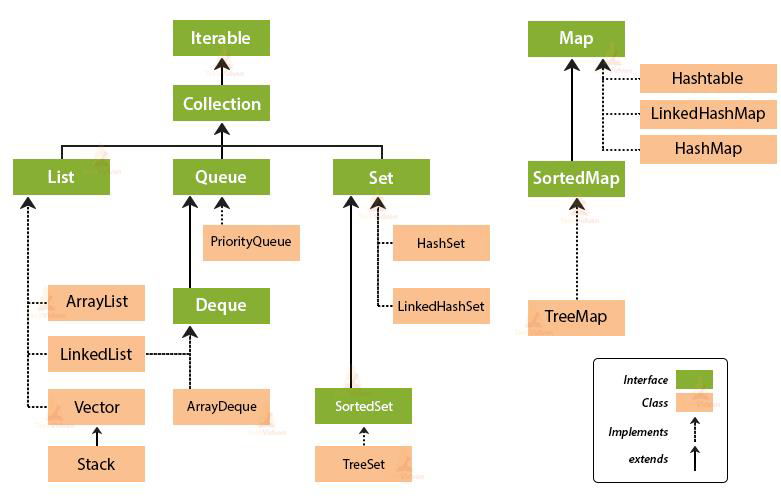

# Collections Overview

## Agenda
* Before Collections
* Java Collections Framework
* Revision
* Hierarchy
* Iterable interface
* Iterator
* Collections
* Collection interface
* Materials


## Overview
Before **Collections** made its most welcome debut, the standard methods for grouping Java objects were via the **Array**, the **Vector**, and the **Hashtable**

All three of these collections have different methods and syntax for accessing members: 

* **Array** uses the square bracket ([]) symbols
* **Vector** uses the elementAt method
* **Hashtable** uses get and put methods. 

These differences have long led programmers down the path to inconsistency in implementing their own collections -- some emulate the **Vector** access methods and some emulate the Enumeration interface.

To further complicate matters, most of the Vector methods are marked as final; that is, you cannot extend the **Vector** class to implement a similar sort of collection. We could create a collection class that looked like a **Vector** and acted like a **Vector**, but it couldn't be passed to a method that takes a **Vector** as a parameter.

Finally, none of the collections (**Array**, **Vector** or **Hashtable**) implements a standard member access interface and had no common interface.

## Java Collections Framework
JDK 1.2 introduced a new framework for collections of objects, called the **Java Collections Framework**, offers developers a common way to implement and access collections.

The **Collections framework** will benefit your programming in many ways:
* **Reduces programming effort.** Algorithms and data structures are already implemented, developer can focus on
other important parts of application.

* **Increases program speed and quality.** Programmer does not need to think of the best implementation of a
specific data structure. Programmer can simply use the best implementation to drastically boost the performance
of algorithm/program.

* **Consistent API.**

* **Reduces effort to design new APIs.** You don't have to reinvent the wheel each time are
creating an API that relies on collections; instead, just use standard collection
interfaces.

* **Fosters software reuse.** Collections interfaces and implementations are flexible
enough to be reused given that there is a contract of interface.

## Revision
* **Class** - A class is a user
  defined blueprint or prototype from which objects are created. It represents
  the set of properties or methods that are common to all objects of one type.

* **Interface** - Like a class, an interface can have methods and variables, but the methods declared in an
  interface are by default abstract ( only method signature, no body ). Interfaces specify what a
  class must do and not how. It is the blueprint of the class.
```
public interface MyInterface {
    //don’t need to implement, since java 8
    default void newMethod() {
        System.out.println("Newly added default method");
    }

    //don’t need to implement + we cannot override it
    static void anotherNewMethod() {
        System.out.println("Newly added static");
    }

    //must be implemented
    void existingMethod(String str);
}
```

## Hierarchy


## Iterable interface
The **Iterable** interface was introduced in JDK 1.5. It belongs to `java.lang` package. In general, an object Implementing Iterable allows it to be iterated. An iterable interface allows an object to be the target of enhanced for loop(**for-each loop**).

**Iterable** interface is the root interface for all the collection classes

```
public interface Iterable<T>{
  Iterator<T>    iterator();
  
  Spliterator<T> spliterator();

  void forEach(Consumer<? super T> action);
}

```
| Method                    | Second Description   |
|---------------------------|----------------------|
| `Iterator <T> iterator()` | Returns the iterator |

There are three ways in which objects of **Iterable** can be iterated:
* **Using enhanced for loop(for-each loop)**
``` 
List<String> list = new ArrayList<>();

list.add("one");
list.add("two");
list.add("three");

for( String element : list ){
    System.out.println( element.toString() );
}
```
* **Using Iterable forEach loop**
```
List<String> list = new ArrayList><();

list.add("one");
list.add("two");
list.add("three");

list.forEach( (element) -> {
    System.out.println( element );
});
```
* **Using Iterator<T> interface**
```
List<String> list = new ArrayList><();

list.add("one");
list.add("two");
list.add("three");

Iterator<String> iterator = list.iterator();

while(iterator.hasNext()) {
    String element = iterator.next();
    System.out.println(element);
}
```
## Iterator
**Iterator** interface represents an object capable of iterating through a collection of Java objects, one object at a time.

| Method               | Second Description                                                                                                                                            |
|----------------------|---------------------------------------------------------------------------------------------------------------------------------------------------------------|
| `boolean hasNext()`  | Returns true if the iterator has more elements otherwise it returns false                                                                                     |
| `Object next()`      | Returns the element and moves the cursor pointer to the next element. (throws `NoSuchElementException`)                                                       |
| `void remove()`      | Removes the last elements returned by the iterator                                                                                                            |
| `forEachRemaining()` | Iterates over all remaining elements in the Iterator and calls a Java Lambda Expression passing each remaining element as parameter to the lambda expression. |

### Obtaining an Iterator
Most often that is how you will interact with an **Iterator** by obtaining it from some Java object that contains multiple nested objects.
You can also obtain an **Iterator** from many of the Java Collection data structures, e.g. a **List**, **Set**, **Map**, **Queue**, **Deque** or **Map**.
```
List<String> list = new ArrayList<>();
list.add("one");
list.add("two");
list.add("three");

Iterator<String> iterator = list.iterator();

Set<String> set = new HashSet<>();
set.add("one");
set.add("two");
set.add("three");

Iterator<String> iterator2 = set.iterator();
```

### Iterating an Iterator
You iterate the objects in an **Iterator** using a while loop.
```
Iterator iterator = list.iterator();

while(iterator.hasNext()) {
    Object nextObject = iterator.next();

}
```

### Modification During Iteration
Some collections do not allow you to modify the collection while you are iterating it via an **Iterator**. In that case you will get a `ConcurrentModificationException` the next time you call the `Iterator next()` method. The following example results in a `ConcurrentModificationException` when executed.
```
List<String> list = new ArrayList<>();

list.add("123");
list.add("456");
list.add("789");

Iterator<String> iterator = list.iterator();

while(iterator.hasNext()) {
    String value = iterator.next();

    if(value.equals("456")){
        list.add("999");
    }
}
```

### Remove Elements During Iteration
The Java Iterator interface has a `remove()` method which lets you remove the element just returned by `next()` from the underlying collection. Calling `remove()` does not cause a `ConcurrentModificationException` to be thrown.
```
List<String> list = new ArrayList<>();

list.add("123");
list.add("456");
list.add("789");

Iterator<String> iterator = list.iterator();

while(iterator.hasNext()) {
    String value = iterator.next();

    if(value.equals("456")){
        iterator.remove();
    }
}
```

## Collection interface
The **Collection** interface represents a group of objects (elements)

The **Collection** interface is implemented by all the classes in the collection framework

| Method                                     | Second Description                                |
|--------------------------------------------|---------------------------------------------------|
| `int size()`                               | Returns the number of elements in this collection |
| `boolean isEmpty()`                        | TRUE - contains no elements, FALSE - contains     |
| `boolean contains Object o)`               | TRUE - contains the specified element, FALSE - no |
| `boolean containsAll (Collection<?>)`      | TRUE - contains ***all*** of the elements         |
| `boolean add E e)`                         | Inserts an element to collection                  |
| `boolean addAll (Collection<? extends E>)` | Insert the specified collection elements          |
| `boolean remove(Object element)`           | Removes the given objection                       |
| `boolean removeAll (Collection<?>)`        | Removes all given objects                         |
| `boolean retainAll (Collection<?>)`        | Retains only given objects                        |

## Collections
The Java **Collections** class (`java.util.Collections` package), contains a long list of utility methods for working with collections in Java. 
* **addAll()**

The Java Collections `addAll()` method can add a variable number of elements to a Collection
```
List<String> list = new ArrayList<>();
Collections.addAll(list, "element 1", "element 2", "element 3");
```
* **binarySearch()**

The Collections `binarySearch()` method can search for an element using a binary search algorithm. The **List** must be sorted in ascending order before you search it using `binarySearch()`.
```
List<String> list = new ArrayList<>();
list.add("one");
list.add("two");
list.add("three");
list.add("four");
list.add("five");

Collections.sort(list);
int index = Collections.binarySearch(list, "four");
System.out.println(index);
```
* **copy()**

The Collections `copy()` method can copy all elements of a **List** into another **List**.
```
List<String> source = new ArrayList<>();
Collections.addAll(source, "e1", "e2", "e3");

List<String> destination = new ArrayList<>();
Collections.copy(destination, source);
```
* **reverse()**

The Collections `reverse()` method can reverse the elements in a Java **List**.
```
List<String> list = new ArrayList<String>();

list.add("one");
list.add("two");
list.add("three");

Collections.reverse(list);
```
After executing the above code, the sequence of the elements in the **List** will be three, two, one .
* **shuffle()**

The Collections `shuffle()` method can shuffle the elements of a **List**.
```
List<String> list = new ArrayList<String>();

list.add("one");
list.add("two");
list.add("three");

Collections.shuffle(list);
```
* **sort()**

The Collections `sort()` method can sort a Java **List**.
```
List<String> list = new ArrayList<String>();

list.add("one");
list.add("two");
list.add("three");
list.add("four");

Collections.sort(list);
```
After running this code the order of the elements in the **List** will be four, one, three, four, as the _String_ elements will be sorted _alphabetically_.

* **min()/max()**
  The Collections `max()`/`min()` method can find the maximum/minimum element in a **List** according to the _natural order_ of the elements.
```
List source = new ArrayList();
source.add("1");
source.add("2");
source.add("3");

String max = (String) Collections.max(source);

List source = new ArrayList();
source.add("1");
source.add("2");
source.add("3");

String min = (String) Collections.min(source);
```

## Materials

Java , Head First book

Thinking in Java, Eckel book

https://docs.oracle.com/javase/tutorial/collections/interfaces/index.html

https://www.javatpoint.com/collections-in-java

https://www.geeksforgeeks.org/collections-class-in-java

http://tutorials.jenkov.com/java-collections/

https://www.baeldung.com/java-iterator-vs-iterable