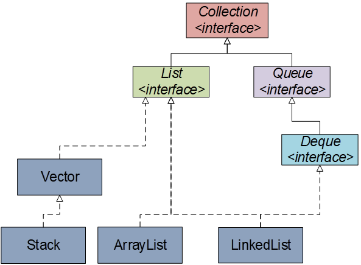
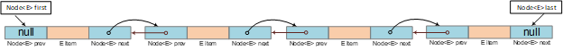
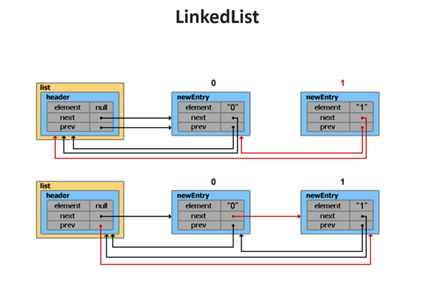

# List Interface (_java.util.List_)

## Agenda
* Overview
* AbstractList
* AbstractSequentialList
* ArrayList
* LinkedList
* CopyOnWriteArrayList
* Materials

## Overview
An ordered collection (also known as a sequence).



### The important points about Java List are:
- Elements can be inserted or accessed by their position in the list, using a zero-based index.
- Elements have a specific order.
- May contain duplicate elements.
- Elements can be searched for within the list.

```
  List<String> list = new ArrayList<>();

  list.add("String1");
  list.add("String2");
  list.add("String3");
```

In addition to the methods defined by **Collection**, **List** defines some of its own, which are summarized in the following table.

| Method                                                 | Description                                                                                                                       |
|--------------------------------------------------------|-----------------------------------------------------------------------------------------------------------------------------------|
| `boolean add(E e)`                                     | Appends the specified element at the end of a list.                                                                               |
| `void add(int index, E element)`                       | Inserts the specified element at the specified position in a list.                                                                |
| `boolean addAll(Collection<? extends E> c)`            | Appends all of the elements in the specified collection to the end of a list.                                                     |
| `boolean addAll(int index, Collection<? extends E> c)` | Appends all the elements in the specified collection, starting at the specified position of the list.                             |
| `E get(int index)`                                     | Fetches the element from the particular position of the list.                                                                     |
| `void clear()`                                         | Remove all of the elements from this list.                                                                                        |
| `boolean isEmpty()`                                    | Returns true if the list is empty, otherwise false.                                                                               |
| `int lastIndexOf(Object o)`                            | Returns the index in this list of the last occurrence of the specified element, or -1 if the list does not contain this element.  |
| `E remove(int index)`                                  | Removes the element present at the specified position in the list.                                                                |
| `Object[] toArray()`                                   | Returns an array containing all of the elements in this list in the correct order.                                                |
| `E set(int index, E element)`                          | Replaces the specified element in the list, present at the specified position.                                                    |
| `boolean contains(Object o)`                           | Returns true if the list contains the specified element                                                                           |
| `boolean containsAll(Collection<?> c)`                 | Returns true if the list contains all the specified element                                                                       |
| `int indexOf(Object o)`                                | Returns the index in this list of the first occurrence of the specified element, or -1 if the List does not contain this element. |
| `E remove(int index)`                                  | Removes the element present at the specified position in the list.                                                                |
| `boolean removeAll(Collection<?> c)`                   | Removes all the elements from the list.                                                                                           |
| `void replaceAll(UnaryOperator<E> operator)`           | Replaces all the elements from the list with the specified element.                                                               |
| `void retainAll(Collection<?> c)`                      | Retains all the elements in the list that are present in the specified collection.                                                |
| `void sort(Comparator<? super E> c)`                   | Sorts the elements of the list on the basis of specified comparator.                                                              |
| `Spliterator<E> spliterator()`                         | Creates spliterator over the elements in a list.                                                                                  |
| `int size()`                                           | Returns the number of elements present in the list.                                                                               |

### Implementations:
- AbstractList
- AbstractSequentialList
- ArrayList
- LinkedList
- CopyOnWriteArrayList
- Stack
- Vector

## AbstractList
The **AbstractList** class provides a partial implementation of the **List** interface (except `get()` and `size()` methods).

## AbstractSequentialList
The **AbstractSequentialList** class extends **AbstractList** to provide support for linked lists.


## ArrayList

### Overview

The **ArrayList** class is a resizable array, which can be found in the `java.util` package. Java **ArrayList** class uses a dynamic array for storing the elements, has no size limit.

```
  List<Integer> list = new ArrayList<>();
  list.add(1);
  list.add(2);
  list.add(3);
```

It inherits the **AbstractList** class and implements **List** interface.

### The important points about Java ArrayList class are:
- Can contain duplicate elements.
- Maintains insertion order.
- Is non-synchronized.
- Allows random access because array works at the index basis.
- The size is increased automatically if the collection grows or shrinks if the objects are removed from the collection.

```
  public class ArrayList<E> extends AbstractList<E>
        implements List<E>, RandomAccess, Cloneable, java.io.Serializable
```

```

    public ArrayList(int initialCapacity) {
        if (initialCapacity > 0) {
            this.elementData = new Object[initialCapacity];
        } else if (initialCapacity == 0) {
            this.elementData = EMPTY_ELEMENTDATA;
        } else {
            throw new IllegalArgumentException("Illegal Capacity: "+
                                               initialCapacity);
        }
    }
```

### Constructors of **ArrayList**:

| Constructor                            | Description                                                                                  |
|----------------------------------------|----------------------------------------------------------------------------------------------|
| `ArrayList()`                          | It is used to build an empty array list.                                                     |
| `ArrayList(Collection<? extends E> c)` | It is used to build an array list that is initialized with the elements of the collection c. |
| `ArrayList(int capacity)`              | It is used to build an array list that has the specified initial capacity.                   |

### Additional methods of **ArrayList**:

| Method                                      | Description                                                                                                                                           |
|---------------------------------------------|-------------------------------------------------------------------------------------------------------------------------------------------------------|
| `void trimToSize()`                         | Trim the capacity of this ArrayList instance to be the list's current size.                                                                           |
| `void ensureCapacity(int requiredCapacity)` | Increase the capacity of this ArrayList instance, if necessary, to ensure that it can hold at least the number of elements specified by the argument. |

## LinkedList

### Overview



Java **LinkedList** class uses a doubly linked list to store the elements. It provides a linked-list data structure. It inherits the **AbstractList** class and implements **List** and **Deque** interfaces.

### The important points about Java LinkedList class are:
- Can contain duplicate elements.
- Maintains insertion order.
- Is non-synchronized.
- Manipulation is fast because no shifting needs to occur.
- Can be used as a list, stack or queue.



```
public class LinkedList<E>
    extends AbstractSequentialList<E>
    implements List<E>, Deque<E>, Cloneable, java.io.Serializable
{
    transient int size = 0;
    transient Node<E> first;
    transient Node<E> last;

    public LinkedList() {
    }

    public LinkedList(Collection<? extends E> c) {
        this();
        addAll(c);
    }
}
```

```
private static class Node<E> {
        E item;
        Node<E> next;
        Node<E> prev;

        Node(Node<E> prev, E element, Node<E> next) {
            this.item = element;
            this.next = next;
            this.prev = prev;
        }
    }
```

### Constructors of LinkedList:

| Constructor                             | Description                                                                                                                                       |
|-----------------------------------------|---------------------------------------------------------------------------------------------------------------------------------------------------|
| `LinkedList()`                          | It is used to build an empty list.                                                                                                                |
| `LinkedList(Collection<? extends E> c)` | It is used to construct a list containing the elements of the specified collection, in the order, they are returned by the collection's iterator. |

### Additional methods of LinkedList:

| Method               | Description                                           |
|----------------------|-------------------------------------------------------|
| `void addFirst(E e)` | Inserts the given element at the beginning of a list. |
| `void addLast(E e)`  | Appends the given element to the end of a list.       |
| `E removeFirst()`    | Removes and returns the first element from a list.    |
| `E removeLast()`     | Removes and returns the last element from a list.     |
| `E getFirst()`       | Returns the first element in a list.                  |
| `E getLast()`        | Returns the last element in a list.                   |

### ArrayList vs LinkedList

| ArrayList                                                                                          | LinkedList                                                                                                |
|----------------------------------------------------------------------------------------------------|-----------------------------------------------------------------------------------------------------------|
| Stores elements as an array                                                                        | Stores elements as a doubly-linked list                                                                   |
| Whenever we remove an element, internally, the array is traversed, and the memory bits are shifted | There is no concept of shifting the memory bits. The list is traversed and the reference link is changed. |
| Less memory                                                                                        | More memory as it stores next/previous references                                                         |
| List                                                                                               | List + Deque                                                                                              |

| Operation              | ArrayList    | LinkedList |
|------------------------|--------------|------------|
| `get(int index)`       | O(1)         | O(n)       |
| `add(E el) `           | O(1) -> O(n) | O(1)       |
| `add(int index, E el)` | O(n/2)       | O(n/4)     |
| `remove(int index) `   | O(n/2)       | O(n/4)     |
| `Iterator.remove()`    | O(n/2)       | O(1)       |

* **ArrayList** is better for storing and accessing data.
* **LinkedList** is better for manipulating data.

## CopyOnWriteArrayList 

### Overview

**CopyOnWriteArrayList** class is an enhanced version of **ArrayList** created to be used in a concurrent environment, implements the CopyOnWrite algorithm.

```
     CopyOnWriteArrayList<String> list = new CopyOnWriteArrayList<>();

     list.add("one");
     list.add("two");
     list.add("three");

     list.addIfAbsent("four");
     list.addIfAbsent("one");

     ListIterator<String> it = list.listIterator(list.size());
     while(it.hasPrevious()) {
      System.out.println(it.previous());
     }
``` 

### Constructors of CopyOnWriteArrayList:

| Constructor                          | Description                                       |
|--------------------------------------|---------------------------------------------------|
| `CopyOnWriteArrayList(E[] toCopyIn)` | Creates a list holding a copy of the given array. |

### Additional methods of CopyOnWriteArrayList:

| Method                                      | Description                                                                                                                                                                                               |
|---------------------------------------------|-----------------------------------------------------------------------------------------------------------------------------------------------------------------------------------------------------------|
| `int indexOf(E e, int index)`               | Returns the index of the first occurrence of the specified element in this list, searching forwards from index, or returns -1 if the element is not found.                                                |
| `int lastIndexOf(E e, int index)`           | Returns the index of the last  occurrence of the specified element in this list, searching backwards from index, or returns -1 if the element is not found.                                               |
| `boolean addIfAbsent(E e)`                  | Appends the element, if not present.                                                                                                                                                                      |
| `int addAllAbsent(Collection<? extends E>)` | Appends all of the elements in the specified collection that are not already contained in this list, to the end of this list, in the order that they are returned by the specified collection’s iterator. |

## Materials
<https://docs.oracle.com/javase/8/docs/api/java/util/List.html>

<https://www.geeksforgeeks.org/list-interface-java-examples/>

<https://docs.oracle.com/javase/8/docs/api/java/util/ArrayList.html>

<https://www.geeksforgeeks.org/arraylist-in-java/>

<https://docs.oracle.com/javase/7/docs/api/java/util/LinkedList.html>

<https://docs.oracle.com/javase/7/docs/api/java/util/concurrent/CopyOnWriteArrayList.html>
