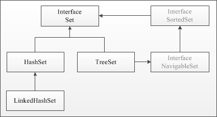
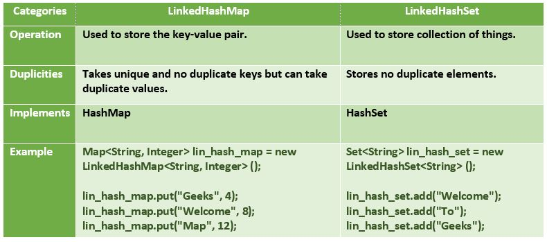

# Set Interface (_java.util.Set_)

## Agenda
* Overview
* HashSet
* LinkedHashSet
* TreeSet
* Materials

## Overview
The **Set** interface is present in `java.util` package and extends the **Collection** interface is an unordered collection of objects in which duplicate values cannot be stored. It is an interface that implements the mathematical set. This interface contains the methods inherited from the **Collection** interface and adds a feature that restricts the insertion of the duplicate elements. There are two interfaces that extend the set implementation namely **SortedSet** and **NavigableSet**.



Since a set doesn’t retain the insertion order, the **NavigableSetInterface** provides the implementation to navigate through the **Set**. The class which implements the **NavigableSet** is a **TreeSet** which is an implementation of a self-balancing tree. Therefore, this interface provides us with a way to navigate through this tree.

### Creating Set Objects
Since **Set** is an interface, objects cannot be created of the typeset. We always need a class that extends this list in order to create an object. And also, after the introduction of `Generics` in _Java 1.5_, it is possible to restrict the type of object that can be stored in the **Set**. This type-safe set can be defined as:
```
Set<T> set = new HashSet<>();
```

| Method                                      | Description                                                                                                          |
|---------------------------------------------|----------------------------------------------------------------------------------------------------------------------|
| `boolean add(E e)`                          | Adds the specified element to this set if it is not already present (optional operation)                             |
| `boolean	addAll(Collection<? extends E> c)` | Adds all of the elements in the specified collection to this set if they're not already present (optional operation) |
| `void	clear()`                              | Removes all of the elements from this set (optional operation)                                                       |
| `boolean	contains(Object o)`                | Returns true if this set contains the specified element                                                              |
| `boolean	containsAll(Collection<?> c)`      | Returns true if this set contains all of the elements of the specified collection                                    |
| `boolean	equals(Object o)`                  | Compares the specified object with this set for equality                                                             |
| `int	hashCode()`                            | Returns the hash code value for this set                                                                             |
| `boolean	isEmpty()`                         | Returns true if this set contains no elements                                                                        |
| `Iterator<E>	iterator()`                    | Returns an iterator over the elements in this set                                                                    |
| `boolean	remove(Object o)`                  | Removes the specified element from this set if it is present (optional operation)                                    |
| `boolean	removeAll(Collection<?> c)`        | Removes from this set all of its elements that are contained in the specified collection (optional operation)        |
| `boolean	retainAll(Collection<?> c)`        | Retains only the elements in this set that are contained in the specified collection (optional operation)            |
| `int	size()`                                | Returns the number of elements in this set (its cardinality)                                                         |
| `default Spliterator<E>	spliterator()`      | Creates a Spliterator over the elements in this set                                                                  |
| `Object[]	toArray()`                        | Returns an array containing all of the elements in this set                                                          |

## HashSet
### Overview
The **HashSet** class implements the **Set** interface, backed by a hash table which is actually a **HashMap** instance. No guarantee is made as to the iteration order of the set which means that the class does not guarantee the constant order of elements over time. This class permits the null element. The class also offers constant time performance for the basic operations like `add`, `remove`, `contains`, and `size` assuming the hash function disperses the elements properly among the buckets.

#### Declaration of HashSet:
```
public class HashSet<E> extends AbstractSet<E> implements Set<E>, Cloneable, Serializable
```
where E is the type of elements stored in a **HashSet**.

Let's see a simple example of **HashSet**.
```
import java.util.HashSet;
import java.util.Iterator;
 
class HashSet1 {    
    public static void main(String args[]) {
        //Creating HashSet and adding elements
        HashSet<String> set = new HashSet();
        set.add("One");
        set.add("Two");
        set.add("Two");
        set.add("Three");
        set.add("Four");
        set.add("Five");
            
        Iterator<String> i = set.iterator();
        while (i.hasNext()) {
            System.out.println(i.next());
        }
    }
}  

Output:
Five
One
Four
Two
Three
```
### HashSet Performance

**HashSet** extends **Abstract Set<E>** class and implements **Set<E>**, **Cloneable** and **Serializable** interfaces where E is the type of elements maintained by this set. The directly known subclass of **HashSet** is **LinkedHashSet**.
Now for the maintenance of constant time performance, iterating over **HashSet** requires time proportional to the sum of the **HashSet** instance’s size (the number of elements) plus the “capacity” of the backing **HashMap** instance (the number of buckets). Thus, it’s very important not to set the initial capacity too high (or the load factor too low) if iteration performance is important. 
* **Initial Capacity**: 

The initial capacity means the number of buckets when hashtable (**HashSet** internally uses hashtable data structure) is created. The number of buckets will be automatically increased if the current size gets full. 
* **Load Factor**: 

The load factor is a measure of how full the **HashSet** is allowed to get before its capacity is automatically increased. When the number of entries in the hash table exceeds the product of the load factor and the current capacity, the hash table is rehashed (that is, internal data structures are rebuilt) so that the hash table has approximately twice the number of buckets.

**Example**:

If internal capacity is 16 and the load factor is 0.75 then the number of buckets will automatically get increased when the table has 12 elements in it.

**Effect on performance**:

Load factor and initial capacity are two main factors that affect the performance of **HashSet** operations. A load factor of 0.75 provides very effective performance with respect to time and space complexity. If we increase the load factor value more than that then memory overhead will be reduced (because it will decrease internal rebuilding operation) but, it will affect the add and search operation in the hashtable. To reduce the rehashing operation we should choose initial capacity wisely. If the initial capacity is greater than the maximum number of entries divided by the load factor, no rehash operation will ever occur.

#### Note:
The implementation in a **HashSet is not synchronized**, in the sense that if multiple threads access a hash set concurrently, and at least one of the threads modifies the set, it must be synchronized externally. This is typically accomplished by synchronizing on some object that naturally encapsulates the set. If no such object exists, the set should be `“wrapped”` using the `Collections.synchronizedSet` method.


### Time Complexity of HashSet Operations
The underlying data structure for **HashSet** is **hashtable**. So amortize (average or usual case) time complexity for `add`, `remove` and `look-up` (contains method) operation of **HashSet** takes `O(1)`  time.

### Internal working of a HashSet
All the classes of **Set** interface internally backed up by **Map**. **HashSet** uses **HashMap** for storing its object internally. You must be wondering that to enter a value in **HashMap** we need a key-value pair, but in **HashSet**, we are passing only one value.
Actually the value we insert in **HashSet** acts as a key to the map _Object_ and for its value, java uses a constant variable. So in key-value pair, all the values will be the same.

Before storing an _Object_, **HashSet** checks whether there is an existing entry using `hashCode()` and `equals()` methods. In the above example, two lists are considered equal if they have the same elements in the same order. When you invoke the `hashCode()`  method on the two lists, they both would give the same hash since they are equal.
**HashSet** does not store duplicate items,  if you give two _Objects_ that are equal then it stores only the first one.

## LinkedHashSet
### Overview
The **LinkedHashSet** is an ordered version of **HashSet** that maintains a _doubly-linked List_ across all elements. When the iteration order is needed to be maintained this class is used. When iterating through a **HashSet** the order is unpredictable, while a **LinkedHashSet** lets us iterate through the elements in the order in which they were inserted. When cycling through **LinkedHashSet** using an iterator, the elements will be returned in the order in which they were inserted.

#### Declaration of LinkedHashSet: 
```
public class LinkedHashSet<E> extends HashSet<E> implements Set<E>, Cloneable, Serializable
```


* **Contains unique elements only like HashSet**. It extends the **HashSet** class and implements the **Set** interface.
* **Maintains insertion order**.

Let's see a simple example of Java **LinkedHashSet** class.
```
import java.util.Iterator;
import java.util.LinkedHashSet;

class LinkedHashSet1{  
    public static void main(String args[]) {
        //Creating HashSet and adding elements
        LinkedHashSet<String> set = new LinkedHashSet();
        set.add("One");
        set.add("Two");
        set.add("Three");
        set.add("Three");
        set.add("Four");
        set.add("Five");
        
        Iterator<String> i = set.iterator();
        while (i.hasNext()) {
            System.out.println(i.next());
        }
    }
}  

Output:
One
Two
Three
Four
Five
```
#### Following is the difference between LinkedHashMap and LinkedHashSet



#### Note:
Keeping the insertion order in both **LinkedHashmap** and **LinkedHashSet** have additional associated costs, both in terms of spending additional CPU cycles and needing more memory. If you do not need the insertion order maintained, it is recommended to use the lighter-weight **HashSet** and **HashMap** instead.

## TreeSet
### Overview
**TreeSet** is one of the most important implementations of the **SortedSet** interface in Java that uses a Tree for storage. The ordering of the elements is maintained by a set using their natural ordering whether an explicit comparator is provided. This must be consistent with equals if it is to correctly implement the **Set** interface.
It can also be ordered by a `Comparator` provided at set creation time, depending on which constructor is used. 

The **TreeSet** implements a **NavigableSet** interface by inheriting **AbstractSet** class.
**NavigableSet** extends the **SortedSet** interface. Since a set doesn’t retain the insertion order, the **NavigableSet** interface provides the implementation to navigate through the **Set**. The class which implements the **NavigableSet** is a **TreeSet** which is an implementation of a _self-balancing tree_. Therefore, this interface provides us with a way to navigate through this tree.

Let's see a simple example of Java **TreeSet**.
```
import java.util.Iterator;
import java.util.TreeSet;
 
class TreeSet1{  
 public static void main(String args[]) {
         //Creating and adding elements
         TreeSet<String> al = new TreeSet<String>();
         al.add("Ravi");
         al.add("Vijay");
         al.add("Ravi");
         al.add("Ajay");
         
         //Traversing elements
         Iterator<String> itr = al.iterator();
         while (itr.hasNext()) {
             System.out.println(itr.next());
         }
     }  
}  

Output:
Ajay
Ravi
Vijay
```
#### Note:
* An object is said to be comparable if and only if the corresponding class implements a `Comparable` interface.
* `String` class and all the `Wrapper` classes already implement `Comparable` interface but `StringBuffer` class  implements Comparable interface. Hence, we DO NOT get a `ClassCastException` in the above example.
* For an empty **TreeSet**, when trying to insert `null` as the _first value_, one will get `NullPointerException` from _JDK 7_. From _JDK 7 onwards_, `null` is _not at all accepted by_ **TreeSet**. However, _up to JDK 6_, `null` was _accepted as the first value_, but any insertion of more `null` values in the **TreeSet** resulted in `NullPointerException`. Hence, it was considered a bug and thus removed in _JDK 7_.
* The insertion of `null` values into a **TreeSet** throws `NullPointerException` because while insertion of `null`, it gets compared to the existing elements, and null cannot be compared to any value.
* **TreeSet** serves as an excellent choice for storing large amounts of sorted information which are supposed to be accessed quickly because of its faster access and retrieval time.

### How does TreeSet work Internally?
**TreeSet** is basically an implementation of a self-balancing binary search tree like a Red-Black Tree. Therefore, operations like `add`, `remove`, and `search` takes `O(log(N))` time. The reason is that in a self-balancing tree, it is made sure that the height of the tree is always `O(log(N))` for all the operations. Therefore, this is considered as one of the most efficient data structures in order to store the huge sorted data and perform operations on it. However, operations like `printing N elements` in the sorted order take `O(N)` time.

The implementation of a **TreeSet is not synchronized**. This means that if multiple threads access a **TreeSet** concurrently, and at least one of the threads modifies the set, it must be synchronized externally. This is typically accomplished by synchronizing some object that naturally encapsulates the set. If no such object exists, the set should be `“wrapped”` using the `Collections.synchronizedSortedSet` method. This is best done at the creation time, to prevent accidental unsynchronized access to the set.

### Features of a TreeSet:
* **TreeSet** implements the **SortedSet** interface. So, duplicate values are not allowed.
* Objects in a **TreeSet** are stored in a sorted and ascending order.
* **TreeSet** does not preserve the insertion order of elements but elements are sorted by keys.
* If we are depended on the default natural sorting order, the objects that are being inserted into the tree should be homogeneous and comparable. **TreeSet** does not allow the insertion of heterogeneous objects. It will throw a `ClassCastException` at Runtime if we try to add heterogeneous objects.
* The **TreeSet** can only accept generic types which are comparable.
  For example, the `StringBuffer` class implements the `Comparable` interface

## Materials
<https://docs.oracle.com/javase/tutorial/collections/interfaces/set.html>

<https://www.geeksforgeeks.org/set-in-java/>

<https://www.javatpoint.com/java-hashset>
