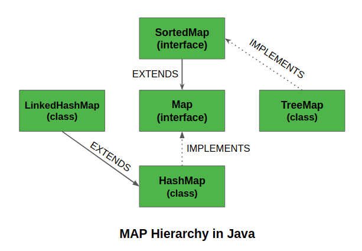
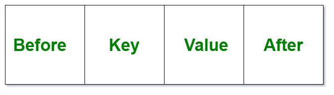
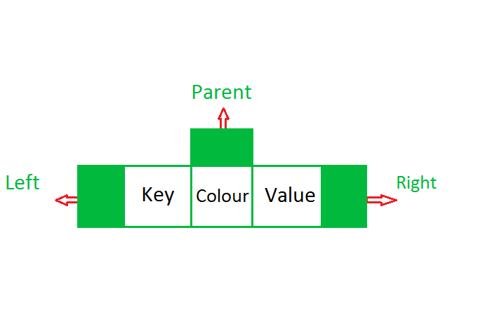

# Map Interface (_java.util.Map_)

## Materials
* Overview
* HashMap
* LinkedHashMap
* TreeMap
* WeakHashMap
* Materials

## Overview
The **Map** interface present in `java.util` package represents a mapping between a key and a value. The **Map** interface _**is not a subtype**_ of the **Collection** interface. Therefore, it behaves a bit differently from the rest of the collection types. A **Map** contains unique keys.



### Characteristics of a Map Interface
* A **Map** cannot contain duplicate keys and each key can map to at most one value. Some implementations allow `null key` and `null value` like the **HashMap** and **LinkedHashMap**, but some do not like the **TreeMap**.
* The order of a **Map** depends on the specific implementations. For example, **TreeMap** and **LinkedHashMap** have predictable order, while **HashMap** does not.
* There are three interfaces for implementing **Map** in java. They are, **Map**, **SortedMap** and **NavigableMap**, and four classes: **HashMap**, **WeakHashMap**, **TreeMap** and **LinkedHashMap**.

### Why and When to use Maps?
**Maps** are perfect to use for key-value association mapping such as dictionaries. The maps are used to perform lookups by keys or when someone wants to retrieve and update elements by keys. Some examples are:

* A map of error codes and their descriptions.
* A map of zip codes and cities.
* A map of managers and employees. Each manager (key) is associated with a list of employees (value) he manages.
* A map of classes and students. Each class (key) is associated with a list of students (value).

### Creating Map Objects
Since **Map** is an interface, objects cannot be created of the type **Map**. We always need a class which extends this **Map** in order to create an object. And also, after the introduction of `Generics` in _Java 1.5_, it is possible to restrict the type of object that can be stored in the **Map**. This type-safe **Map** can be defined as:

```
Map<Integer, String> map = new HashMap<>();
```


## HashMap
### Overview
**HashMap<K, V>** is a part of Java’s collection since _Java 1.2_. This class is found in `java.util` package. It provides the basic implementation of the **Map** interface of Java. It stores the data in `(Key, Value) pairs`, and you can access them by an index of another type (e.g. an Integer). One object is used as a key (index) to another object (value). If you try to insert the duplicate key, it will replace the element of the corresponding key.
Declaration:
```
public class HashMap<K,V> extends AbstractMap<K,V>
implements Map<K,V>, Cloneable, Serializable
```
* **HashMap** is similar to **HashTable**, but it **_is unsynchronized_**. 
* It allows to store the `null keys` as well, but there should be **_only one_** `null key` object and there can be **_any number_** of `null values`.  
* This class makes **_no guarantees as to the order of the map_**. 
* To use this class and its methods, you need to `import java.util.HashMap` package or its superclass.

```
// Java Program to illustrate the Hashmap Class
import java.util.*;

public class GFG {

    public static void main(String[] args)
    {
        Map<String, Integer> map
            = new HashMap<>();
  
        map.put("one", 10);
        map.put("two", 30);
        map.put("three", 20);
  
        for (Map.Entry<String, Integer> e : map.entrySet())
            System.out.println(e.getKey() + " "
                               + e.getValue());
    }
} 
```
### HashMap Performance
The **performance** of a **HashMap** is affected by two parameters: **Initial Capacity** and **Load Factor**. 

The **capacity** is the number of buckets or the underlying array length and the initial capacity is simply the capacity during creation.

The **load factor** or **LF**, in short, is a measure of how full the **HashMap** should be after adding some values before it is resized.

The **_default initial capacity is 16_** and **_default load factor is 0.75_**. The default values set by the Java team are well optimized for most cases. However, if you need to use your own values, which is very okay, you need to understand the performance implications so that you know what you are doing.

When the number of **HashMap** entries exceeds the product of LF and capacity, then rehashing occurs i.e. another internal array is created with twice the size of the initial one and all entries are moved over to new bucket locations in the new array.

A low initial capacity reduces space cost but increases the frequency of rehashing. Rehashing is obviously a very expensive process. So as a rule, if you anticipate many entries, you should set a considerably high initial capacity.

On the flip side, if you set the initial capacity too high, you will pay the cost in iteration time.

So a high initial capacity is good for a large number of entries coupled with little to no iteration.

A low initial capacity is good for few entries with a lot of iteration.

### Collisions in the HashMap
A **collision**, or more specifically, a **hash code collision** in a **HashMap**, is a situation where two or more key objects produce the same final hash value and hence point to the same bucket location or array index.
This scenario can occur because according to the `equals` and `hashCode` contract, two unequal objects in Java can have the same `hash code`.

It can also happen because of the finite size of the underlying array, that is, before resizing. The smaller this array, the higher the chances of collision.

Keep in mind that it's the `hash value` of the key that determines the bucket the object will be stored in. And so, if the `hash codes` of any two keys collide, their entries will still be stored in the same bucket.

And by default, the implementation uses a **LinkedList** as the bucket implementation.

The initially constant time `O(1)` `put` and `get` operations will occur in linear time `O(n)` in the **_case of a collision_**. This is because after finding the bucket location with the final `hash value`, each of the keys at this location will be compared with the provided key object using the equals API.

### Performance Improvement for HashMap in Java 8
**_Hash collisions_** have negative impact on the lookup time of **HashMap**. When multiple keys end up in the same bucket, then values along with their keys are placed in a **_linked list_**. In case of retrieval, **_linked list_** has to be traversed to get the entry. In worst case scenario, when all keys are mapped to the same bucket, the lookup time of **HashMap** increases from `O(1)` to `O(n)`.

_Java 8_ has come with the following improvements/changes of **HashMap** objects in case of high collisions.

* The alternative String `hash function` added in _Java 7_ has been removed.
* Buckets containing a large number of colliding keys will store their entries in a **_balanced tree_** instead of a **_linked list_** after certain threshold is reached.

Above changes ensure performance of `O(log(n))` in worst case scenarios (`hash function` is not distributing keys properly) and `O(1)` with proper hashCode().

#### How linked list is replaced with binary tree?
In _Java 8_, **HashMap** replaces **_linked list_** with a **_binary tree_** when the number of elements in a bucket reaches certain threshold. While converting the **_list_** to **_binary tree_**, `hashcode` is used as a branching variable. If there are two different `hashcodes` in the same bucket, one is considered bigger and goes to the right of the **_tree_** and other one to the left. But when both the `hashcodes` are equal, **HashMap** assumes that the keys are comparable, and compares the key to determine the direction so that some order can be maintained. It is a good practice to make the keys of **HashMap** comparable.

## LinkedHashMap
### Overview
A **LinkedHashMap** is an extension of the **HashMap** class and it implements the **Map** interface. Therefore, the class is declared as:
```
public class LinkedHashMap<K,​V> extends HashMap<K,​V> implements Map<K,​V>
```
In this class, the data is stored in the form of nodes. The implementation of the **LinkedHashMap** is very similar to a **_doubly-linked list_**. Therefore, each node of the **LinkedHashMap** is represented as:


* `Hash`: All the input keys are converted into a `hash` which is a shorter form of the key so that the search and insertion are faster.
* `Key`: Since this class extends **HashMap**, the data is stored in the form of a key-value pair. Therefore, this parameter is the key to the data.
* `Value`: For every key, there is a value associated with it. This parameter stores the value of the keys. Due to generics, this value can be of any form.
* `Next`: Since the **LinkedHashMap** stores the insertion order, this contains the address to the next node of the **LinkedHashMap**.
* `Previous`: This parameter contains the address to the previous node of the **LinkedHashMap**.
```
// Java Program to illustrate the LinkedHashmap Class
import java.util.*;

public class GFG {

    public static void main(String[] args)
    {
        Map<String, Integer> map
            = new LinkedHashMap<>();
  
        map.put("one", 10);
        map.put("two", 30);
        map.put("three", 20);
  
        for (Map.Entry<String, Integer> e : map.entrySet())
            System.out.println(e.getKey() + " "
                               + e.getValue());
    }
}
```
### Performance Considerations
Just like **HashMap**, **LinkedHashMap** performs the basic **Map** operations of `add`, `remove` and `contains` in _constant-time_, as long as the `hash function` is well-dimensioned. It also **_accepts_** a `null key` as well as `null values`.

However, this constant-time performance of **LinkedHashMap** is likely to be a little worse than the constant-time of **HashMap** due to the added overhead of maintaining a **_doubly-linked list_**.

Iteration over collection views of **LinkedHashMap** also takes linear time `O(n)` similar to that of **HashMap**. On the flip side, **LinkedHashMap‘s** linear time performance during iteration is better than **HashMap‘s** linear time.

This is because, for **LinkedHashMap**, `n` in `O(n)` is only the number of entries in the map regardless of the capacity. Whereas, for **HashMap**, `n` is capacity and the size summed up, `O(size+capacity)`.

**Load Factor** and **Initial Capacity** are defined precisely as for **HashMap**. Note, however, that the penalty for choosing an excessively high value for initial capacity is less severe for **LinkedHashMap** than for **HashMap**, as iteration times for this class are unaffected by capacity.

### Synchronized LinkedHashMap
The implementation of **LinkedHashMap** not synchronized. If multiple threads access a **LinkedHashMap** concurrently, and at least one of the threads modifies the map structurally, it must be synchronized externally. This is typically accomplished by synchronizing on some object that naturally encapsulates the map. If no such object exists, the map should be `“wrapped”` using the `Collections.synchronizedMap` method. This is best done at creation time, to prevent accidental unsynchronized access to the map:
```
Map m = Collections.synchronizedMap(new LinkedHashMap(…));
```
## TreeMap
### Overview
The **TreeMap** in Java is used to implement **Map** interface and **NavigableMap** along with the **AbstractMap** Class. The map is sorted according to the natural ordering of its keys, or by a `Comparator` provided at map creation time, depending on which constructor is used. This proves to be an efficient way of sorting and storing the key-value pairs. The storing order maintained by the **TreeMap** must be consistent with equals just like any other **SortedMap**, irrespective of the explicit comparators. The **Treemap** implementation is not synchronized in the sense that if a **Map** is accessed by multiple threads, concurrently and at least one of the threads modifies the **Map** structurally, it must be synchronized externally.

**TreeMap** is a **_Red-Black tree_** based **NavigableMap** implementation that provides you sorting, on top of hashing offered by the **Map** interface. This means you can not only retrieve elements in guaranteed `log(n)` time (Algorithms are adaptations of those in Cormen, Leiserson, and Rivest's Introduction to Algorithms), but also iterate through those mapping in a predefined sorted order.

```
// Java Program to illustrate the Treemap Class
import java.util.*;

public class GFG {

    public static void main(String[] args)
    {
        Map<String, Integer> map
            = new TreeMap<>();
  
        map.put("one", 10);
        map.put("two", 30);
        map.put("three", 20);
  
        for (Map.Entry<String, Integer> e : map.entrySet())
            System.out.println(e.getKey() + " "
                               + e.getValue());
    }
}
```
### Some important features of the treemap are:
* This class is a member of Java Collections Framework.
* The class implements **Map** interfaces including **NavigableMap**, **SortedMap** and extends **AbstractMap** class.
* **TreeMap** in Java **_does not allow_** `null` keys (like **Map**) and thus a `NullPointerException` is thrown. However, multiple null values can be associated with different keys.
* Entry pairs returned by the methods in this class and its views represent snapshots of mappings at the time they were produced. They do not support the `Entry.setValue` method.

### How Does the TreeMap work Internally?
The methods in a **TreeMap** while getting `keyset` and `values`, return an `Iterator` that are fail-fast in nature. Thus, any concurrent modification will throw `ConcurrentModificationException`. A **TreeMap** is based upon a **_Red-Black tree_** data structure. Each node in the **_tree_** has:

* 3 Variables (K key=Key, V value=Value, boolean color=Color)
* 3 References (Entry left = Left, Entry right = Right, Entry parent = Parent)
  

### Synchronized TreeMap:
The implementation of a **TreeMap** is not synchronized. This means that if multiple threads access a **TreeMap** concurrently, and at least one of the threads modifies the map, it must be synchronized externally. This is typically accomplished by using the `Collections.synchronizedSortedMap` method. This is best done at the creation time, to prevent accidental unsynchronized access to the map. This can be done as:
```
SortedMap m = Collections.synchronizedSortedMap(new TreeMap(…));
```

## WeakHashMap
### Overview
**HashTable** based implementation of the **Map** interface, with weak keys. An entry in a **WeakHashMap** will automatically be removed when its key is no longer in ordinary use. More precisely, the presence of a mapping for a given key will not prevent the key from being discarded by the garbage collector, that is, made finalizable, finalized, and then reclaimed. When a key has been discarded its entry is effectively removed from the map, so this class behaves somewhat differently from other **Map** implementations.
Both `null values` and the `null key` are supported. This class has performance characteristics similar to those of the **HashMap** class, and has the same efficiency parameters of initial capacity and load factor.
Like most collection classes, this class is not synchronized. A synchronized **WeakHashMap** may be constructed using the `Collections.synchronizedMap` method.

This class is intended primarily for use with key objects whose equals methods test for object identity using the `==` operator. Once such a key is discarded it can never be recreated, so it is impossible to do a `lookup` of that key in a **WeakHashMap** at some later time and be surprised that its entry has been removed. This class will work perfectly well with key objects whose `equals` methods are not based upon object identity, such as _String_ instances. With such recreatable key objects, however, the automatic removal of **WeakHashMap** entries whose keys have been discarded may prove to be confusing.
The behavior of the **WeakHashMap** class depends in part upon the actions of the garbage collector, so several familiar (though not required) **Map** invariants do not hold for this class. Because the garbage collector may discard keys at any time, a **WeakHashMap** may behave as though an unknown thread is silently removing entries. In particular, even if you synchronize on a **WeakHashMap** instance and invoke none of its mutator methods, it is possible for the `size` method to return smaller values over time, for the `isEmpty` method to return false and then true, for the `containsKey` method to return true and later false for a given key, for the `get` method to return a value for a given key but later return null, for the `put` method to return null and the `remove` method to return false for a key that previously appeared to be in the map, and for successive examinations of the `key set`, the `value collection`, and the `entry set` to yield successively smaller numbers of elements.

Each key object in a **WeakHashMap** is stored indirectly as the referent of a weak reference. Therefore, a key will automatically be removed only after the weak references to it, both inside and outside the map, have been cleared by the garbage collector.

### Implementation note:
The value objects in a **WeakHashMap** are held by ordinary strong references. Thus care should be taken to ensure that value objects do not strongly refer to their own keys, either directly or indirectly, since that will prevent the keys from being discarded. Note that a value object may refer indirectly to its key via the **WeakHashMap** itself; that is, a value object may strongly refer to some other key object whose associated value object, in turn, strongly refers to the key of the first value object. If the values in the map do not rely on the map holding strong references to them, one way to deal with this is to wrap values themselves within **WeakReferences** before inserting, as in: `m.put(key, new WeakReference(value))`, and then unwrapping upon each get.

The iterators returned by the `iterator` method of the collections returned by all of this class's "collection view methods" are fail-fast: if the map is structurally modified at any time after the iterator is created, in any way except through the iterator's own remove method, the iterator will throw a `ConcurrentModificationException`. Thus, in the face of concurrent modification, the iterator fails quickly and cleanly, rather than risking arbitrary, non-deterministic behavior at an undetermined time in the future.

Note that the fail-fast behavior of an iterator cannot be guaranteed as it is, generally speaking, impossible to make any hard guarantees in the presence of unsynchronized concurrent modification. Fail-fast iterators throw `ConcurrentModificationException` on a best-effort basis. Therefore, it would be wrong to write a program that depended on this exception for its correctness: the fail-fast behavior of iterators should be used only to detect bugs.

## Materials
<https://docs.oracle.com/javase/8/docs/api/java/util/Map.html>

<https://www.geeksforgeeks.org/map-interface-java-examples/>

<https://docs.oracle.com/javase/8/docs/api/java/util/concurrent/ConcurrentHashMap.html>

<https://www.baeldung.com/java-hashmap>

<https://www.geeksforgeeks.org/navigablemap-interface-in-java-with-example/#:~:text=The%20NavigableMap%20interface%20is%20a,with%20this%20popular%20navigation%20method.>

<https://docs.oracle.com/javase/8/docs/api/java/util/WeakHashMap.html>
