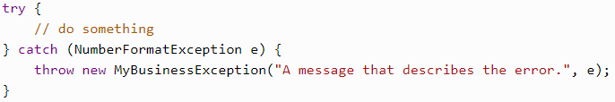

# How to Catch and Handle Exceptions?

## Try Catch Finally syntax

A __try__ block can be followed by one or more __catch__ blocks, each specifying a different type. The first catch block that handles the exception class or one of its superclasses will be executed. So, make sure to catch the most specific class first.

If an exception occurs in the __try__ block, the exception is thrown to the first __catch__ block. If not, the Java exception passes down to the second __catch__ statement. This continues until the exception either is caught or falls through all catches.

If you need to add additional information, you should catch the exception and wrap it in a custom one. But don't rethrow it, because it will write multiple error messages for the same exception.

