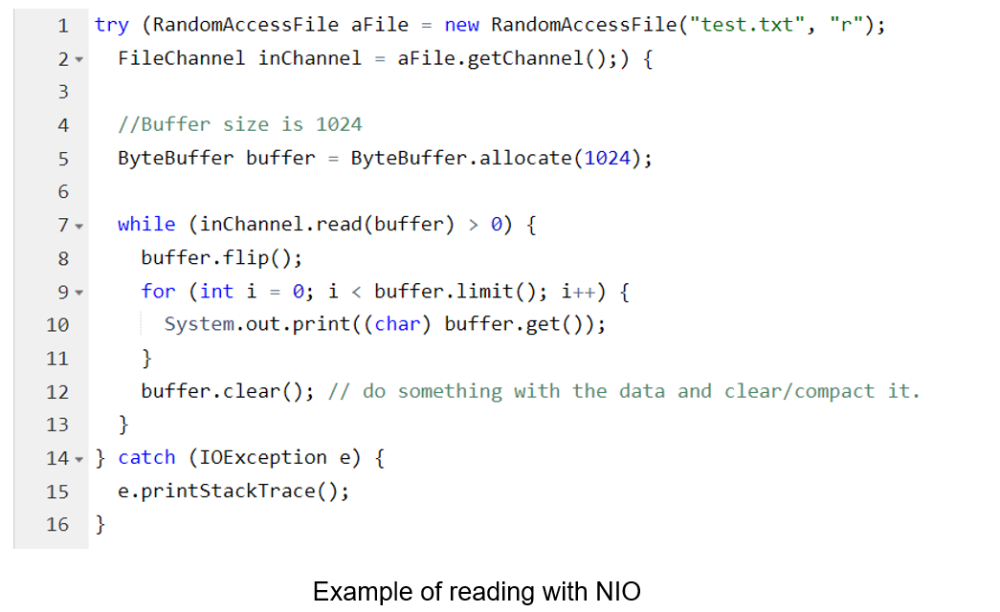

# Java NIO

## Introduction to NIO

In the previous module we observed base input and output mechanism in Java, but there are others, such as Java NIO. Therefore, a question quickly pops into mind:
When should I use IO and when should I use NIO?
In this part we will find out the differences between Java NIO and IO, their use cases, and how they affect the design of your code.

## Java NIO vs IO

### Stream Oriented vs. Buffer Oriented
The first big difference between Java NIO and IO is that IO is stream oriented, where NIO is buffer oriented. So, what does that mean?
Java IO being stream oriented means that you read one or more bytes at a time, from a stream. What you do with the read bytes is up to you. They are not cached anywhere. Furthermore, you cannot move forth and back in the data in a stream. If you need to move forth and back in the data read from a stream, you will need to cache it in a buffer first.


Java NIO's buffer oriented approach is slightly different. 
Data is read into a buffer from which it is later processed. 
You can move forth and back in the buffer as you need to. 
This gives you a bit more flexibility during processing. 
However, you also need to check if the buffer contains all the data you need 
in order to fully process it. And, you need to make sure that when reading more data into the buffer, you do not overwrite data in the buffer you have not yet processed.


### Blocking vs. Non-blocking IO
Java IO's various streams are blocking. That means, that when a thread invokes a `read()` or `write()`, that thread is blocked until there is some data to read, or the data is fully written. 
The thread can do nothing else in the meantime.
Java NIO's non-blocking mode enables a thread to request reading data from a channel, and only get what is 
currently available, or nothing at all, if no data is currently available. 
Rather than remain blocked until data becomes available for reading, the thread can go on with something else.
The same is true for non-blocking writing. A thread can request that some data be written to a channel, 
but not wait for it to be fully written. The thread can then go on and do something else in the mean time.
What threads spend their idle time on when not blocked in IO calls, is usually performing IO on other channels in the meantime. 
That is, a single thread can now manage multiple channels of input and output.

## Selectors 
Java NIO's selectors allow a single thread to monitor multiple channels of input. You can register multiple channels with a selector, then use a single thread to "select" the channels that have input available for processing, or select the channels that are ready for writing. This selector mechanism makes it easy for a single thread to manage multiple [channels](https://jenkov.com/tutorials/java-nio/channels.html).
More details about selectors [here](https://jenkov.com/tutorials/java-nio/selectors.html).

## How NIO and IO Influences Application Design
Whether you choose NIO or IO as your IO toolkit may impact the following aspects of your application design:
1.	The API calls to the NIO or IO classes.
2.	The processing of data.
3.	The number of thread used to process the data.
### The API Calls
Of course the API calls when using NIO look different than when using IO. There is no surprise. Rather than just read the data byte for byte from e.g. an `InputStream`, the data must first be read into a buffer, and then be processed from there.
### The Processing of Data
The processing of the data is also affected when using a pure NIO design, vs. an IO design.
In an IO design you read the data byte for byte from an `InputStream` or a `Reader`. Imagine you were processing a stream of line based textual data. For instance:
```
Name: Anna
Age: 25
Email: anna@mailserver.com
Phone: 1234567890
```

This stream of text lines could be processed like this:


Notice how the processing state is determined by how far the program has executed. 
In other words, once the first `reader.readLine()` method returns, you know for sure that a full line of text has been 
read. The `readLine()` is blocked until a full line is read, that's why. You also know that this line contains the name. 
Similarly, when the second `readLine()` call returns, you know that this line contains the age etc.
As you can see, the program progresses only when there is new data to read, and for each step you know what that data is. Once the executing thread have progressed past reading a certain piece of data in the code, the thread is not going backwards in the data (mostly not). This principle is also illustrated in this diagram:


A NIO implementation would look different. Here is a simplified example:


Notice the second line which reads bytes from the channel into the `ByteBuffer`. 
When that method call returns you don't know if all the data you need is inside the buffer. 
All you know is that the buffer contains some bytes. This makes processing somewhat harder.
Imagine if, after the first `read(buffer)` call, that all what was read into the buffer was half a line. 
For instance, "Name: An". Can you process that data? Not really. 
You need to wait until at leas a full line of data has been into the buffer, before it makes sense to process any of the data at all.
So how do you know if the buffer contains enough data for it to make sense to be processed? Well, you don't. The only way to find out, is to look at the data in the buffer. The result is, that you may have to inspect the data in the buffer several times before you know if all the data is there. This is both inefficient, and can become messy in terms of program design. For instance:


*48 - Buffer capacity in bytes*

The `bufferFull()` method has to keep track of how much data is read into the buffer, and return either true or false, depending on whether the buffer is full. In other words, if the buffer is ready for processing, it is considered full.
The `bufferFull()` method scans through the buffer, but must leave the buffer in the same state as before the `bufferFull()` method was called. If not, the next data read into the buffer might not be read in at the correct location. This is not impossible, but it is yet another issue to watch out for.
If the buffer is full, it can be processed. If it is not full, you might be able to partially process whatever data is there, if that makes sense in your particular case. In many cases it doesn't.
The is-data-in-buffer-ready loop is illustrated in this diagram:


## Summary
NIO allows you to manage multiple channels (network connections or files) using only a single (or few) threads, but the cost is that parsing the data might be somewhat more complicated than when reading data from a blocking stream.
If you need to manage thousands of open connections simultanously, which each only send a little data, for instance a chat server, implementing the server in NIO is probably an advantage. Similarly, if you need to keep a lot of open connections to other computers, e.g. in a P2P network, using a single thread to manage all of your outbound connections might be an advantage. This one thread, multiple connections design is illustrated in this diagram:


If you have fewer connections with very high bandwidth, sending a lot of data at a time, perhaps a classic IO server implementation might be the best fit. This diagram illustrates a classic IO server design:


You can see an example of reading on the next picture:



# Path and Files

The Java `Path` interface is part of the Java NIO 2 update which Java NIO received in Java 6 and Java 7. 
The Java `Path` interface was added to Java NIO in Java 7. The Path interface is located in the `java.nio.file` package, so the fully qualified name of the Java Path interface is java.nio.file.Path.
A Java `Path` instance represents a path in the file system. A path can point to either a file or a directory. A path can be absolute or relative. 
An absolute path contains the full path from the root of the file system down to the file or directory it points to. A relative path contains the path to the file or directory relative to some other path. Relative paths may sound a bit confusing. Don't worry. I will explain relative paths in more detail later in this Java NIO Path tutorial.
Do not confuse a _file system path_ with the `path` environment variable in some operating systems. The `java.nio.file.Path` interface has nothing to do with the `path` environment variable.
In many ways the `java.nio.file.Path` interface is similar to the `java.io.File` class, but there are some minor differences. In many cases though, you can replace the use of the `File` class with use of the `Path` interface.

## Creating a Path Instance

In order to use a `java.nio.file.Path` instance you must create a `Path` instance. 
You create a `Path` instance using a static method in the `Paths` class (`java.nio.file.Paths`) named `Paths.get()`. 
Here is a Java `Paths.get()` example:


Notice the `Paths.get("c:\\data\\myfile.txt")` method call. 
It is the call to the `Paths.get()` method that creates the Path instance. 
The `Paths.get()` method is a factory method for `Path` instances.
## Creating an Absolute Path

Creating an absolute path is done by calling the `Paths.get()` factory method with the absolute file as parameter. Here is an example of creating a `Path` instance representing an absolute path:
```
Path path = Paths.get("c:\\data\\myfile.txt");
```

The absolute path is `c:\data\myfile.txt`. The double `\` characters are necessary in Java strings, since the `\` is an escape character, meaning the following character tells what character is really to be located at this place in the string. By writing `\\` you tell the Java compiler to write a single `\` character into the string.
The above path is a Windows file system path. On a Unix system (Linux, MacOS, FreeBSD etc.) the above absolute path could look like this:

```
Path path = Paths.get("/home/data/myfile.txt");
```

The absolute path is now `/home/data/myfile.txt`.
If you used this kind of path on a Windows machine (a path starting with `/`) the path would be interpreted as relative to the current drive. For instance, the path

```
/home/data/myfile.txt
```

could be interpreted as being located on the C drive. Then the path would correspond to this full path:

```
C:/home/data/myfile.txt
```

## Creating a relative Path

A relative path is a path that points from one path (the base path) to a directory or file. The full path (the absolute path) of a relative path is derived by combining the base path with the relative path.
The Java NIO `Path` class can also be used to work with relative paths. You create a relative path using the `Paths.get(basePath, relativePath)` method. Here are two relative path examples in Java:

```
Path projects = Paths.get("d:\\data", "projects");
Path file     = Paths.get("d:\\data", "projects\\a-project\\myfile.txt");
```

# Files

The Java NIO `Files` class (`java.nio.file.Files`) provides several methods for manipulating files in the file system.
In this Subsection we will cover the most commonly used of these methods. 
The `Files` class contains many methods, so check the JavaDoc too, if you need a method that is not described here. 
The `Files` class just might have a method for it still.
The `java.nio.file.Files `class works with `java.nio.file.Path` instances, so you need to understand the `Path` class before you can work with the `Files` class.

## Files.exists()

The `Files.exists()` method checks if a given `Path` exists in the file system.
It is possible to create `Path` instances that do not exist in the file system. For instance, if you plan to create a new directory, you would first create the corresponding `Path` instance, and then create the directory.
Since `Path` instances may or may not point to paths that exist in the file system, you can use the `Files.exists()` method to determine if they do (in case you need to check that).
Here is a Java `Files.exists()` example:
```
Path path = Paths.get("data/logging.properties");

boolean pathExists =
        Files.exists(path,
            new LinkOption[]{ LinkOption.NOFOLLOW_LINKS});

```

This example first creates a `Path` instance pointing to the path we want to check if exists or not. 
Second, the example calls the `Files.exists()` method with the Path instance as the first parameter.
Notice the second parameter of the `Files.exists()` method. 
This parameter is an array of options that influence how the `Files.exists()` determines if the path exists or not. 
In this example above the array contains the `LinkOption.NOFOLLOW_LINKS` which means that the `Files.exists()` method should not follow symbolic links in the file system to determine if the path exists.

## Files.createDirectory()

The `Files.createDirectory()` method creates a new directory from a `Path` instance. Here is a Java `Files.createDirectory()` example:

```
Path path = Paths.get("data/subdir");

try {
    Path newDir = Files.createDirectory(path);
} catch(FileAlreadyExistsException e){
    // the directory already exists.
} catch (IOException e) {
    //something else went wrong
    e.printStackTrace();
}
```

The first line creates the `Path` instance that represents the directory to create. Inside the `try-catch` block the `Files.createDirectory()` method is called with the path as parameter. If creating the directory succeeds, a Path instance is returned which points to the newly created path.
If the directory already exists, a `java.nio.file.FileAlreadyExistsException` will be thrown. If something else goes wrong, an `IOException` may get thrown. For instance, if the parent directory of the desired, new directory does not exist, an `IOException` may get thrown. The parent directory is the directory in which you want to create the new directory. Thus, it means the parent directory of the new directory.

## Files.copy()

The `Files.copy()` method copies a file from one path to another. Here is a Java NIO `Files.copy()` example:
```
Path sourcePath      = Paths.get("data/logging.properties");
Path destinationPath = Paths.get("data/logging-copy.properties");

try {
    Files.copy(sourcePath, destinationPath);
} catch(FileAlreadyExistsException e) {
    //destination file already exists
} catch (IOException e) {
    //something else went wrong
    e.printStackTrace();
}
```

First the example creates a source and destination Path instance. Then the example calls `Files.copy()`, passing the two Path instances as parameters. This will result in the file referenced by the source path to be copied to the file referenced by the destination path.
If the destination file already exists, a `java.nio.file.FileAlreadyExistsException` is thrown. If something else goes wrong, an `IOException` will be thrown. For instance, if the directory to copy the file to does not exist, an `IOException` will be thrown.

## Overwriting Existing Files

It is possible to force the `Files.copy()` to overwrite an existing file. Here an example showing how to overwrite an existing file using `Files.copy()`:

```
Path sourcePath      = Paths.get("data/logging.properties");
Path destinationPath = Paths.get("data/logging-copy.properties");

try {
    Files.copy(sourcePath, destinationPath,
            StandardCopyOption.REPLACE_EXISTING);
} catch(FileAlreadyExistsException e) {
    //destination file already exists
} catch (IOException e) {
    //something else went wrong
    e.printStackTrace();
}
```

Notice the third parameter to the `Files.copy()` method. This parameter instructs the `copy()` method to overwrite an existing file if the destination file already exists.

## Files.move()

The Java NIO `Files` class also contains a function for moving files from one path to another. Moving a file is the same as renaming it, except moving a file can both move it to a different directory and change its name in the same operation. Yes, the `java.io.File` class could also do that with its `renameTo()` method, 
but now you have the file move functionality in the `java.nio.file.Files` class too.
Here is a Java `Files.move()` example:

```
Path sourcePath      = Paths.get("data/logging-copy.properties");
Path destinationPath = Paths.get("data/subdir/logging-moved.properties");

try {
    Files.move(sourcePath, destinationPath,
            StandardCopyOption.REPLACE_EXISTING);
} catch (IOException e) {
    //moving file failed.
    e.printStackTrace();
}
```

First the source path and destination path are created. The source path points to the file to move, and the destination path points to where the file should be moved to. Then the `Files.move()` method is called. This results in the file being moved.
Notice the third parameter passed to `Files.move()`. This parameter tells the Files.move() method to overwrite any existing file at the destination path. This parameter is actually optional.
The `Files.move()` method may throw an IOException if moving the file fails. For instance, if a file already exists at the destination path, and you have left out the `StandardCopyOption.REPLACE_EXISTING` option, or if the file to move does not exist etc.

## Files.delete()

The `Files.delete()` method can delete a file or directory. Here is a Java `Files.delete()` example:

```
Path path = Paths.get("data/subdir/logging-moved.properties");

try {
    Files.delete(path);
} catch (IOException e) {
    //deleting file failed
    e.printStackTrace();
}
```

First the `Path` pointing to the file to delete is created. Second the `Files.delete()` method is called. If the `Files.delete()` fails to delete the file for some reason (e.g. the file or directory does not exist), an `IOException` is thrown.

## Additional Methods in the Files Class

The `java.nio.file.Files` class contains many other useful functions, like functions for creating symbolic links, determining the file size, setting file permissions etc. Check out the JavaDoc for the `java.nio.file.Files` class for more information about these methods.

# Useful links:

[Reading a File with Channels and Buffers - HowToDoInJava](https://howtodoinjava.com/java/nio/nio-read-file/)

[What Is the Difference Between NIO and NIO.2? | Baeldung](https://www.baeldung.com/java-nio-vs-nio-2)

[Java NIO vs. IO (jenkov.com)](https://jenkov.com/tutorials/java-nio/nio-vs-io.html)


