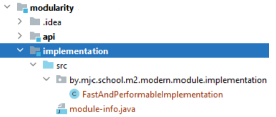

# Structuring and encapsulation

## Materials
- Modularity/Packaging
- Hidden classes
- Records
- Sealed classes

## Modularity/Packaging

([JSR 277: Java Module System](https://jcp.org/en/jsr/detail?id=277),  [JSR 376: Java Platform Module System](https://jcp.org/en/jsr/detail?id=376))

Long story short - module is just another abstraction level over the packages. The same way as common methods may be placed in one class, classes with similar purpose are grouped in packages, packages may be aggregated in modules. In the module itself packages are organized the same way as they were.

Module is a uniquely named group of related packages and resources.

Key elements:
- Name
- Accessible packages (declared to be accessible from outside the module, by default inner packages are private)
- Dependencies (other modules)
- Services offered
- Services consumed
- Reflection availability (what other modules are allowed for this)

Why was it made?

Let’s look at it from the Java Runtime point of view. Java is evolving and growing. It is hardly possible that you will need all the features it includes, so with the use of modularity you can include in your runtime only modules which are used in the project. In the same way, a new project can be divided into modules, and then, during further development, some of them may be reused.

How is it used?

To set up the module, the ‘module-info.java’ file (called module declaration) should be created at the root of the package, which may include the following directives:
- exports (to)
- requires
- provides .. with
- uses
- opens
    
    Note: As a java file later on it will be compiled to the java class and the ‘module-info.class’ is called module descriptor.

There is an example of a simple multi-module project which uses these directives. The first module is an api for our implementation to be widely reused.

The first module is an api module which exports some package with an interface. There also may be several packages with lots of interfaces and classes.

And ‘module-info.java’ is following

    module api {
      exports by.mjc.school.m2.modern.module.api /* to implementation */;
    }

Commented you may see the optional selection of the directed module export.
And in the next module we should explicitly show the dependencies we are using. The ‘module-info.java’ is created the same way.

    module implementation {
      requires /* transitive */ api;
      exports by.mjc.school.m2.modern.module.implementation;
    }

Requires directive also has several types:
- the default one, just adding the module to the current one;
- requires static - the compile time only module
- requires transitive - adding not only the module but also its dependencies

    module modularity {
      requires implementation;
    }

With the use of requires transitive both interface and implementation will be accessible in the modularity module.

Note: requires transitive doesn’t work in case if dependent module declares modules to be used in with exports .. to.

Provides … with and uses gives more control over the encapsulation of the implementation, which in fact dependency injection of the implementation to the application module without changing its code or explicit declaration of the used implementation.

To use it, we should change module-info files:

- for the ‘api’ module there is no changes, here is only API for the further usage;
- in the ‘implementation’ module we are telling which implementation do we want to use for the interface

      module implementation {
        requires transitive api;
        provides by.mjc.school.m2.modern.module.api
        .VeryImportantAndUsefulInterface with
        by.mjc.school.m2.modern.module.implementation.
        FastAndPerformableImplementation;
      }

- in the application ‘modularity’ module the used service is declared

      module modularity {
        requires api;
        uses VeryImportantAndUsefulInterface;
      }

Pay attention that ‘service’ is a generally used name for this predefined implementations. To have more understanding below is the code of the Main.class now doesn’t know about the encapsulated implementation.

    public class Main {
      public static void main(String[] args) {
        VeryImportantAndUsefulInterface workPerformer =
        ServiceLoader.load(VeryImportantAndUsefulInterface.class)
          .stream()
          .map(ServiceLoader.Provider::get)
          .findFirst()
          .get();
        workPerformer.doThisWork();
      }
    }

Opens is even more advanced directive to encapsulate the code and it opens the module’s classes for the reflection, by default they are not available for this and in case of trying the InaccessibleObjectException is thrown.

Note: do not use Reflection API.

Module types:

- Application Modules - created by third party
- Platform or System Modules - JDK’s modules (print ‘java --list-modules’ in the console to see them)
- Automated Modules - added to the module path jars
- Unnamed Modules - added to the classpath jars and classes

## Hidden classes

Hidden classes is a feature of JDK 15 that’s most interesting to framework developers.

It allows them to create classes that cannot be used directly by the bytecode of other classes, they are intended for use by the framework itself that generate classes at run time and use them indirectly, via reflection.

Standard APIs that define a class *ClassLoader::defineClass* and *Lookup::defineClass* are indifferent to whether the bytecodes of the class were generated dynamically (at run time) or statically (at compile time). 
These APIs always <b>*define a visible class that will be used every time another class in the same loader hierarchy tries to link a class of that name*</b>.

So, If a standard API could define *hidden* classes that are not discoverable and have a limited lifecycle, then frameworks both inside and outside of the JDK that generate classes dynamically could instead define hidden classes, that have way lower visibility and overhead, which would improve the efficiency of all language implementations built on the JVM.

Adding this feature also allows deprecation of non-standard API sun.misc.Unsafe::defineAnonymousClass . Hidden classes will not support every functionality that defineAnonymousClass does, and that’s not the goal here, but the goal is to deprecate that API and to fully remove it in upcoming releases.

We will not go any deeper into hidden classes, since this is mostly applicable for framework developers working on low level internal stuff, all other info on this can be found in [official JEP](https://openjdk.java.net/jeps/371).

## Records

To reduce the amount of the code for the data bean the record type of Java class was introduced in JDK 16. For the declaration the word record should be used and the fields to be used for the constructor and getter-s creation are declared in the head.

There is an example of the record with two fields:

    public record Data(String s, int i) {
    }

The following code will be generated:
1. The fields declared in the head are considered as private final
2. The constructor with the declared parameters
3. Getter type methods (without the get prefix)
4. equals(), hashCode(), toString() methods 

Creation of the object of the record is the same as for the regular class’s object.

    Data data = new Data("line", 42);

It should be mentioned that static fields or methods, non-static methods can be declared in record. There is no possibility to add non static fields.

Additional constructors should reference the generated one.

    public record Data(String s, int i) {
        public Data() {
          this("", 1);
        }
    }

## Sealed classes

Sealed Classes were delivered and finalized in JDK 17.

These classes and interfaces restrict which other classes or interfaces may extend or implement them.

A sealed class or interface can be extended or implemented only by those classes and interfaces permitted to do so.

    public sealed class Parent 
        permits FirstChild, SecondChild, ThirdChild {
    }

The inheritors may have the listed below types of declaration:

- final class - this way we prevent the further access to the inheritance of the class

      public final class FirstChild extends Parent { 
      }

- non sealed class - we are making it available for further inheritance

      public non-sealed class SecondChild extends Parent {
      }

- sealed class - just continue the process with explicit declaration

      public sealed class ThirdChild extends Parent {
      }
  
      //possible to do
      public class Grandson extends ThirdChild {
      }

From the last example, you may notice, that it doesn’t have the permits part of the declaration. This is possible in case when the inheritor class is in the file with the class which functionality it should reimplement.

The same way an interface may be declared and implemented as a sealed:  

    pulic sealed interface Childable
      permits FirstChild, SecordChild, ThirdChild {
    }

And the implementation

    public final class FirstChild implements Childable {
    }

Moreover, the <b>*records*</b> can be used as the implementation of the sealed interface

    public record SecondChild(int a, int b) implements Childable {
    }

