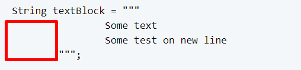

# Slight Code writing improvements

## Materials
- Local-Variable Type Inference //<b>*todo*</b>
- Local-Variable Syntax for Lambda Parameters //<b>*todo*</b>
- Switch Expressions
- Text Blocks
- Pattern Matching for instanceof //<b>*todo*</b>

## Local-Variable Type Inference

## Local-Variable Syntax for Lambda Parameters

## Switch Expressions

You may already know syntax of the switch expression and that it may have some of the following input parameter types: byte, short, int, char, and wrappers, enums and strings.

The update of the switch statement from JDK 14 now allows to have multiple case values for the same result in a row.

Classic approach:

    switch (month) {
      case "January":
      case "February":
      case "December":
        System.out.println("Winter");
        break;
      case "March":
      case "April":
      case "May":
        System.out.println("Spring");
        break;
      default:
        System.out.println("Something else");
    }

Enhanced approach:

    switch (month) {
        case "January", "February", "December" -> System.out.println("Winter");
        case "March", "April", "May" -> System.out.println("Spring");      
        default -> System.out.println("Something else");     
    }

All cases should be covered if we need the result to be assigned to some variable (in other words - the statement should be exhaustive):

    return switch (month) {
        case "January", "February", "December" -> "Winter";
        case "March", "April", "May" -> "Spring";      
        default -> "Something else";     
    };

Note, that the new syntax does not require break statements.

When more control over the right side of the case statement is needed, inside the code block the yield word should be used.

    return switch (month) {
        case "January", "February", "December" -> "Winter";
        case "March", "April", "May" -> {
            var message = "Spring";
            yield message + " is the best";
        default -> "Something else";     
    };

## Text blocks

Fully available after JDK 15.

([JEP 355: Text Blocks](https://openjdk.java.net/jeps/355), [JEP 378: Text Blocks](https://openjdk.java.net/jeps/378), [JEP 368: Text Blocks](https://openjdk.java.net/jeps/368))

Text blocks are used to make work with text data more understandable and readable. The main point of the text blocks is to transfer some work with the indents, line terminators, double quotes to the java compiler.

To start and end a text block three double-quotes characters are used (“””)

    String textBlock = """
                Some text   
                Some text on a new line
            """;
    String equalTextBlock = "    Some text\n    Some text on a new line\n"

Let’s discuss key moment of the text blocks.

1. After the opening quotes there may be space or spaces, but they are optional and ignored by the compiler till the new line pointer.
2. The amount of spaces in the result string is dependent on the line with minimal spaces before the text.

Here the number of minimal spaces before the closing quotes (last line), so 16 spaces before the each line in the block will be excluded.

     18           <String textBlock = """
     19 Some text
     22                           Some test on new line
     22                        """;

And here there are no spaces on the line 19 and as a result the compiled string will have following value: 

    Some text\n                    Some text on a new line\n

Pay attention, that the new line at the end of the second line will be the last part of the line, and the spaces on the 21 line in this situation will be trimmed.

## Pattern Matching for instanceof