# Build Tools

## Agenda

+ Intro
+ Maven Basics
+ Gradle Basics

## Materials

+ [Gradle Getting Started](https://docs.gradle.org/current/userguide/getting_started.html)
+ [Maven documentation](https://maven.apache.org/guides/)

### Intro

Software development is a complex process. A lot of people can work on it.
Before we can see the application it needs to be packaged into a binary executable. The application itself may (and always will) have dependencies (e.g. external JAR files from
other projects to support some features with database and ect.).
To package an application, we first need to ensure that all dependencies are available, then we need to compile the source files against the dependencies, then run our test cases (
your code should always be tested), and finally we can package our application.
Then copy our binaries to some Artifactory. In a real-world enterprise application, there will be many more tasks. How can a developer manage it? Likely, there is a solution - **
Build automation**.

+ *Build automation* is the process of automating the creation of a software build and the associated processes including: compiling computer source code into binary code,
  packaging binary code, and running automated tests.

There are a lot of programs that automate the process of compiling, testing, packaging and deploying of source code in the most efficient manner. The most popular are: Apache
Maven, Apache ANT, Gradle.

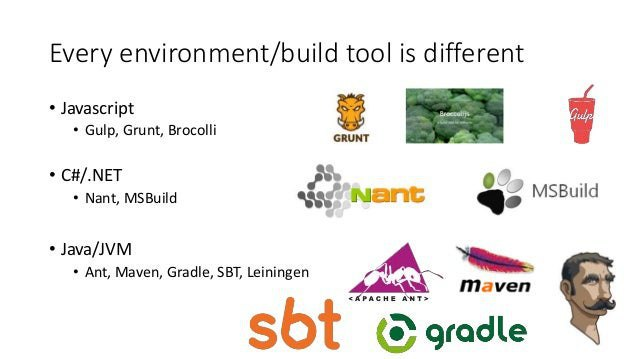

Here we will discuss Gradle and Maven.

### Maven Basics

Key features:

+ simple project setup
+ dependency management: automatic updating, downloading and validating the compatibility
+ central repository system: project dependencies can be loaded from the local file system or public repositories, such as Maven Central.

While predominantly used for Java projects, you can use it for Scala, Ruby, and C#, as well as a host of other languages.

#### Project Object Model

The central piece of information in Maven is POM - the *Project Object Model* - that is written in XML (pom.xml). The POM describes the project, manages dependencies, and
configures plugins for building the software.
It is the fundamental unit of work in Maven.

Example:

```xml
<project>
    <modelVersion>4.0.0</modelVersion> <!--Should be always set to 4.0.0-->
    <groupId>com.mjcschool</groupId>
    <artifactId>school-app</artifactId>
    <packaging>jar</packaging>
    <version>1.0-SNAPSHOT</version>
    <dependencies>
        <dependency>
            <groupId>org.projectlombok</groupId>
            <artifactId>lombok</artifactId>
            <version>1.18.24</version>
            <scope>provided</scope>
        </dependency>
    </dependencies>
    <build>
        <plugins>
            <plugin>
                //...
            </plugin>
        </plugins>
    </build>
</project>
   ```

Explanation:

+ *Project* identifiers are used to uniquely identify a project and specify how the project *artifact* should be packaged:
  *project* - root
  *groupId* – a unique base name of the company or group that created the project (com.mjcschool)
  *artifactId* – a unique name of the project (school-app)
  *version* – a version of the project (1.0-SNAPSHOT)
  *packaging* – a packaging method (e.g. WAR/JAR/ZIP) (if it is not specified in the POM, then the default value "jar" would be used.)

  A POM requires that its groupId, artifactId, and version be configured. These three values form the project's fully qualified artifact name.
  This is in the form of <groupId>:<artifactId>:<version>. As for the example above, its fully qualified artifact name is "com.mjcschool:school-app:1.0-SNAPSHOT".

+ *Dependencies* - external libraries that are used by the project. In order to declare a dependency on an external library, you need to provide the groupId, artifactId, and
  version of the library. Maven will download it from a central repository automatically.
  At the example above we had:
  ```xml 
  <dependencies>
     <dependency>
        <groupId>org.projectlombok</groupId>
        <artifactId>lombok</artifactId>
        <version>1.18.24</version>
     </dependency>
  </dependencies>                      
  ```

  Maven will download lombok dependency to your local Maven repository (.m2/repository directory). You can find all dependencies [here](https://mvnrepository.com).

+ *Repository* holds build artifacts and dependencies of varying types. There are exactly two types of repositories: local and remote:
    + **local**  is a directory on the computer where Maven runs (.m2/repository)
    + **remote** any other repository you have access to.

  If artifact or plugin is located in *local* repository, then Maven will use it, otherwise it will bw downloaded from a central (remote) repository and stored in the local
  repository.

  In general, you should not need to do anything with the local repository on a regular basis, except clean it out if you are short on disk space (or erase it completely if you are
  willing to download everything again).
  For the remote repositories, they are used for both downloading and uploading (if you have the permission to do so).

  Example of using a remote repository:
     ```xml
         <project>
           ...
           <repositories>
             <repository>
               <id>my-internal-site</id>
               <url>https://myserver/repo</url>
             </repository>
           </repositories>
           ...
         </project>
     ```


+ *Properties*

  Properties can help to make your pom.xml file easier to read and maintain. In the classic use case, you would use custom properties to define versions for your project's
  dependencies.
  Let's use the origine example and show properties usage:
  ```xml
             ...
         <properties>
             <lombok.version>1.18.24</lombok.version>
         </properties>
         
         <dependencies>
             <dependency>
                 <groupId>org.projectlombok</groupId>
                 <artifactId>lombok</artifactId>
                 <version>${lombok.version}</version>
             </dependency>
         </dependencies> 
         ...
  ```

  Maven properties are value-placeholders and are accessible anywhere within a pom.xml by using the notation *${name}*, where name is the property.

+ *Build*

  This section provides information about the default Maven *goal*, the directory for the compiled project, the final name of the application:
  ```xml
      <build>
        <defaultGoal>install</defaultGoal>
        <directory>${basedir}/target</directory>
        <finalName>${artifactId}-${version}</finalName>
        <filters>
          <filter>filters/filter1.properties</filter>
        </filters>
        ...
      </build>
  ```

  *defaultGoal*: the default goal or phase to execute if none is given (will be explained later);
  *directory*: the default output folder for compiled artifacts (target);
  *filter*: defines *.properties files that specify existing resources (e.g. some configuration) - this is *extra* information, do not pay a lot of attention.

  **Maven Build Lifecycle**

  *Lifecycle* is a sequence of named stages, i.e. **Phases**. Maven has three defined Lifecycles — **default (build)**, **clean** and **site**.

  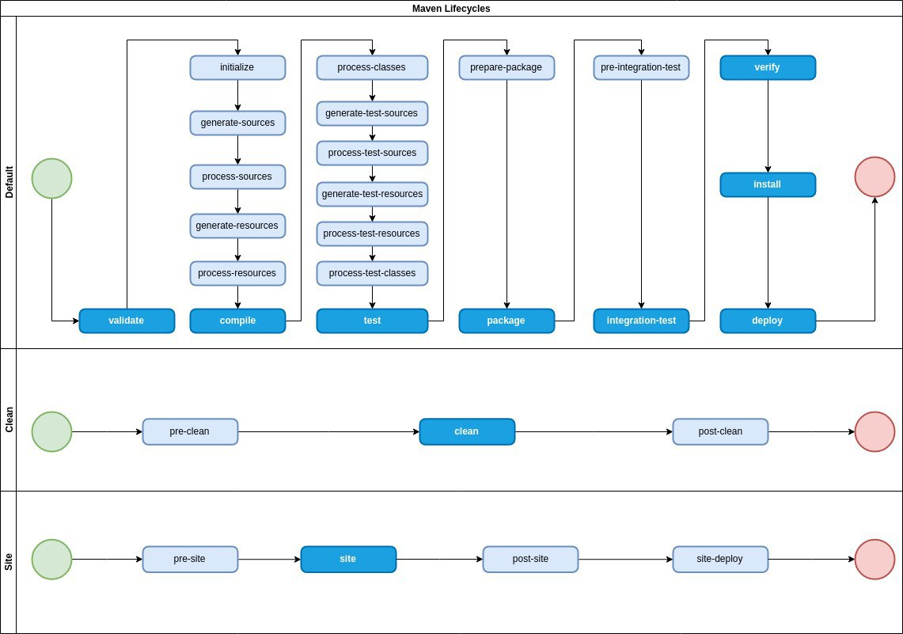

    + default: the main lifecycle, as it's responsible for project deployment;
    + clean: to clean the project and remove all files generated by the previous build;
    + site: to create the project's site documentation;

  The most important phases in the *default* build lifecycle:

    + validate: check if all information necessary for the build is available
    + compile: compile the source code
    + test-compile: compile the test source code
    + test: run unit tests
    + package: package compiled source code into the distributable format (jar, war, …)
    + integration-test: process and deploy the package if needed to run integration tests
    + install: install the package to a local repository
    + deploy: copy the package to the remote repository

  It won't only execute the specified phase, but all the preceding phases as well:

  ```
  mvn <PHASE>
  ```

  Phase is a sequence of *goals* - specific tasks. While running a phase, all goals bound to this phase are executed in order. Think of it as *classes* and *methods*.
  To list all goals bound to a specific phase and their plugins use the command:

  ```
  mvn help:describe -Dcmd=PHASENAME
  ```

  For instance *compiler:compile* – the compile goal from the compiler plugin, which is bound to the compile phase:

  ```
  mvn compiler:compile
  ```

    + *Plugins*

      Plugins are where much of the real action is performed, plugins are used to: create jar files, create war files, compile code, unit test code, create project documentation,
      and on and on. Almost any action that you can think of performing on a project is implemented as a Maven plugin.
      One of the simplest plugins in Maven is the Clean Plugin, which is responsible for removing the target directory of Maven project. The Clean Plugin can be called to execute
      in the command-line without any additional configurations. Like the other plugins, to run the Clean Plugin, you use:

          mvn clean:clean

      Or you can put it in a project *pom.xml* so that it gets executed everytime the project is built:
       ```xml    
           <project>
             ...
             <build>
               <plugins>
                 <plugin>
                   <artifactId>maven-clean-plugin</artifactId>
                   <version>3.2.0</version>
                   <executions>
                     <execution>
                       <id>auto-clean</id>
                       <phase>initialize</phase>
                       <goals>
                         <goal>clean</goal>
                       </goals>
                     </execution>
                   </executions>
                 </plugin>
               </plugins>
             </build>
             ...
           </project>
        ```

      A Maven plugin is a group of goals; however, these goals aren't necessarily all bound to the same phase.

### Gradle Basics

Gradle is a build automation system that is fully open source and uses the concepts you see on Apache Maven and Apache Ant. It uses domain-specific language based on the
programming languages Groovy or Koltin,
differentiating it from Apache Maven, which uses XML for its project configuration. It also determines the order of tasks run by using
a [directed acyclic graph](https://en.wikipedia.org/wiki/Directed_acyclic_graph),
while Maven is based on a fixed and linear model of phases.

With Maven, goals are attached to project phases, and goals serve a similar function to Gradle’s _tasks_, being the “things that do the work.”

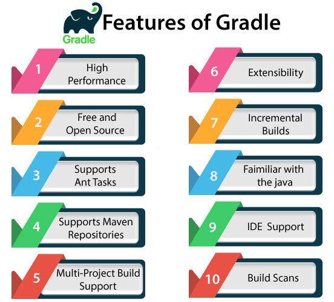

#### Projects and Tasks

The gradle build is made of one or more projects. Everything in Gradle is based on the project and task:

+ _Task_ is a single unit of work that a build performs.These tasks can be compiling classes, creating a JAR, Generating Javadoc, and publishing some archives to a repository and
  more. It can be considered as a single atomic piece of work for a build process.
  There are two types of tasks in Gradle:

    + Default - predefined
    + Custom - user-defined

+ _Project_ is a collection of one or more tasks. A project represents a library JAR or a web application. It may also serve a distribution ZIP, which is assembled from the JARs of
  different projects.

#### Build

As mentioned earlier, the core of Gradle is a language for dependency based programming. This means that you can define tasks and dependencies between tasks. Gradle guarantees that
these tasks are executed in the order of their dependencies, and that each task is executed only once (directed acyclic graph).
Gradle builds the complete dependency graph before any task is executed.

Build phases:

+ Initialization
+ Configuration
+ Execution

The Gradle build is a process of creating a Gradle project. When we run a gradle command, it will look for a file called **build.gradle** in the current directory. This file is
also called the Gradle build script.
The build configuration, tasks, and plugins are described in this file. The build script describes a project and its tasks.
Let's refer to Maven pom.xml and create similar build.gradle.

*pom.xml*:

```xml

<project xmlns="http://maven.apache.org/POM/4.0.0"
         xmlns:xsi="http://www.w3.org/2001/XMLSchema-instance"
         xsi:schemaLocation="http://maven.apache.org/POM/4.0.0 http://maven.apache.org/maven-v4_0_0.xsd">

    <modelVersion>4.0.0</modelVersion>
    <groupId>com.mjcschool</groupId>
    <artifactId>school-app</artifactId>
    <version>1.0</version>

    <dependencies>
        <!-- dependency for testing-->
        <dependency>
            <groupId>junit</groupId>
            <artifactId>junit</artifactId>
            <version>4.11</version>
        </dependency>
    </dependencies>

    <build>
        <plugins>
            <plugin>
                <groupId>org.apache.maven.plugins</groupId>
                <artifactId>maven-compiler-plugin</artifactId>
                <version>2.3.2</version>
            </plugin>
        </plugins>
    </build>
</project>
```

*build.gradle*:

```groovy
plugins {
//  The Java plugin adds Java compilation along with testing and bundling capabilities to a project. 
  id 'java'
}

group = 'com.mjcschool'
version = '1.0'

repositories {
//  Gradle allows you to retrieve declared dependencies from any Maven-compatible or Ivy-compatible repository.
    mavenCentral()
}

// In this section, we can declare dependencies that are necessary for a particular subject.
dependencies {
   testImplementation group: 'junit', name: 'junit', version: '4.11'
}
```


A dependency can be used on different phases of the project. These phases can be:

+ Compile: At compile time, we will use the dependencies that are required to compile the production source of the project. 
+ Runtime: These dependencies are used at runtime by production classes. By default, it also contains the compile-time dependencies.
+ Test Compile: These dependencies are required to compile the test source of the project. It also contains the compiled production classes and the compile-time dependencies.
+ Test Runtime: These dependencies are required to run the tests. It also contains runtime and test compile dependencies.

Refer [here](https://reflectoring.io/maven-scopes-gradle-configurations/) and [official documentation](https://docs.gradle.org/5.3.1/userguide/java_plugin.html#sec:java_plugin_and_dependency_management)
to lear more about phases and scopes.

#### Simple project
Assuming that Gradle is already [installed](https://gradle.org/install/), let's create a simple application:
1. Create directory: 
   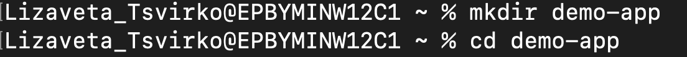
2. Run *gradle init* command to create a new Gradle project:
   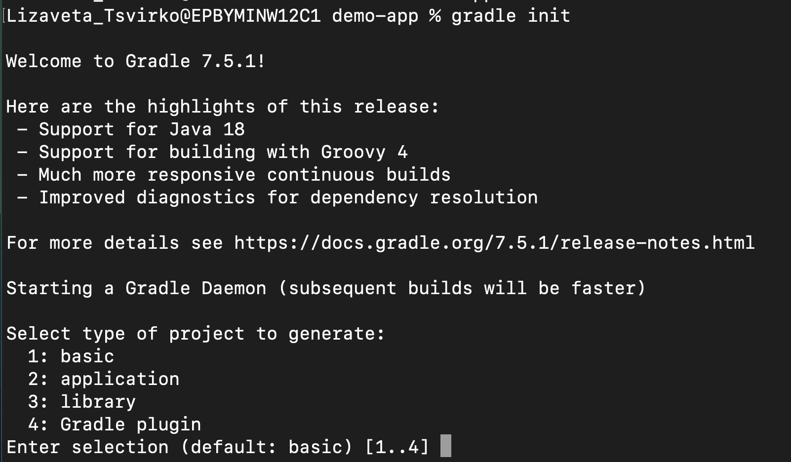
 + basic means "a basic, empty, Gradle build";
 + application means "application with implementation language (C++, Groovy, Java, Kotlin, Scala, Swift) you will have to choose";
 + library is the same as previous;
 + plugin - produce a plugin implemented in chosen language.
3. Select type of a project to generate and then a build script:
   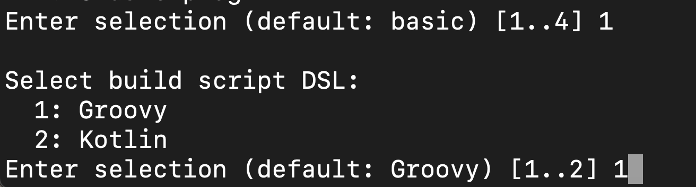
4. Enter project name or keep default:
   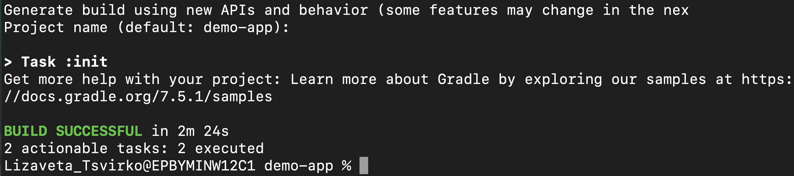
   As you can see, the init task was successfully executed and we have created a basic Gradle project using Gradle API. You do not need to do
   it everytime like this, you can use your favourite IDE and choose (IntelliJ):
   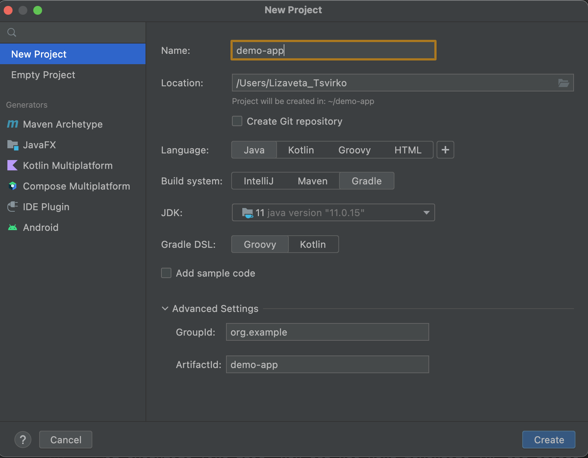
5. When opening created project, we will get such structure:
   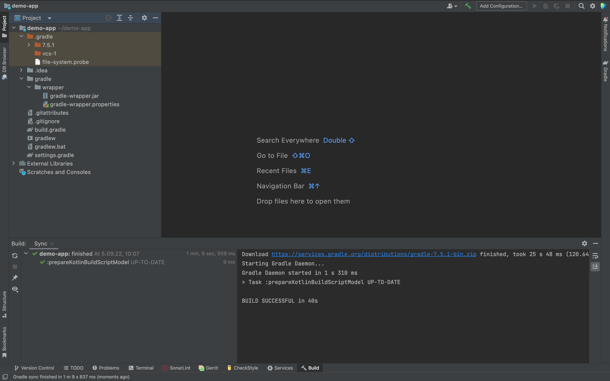
   The init task generated *gradlew* and *gradlew.bat* files - **wrapper scripts**. They are essential, because allow you to build your project with Gradle, without having to install Gradle.
6. Let's create a simple Copy task, which will copy a file from one location to another:
   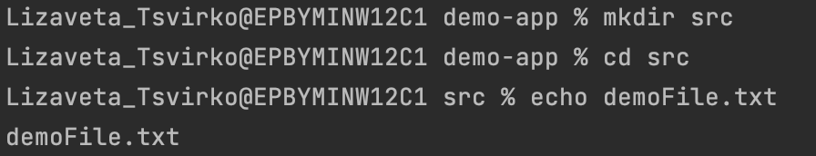
7. In build.gradle define a task:
    ```groovy
    /*
     * This file was generated by the Gradle 'init' task.
     *
     * This is a general purpose Gradle build.
     * Learn more about Gradle by exploring our samples at https://docs.gradle.org/7.5.1/samples
     */
    task copy(type: Copy, group: "Custom", description: "The sources are copied to resources directory") {
        from "src"
        into "resources"
    }  
    ```
8. Execute a task. And we will get a file copied in a 'resources' folder.
   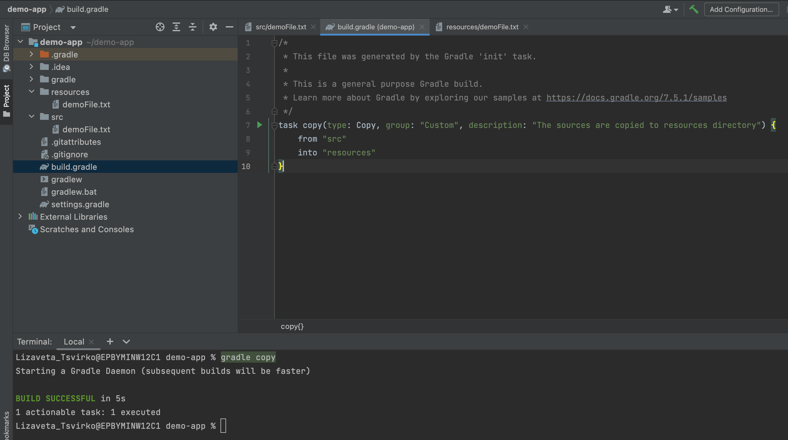

