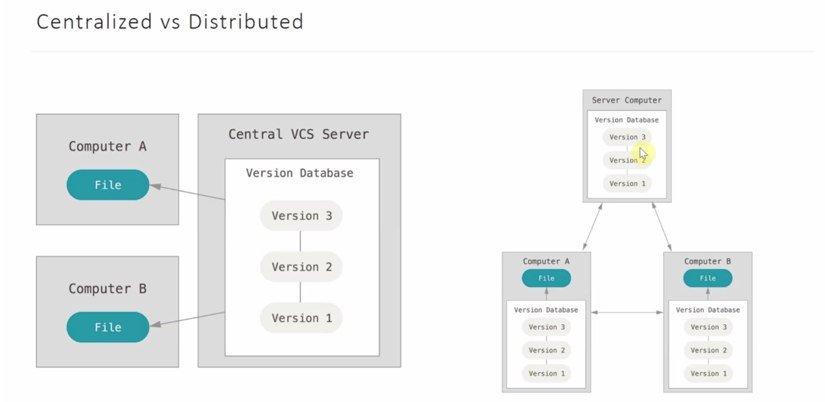
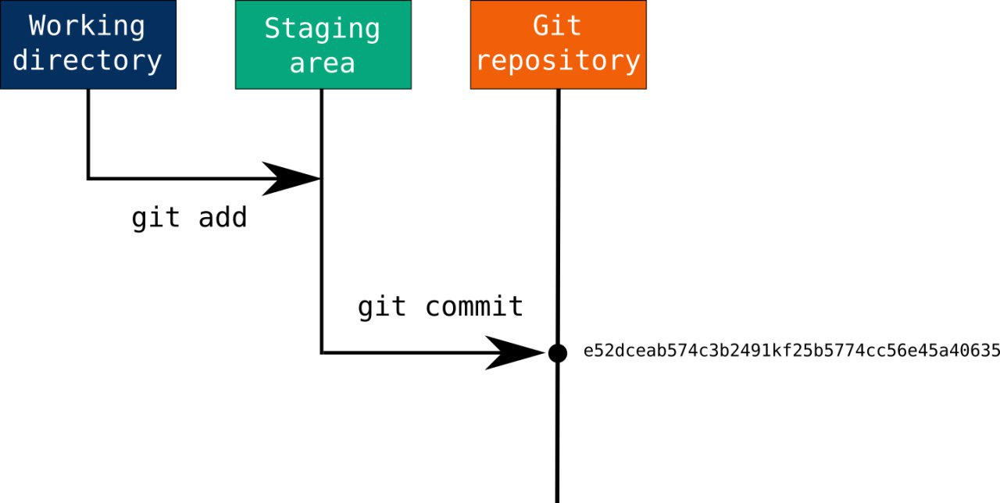
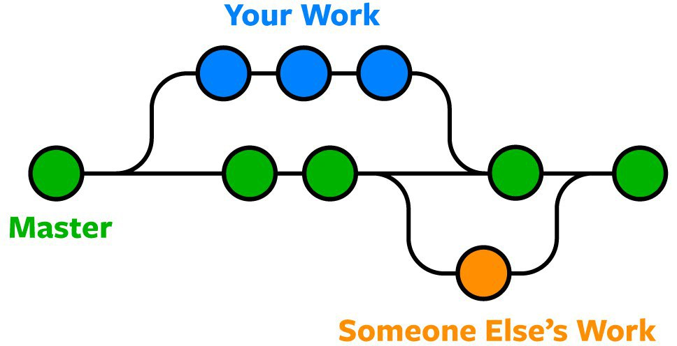

# GIT

## Agenda
+ Intro
+ Version Control System
+ Git Basics

## Materials
+ [Git concepts](https://www.gitkraken.com/learn/git#concepts)
+ [Official resource to learn git](https://git-scm.com/doc)
+ [Git online sandbox](https://learngitbranching.js.org/)
+ [Merging and rebasing](https://www.loginradius.com/blog/engineering/git-rebase-vs-git-merge/)

### Intro

Git is the world’s most popular **Version Control System** (VCS). It's original purpose was to help groups of developers work collaboratively on big software projects.

### Version Control System

Version Control System is a system that records changes to a file or set of files over time so that you can recall specific versions later. It is an essential part of the every-day of the modern software team's professional practices.

 Goals: 
1.     Backup and restore
2.     Synchronization
3.     Undo
4.     Track changes and ownership
5.     Sandboxing
6.     Branching

There are two types of VCS:

**What is the difference?**

In a centralized version control the versions are saved in the remote repository, while in distributed version control, versions can be saved in the remote repository as well as in local repositories of the local machines.

In other words, according to picture, centralized (server – client, less complicated) focuses on synchronizing, tracking, and backing up files,
distributed (+ repository (all changes that have been done), more complicated, everyone can be server) - sharing changes.

**And how it is applied to developer life?** 

- *CVCS* - get the last version of the code from the central repository, make you own changes, commit them or merge into the central repository.

- *DVCS* - when you firstly start working on a project, you need to clone copy of the code to your hard drive, make changes, commit it to your local repository, 
*make connection* with the remote repository (note it can be changed while you are coding), so you need to get the new changes from a repository ("**pull**"), and then merge your local **branch** into
**master** repository ("**push**").

It may sound to complicated, but after practising you will become an expert.

### Git Basics

#### Git workflow
There are three main components of a Git project:

- Repository
- Working tree
- Index

 1. The repository is a "container" that tracks the changes to your project files.
 2. The working tree, or working directory, consists of files that you are currently working on. You can think of a working tree as a file system where you can view and modify files.
 3. The index (staging area) is where commits are prepared. It's like a middle ground between what you have done to your files (the working directory) and what you have last committed (the HEAD commit)

You can think of it like:
 1. Modify files;
 2. Stage the changes you want to include (commit);
 3. Commit changes.
 
#### Storing data
Git thinks of its data more like *a series of snapshots* of a miniature filesystem. With Git, every time you commit, or save the state of your project, Git basically takes 
a picture of what all your files look like at that moment and stores a reference to that snapshot. To be efficient, if files have not changed, Git doesn’t store the file again, 
just a link to the previous identical file it has already stored. Git thinks about its data more like a stream of snapshots.

Git has three main states that your files can reside in: **committed**, **modified**, **staged**:

- *Modified* 
means that you have changed the file but have not committed it to your database yet.

- *Staged* 
means that you have marked a modified file in its current version to go into your next commit snapshot.

- *Committed* 
means that the data is safely stored in your local database.

#### Concepts

- Commit is a snapshot of your repo at a specific point in time. A commit is a singly linked list that consists of objects with changed files and a link to the previous commit. 
Author names, timestamps, and commit messages are also included (*metadata*). To get acquainted with the storage, refer to 
<a href="https://campus.datacamp.com/courses/introduction-to-git/repositories?ex=1">How does Git store information?</a>

Essential *commands*: 

| Command       | Description    | 
| --------------|:--------------:|
| git add | takes a modified file in your working directory and places the modified version in a staging area |
| git commit |  takes everything from the staging area and makes a permanent snapshot of the current state of your repository that is associated with a unique identifier |
| git commit –amend |  it is like git commit, but changes previous commit |

- Branch

Imagine a tree. It has branches which are attached to the central part of the tree - trunk. Branches can fall of, generate, 
but the trunk always remains compact. It's a tree heart. Similarly, *Git branch* is a way of developing the software without affecting the main part of the project.
The trunk in Git is **master** (or ***main*) branch (it's default).

Branch in Git is *lightweight* . In fact, a branch is simply a pointer to one specific commit. 

Essential *commands*: 

| Command       | Description    | 
| --------------|:--------------:|
| git branch *branch_name* | create a new branch with name *branch_name* |
| git branch -d | deletes a branch |
| git checkout | switch to another branch |

Imagine a situation when you are working on a specific feature for a website. You simply create a new branch and start working. You haven’t finished your new feature, 
but you get a request to make a rush change that needs to go live on the site today. You switch back to the master branch, make the change, and push it live. 
Then you can switch back to your new feature branch and finish your work.

- Merging 

Ok, you've finished working on your feature, then how will you *send* it to master branch? The answer is quite simple - just *merge* it and you will get all your changes 
in target branch.

Essential *commands* to merge the master and *feature_branch_name* branches: 

| Command       | Description    | 
| --------------|:--------------:|
| git checkout master | change to the master branch |
| git merge *feature_branch_name* | merge the current branch (master) with *feature_branch_name* |

Sometimes merging two branches (or merging a local and remote branch, when you want to update your project with new changes your colleagues made) 
can be challenging - you can get a conflict. For example, you and another developer unknowingly both work on the same part of a file. The other developer pushes their changes 
to the remote repo. When you then pull them to your local repo you’ll get a merge conflict. Git has a nice way to handle it -  you can see both sets of changes and decide which you want to keep.

Always try to keep your branch up-to-date to avoid big conflicts. To do this, here are the essential *commands*:

| Command       | Description    | 
| --------------|:--------------:|
| git fetch | pull the latest remote commits (it does not merge them with your current branch) |
| git pull | this is a combination of git fetch and git merge |

To understand the difference better, refer to [Difference between git PULL and git FETCH](https://www.youtube.com/watch?v=Mdo7hvlUJ-U)

- HEAD is a pointer, which always points to the latest commit in the branch. Whenever you make a commit, HEAD is updated with the latest commit. 
The heads of the branches are stored in .git/refs/heads/ directory. *Detached* HEAD means that it points not on the top of a branch, but on a random (specific) commit.
You can take a look of it's moving with **git reflog** command.

Note that this is a brief explanation of Git concepts. To learn more and understand better, refer to a file with tasks.

## Extra Materials
1. [Useful git commands](https://davidwalsh.name/git-commands)
2. [Version Control with Git](https://swcarpentry.github.io/git-novice/)
3. [Git optional](https://try.github.io/)
4. [Git videos](https://youtu.be/jUlT-zQ-mbk)
5. [10-minutes git concepts video](https://youtu.be/8KCQe9Pm1kg)
6. [Mastering git](https://youtu.be/ZgCCnv9LxzA)
7. [Git vs GitHub](https://kinsta.com/knowledgebase/git-vs-github/)