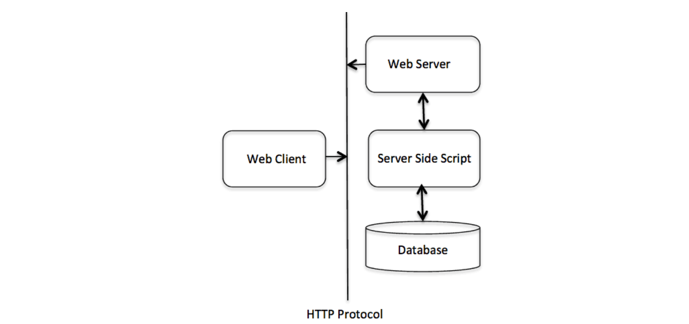
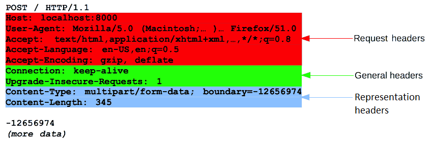
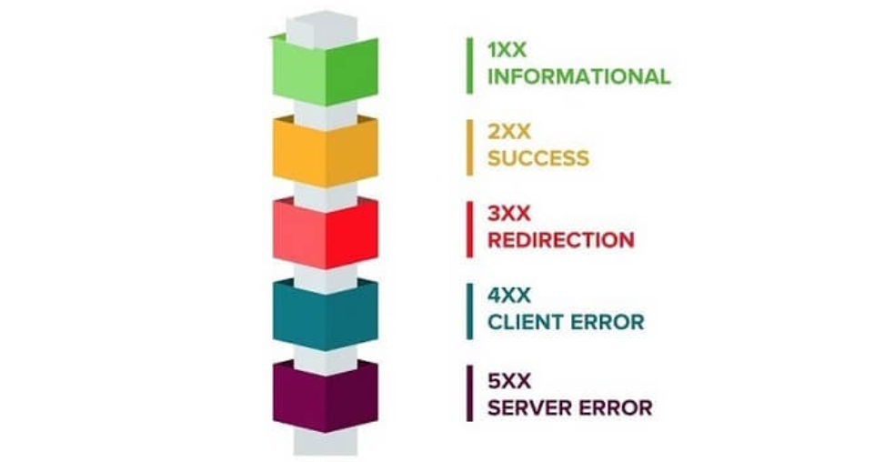

# Web & HTTP

## Materials
+ Introduction in Web
+ Web and HTTP interrelation
+ HTTP Message structure
+ HTTP methods
+ HTTP Response codes

## Introduction in Web
### Clients and servers
Web is basically a system of Internet servers that supports formatted documents. The documents are formatted using a markup language called HTML (HyperText Markup Language) that supports links to other documents, like graphics, audio, and video files.

Computers connected to the web are called clients and servers. Web consists of billions of clients and servers connected through wires and wireless networks. A simplified diagram of how they interact might look like this:

- Clients are the typical web user's internet-connected devices (for example, your computer or your phone connected to your Wi-Fi) and web-accessing software available on those devices (usually a web browser like Firefox or Chrome).
- Servers are computers that store webpages, sites, or apps. When a client device wants to access a webpage, a copy of the webpage is downloaded from the server onto the client machine to be displayed in the user's web browser.

### The other parts of the toolbox
The client and server we've described above don't tell the whole story. There are many other parts involved, and we'll describe them below.

For now, let's imagine that the web is a road. On one end of the road is the client, which is like your house. On the other end of the road is the server, which is a shop you want to buy something from.

In addition to the client and the server, we also need to know:

+ <b>Internet connection</b>. Allows you to send and receive data on the web. It's basically like the street between your house and the shop.
+ <b>TCP/IP</b>. Transmission Control Protocol and Internet Protocol are communication protocols that define how data should travel across the internet. In our example, this is like the transport mechanisms that helps you, like a car or a bike or etc.
+ <b>DNS</b>: Domain Name Servers are like an address book for websites. When you type a web address in your browser, the browser looks at the DNS to find the website's real address before it can retrieve the website. The browser needs to find out which server the website lives on, so it can send HTTP messages to the right place. This is like looking up the address of the shop so you can access it.
+ <b>HTTP</b>: Hypertext Transfer Protocol is an application protocol that defines a language in which clients and servers can communicate. This is like the language you use to order your goods.
+ <b>Component files</b>: A website is made up of many different files, which are like the different parts of the goods you buy from the shop. 
  
    These files come in two main types:
    + Code files: Websites are built primarily from HTML, CSS, and JavaScript.
    + Assets: This is a collective name for all the other stuff that makes up a website, such as images, music, video, Word documents, and PDFs.

### "How it works" or HTTP Request lifecycle 
When you type a web address into your browser <i>(for our analogy that's like walking to the shop)</i>:

1. The browser goes to the DNS server, and finds the real address of the server that the website lives on <i>(you find the address of the shop)</i>.
2. The browser sends an HTTP request message to the server, asking it to send a copy of the website to the client <i>(you go to the shop and order your goods)</i>. This message, and all other data sent between the client and the server. It is sent across your internet connection using TCP/IP.
3. If the server approves the client's request, the server sends the client a "200 OK" message, which means "Of course you can look at that website! Here it is", and then starts sending the website's files to the browser as a series of small chunks called data packets <i>(the shop gives you your goods, and you bring them back to your house)</i>.
4. The browser assembles the small chunks into a complete web page and displays it to you <i>(the goods arrive at your door)</i>.

## Web and HTTP interrelation
HTTP (Hypertext Transfer Protocol)
- HTTP is a protocol that clients and servers on the web to communicate. 
- It is similar to other internet protocols such as SMTP (Simple Mail Transfer Protocol) and FTP (File Transfer Protocol.
- HTTP is a stateless protocol i.e it supports only one request per connection. This means that with HTTP the clients connect to the server to send one request and then disconnect. This mechanism allows more users to connect to a given server over a period of time.
- The client sends an HTTP request and the server answers with an HTML page to the client, using HTTP.

In an extremely simplified form, the HTTP architecture can be represented as follows:

HTTP messages are composed of textual information encoded in ASCII, and span over multiple lines.
Web developers rarely craft these textual HTTP messages themselves: software, a Web browser, proxy, or Web server, perform this action. 

## HTTP Message structure
HTTP messages are how data is exchanged between a server and a client. There are two types of messages: request and response.

HTTP requests and responses share similar structure and are composed of:
1. A <b>start-line</b> describing the requests to be implemented, or its status of whether successful or a failure. This start-line is always a single line.
2. An optional set of HTTP <b>headers</b> specifying the request, or describing the body included in the message.
3. An <b>empty line</b> indicating the end of meta-information.
4. An optional <b>body</b> containing data associated with the request (like content of an HTML form), or the document associated with a response. The presence of the body and its size is specified by the start-line and HTTP headers.

The start-line and HTTP headers of the HTTP message are collectively known as the <b>head of the request</b>, whereas its body is known as the <b>payload</b>.

### HTTP Request structure

The start-line of HTTP request contains three elements:
1. An HTTP method, a verb that describes the action to be performed (like GET, POST). You'll see more information about HTTP methods in the further chapter.
2. The request target, usually a URL, or the absolute path of the protocol, port, and domain are usually characterized by the request context.
3. The protocol version, which defines the structure of the remaining message, acting as an indicator of the expected version to use for the response.

HTTP headers from a request follow the same basic structure of an HTTP header: a case-insensitive string followed by a colon (':') and a value. The whole header, including the value, consist of one single line, which can be quite long.

Many different headers can appear in requests. They can be divided in several groups:
+ <b>General headers</b>, like Connection, apply to the message as a whole.
+ <b>Request headers</b>, like Accept or Accept-Language, modify the request or by conditionally restricting it.
+ <b>Representation headers</b>, like Content-Type that describe the original format of the message data and any encoding applied.

The final part of the request is its body. Not all requests have one: requests fetching resources, like GET, HEAD, DELETE, or OPTIONS, usually don't need one.

### HTTP Response structure

The start line of an HTTP response, called the status line, contains the following information:
1. The protocol version, usually HTTP/1.1.
2. A status code, indicating success or failure of the request. Common status codes are 200, 404, or 302
3. A status text. A brief, purely informational, textual description of the status code to help a human understand the HTTP message.

A typical status line looks like: 
        
    HTTP/1.1 404 Not Found.

HTTP headers from a response follow the same basic structure of an HTTP header: a case-insensitive string followed by a colon (':') and a value. The whole header, including the value, consist of one single line, which can be quite long.

Many different headers can appear in responses. These can be divided into several groups:

+ <b>General headers</b>, like Transfer-Encoding, apply to the whole message.
+ <b>Response headers</b>, like Server, Set-Cookie, give additional information about the server which doesn't fit in the status line.
+ <b>Representation headers</b> like Content-Type that describe the original format of the message data and any encoding applied.

The last part of a response is the body. Not all responses have one: responses with a status code that sufficiently answers the request without the need for corresponding payload (like 201 Created or 204 No Content) usually don't.

## HTTP methods
There are eight methods in HTTP:

+ <b>HEAD</b> 
  
    Used to get the status line and title from the server by URI. Doesn't change data. 

+ <b>GET</b>
  
    Used to receive data from the server at the specified URI. Doesn't change data.
    
+ <b>POST</b>
    
    Used to send data to the server (such as developer information, etc.) using HTML forms.
    
+ <b>PUT</b>
  
    Replaces all previous data on the resource with the new loaded data.
    
+ <b>DELETE</b>
    
    Removes all current data on the resource specified by the URI.
    
+ <b>CONNECT</b>
    
    Establishes a tunnel connection to the server at the specified URI.
    
+ <b>OPTIONS</b>
  
    Describes the connection properties for the specified resource.
    
+ <b>TRACE</b>
    Provides a message containing a reverse trace of the location of the specified resource URI.

The HTTP request can be made using a variety of methods, but the ones which we use widely are  <b>Get</b> and <b>Post</b>. The method name itself tells the server the kind of request that is being made, and how the rest of the message will be formatted.

Now, with the help of the below table, let’s understand the difference between Get and Post methods of HTTP.

| GET                                             | POST                                       |
| ------------------------------------------------|:------------------------------------------:|
| 1. No data is sent                              | Data is sent in the request body           |
| 2. Restricted to limited data transfer          | Supports a large amount of data transfer   |
| 3. It is not secured                            | It is completely secured                   |
| 4. It can be bookmarked                         | It cannot be bookmarked                    |

###  Idempotent Methods

The term idempotent is used to describe an operation that will produce the same results if executed once or multiple times.

Idempotence is a handy property in many situations, as it means that an operation can be repeated or retried as often as necessary without causing unintended effects.

With non-idempotent operations, the algorithm may have to keep track of whether the operation was already performed or not.

In HTTP specification, The methods GET, HEAD, PUT and DELETE are declared idempotent methods.

Other methods OPTIONS and TRACE SHOULD NOT have side effects, so both are also inherently idempotent.

## HTTP Response codes

There are five types of Response codes:

Some of the important response codes are given below:

<i>Information responses</i>

<b>100 : Continue</b>. 
This interim response indicates that everything so far is OK and that the client should continue the request, or ignore the response if the request is already finished.

<b>102 : Processing</b>.
This code indicates that the server has received and is processing the request, but no response is available yet.

<i>Successful responses</i>

<b>200 : Ok</b>.
The request has succeeded.

<b>201 : Created</b>.
The request has succeeded and a new resource has been created.

<b>204 : No content</b>.
There is no content to send for this request, but the headers may be useful. 

<i>Redirecting messages</i>

<b>301 : Moved Permanently</b>.
The URL of the requested resource has been changed permanently. The new URL is given in the response.

<b>302 : Found</b>.
This response code means that the URI of requested resource has been changed temporarily.

<b>307 : Temporary Redirect</b>.
The server sends this response to direct the client to get the requested resource at another URI with same method that was used in the prior request. This has the same semantics as the 302 Found HTTP response code, with the exception that the user agent must not change the HTTP method used: If a POST was used in the first request, a POST must be used in the second request.

<b>308 : Permanent Redirect</b>.
This means that the resource is now permanently located at another URI, specified by the Location HTTP Response header. The user agent must not change the HTTP method used.

<i>Client Error responses</i>

<b>400 : Bad Request</b>.
The server could not understand the request due to invalid syntax.

<b>401 : Unauthorized</b>.
The client must authenticate itself to get the requested response.

<b>403 : Forbidden</b>.
The client does not have access rights to the content;

<b>404: Not Found</b>.
The server can not find the requested resource.

<b>409 : Conflict</b>.
This response is sent when a request conflicts with the current state of the server.

<i>Server Error responses</i>

<b>500 : Internal Server Error</b>
The server has encountered a situation it doesn’t know how to handle.

<b>501 : Not Implemented</b>
The request method is not supported by the server and cannot be handled.

<b>502 : Bad Gateway</b>
This error response means that the server, while working as a gateway to get a response needed to handle the request, got an invalid response.

<b>503 : Server Unavailable</b>
The server is not ready to handle the request. Common causes are a server that is down for maintenance or that is overloaded.

### Summary of HTTP Methods and Response codes

| HTTP Method  | CRUD           | Collection Resource (e.g. /users)                                                                      | Single Resource (e.g. /users/123)                                                |
| -------------|:--------------:| -------------------------------------------------------------------------------------------------------|:--------------------------------------------------------------------------------:|
| <b>POST</b>  | Create         | 201 (Created), ‘Location’ header with link to /users/{id} containing new ID                            | Avoid using POST on a single resource                                            |
| <b>GET</b>   | Read           | 200 (OK), list of users. Use pagination, sorting, and filtering to navigate big lists                  | 200 (OK), single user. 404 (Not Found), if ID not found or invalid               |
| <b>PUT</b>   | Update/Replace | 405 (Method not allowed), unless you want to update every resource in the entire collection of resource| 200 (OK) or 204 (No Content). Use 404 (Not Found), if ID is not found or invalid |
| <b>DELETE</b>| Delete         | 405 (Method not allowed), unless you want to delete the whole collection — use with caution            | 200 (OK). 404 (Not Found), if ID not found or invalid                            |
