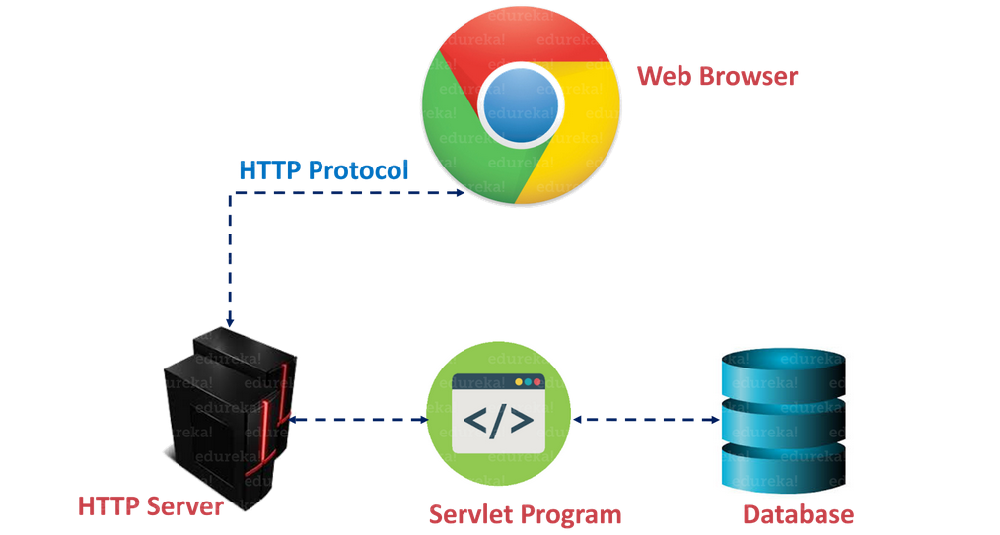
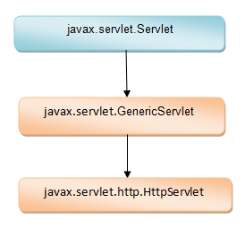

# Servlets

## Materials
+ Introduction in Servlets
+ Servlet lifecycle
+ Servlet architecture
+ Servlet interfaces
+ Request Dispatcher

## Introduction in Servlets
Servlets are Java programs that run on the server and handle requests coming from an HTTP client.

A Servlet is a class that handles requests, processes them, and responds with a response.

For example, we may use a Servlet to gather user input via an HTML form, query records from a database, and dynamically build web pages.

Benefits of servlets:
+ <b>Efficient, platform independent</b>

    By definition, the Java Servlet responds to the client’s request in real-time. It may also be portable and perform in any environment, regardless of the operating system platform.

+ <b>Scalable</b>

    Java Servlets are highly scalable, in our opinion. Servlets employ lightweight threads for their processes and may handle many client requests simultaneously by creating several threads.

+ <b>Robust</b>

    Java Servlets are best recognized for their dependable operation methods. The servlets enhance Java’s functionality, which includes exception handling, security manager, garbage collector.

Servlets are managed by another Java program known as a <b>Servlet Container</b>. When an application running in a web server receives a request, the Server forwards it to the Servlet Container – which in turn passes it to the target Servlet.

The most common servlet container implementations are Apache Tomcat, GlassFish, Jetty, JBoss, IBM WebSphere, Oracle Weblogic.

<b><i>The servlet container loads the servlet on the first client request.</i></b> In some cases, if the servlet is bulky, you need to load it directly at the start of the application in order to reduce the processing time of the request. To do this, use the <load-on-startup> tag in the web.xml application descriptor, which determines whether the servlet should be loaded at startup.

    <servlet>
        <servlet-name>servlet_name</servlet-name>
        <servlet-class>common.servlets.ServletName</servlet-class>
        <load-on-startup>3</load-on-startup>
    </servlet>

## Servlet lifecycle
Let's go through the set of methods which define the lifecycle of a Servlet.

<b>1. init()</b>

The init method is designed to be called only once. If an instance of the servlet does not exist, the web container:
1. loads the servlet class
2. creates an instance of the servlet class
3. initializes it by calling the init method 
   
Before the Servlet can receive requests, the init method must be successfully completed. If the init method throws a ServletException or does not return inside the time limit specified by the Web server, the servlet container cannot put the Servlet into service.

    public void init() throws ServletException { // ... }

<b>2. service()</b>

The Container invokes the service() method to handle client requests, which understands the HTTP request type (POST, GET, PUT, etc.) and invokes the doGet, doPost doPut, doDelete, and so on.

    public void service(ServletRequest request, ServletResponse response)
        throws ServletException, IOException { // ... }

<b>3. destroy()</b>

The Servlet Container invokes this method to remove the Servlet from service. This function is only executed when all Servlet’s service method threads have left or a timeout period has expired. The Container will not call the service method on the Servlet again after calling this method.

    public void destroy() { // ... }

## Servlet architecture

The architecture shows the communication interface, protocol used, requirements of client and server, the programming with the languages and software involved. Basically, it performs the below-mentioned tasks.

+ First, it reads the explicit data sent by the clients (browsers).  This data can include an HTML form on a Web page, an applet or a custom HTTP client program. It also reads implicit HTTP request data sent by the clients (browsers). This can include cookies, media types and compression schemes the browser understands, and so forth.
+ After that, the servlet processes the data and generate the results. This process may require communicating to a database, executing an RMI, invoking a Web service, or computing the response directly.
+ After processing, it sends the explicit data to the clients (browsers). This document can be sent in a variety of formats, including text (HTML or XML) or binary formats(GIF images).
+ Finally, it also sends the implicit HTTP response to the clients (browsers). This includes telling the browsers or other clients what type of document is being returned.

## Servlet interfaces

Sun defines two java packages that contain all the interfaces and classes required by Servlet API. These packages are:

1. <b>javax.servlet</b> – This package contains generic classes and interfaces (protocol less). 

2. <b>javax.servlet.http</b> - As package name suggest , this package contains all classes and interfaces related to HTTP protocol.

The main interface in the Servlet API is the Servlet interface. All servlets implement this interface, either directly or indirectly.

By indirectly we mean, instead of implementing Servlet interface, custom servlets can extend one of the two available abstract classes which are Generic Servlet or Http Servlet.

The inheritance hierarchy looks as follows.

Servlet is displayed in a different colour because it is an interface while Generic Servlet and Http Servlet are abstract classes.

Generic Servlet implements Servlet interface whereas Http Servlet extends Generic Servlet.

### Servlet Config

([Oracle Docs: ServletConfig](https://docs.oracle.com/javaee/7/api/javax/servlet/ServletConfig.html))

Servlet Container creates ServletConfig object for each Servlet during initialization, to pass information to the Servlet. 

This object can be used to get configuration information such as parameter name and values from deployment descriptor file(web.xml).

A servlet is initialized by passing an object of ServiceConfig to its init() method by the Servlet Container. The ServletConfig object contains initialization information and provides access to the ServletContext object.

The following example shows an init servlet's method that prints the name and surname parameters to the console.

    public void init (ServletConfig config) throws ServletException  
    {  
        System.out.println ("name = " + config.getInitParameter("name") +
        "surname = " + config.getInitParameter("surname"));
    }
To get the Servlet Config object in a servlet, we just need to call getServletConfig() method.

### Servlet Context

([Oracle Docs: ServletContext](https://docs.oracle.com/javaee/7/api/javax/servlet/ServletContext.html))

The main difference between ServletConfig and ServletContext is that unlike ServletConfig, the ServletContext is being created once per web application, i.e. ServletContext object is common to all the servlets in web application.

ServletContext allows you to access the parameters of the WEB application, defined in the web.xml descriptor by the <context-param> tag:

    <context-param>
        <param-name>email</param-name>
        <param-value>admin@email.com</param-value>
    </context-param>

The ServletContext object can be obtained using the getServletContext() method of the ServletConfig interface.

    public void init (ServletConfig config) throws ServletException  
    {  
        ServletContext sc = config.getServletContext();  
        System.out.println ("Email = " + sc.getInitParameter("email"));
    }

Once we have the ServletContext object, we can set the attributes of the ServletContext object by using the setAttribute() method. Other servlets can retrieve the attribute from the ServletContext object by using the getAttribute() method.
The purpose of these methods is to transfer different objects between unrelated servlets.

### Servlet Request

([Oracle Docs: ServletRequest](https://docs.oracle.com/javaee/7/api/javax/servlet/ServletRequest.html))

When a client sends a request to the web server, the servlet container creates HttpServletRequest & HttpServletResponse objects and passes them as an argument to the servlet’s service() method.

HttpServletRequest & HttpServletResponse are extended from ServletRequest & ServletResponse and allow you to get additional information about the servlet and the details of the HTTP request protocol.

The request object provides the access to the request information such as header and body information of request data.

Following, various segments of a request received by the Servlet:

- HTTP Request Header
- HTTP Request Parameters 
- HTTP Request InputStream
- HTTP Request Context
- HTTP Request Session

### Servlet Response

([Oracle Docs: ServletResponse](https://docs.oracle.com/javaee/7/api/javax/servlet/ServletResponse.html))

The servlet container is connected to the web server that receives Http Requests from client on a certain port. When client sends a request to web server, the servlet container creates HttpServletRequest and HttpServletResponse objects and passes them as an argument to the servlet service() method.

The response object allows you to format and send the response back to the client. 

Various components of a response in Servlets:

- HTTP Response Header
- HTTP Response Content-Type
- HTTP Response Content-Length
- HTTP Response Write HTML 
- HTTP Response Redirection

## Request Dispatcher

([Oracle Docs: RequestDispatcher](https://docs.oracle.com/javaee/7/api/javax/servlet/RequestDispatcher.html))

The RequestDispatcher is used to work with additional resources such as another servlet, JSP page, or HTML document. Typically, this interface is used for internal communication between servlets in the same context. The RequestDispatcher can be accessed using the getRequestDispatcher (String url) method of the ServletContext interface. 

RequestDispatcher implements two methods:

1. void <b>forward</b>(ServletRequest request, ServletResponse response) - transfer of a request/control to another resource on the server;
2. void <b>include</b>(ServletRequest request, ServletResponse response) - including the content of an additional resource in the response. 

### forward() vs sendRedirect()
| Forward       | SendRedirect   | 
| --------------|:--------------:|
| Executed on the server side | Executed on the client side |
| The request is redirected to another resource within the same server | A 302 (redirect) response is returned to the client and the request is redirected to another server |
| Does not depend on the client's request protocol, as provided by the servlet container | Can only be used with HTTP clients |
| Cannot be used to inject a servlet into another context | Can be used to inject a servlet into a different context |
| The client is unaware of the actual resource being processed and the URL in the string remains the same  | The URL is changed to the address of the new resource |
| Faster than sendRedirect() method  | Slower than forward() because requires the creation of a new request |
| Defined in the RequestDispatcher interface  | Defined in the HttpServletResponse interface |
