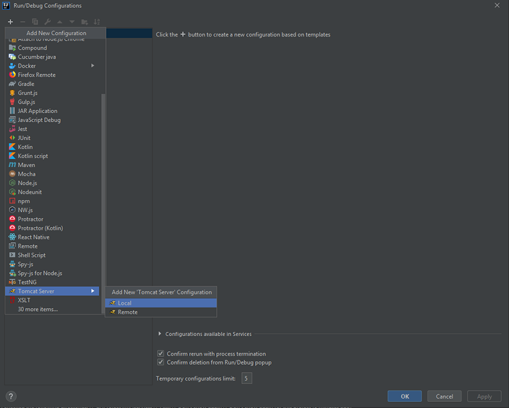
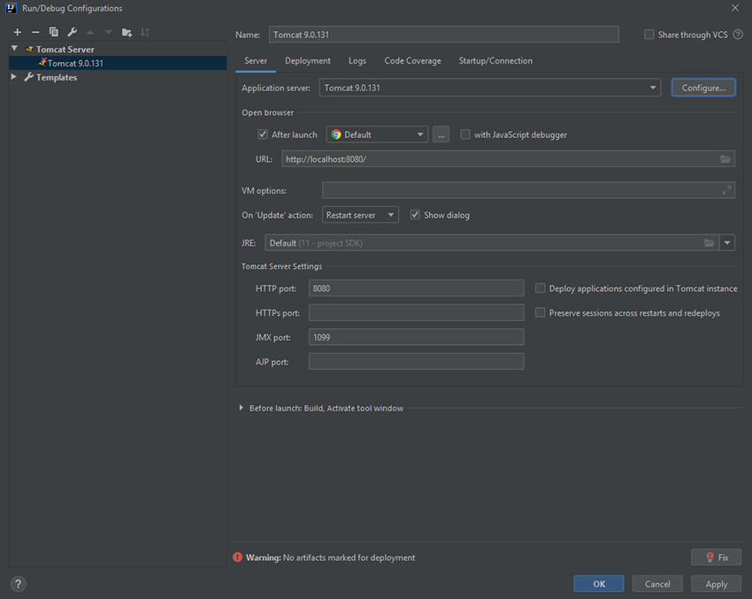
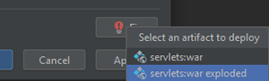
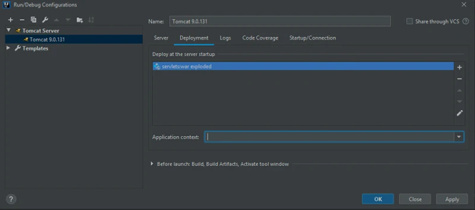

# Servlet add-ons

## Materials
+ Steps to create Servlet
+ Sessions
+ Cookies
+ Filters
+ Listeners

## Steps to create Servlet
Let's create a simple application with servlet.

1. Add the javax.servlet-api dependency to pom.xml and install the packaging war:

        <?xml version="1.0" encoding="UTF-8"?>
        <project xmlns="http://maven.apache.org/POM/4.0.0"
        xmlns:xsi="http://www.w3.org/2001/XMLSchema-instance"
        xsi:schemaLocation="http://maven.apache.org/POM/4.0.0 http://maven.apache.org/xsd/maven-4.0.0.xsd">
        <modelVersion>4.0.0</modelVersion>
        
        <groupId>org.example</groupId>
        <artifactId>servlets</artifactId>
        <version>1.0-SNAPSHOT</version>
        <packaging>war</packaging>
        
           <dependencies>
               <dependency>
                   <groupId>javax.servlet</groupId>
                   <artifactId>javax.servlet-api</artifactId>
                   <version>4.0.1</version>
               </dependency>
           </dependencies>
        </project>

2. Create servlet class:

        import javax.servlet.ServletException;
        import javax.servlet.annotation.WebServlet;
        import javax.servlet.http.HttpServlet;
        import javax.servlet.http.HttpServletRequest;
        import javax.servlet.http.HttpServletResponse;
        import java.io.IOException;
        import java.io.PrintWriter;        
        
        @WebServlet("/hello")
        public class MainServlet extends HttpServlet {
        
            @Override
            protected void doGet(HttpServletRequest req, HttpServletResponse resp) throws ServletException, IOException {
                resp.setContentType("text/html");
                PrintWriter printWriter = resp.getWriter();
                printWriter.write("Hello!");
                printWriter.close();
            }
        }
3. To run the application, create a Tomcat configuration:

4. Next, specify which version of Tomcat you will use, the URL where you can access the server and the port. You should end up with something like this:

5. It remains to specify the artifact (the assembled project in the jar archive), which will be deployed in the container. You can click the Fix button and select war exploded: this means that after rebuilding the project, the artifact will be automatically placed in the servlet container.

   

The application context is servlets_war_exploded by default, which means that the application must be accessed at: http://localhost:8080/servlets_war_exploded.

You may change application context in Development tab.

6. Then click OK and see that now you have the ability to launch the application:

7. Add /hello to the opened url and get the expected response - the string “Hello”!

Then try to improve your servlet to work with sessions, cookies, filters and listeners.

## Session
HTTP protocol and Web Servers are stateless, what it means is that for web server every request is a new request to process and they can’t identify if it’s coming from client that has been sending request previously.

But sometimes in web applications, we should know who the client is and process the request accordingly. For example, a shopping cart application should know who is sending the request to add an item and in which cart the item has to be added or who is sending checkout request so that it can charge the amount to correct client.

Session is a conversional state between client and server and it can consists of multiple request and response between client and server. Since HTTP and Web Server both are stateless, the only way to maintain a session is when some unique information about the session (session id) is passed between server and client in every request and response.

There are several ways through which we can provide unique identifier in request and response:
+ <b>HTML Hidden Field</b> – We can create a unique hidden field in the HTML and when user starts navigating, we can set its value unique to the user and keep track of the session. This method can’t be used with links because it needs the form to be submitted every time request is made from client to server with the hidden field. Also it’s not secure because we can get the hidden field value from the HTML source and use it to hack the session.

+ <b>URL Rewriting</b> – We can append a session identifier parameter with every request and response to keep track of the session. This is very tedious because we need to keep track of this parameter in every response and make sure it’s not clashing with other parameters.

+ <b>Cookies</b> – Cookies are small piece of information that is sent by web server in response header and gets stored in the browser cookies. When client make further request, it adds the cookie to the request header and we can utilize it to keep track of the session. We can maintain a session with cookies but if the client disables the cookies, then it won’t work.

+ <b>Session Management API</b> – Session Management API is built on top of above methods for session tracking. Some the major disadvantages of all the above methods are:

    + Most of the time we don’t want to only track the session, we have to store some data into the session that we can use in future requests. This will require a lot of effort if we try to implement this.
    + All the above methods are not complete in themselves, all of them won’t work in a particular scenario.

  So we need a solution that can utilize these methods of session tracking to provide session management in all cases.
  That’s why we need Session Management API and J2EE Servlet technology comes with session management API that we can use.

### Session in Java Servlet – HttpSession

Servlet API provides Session management through <b>_HttpSession_</b> interface. <b>_HttpSession_</b> allows us to set objects as attributes
that can be retrieved in future requests. Table of content:
1. Getting or creating a Session
2. Binding data to a Session 
   2.1. Store value in session 
   2.2. Read value from session in Java Servlet 
   2.3. Remove value from session
3. Configure session timeout
4. Invalidate a session

### 1. Getting or creating a session

+ <b>_HttpSession getSession()_</b> – This method always returns a HttpSession object. It returns the session object attached with the request, if the request has no session attached, then it creates a new session and return it. For example:

      protected void doGet(HttpServletRequest request, HttpServletResponse response)
         throws ServletException, IOException {
            HttpSession session = request.getSession();
         }
+ <b>_HttpSession getSession(boolean flag)_</b> – This method returns HttpSession object if request has session else it returns null. For example:

         HttpSession session = request.getSession(false);
         if (session != null) {
            // a session exists
         } else {
            // no session
         }
+ <b>_String getId()_</b> – Returns a string containing the unique identifier assigned to this session.
+ <b>_boolean isNew()_</b> – Returns true if the client does not yet know about the session or if the client chooses not to join the session.
+ <b>_ServletContext getServletContext()_</b> - Returns the ServletContext to which this session belongs.

### 2. Binding data to a session
#### 2.1. Store value in session
* <b>_void setAttribute(String name, Object value)_</b> - Binds an object to this session, using the name specified. For example:

    session.setAttribute("username", "Ivan");

<b>NOTES:</b>
Each user is associated with different HttpSession object, so the values stored for user #1 are different than the
values stored for user #2 - although the key is the same.
If the key is already associated with a value, then the old value is replaced by the new one. So you can use the
<b>_setAttribute()_</b> method to update value in the session.
  

#### 2.2. Read value from session in Java Servlet
* <b>_Object getAttribute(String name)_</b> - Returns the object bound with the specified name in this session, or null
  if no object is bound under the name. For example:

    String username = (String) session.getAttribute("username");
* <b>_Enumeration \<String> getAttributeNames()_</b> - Returns an Enumeration of String objects containing the names of
  all the objects bound to this session.
    

#### 2.3. Remove value from session
* <b>_void removeAttribute(String name)_</b> Removes the object bound with the specified name from this session. For example:

    session.removeAttribute("username");
### 3. Configure session timeout
* <b>_void setMaxInactiveInterval(int interval)_</b> - Specifies the time, in seconds, between client requests before
  the servlet container will invalidate this session. For example:

    session.setMaxInactiveInterval(300);
* <b>_long getCreationTime()_</b> - Returns the time when this session was created, measured in milliseconds since
  midnight January 1, 1970 GMT.
* <b>_long getLastAccessedTime()_</b> - Returns the last time the client sent a request associated with this session,
  as the number of milliseconds since midnight January 1, 1970 GMT, and marked by the time the container received the
  request.
* <b>_int getMaxInactiveInterval()_</b> - Returns the maximum time interval, in seconds, that the servlet container will
  keep this session open between client accesses.
### 4. Invalidate a session
* <b>_void invalidate()_</b> - Invalidates this session then unbinds any objects bound to it. For example:

    session.invalidate();

## Cookies

A cookie is a small amount of data which is stored in the web browser and sent between requests and responses through HTTP headers. A cookie has a name and value, plus option attributes like comment, path, domain, max age, etc Cookies are commonly used to implement simple, temporary data storage on the client side, such as session id, remember password, etc.
In Java Servlet API, the javax.servlet.http.Cookie class represents a cookie.

Table of content:
1. Create a cookie
2. Read cookies
3. Update a cookie
4. Delete a cookie

### 1. Create a cookie.
To store a cookie in the web browser, first create a new Cookie object. Then call the addCookie() method of the HttpServletResponse object in a Servlet class.
This will send appropriate HTTP headers to the client, and the browser stores the cookie on user’s computer.

    String name = "Cookie name";
    String value = "Cookie value";
    Cookie cookie = new Cookie(name, value);
    response.addCookie(cookie);

You can also specify additional information for a cookie using the following methods:

+ <b>cookie.setComment("String")</b>: specifies a comment that describes the cookie’s purpose.
+ <b>setDomain(String)</b>: specifies the domain name within which this cookie is visible. By default, cookies are only returned to the server that sent them. So setting the domain name makes the cookies available for different servers under the same domain name.
+ <b>setHttpOnly(boolean)</b>: if set to true, Javascript can’t read this cookie on the client side, which can prevent some kinds of cross-site scripting attacks.
+ <b>setMaxAge(int)</b>: specifies how long the cookie is stored in user’s computer, in seconds. If not set, the cookie is deleted when the web browser get closed.
+ <b>setPath(String)</b>: use this method if you want to restrict the cookie to be available for a certain path (and its subpaths) on the server.
+ <b>setSecure(boolean)</b>: if set to true, the cookie is sent from the browser to the server only when using secure protocol (HTTPS or SSL). Default value is false.

### 2. Read cookies
To read cookies sent from the browser to the server, call getCookies() method on a HttpServletRequest object in a Java servlet class. This method returns an array of Cookie objects that are visible to the current request. To read a specific cookie, you need to check the cookie’s name in the loop. For example:

    Cookie[] cookies = request.getCookies();
    for (Cookie cookie : cookies) {
        String name = cookie.getName();
        if (name.equals("username")) {
            username = cookie.getValue();
            break;
        }
    }

### 3. Update a cookie
To update an existing cookie, you need to create a new cookie with the same name and add it to the response. For example:

    String name = "Cookie name";
    String value = "New value";
    Cookie cookie = new Cookie(name, value);
    response.addCookie(cookie);

### 4. Delete a cookie
To remove a cookie from the browser’s cache, you need to create a new cookie with the same name, set its max age to zero and add it to the response. For example:

    Cookie cookie = new Cookie("username", "");
    cookie.setMaxAge(0);
    response.addCookie(cookie);

## Filters
Servlet Filters are java components that we can use to intercept and process requests before they are sent to servlets
and response after servlet code is finished and before container sends the response back to the client.
Some common tasks that we can do with servlet filters are:
1) Writing request parameters to log files
2) Authenticating and authorizing resource requests
3) Encryption of requests

### Servlet Filter interface
Servlet Filter interface is similar to Servlet interface and we need to implement it to create our own servlet filter.
Servlet Filter interface contains lifecycle methods of a Filter and it’s managed by servlet container.
Servlet Filter interface lifecycle methods are:

+ <b>_void init(FilterConfig paramFilterConfig)_</b> – When container initializes the Filter, this is the method that
  gets invoked. This method is called only once in the lifecycle of filter and we should initialize any resources in
  this method. FilterConfig is used by container to provide init parameters and servlet context object to the Filter. We
  can throw ServletException in this method.
+ <b>_doFilter(ServletRequest paramServletRequest, ServletResponse paramServletResponse, FilterChain paramFilterChain)_</b>
  – This is the method invoked every time by container when it has to apply filter to a resource. Container provides
  request and response object references to filter as argument. FilterChain is used to invoke the next filter in the chain. This is a great example of Chain of Responsibility Pattern.
+ <b>_void destroy()_</b> – When container offloads the Filter instance, it invokes the destroy() method. This is the
  method where we can close any resources opened by filter. This method is called only once in the lifetime of filter.

### @WebFilter Annotation
The <b>@WebFilter</b> annotation is used to define a <b>Filter</b> in a web application. This annotation is specified on a class and
contains metadata about the filter being declared. This annotation is processed by the container at deployment time,
and the corresponding filter applied to the specified URL patterns, servlets, and dispatcher types.

The list all the attributes used to configure <b>Filter</b> using <b>@WebFilter</b> annotation:
1. <b>String filterName</b> - Name of the filter
2. <b>String[] urlPatterns</b> - Provides an array of values or urlPatterns to which the filter applies
3. <b>DispatcherType[] dispatcherTypes</b> - Specifies the types of dispatcher (Request/Response) to which the filter applies
4. <b>String[] servletNames</b> - Provides an array of servlet names
5. <b>String displayName</b> - Name of the filter
6. <b>String description</b> - Description of the filter
7. <b>WebInitParam[] initParams</b> - The array of initialization parameters for this filter
8. <b>Boolean asyncSupported</b> - Asynchronous operation supported by this filter
9. <b>String smallIcon</b> - Defines a small icon for this filter, if present
10. <b>String largeIcon</b> - Defines a large icon for this filter, if present

The default name of the Filter if not specified is the fully qualified class name. The urlPatterns attribute,
servletNames attribute or the value attribute of the annotation must be specified. All other attributes are optional
with default settings.

_Example 1. Create Filter using @WebFilter Annotation_

        import java.io.IOException;
        import javax.servlet.annotation.WebFilter;
        import javax.servlet.annotation.WebInitParam;
        import javax.servlet.*;
        import java.util.*;
        
        // Implements Filter class
        
        @WebFilter(urlPatterns = {
        "/*"
        },
        initParams = {
        @WebInitParam(name = "username", value = "Ramesh"),
        @WebInitParam(name = "password", value = "Pass@123")
        })
        public class AuthFilter implements Filter {
        
            public void init(FilterConfig config) throws ServletException {
                // Get init parameter
                String username = config.getInitParameter("username");
                String password = config.getInitParameter("password");
                // Print the init parameter
                System.out.println("Username : " + username);
                System.out.println("Password : " + password);
            }
        
            public void doFilter(ServletRequest request, ServletResponse response, FilterChain chain)
            throws IOException, ServletException {
        
                // Log the current timestamp.
                System.out.println("Time " + new Date().toString());
        
                // Pass request back down the filter chain
                chain.doFilter(request, response);
            }
        
            public void destroy() {
                /*
                 * Called before the Filter instance is removed from service by the web
                 * container
                 */
            }
        }

_Example 2. Register a filter for multiple servlets_

            @WebFilter(servletNames = {"FirstServlet", "SecondServlet"})
            public class SampleFilter implements Filter {
                // implements Filter's methods here...
            }
_Example 3. Define additional information for the filter_

            @WebFilter(
            urlPatterns = "/users/*",
            filterName = "UserFilter",
            description = "Describe Filter"       
            )
            public class UserFilter implements Filter {
                // implements Filter's methods here...
            }
_Example 4. Specify dispatcher types_

            @WebFilter(
            urlPatterns = "/user",
            dispatcherTypes = {DispatcherType.REQUEST, DispatcherType.FORWARD}
            )
            public class UserFilter implements Filter {
                // implements Filter's methods here...
            }

## Listeners
During the lifetime of a typical web application, a number of events take place, such as:

+ requests are created or destroyed;
+ request or session attributes are added, removed, or modified;

The Servlet API provides a number of listener interfaces we can implement in order to react to these events.

| Listener Interface                               | Methods                                                                                                                                             | Description
|:------------------------------------------------:|:---------------------------------------------------------------------------------------------------------------------------------------------------:|:--------------------------------------------------------------------------
| 1. ServletContextListener                         | contextInitialized(ServletContextEvent e), contextDestroyed(ServletContextEvent e)                                                                  |Contains methods for handling context initialization and destruction events.|         
| 2. ServletContextAttributeListener                | attributeAdded(ServletContextAttributeEvent e), attributeRemoved(ServletContextAttributeEvent e), attributeReplaced(ServletContextAttributeEvent e) | Contains methods for reacting to any attributes added, removed, or replaced in the servlet context (application scope).
| 3. ServletRequestListener                         | requestDestroyed(ServletRequestEvent e), requestInitialized(ServletRequestEvent e)                                                                  | Contains methods for handling request initialization and destruction events.|
| 4. ServletRequestAttributeListener                | attributeAdded(ServletRequestAttributeEvent e, attributeRemoved(ServletRequestAttributeEvent e), attributeReplaced(ServletRequestAttributeEvent e)  | Contains methods for reacting to any attributes added, removed, or replaced in the request.|
| 5. HttpSessionListener                            | sessionCreated(HttpSessionEvent e), sessionDestroyed(HttpSessionEvent e)                                                                            |Contains methods for handling HTTP session initialization and destruction events.|
| 6. HttpSessionAttributeListener                   | attributeAdded(HttpSessionBindingEvent e), attributeRemoved(HttpSessionBindingEvent e), attributeReplaced(HttpSessionBindingEvent e)                | Contains methods for reacting to any attributes added, removed, or replaced in the HTTP session.|
| 7. HttpSessionBindingListener                     | valueBound(HttpSessionBindingEvent e), valueUnbound(HttpSessionBindingEvent e                                                                       | Causes an object to be notified when it is bound to or unbound from a session. This may be as a result of a servlet programmer explicitly unbinding an attribute from a session, due to a session being invalidated, or due to a session timing out.|
| 8. HttpSessionActivationListener                  | sessionWillPassivate(HttpSessionEvent e), sessionDidActivate(HttpSessionEvent e)                                                                    | Objects that are bound to a session may listen to container events notifying them that sessions will be passivated and that session will be activated.|

All we need to do is to implement one or more of these interfaces and then:
annotate the implemented class(es) with the **@WebListener()** annotation or
declare the implemented class(es) in the web.xml (deployment descriptor) via the \<listener> tag.
    
*Example 1. ServletRequestListener*

      import javax.servlet.ServletRequest;
      import javax.servlet.ServletRequestEvent;
      import javax.servlet.ServletRequestListener;
      import javax.servlet.annotation.WebListener;

      @WebListener
      public class MyServletRequestListener implements ServletRequestListener {

          public void requestDestroyed(ServletRequestEvent servletRequestEvent) {
            System.out.println("ServletRequest destroyed");
          }
    
          public void requestInitialized(ServletRequestEvent servletRequestEvent) {
            System.out.println("ServletRequest initialized.");
          }
      }

*Example 2. HttpSessionListener*

      import javax.servlet.annotation.WebListener;
      import javax.servlet.http.HttpSessionEvent;
      import javax.servlet.http.HttpSessionListener;
   
      @WebListener
      public class MySessionListener implements HttpSessionListener {

          public void sessionCreated(HttpSessionEvent sessionEvent) {
            System.out.println("Session Created:: ID="+sessionEvent.getSession().getId());
          }
    
          public void sessionDestroyed(HttpSessionEvent sessionEvent) {
            System.out.println("Session Destroyed:: ID="+sessionEvent.getSession().getId());
          }
      }