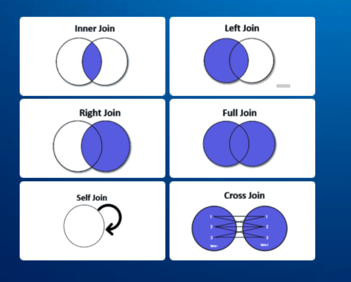

# JOINS Tutorial

JOIN key word is used to work with several tables or within one table. That helps to write effective scripts and perform
actions based on it.
It is widely used and important to know.
The SQL Joins clause is used to combine records from two or more tables in a database. A JOIN is a means for combining
fields from two tables by using values common to each.

```text
SELECT table1.column1,table1.column2,table2.column1,....
FROM table1 
ANY JOIN table2
ON table1.matching_column = table2.matching_column;

table1: First table.
table2: Second table
ANY JOIN: Any type of join : INNER JOIN, FULL JOIN, LEFT JOIN, RIGHT JOIN, CROSS JOIN.
matching_column: Column common to both the tables.
```



1. **INNER JOIN** − returns rows when there is a match in both tables.
2. **LEFT JOIN** − returns all rows from the left table, even if there are no matches in the right table.
3. **RIGHT JOIN** − returns all rows from the right table, even if there are no matches in the left table.
4. **FULL JOIN** − returns rows when there is a match in one of the tables.
5. **SELF JOIN** − is used to join a table to itself as if the table were two tables, temporarily renaming at least one
   table in the SQL statement.
6. **CROSS JOIN** - returns the Cartesian product of rows from the tables in the join. In other words, t combines each
   row from the first table with each row from the second table.

## Materials

- https://www.sqlshack.com/sql-multiple-joins-for-beginners-with-examples/
- https://www.tutorialspoint.com/sql/sql-using-joins.htm
- https://www.geeksforgeeks.org/sql-join-set-1-inner-left-right-and-full-joins/
- https://www.w3schools.com/sql/sql_join.asp

## Questions

1. What kinds of JOINs do you know? Describe the difference.
2. Is it possible to use several JOINs within one script?
3. Which actions can be done with the help of JOINs?
4. What kind of JOIN would you use if you need to select all the records when there is a match in either left or right
   table?  
