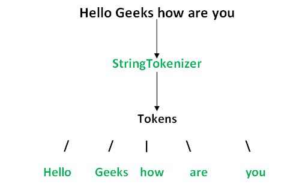

# StringJoiner (java.util.StringJoiner)

## Overview

**StringJoiner** is used to construct a sequence of characters separated by a delimiter and optionally
starting with a supplied prefix and ending with a supplied suffix.

## The important points about Java StringJoiner are:


| Method                                              | Description                                                                                                                                                                                                                               |
|-----------------------------------------------------|-------------------------------------------------------------------------------------------------------------------------------------------------------------------------------------------------------------------------------------------|
| StringJoiner add(CharSequence newElement)           | Adds a copy of the given CharSequence value as the next element of the StringJoiner value.                                                                                                                                                |
| int length()                                        | Returns the length of the String representation of this StringJoiner.                                                                                                                                                                     |
| StringJoiner merge(StringJoiner other)              | Adds the contents of the given StringJoiner without prefix and suffix as the next element if it is non-empty.                                                                                                                             |
| StringJoiner setEmptyValue(CharSequence emptyValue) | Sets the sequence of characters to be used when determining the string representation of this StringJoiner and no elements have been added yet, that is, when it is empty.                                                                |
| String toString()                                   | Returns the current value, consisting of the prefix, the values added so far separated by the delimiter, and the suffix, unless no elements have been added in which case, the prefix + suffix or the emptyValue characters are returned. |

Constructors of **StringJoiner**:

| Constructor                                                                    | Description                                                                                                         |
|--------------------------------------------------------------------------------|---------------------------------------------------------------------------------------------------------------------|
| StringJoiner(CharSequence delimiter)                                           | Constructs a StringJoiner with no characters in it, with no prefix or suffix, and a copy of the supplied delimiter. |
| StringJoiner(CharSequence delimiter, CharSequence prefix, CharSequence suffix) | Constructs a StringJoiner with no characters in it using copies of the supplied prefix, delimiter and suffix.       |

**Example:**
```
    public class GFG {
        public static void main(String[] args)
        {
            // Creating an empty ArrayList of string type
            ArrayList<String> al = new ArrayList<>();
     
            // Adding elements to above List
            al.add("Ram");
            al.add("Shyam");
            al.add("Alice");
            al.add("Bob");
     
            // Creating object of class inside main()
            StringJoiner sj1 = new StringJoiner(",");
            // Using setEmptyValue() method
            sj1.setEmptyValue("sj1 is empty");
            System.out.println(sj1);
            // Using add() method
            sj1.add(al.get(0)).add(al.get(1));
            System.out.println(sj1);
            // Using length() method
            System.out.println("Length of sj1 : "
                               + sj1.length());
     
            StringJoiner sj2 = new StringJoiner(":");
            sj2.add(al.get(2)).add(al.get(3));
            // Using merge() method
            sj1.merge(sj2);
            // Using toString() method
            System.out.println(sj1.toString());
            System.out.println("Length of new sj1 : "
                               + sj1.length());
        }
    }
```

**Output**
```
    sj1 is empty
    Ram,Shyam
    Length of sj1 : 9
    Ram,Shyam,Alice:Bob
    Length of new sj1 : 19
```

That's pretty much all that we can do with **StringJoiner**.
There's one more indirect usage that can be found in the **Stream API**:
```
    @Test
    public void whenUsedWithinCollectors_thenJoined() {
        List<String> rgbList = Arrays.asList("Red", "Green", "Blue");
        String commaSeparatedRGB = rgbList.stream()
            .map(color -> color.toString())
            .collect(Collectors.joining(","));
        assertEquals(commaSeparatedRGB, "Red,Green,Blue");
    }
```
**Collectors.joining() internally uses StringJoiner to perform the joining operation.**

# StringTokenizer (java.util.StringTokenizer)

## Overview
The string tokenizer class allows an application to break a string into tokens.
The **StringTokenizer** methods do not distinguish among identifiers, numbers, and quoted strings, nor
do they recognize and skip comments.

If you look at `String.split()` and compare it to **StringTokenizer**, the relevant difference is
that `String.split()` uses a regular expression, whereas **StringTokenizer** just uses verbatim
split characters. So if I wanted to tokenize a string with more complex logic than single characters
(e.g. split on `\r\n`), I can't use **StringTokenizer** but I can use `String.split()`.



| Method                         | Description                                                                                                           |
|--------------------------------|-----------------------------------------------------------------------------------------------------------------------|
| int countTokens()              | Calculates the number of times that this tokenizer's nextToken method can be called before it generates an exception. |
| boolean hasMoreElements()      | Returns the same value as the hasMoreTokens method.                                                                   |
| boolean hasMoreTokens()        | Tests if there are more tokens available from this tokenizer's string.                                                |
| Object nextElement()           | Returns the same value as the nextToken method, except that its declared return value is Object rather than String.   |
| String nextToken()             | Returns the next token from this string tokenizer.                                                                    |
| String nextToken(String delim) | Returns the next token in this string tokenizer's string.                                                             |

Constructors of **StringTokenizer**:

| Constructor                                                     | Description                                             |
|-----------------------------------------------------------------|---------------------------------------------------------|
| StringTokenizer(String str)                                     | Constructs a string tokenizer for the specified string. |
| StringTokenizer(String str, String delim)                       | Constructs a string tokenizer for the specified string. |
| StringTokenizer(String str, String delim, boolean returnDelims) | Constructs a string tokenizer for the specified string. |

An instance of **StringTokenizer** behaves in one of two ways, depending on whether it was created
with the returnDelims flag having the value true or false:

- If the flag is false, delimiter characters serve to separate tokens. A token is a maximal sequence
of consecutive characters that are not delimiters.
- If the flag is true, delimiter characters are themselves considered to be tokens. A token is thus
either one delimiter character, or a maximal sequence of consecutive characters that are not delimiters.

**Example:**
```
    public class GFG {  
    // Main driver method
    public static void main(String args[])
        {
            // Constructor 1
            System.out.println("Using Constructor 1 - ");
            // Creating object of class inside main() method
            StringTokenizer st1 = new StringTokenizer(
                "Hello Geeks How are you", " ");
            // Condition holds true till there is single token
            // remaining using hasMoreTokens() method
            while (st1.hasMoreTokens())
                // Getting next tokens
                System.out.println(st1.nextToken());

            // Constructor 2
            System.out.println("Using Constructor 2 - ");
            // Again creating object of class inside main()
            // method
            StringTokenizer st2 = new StringTokenizer(
                "JAVA : Code : String", " :");
            // If tokens are present
            while (st2.hasMoreTokens())
                // Print all tokens
                System.out.println(st2.nextToken());

            // Constructor 3
            System.out.println("Using Constructor 3 - ");
            // Again creating object of class inside main()
            // method
            StringTokenizer st3 = new StringTokenizer(
                "JAVA : Code : String", " :", true);
            while (st3.hasMoreTokens())
                System.out.println(st3.nextToken());
        }
    }
```

**Output**
```
    Using Constructor 1 - 
    Hello
    Geeks
    How
    are
    you
    Using Constructor 2 - 
    JAVA
    Code
    String
    Using Constructor 3 - 
    JAVA
     
    :
     
    Code
     
    :
     
    String
```

## Materials
<https://docs.oracle.com/javase/8/docs/api/java/util/StringJoiner.html>

<https://docs.oracle.com/javase/8/docs/api/java/util/StringTokenizer.html>

<https://www.geeksforgeeks.org/stringtokenizer-class-in-java/>

<https://www.geeksforgeeks.org/stringjoiner-class-in-java/>

<https://www.baeldung.com/java-string-joiner>
###
