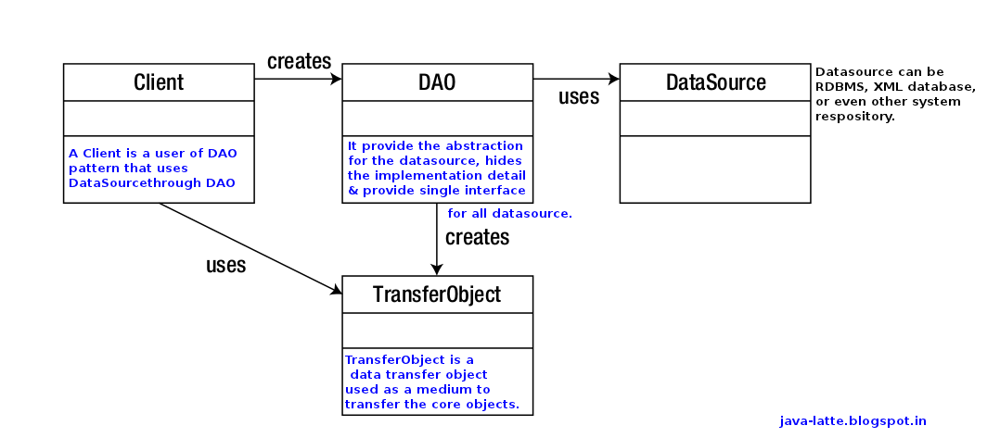

# Architectural Patterns

## Layered Pattern

Image result for layered pattern
Layered architecture patterns are n-tiered patterns where the components are organized in horizontal layers. This is the
traditional method for designing most software and is meant to be self-independent. This means that all the components
are interconnected but do not depend on each other.  
This pattern can be used to structure programs that can be decomposed into groups of subtasks, each of which is at a
particular level of abstraction. Each layer provides services to the next higher layer.  
The most commonly found 5 layers of a general information system:

- Presentation layer (also known as UI layer)
- Application layer (also known as service layer)
- Business logic layer (also known as domain layer)
- Data access layer (also known as persistence layer)
- Database layer


The most commonly used patterns for the data access layer are the DAO and Repository patterns.

## DAO (Data Access Object Pattern)

Data Access Object Pattern or DAO pattern is used to separate low level data accessing API or operations from high level
business services. Following are the participants in Data Access Object Pattern.

- **Data Access Object Interface** - This interface defines the standard operations to be performed on a model object(s)
  .
- **Data Access Object concrete class** - This class implements above interface. This class is responsible to get data
  from a
  data source which can be database / xml or any other storage mechanism.
- **Model Object or Value Object** - This object is simple POJO containing get/set methods to store data retrieved using
  DAO class.

  There are many advantages for using DAO pattern. Let’s state some of them here:

1. While changing a persistence mechanism, service layer doesn’t even have to know where the data comes from. For
   example,
   if you’re thinking of shifting from using MySQL to MongoDB, all changes are needed to be done in the DAO layer only.
2. DAO pattern emphasis on the low coupling between different components of an application. So, the View layer have no
   dependency on DAO layer and only Service layer depends on it, even that with the interfaces and not from concrete
   implementation.
3. As the persistence logic is completely separate, it is much easier to write Unit tests for individual components. For
   example, if you’re using JUnit and Mockito for testing frameworks, it will be easy to mock the individual components
   of
   your application.
4. As we work with interfaces in DAO pattern, it also emphasizes the style of “work with interfaces instead of
   implementation” which is an excellent OOPs style of programming.
   

```java
public class User {
    private int id;
    private String login;
    private String password;
    private String name;

    public User() {
    }

    public User(int id, String login, String password, String name) {
        this.id = id;
        this.login = login;
        this.password = password;
        this.name = name;
    }
    //Getters, Setters, Equals, Hashcode, toString
}

public interface UserDao {
    List<User> findAll();

    Optional<User> findById(int id);

    void saveUser(User user);

    void updateUser(User user);

    boolean deleteById(int id);
}

public class UserDaoImpl implements UserDao {
    //list is working as a database only for example
    private List<User> users;

    public UserDaoImpl() {
        users = new ArrayList<>();
        users.add(new User(1, "login1", "password1", "name1"));
        users.add(new User(2, "login2", "password2", "name2"));
        users.add(new User(3, "login3", "password3", "name3"));
    }

    @Override
    public List<User> findAll() {
        return users;
    }

    @Override
    public Optional<User> findById(int id) {
        return users.stream()
                .filter(user -> user.getId() == id)
                .findAny();
    }

    @Override
    public void saveUser(User user) {
        users.add(user);
    }

    @Override
    public void updateUser(User user) {
        Optional<User> optionalUser = findById(user.getId());
        if (optionalUser.isPresent()) {
            users.remove(optionalUser.get());
            users.add(user.getId() - 1, user);
        } else {
            // Only for example ! Should be thrown exception like incorrect method call
            saveUser(user);
        }
    }

    @Override
    public boolean deleteById(int id) {
        Optional<User> optionalUser = findById(id);
        if (optionalUser.isPresent()) {
            users.remove(id);
            return true;
        }
        return false;
    }
}

public class Example {
    public static void main(String[] args) {
        UserDao userDao = new UserDaoImpl();
        for (User user : userDao.findAll()
        ) {
            System.out.println(user);
        }
        System.out.println(" =================================================================  ");
        Optional<User> optionalUser = userDao.findById(1);
        if (optionalUser.isPresent()) {
            User userForUpdate = optionalUser.get();
            userForUpdate.setName("UPDATED");
            userDao.updateUser(userForUpdate);
        }
        for (User user : userDao.findAll()
        ) {
            System.out.println(user);
        }
    }
}
```

Output:
> User{id=1, login='login1', password='password1', name='name1'}  
> User{id=2, login='login2', password='password2', name='name2'}  
> User{id=3, login='login3', password='password3', name='name3'}  
> =================================================================  
> User{id=1, login='login1', password='password1', name='UPDATED'}  
> User{id=2, login='login2', password='password2', name='name2'}  
> User{id=3, login='login3', password='password3', name='name3'}

## Repository pattern

Repository is one of the easiest and important design pattern that you can use and see, especially when you need a layer
to deal with data access whether this data is in a database or another storage.
Where to Use:

- Between domains(entity) and Data storage
- To prevent duplicate query
- In a system where you have a lot of heavy query
- It is used for search or remove element using specification of the entity that the repository created for.

```java
public interface Repository<T> {
    void add(T t);

    List<T> findAll();

    List<T> findBySpecification(Specification specification);

    void remove(T t);
}

public interface Specification<T> {
    boolean isExist(T t);
}

public class User {
    private int id;
    private String login;
    private String password;
    private String name;

    public User() {
    }

    public User(int id, String login, String password, String name) {
        this.id = id;
        this.login = login;
        this.password = password;
        this.name = name;
    }
    //Getters, Setters, Equals, Hashcode, toString
}

public class UserRepository implements Repository<User> {
    private static UserRepository Instance = new UserRepository();
    //list is working as a database only for example
    private List<User> users;

    private UserRepository() {
        users = new ArrayList<>();
        users.add(new User(1, "login1", "password1", "name1"));
        users.add(new User(2, "login2", "password2", "name2"));
        users.add(new User(3, "login3", "password3", "name3"));
    }

    public static UserRepository getInstance() {
        return Instance;
    }

    @Override
    public void add(User user) {
        users.add(user);
    }

    @Override
    public List<User> findAll() {
        return users;
    }

    @Override
    public List<User> findBySpecification(Specification specification) {
        List<User> userList = new ArrayList<>();
        for (User user : users) {
            if (specification.isExist(user)) {
                userList.add(user);
            }
        }
        return userList;
    }

    @Override
    public void remove(User user) {
        users.remove(user);
    }
}

public class FindByIdSpecification implements Specification<User> {
    private int id;

    public FindByIdSpecification(int id) {
        this.id = id;
    }

    @Override
    public boolean isExist(User user) {
        return user.getId() == id;
    }
}

public class FindByUserNameSpecification implements Specification<User> {
    private String name;

    public FindByUserNameSpecification(String name) {
        this.name = name;
    }

    @Override
    public boolean isExist(User user) {
        return user.getName().equals(name);
    }
}

public class Example {
    public static void main(String[] args) {
        Repository<User> userRepository = UserRepository.getInstance();
        List<User> userList = userRepository.findAll();
        printList(userList);
        System.out.println("================================================================");
        System.out.println("Find by name, used FindByUserNameSpecification");
        List<User> findByUserName = userRepository.findBySpecification(new FindByUserNameSpecification("name1"));
        printList(findByUserName);
        System.out.println("Find by id, used FindByIdSpecification");
        List<User> findByUserId = userRepository.findBySpecification(new FindByIdSpecification(3));
        printList(findByUserId);
    }

    private static void printList(List<User> userList) {
        for (User user : userList
        ) {
            System.out.println(user);
        }
    }
}
```

Output:
> User{id=1, login='login1', password='password1', name='name1'}  
> User{id=2, login='login2', password='password2', name='name2'}  
> User{id=3, login='login3', password='password3', name='name3'}  
> ================================================================  
> Find by name, used FindByUserNameSpecification  
> User{id=1, login='login1', password='password1', name='name1'}  
> Find by id, used FindByIdSpecification  
> User{id=3, login='login3', password='password3', name='name3'}

## MVC (Model-view-controller pattern)

Model–view–controller (MVC) is a software architectural pattern commonly used for developing user interfaces that
divide the related program logic into three interconnected elements. This is done to separate internal representations
of information from the ways information is presented to and accepted from the user.
Traditionally used for desktop graphical user interfaces (GUIs), this pattern became popular for designing web
applications. Popular programming languages have MVC frameworks that facilitate the implementation of the pattern.
This pattern divides an interactive application in to 3 parts as:

- model — contains the core functionality and data
- view — displays the information to the user (more than one view may be defined)
- controller — handles the input from the user

This is done to separate internal representations of information from the ways information is presented to, and
accepted from, the user. It decouples components and allows efficient code reuse.  
In addition to dividing the application into these components, the model–view–controller design defines the interactions
between them.

- The model is responsible for managing the data of the application. It receives user input from the controller.
- The view renders presentation of the model in a particular format.
- The controller responds to the user input and performs interactions on the data model objects. The controller receives
  the input, optionally validates it and then passes the input to the model.

MVC is a framework for thinking about programming, and for organizing your program’s files. To signify the idea that
your code should be organized by its function, developers will create folders for each part of MVC. (The idea that apps
should be divided based on the function of each part of the code is sometimes referred to as separation of concerns.) If
you’ve looked at Codecademy’s Ruby on Rails course, you might have noticed that there is a folder for each part of MVC
within every Rails app it introduces.
MVC gives you a starting place to translate your ideas into code, and it also makes coming back to your code easier,
since you will be able to identify which code does what. In addition, the organizational standard MVC promotes makes it
easy for other developers to understand your code.
Thinking about how code interacts with other code is a significant part of programming, and learning to collaborate with
other developers is an important skill.


Usage:

- Architecture for World Wide Web applications in major programming languages.
- Web frameworks such as Django and Rails.

```java
public class Student {
    private String name;
    private int rollNo;

    Student(String name, int rollNo) {
        this.name = name;
        this.rollNo = rollNo;
    }

    public String getName() {
        return name;
    }

    public void setName(String name) {
        this.name = name;
    }

    public int getRollNo() {
        return rollNo;
    }

    public void setRollNo(int rollNo) {
        this.rollNo = rollNo;
    }
}

public class StudentView {
    public void printStudentDetails(String studentName, String studentRollNo) {
        System.out.println("Student: ");
        System.out.println("Name: " + studentName);
        System.out.println("Roll No: " + studentRollNo);
    }
}

public class StudentController {
    private Student model;
    private StudentView view;

    public StudentController(Student model, StudentView view) {
        this.model = model;
        this.view = view;
    }

    public void setStudentName(String name) {
        model.setName(name);
    }

    public String getStudentName() {
        return model.getName();
    }

    public void setStudentRollNo(String rollNo) {
        model.setRollNo(rollNo);
    }

    public String getStudentRollNo() {
        return model.getRollNo();
    }

    public void updateView() {
        view.printStudentDetails(model.getName(), model.getRollNo());
    }
}

public class MVCPatternDemo {
    public static void main(String[] args) {

        //fetch student record based on his roll no from the database
        Student model = retrieveStudentFromDatabase();

        //Create a view : to write student details on console
        StudentView view = new StudentView();

        StudentController controller = new StudentController(model, view);

        controller.updateView();

        //update model data
        controller.setStudentName("John");

        controller.updateView();
    }

    private static Student retrieveStudentFromDatabase() {
        Student student = new Student();
        student.setName("Robert");
        student.setRollNo("10");
        return student;
    }
}
```

Output:
> Student:  
> Name: Robert  
> Roll No: 10  
> Student:  
> Name: John  
> Roll No: 10

## Client-Server pattern

This pattern consists of two parties; a server and multiple clients. The server component will provide services to
multiple client components. Clients request services from the server and the server provides relevant services to those
clients. Furthermore, the server continues to listen to client requests.  
Usage:

- ClientOnline applications such as email, document sharing and banking.


## Event bus pattern

This pattern primarily deals with events and has 4 major components; event source, event listener, channel and event
bus. Sources publish messages to particular channels on an event bus. Listeners subscribe to particular channels.
Listeners are notified of messages that are published to a channel to which they have subscribed before.


Usage:

- Android development
- Notification services
  