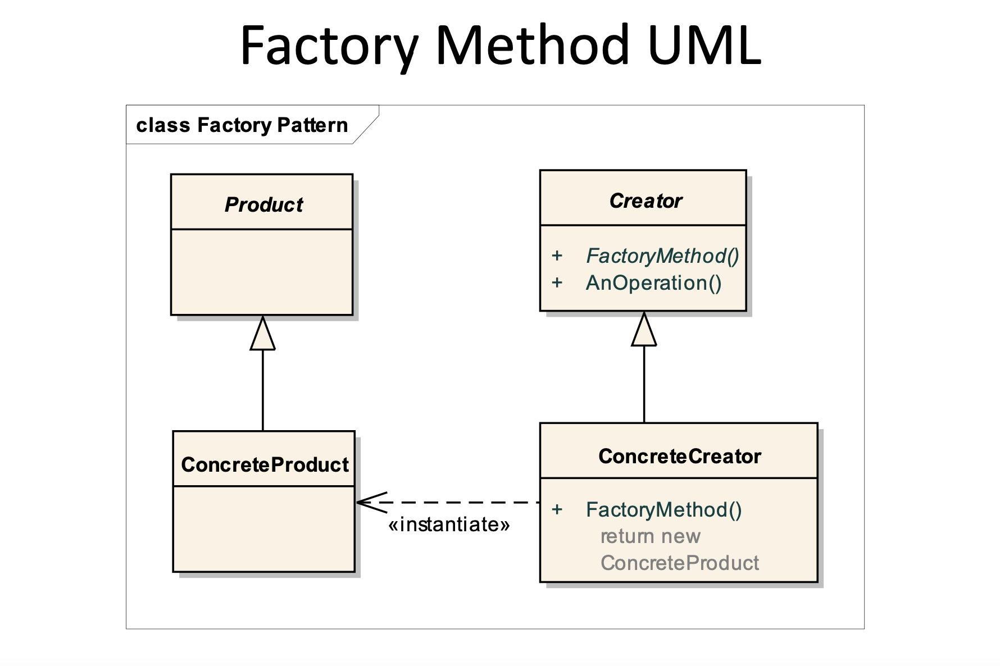
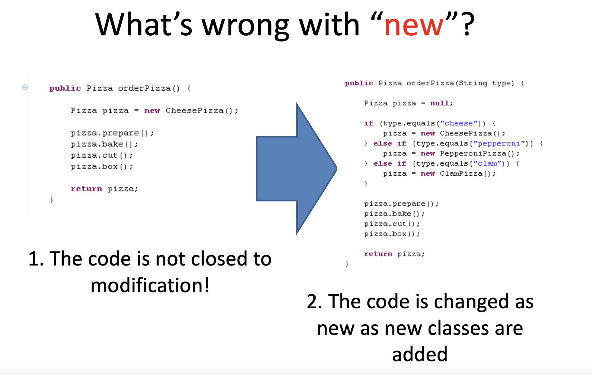
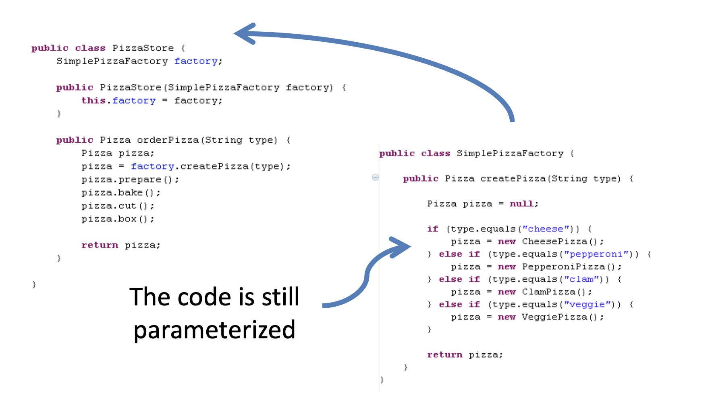
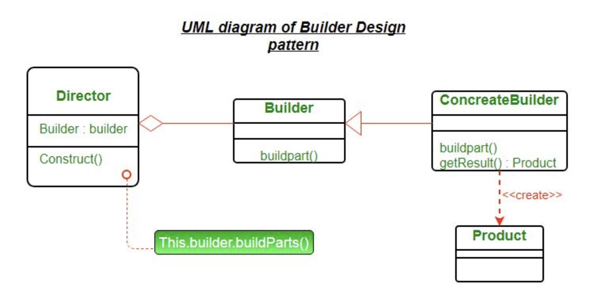
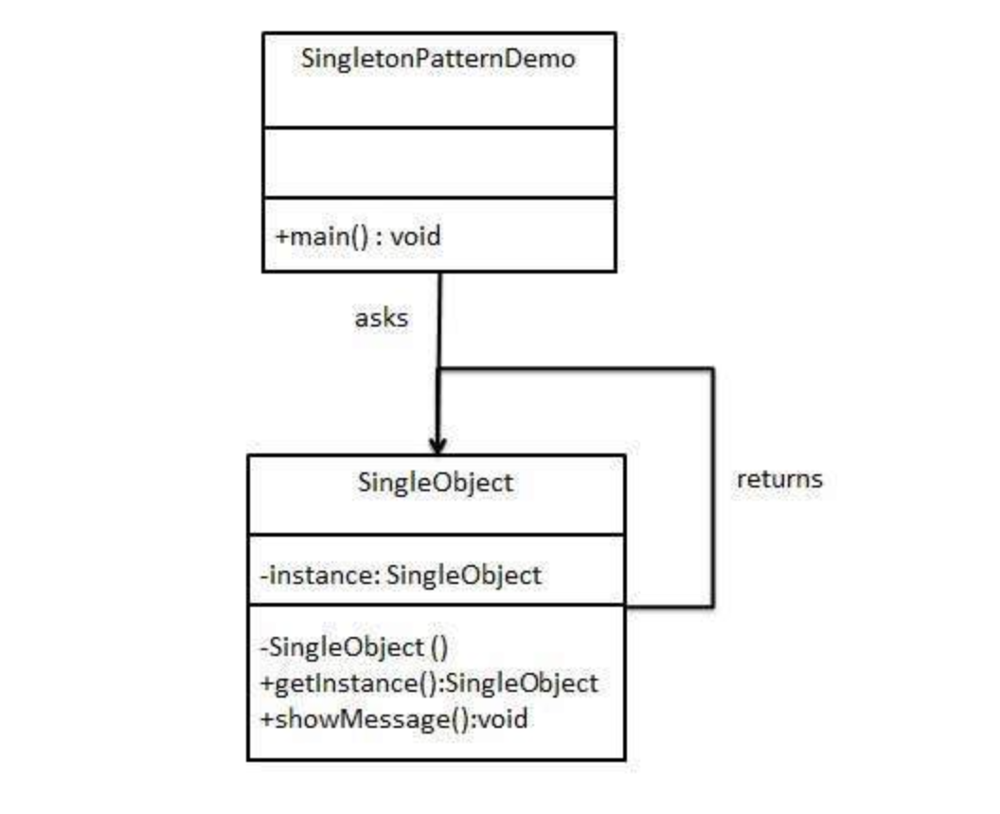
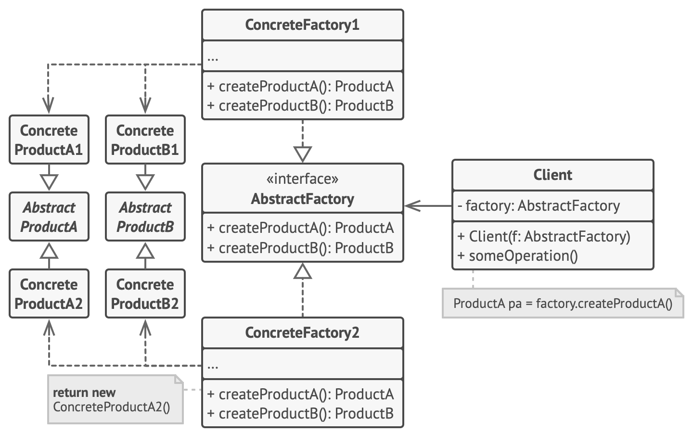

# Architecture Basics, Creational Design Patterns

## Architecture Principles

## SOLID Principles

SOLID is acronym for the Five Principles of Object-Oriented Design.

### SOLID:

- **S** – Single responsibility
- **O** – Open/Closed
- **L** – Liskov substitution
- **I** – Interface segregation
- **D** – Dependency inversion

These principles, when applied together, are designed to increase the likelihood that a programmer will create a system
that is easy to maintain and expand over time.
The SOLID Principles are guidelines that can be applied while working on software to remove "odor code" by instructing
the programmer to refactor the source code until it is legible and extensible.

### Single responsibility principle

There should never be more than one reason for a class to change In other words, every class should have only one
responsibility

#### How does this principle help us to build better software :

- Testing – A class with one responsibility will have far fewer test cases.
- Lower coupling – Less functionality in a single class will have fewer dependencies.
- Organization – Smaller, well-organized classes are easier to search than monolithic ones.

### Open/Closed principle

Software entities should be open for extension, but closed for modification.

1. **open for extension** - entity behavior can be extended by creating new entity types
2. **closed for modification** - As a result of extending the behavior of an entity, no changes should be made to the
   code that these entities use.

> "How can you develop a project that is resistant to changes, the life of which exceeds the lifetime of the first
> version of the project?" - Bertrand Meyer

The idea was that once developed implementation of a class in the future requires only bug fixes, and new or changed
functions require the creation of a new class. This new class can reuse the code of the original class through the
inheritance mechanism. The derived subclass may or may not implement the interface of the original class.

### Liskov substitution

The behavior of inherited classes should not conflict with the behavior specified by the base class, that is, the
behavior of inherited classes should be expected for code that uses a variable of the base type.
This principle warns the developer that changing behavior inherited from a derived type is very risky. It is very
important to follow this principle when designing new types using inheritance.

### Interface segregation principle

1. Variant 1: Many client-specific interfaces are better than one general-purpose interface
2. Variant 2: clients shouldn't depend on methods they don't use

As with other principles of class design, we try to get rid of unnecessary dependencies in the code, make the code easy
to read and easily changeable.

#### General-purpose interface

``` java
interface Item {
    public void applyDiscount(int discount);

    public void applyPromocode(String promocode);

    public void setColor(String color);
    
    public void setSize(int size);
    
    public void setCondition(Condition condition); 
    
    public void setPrice(double price);
    
    public void setMaterial(String material);
}
```

#### After interface segregation

``` java
interface Item {
    public void setCondition(Condition condition); 

    public void setPrice(double price);
}

interface Clothes {
    public void setColor(String color);
    
    public void setSize(int size);
    
    public void setMaterial(String material);
}

interface Discountable {
    public void applyDiscount(int discount);
    
    public void applyPromocode(String promocode);
}
``` 

### Dependency inversion principle

#### Definition:

- Top-level modules should not depend on lower-level modules. Both should depend on abstraction.
- Depend upon abstractions, not implementation.


The reason projects get old is that developers don't have the ability to painlessly change the code of some components
without fear of disrupting the work of others.

#### The design of such systems can be characterized by the following features:

- Rigidity - changing one part of the code affects too many other parts;
- Fragility - even a minor change in the code can lead to completely unexpected problems;
- Immobility - No part of the application can be easily isolated and reused.

## KISS, DRY, YAGNI Principles

Keep it simple, stupid (KISS), you aren’t gonna need it (YAGNI), and don’t repeat yourself (DRY) are some of the most
powerful digital product design principles. They lay the foundations for best practices that developers use to build
better products every day.

### KISS

According to the keep it simple, stupid principle the key to building a successful product is simplicity. The KISS
method applies to the design and development of digital products.
In the digital product development context, the keep it simple, stupid principle has a huge impact on overall product
success:

1. Users don’t want to waste time. They expect a frictionless experience with straightforward, intuitive user flows,
   jargon-free naming, and quick results.
2. A simpler software structure makes testing, including also automated testing, easier and more effective.
3. Reduced codebase complexity makes maintenance and onboarding of new team members mid-project easier and faster.

### YAGNI

The you aren’t gonna need it (YAGNI) principle requires software developers to work on functionalities when they’re
actually needed, not when they assume or foresee that something might be useful in the future. The main goal of the
YAGNI principle is to avoid spending time and money on overengineering things that you think you will need later on.
Because in the end, it usually turns out that you don’t need it, or that what you need is different from what you
expected.
The primary benefit of using YAGNI is a more cost-optimized product development process due to:

1. Better developer performance: The team focuses on delivering the current requirements effectively. They don’t spend
   time and effort on guesses.
2. More flexible codebase: You don’t have to find ways to use suboptimal solutions that you had already developed before
   you had the full picture.

### DRY

DRY stands for don’t repeat yourself and recommends reducing the repetition of software patterns. The DRY principle
states that Every piece of knowledge must have a single, unambiguous, authoritative representation within a system.
This means that you should not have duplicated code. It’s easier to maintain a code that is only in one place, because
if you need to change something in the code, you just need to change in one place. Besides that, if you have the same
code in two or more places, the chance of this code become different during the time is high, and when this happens it
will become an easy way to introduce bugs in your system. Duplicated code also makes the code more complex and
unnecessarily larger. The DRY principle ensures that any modification of a single element of a system does not require a
change in other, logically unrelated elements.
So it’s an effective way of streamlining the development process. In addition, elements that are logically related
change predictably and uniformly, which keeps them in sync.

## Patterns

Design patterns are typical solutions to commonly occurring problems in software design. They are like pre-made
blueprints that you can customize to solve a recurring design problem in your code. You can’t just find a pattern and
copy it into your program, the way you can with off-the-shelf functions or libraries. The pattern is not a specific
piece of code, but a general concept for solving a particular problem. You can follow the pattern details and implement
a solution that suits the realities of your own program.  
Patterns are often confused with algorithms, because both concepts describe typical solutions to some known problems.
While an algorithm always defines a clear set of actions that can achieve some goal, a pattern is a more high-level
description of a solution. The code of the same pattern applied to two different programs may be different.


### Unified Modeling Language

The Unified Modeling Language (UML) is a general-purpose, developmental, modeling language in the field of software
engineering that is intended to provide a standard way to visualize the design of a system.
.png)

## Factory (Factory method)

Design principle - program to an interface, not an implementation.


#### The Factory Method design pattern solves problems like:

- How can an object be created so that subclasses can redefine which class to instantiate?
- How can a class defer instantiation to subclasses?

The factory method design pattern handles these problems by defining a separate method for creating the objects, which
subclasses can then override to specify the derived type of product that will be created. The factory method pattern
relies on inheritance, as object creation is delegated to subclasses that implement the factory method to create
objects.

#### The Factory Method design pattern describes how to solve such problems:

- Define a separate operation (factory method) for creating an object.
- Create an object by calling a factory method.
  And now, why we should use this pattern instead of use keyword new.
  

#### After implementing this pattern



## Builder Pattern

Builder is a creational design pattern, which allows constructing complex objects step by step.
The Builder Pattern separates the construction of a complex object from its representation so that the same construction
process can create different representations.


1. Product – The product class defines the type of the complex object that is to be generated by the builder pattern.
2. Builder – This abstract base class defines all of the steps that must be taken in order to correctly create a
   product. Each step is generally abstract as the actual functionality of the builder is carried out in the concrete
   subclasses.
   The GetProduct method is used to return the final product. The builder class is often replaced with a simple
   interface.
3. ConcreteBuilder – There may be any number of concrete builder classes inheriting from Builder. These classes contain
   the functionality to create a particular complex product.
4. Director – The director-class controls the algorithm that generates the final product object. A director object is
   instantiated and its Construct method is called.
   The method includes a parameter to capture the specific concrete builder object that is to be used to generate the
   product. The director then calls methods of the concrete builder in the correct order to generate the product object.
   On completion of the process, the GetProduct method of the builder object can be used to return the product.

```java
public class Car {
    private String fuelType;
    private String engineType;

    public void setFuelType(String fuelType) {
        this.fuelType = fuelType;
    }

    public void setEngineType(String engineType) {
        this.engineType = engineType;
    }
    //+ Getters, toString
}

public interface CarBuilder {
    void setFuelType();

    void setEngineType();

    Car getCar();
}

public class DieselCarBuilder implements CarBuilder {
    private Car car;

    public DieselCarBuilder() {
        this.car = new Car();
    }

    @Override
    public void setFuelType() {
        car.setFuelType("DIESEL");
    }

    @Override
    public void setEngineType() {
        car.setEngineType("Diesel Engine");
    }

    @Override
    public Car getCar() {
        return this.car;
    }
}

public class GasolineCarBuilder implements CarBuilder {
    private Car car;

    public GasolineCarBuilder() {
        this.car = new Car();
    }

    @Override
    public void setFuelType() {
        car.setFuelType("GASOLINE");
    }

    @Override
    public void setEngineType() {
        car.setEngineType("Gasoline Engine");
    }

    @Override
    public Car getCar() {
        return this.car;
    }
}

public class CarEngineer {
    private CarBuilder carBuilder;

    public CarEngineer(CarBuilder carBuilder) {
        this.carBuilder = carBuilder;
    }

    public Car getCar() {
        return this.carBuilder.getCar();
    }

    public void constructCar() {
        carBuilder.setEngineType();
        carBuilder.setFuelType();
    }
}

public class Builder {
    public static void main(String[] args) {
        //building diesel car
        DieselCarBuilder dieselCarBuilder = new DieselCarBuilder();
        CarEngineer dieselCarEngineer = new CarEngineer(dieselCarBuilder);
        dieselCarEngineer.constructCar();
        Car dieselCar = dieselCarBuilder.getCar();
        System.out.println("Diesel car built: " + dieselCar);
        //building gasoline car
        GasolineCarBuilder gasolineCarBuilder = new GasolineCarBuilder();
        CarEngineer gasolineCarEngineer = new CarEngineer(gasolineCarBuilder);
        gasolineCarEngineer.constructCar();
        Car gasolineCar = gasolineCarBuilder.getCar();
        System.out.println("Gasoline car built: " + gasolineCar);
    }
}

```

output:
> Diesel car built: Car{fuelType='DIESEL', engineType='Diesel Engine'}  
> Gasoline car built: Car{fuelType='GASOLINE', engineType='Gasoline Engine'}

Sometimes we have a lot of fields in a class, and we need to create constructors for many options for creating objects,
in this case the builder pattern can also help us.

```java
public class User {
    private long id;
    private String login;
    private String email;
    private String password;

    public User() {
    }

    // + Getters, Setters, toString 
    public static class UserBuilder {
        private User user;

        public UserBuilder() {
            user = new User();
        }

        public UserBuilder setId(long id) {
            user.id = id;
            return this;
        }

        public UserBuilder setLogin(String login) {
            user.login = login;
            return this;
        }

        public UserBuilder setEmail(String email) {
            user.email = email;
            return this;
        }

        public UserBuilder setPassword(String password) {
            user.password = password;
            return this;
        }

        public User build() {
            return user;
        }
    }
}

public class Main {
    public static void main(String[] args) {
        User user1 =
                new User.UserBuilder()
                        .setId(1)
                        .setEmail("wer@mail.com")
                        .setLogin("login1")
                        .setPassword("password1")
                        .build();
        System.out.println(user1);
        User user2 =
                new User.UserBuilder()
                        .setLogin("login2")
                        .setPassword("password2")
                        .build();
        System.out.println(user2);
    }
}
```

output:
> User{id=1, login='login1', email='wer@mail.com', password='password1'}  
> User{id=0, login='login2', email='null', password='password2'}

## Singleton

In Java, Singleton is a design pattern that ensures that a class can only have one object.

To create a singleton class, a class must implement the following properties:

1. Create a private constructor of the class to restrict object creation outside of the class.
2. Create a private attribute of the class type that refers to the single object.
3. Create a public static method that allows us to create and access the object we created. Inside the method, we will
   create a condition that restricts us from creating more than one object.

```java
//Note: This is not thread safe!!!
public class SingletonObject {
    private static SingletonObject uniqueInstance;

    //other useful variables here
    private SingletonObject() {
    }

    public static SingletonObject getInstance() {
        if (uniqueInstance == null) {
            uniqueInstance = new SingletonObject();
        }
        return uniqueInstance;
    }
    // other useful methods here
}

//or
public class SingletonObject {
    private static SingletonObject uniqueInstance = new SingletonObject();

    private SingletonObject() {
    }

    public static SingletonObject getInstance() {
        return uniqueInstance;
    }
}

public class Singleton {
    public static void main(String[] args) {
        SingletonObject singletonObject = SingletonObject.getInstance();
        //some business logic
    }
}
```

## Abstract factory

Abstract Factory is a creational design pattern that lets you produce families of related objects without specifying
their concrete classes.

### Abstract Factory UML



1. **Abstract Products** declare interfaces for a set of distinct but related products which make up a product family.
2. **Concrete Products** are various implementations of abstract products, grouped by variants. Each abstract product
   must be implemented in all given variants.
3. The **Abstract Factory** interface declares a set of methods for creating each of the abstract products.
4. **Concrete Factories** implement creation methods of the abstract factory. Each concrete factory corresponds to a
   specific variant of products and creates only those product variants.
5. Although concrete factories instantiate concrete products, signatures of their creation methods must return
   corresponding abstract products.
   This way the client code that uses a factory doesn’t get coupled to the specific variant of the product it gets from
   a factory. The **Client** can work with any concrete factory/product variant, as long as it communicates with their
   objects via abstract interfaces.

