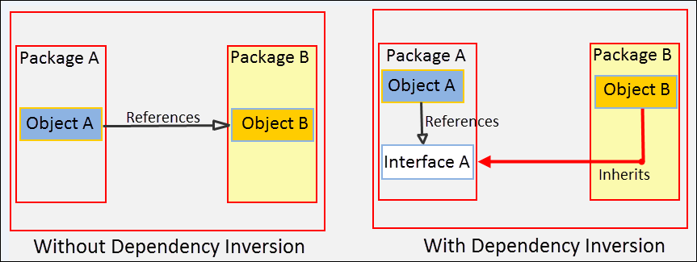
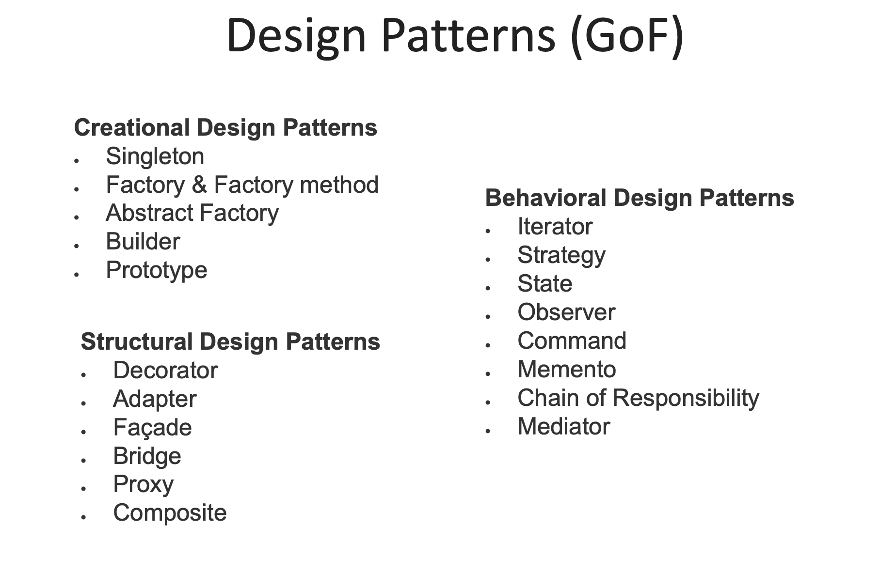

# Architecture Basics

## Architecture Principles

## SOLID Principles

SOLID is acronym for the Five Principles of Object-Oriented Design.

### SOLID:

- **S** – Single responsibility
- **O** – Open/Closed
- **L** – Liskov substitution
- **I** – Interface segregation
- **D** – Dependency inversion

These principles, when applied together, are designed to increase the likelihood that a programmer will create a system
that is easy to maintain and expand over time.
The SOLID Principles are guidelines that can be applied while working on software to remove "odor code" by instructing
the programmer to refactor the source code until it is legible and extensible.

### Single responsibility principle

There should never be more than one reason for a class to change. In other words, every class should have only one
responsibility.

#### How does this principle help us to build better software :

- Testing – A class with one responsibility will have far fewer test cases.
- Lower coupling – Less functionality in a single class will have fewer dependencies.
- Organization – Smaller, well-organized classes are easier to search than monolithic ones.

### Open/Closed principle

Software entities should be open for extension, but closed for modification.

1. **open for extension** - Entity behavior can be extended by creating new entity types.
2. **closed for modification** - As a result of extending the behavior of an entity, no changes should be made to the
   code that these entities use.

> "How can you develop a project that is resistant to changes, the life of which exceeds the lifetime of the first
> version of the project?" - Bertrand Meyer

The idea was that once developed implementation of a class in the future requires only bug fixes, and new or changed
functions require the creation of a new class. This new class can reuse the code of the original class through the
inheritance mechanism. The derived subclass may or may not implement the interface of the original class.

### Liskov substitution

The behavior of inherited classes should not conflict with the behavior specified by the base class, that is, the
behavior of inherited classes should be expected for code that uses a variable of the base type.
This principle warns the developer that changing behavior inherited from a derived type is very risky. It is very
important to follow this principle when designing new types using inheritance.

### Interface segregation principle

1. Variant 1: Many client-specific interfaces are better than one general-purpose interface
2. Variant 2: Clients shouldn't depend on methods they don't use

As with other principles of class design, we try to get rid of unnecessary dependencies in the code, make the code easy
to read and easily changeable.

#### General-purpose interface

``` java
interface Item {
    public void applyDiscount(int discount);

    public void applyPromocode(String promocode);

    public void setColor(String color);
    
    public void setSize(int size);
    
    public void setCondition(Condition condition); 
    
    public void setPrice(double price);
    
    public void setMaterial(String material);
}
```

#### After interface segregation

``` java
interface Item {
    public void setCondition(Condition condition); 

    public void setPrice(double price);
}

interface Clothes {
    public void setColor(String color);
    
    public void setSize(int size);
    
    public void setMaterial(String material);
}

interface Discountable {
    public void applyDiscount(int discount);
    
    public void applyPromocode(String promocode);
}
``` 

### Dependency inversion principle

#### Definition:

- Top-level modules should not depend on lower-level modules. Both should depend on abstraction.
- Depend upon abstractions, not implementation.



The reason projects get old is that developers don't have the ability to painlessly change the code of some components
without fear of disrupting the work of others.

#### The design of such systems can be characterized by the following features:

- Rigidity - changing one part of the code affects too many other parts;
- Fragility - even a minor change in the code can lead to completely unexpected problems;
- Immobility - no part of the application can be easily isolated and reused.

## KISS, DRY, YAGNI Principles

Keep it simple, stupid (KISS), you aren’t gonna need it (YAGNI), and don’t repeat yourself (DRY) are some of the most
powerful digital product design principles. They lay the foundations for best practices that developers use to build
better products every day.

### KISS

According to the keep it simple, stupid principle the key to building a successful product is simplicity. The KISS
method applies to the design and development of digital products.
In the digital product development context, the keep it simple, stupid principle has a huge impact on overall product
success:

1. Users don’t want to waste time. They expect a frictionless experience with straightforward, intuitive user flows,
   jargon-free naming, and quick results.
2. A simpler software structure makes testing, including also automated testing, easier and more effective.
3. Reduced codebase complexity makes maintenance and onboarding of new team members mid-project easier and faster.

### YAGNI

The you aren’t gonna need it (YAGNI) principle requires software developers to work on functionalities when they’re
actually needed, not when they assume or foresee that something might be useful in the future. The main goal of the
YAGNI principle is to avoid spending time and money on overengineering things that you think you will need later on.
Because in the end, it usually turns out that you don’t need it, or that what you need is different from what you
expected.
The primary benefit of using YAGNI is a more cost-optimized product development process due to:

1. Better developer performance: The team focuses on delivering the current requirements effectively. They don’t spend
   time and effort on guesses.
2. More flexible codebase: You don’t have to find ways to use suboptimal solutions that you had already developed before
   you had the full picture.

### DRY

DRY stands for don’t repeat yourself and recommends reducing the repetition of software patterns. The DRY principle
states that Every piece of knowledge must have a single, unambiguous, authoritative representation within a system.
This means that you should not have duplicated code. It’s easier to maintain a code that is only in one place, because
if you need to change something in the code, you just need to change in one place. Besides that, if you have the same
code in two or more places, the chance of this code become different during the time is high, and when this happens it
will become an easy way to introduce bugs in your system. Duplicated code also makes the code more complex and
unnecessarily larger. The DRY principle ensures that any modification of a single element of a system does not require a
change in other, logically unrelated elements.
So it’s an effective way of streamlining the development process. In addition, elements that are logically related
change predictably and uniformly, which keeps them in sync.

## Patterns

Design patterns are typical solutions to commonly occurring problems in software design. They are like pre-made
blueprints that you can customize to solve a recurring design problem in your code. You can’t just find a pattern and
copy it into your program, the way you can with off-the-shelf functions or libraries. The pattern is not a specific
piece of code, but a general concept for solving a particular problem. You can follow the pattern details and implement
a solution that suits the realities of your own program.  
Patterns are often confused with algorithms, because both concepts describe typical solutions to some known problems.
While an algorithm always defines a clear set of actions that can achieve some goal, a pattern is a more high-level
description of a solution. The code of the same pattern applied to two different programs may be different.


### Unified Modeling Language

The Unified Modeling Language (UML) is a general-purpose, developmental, modeling language in the field of software
engineering that is intended to provide a standard way to visualize the design of a system.
.png)
