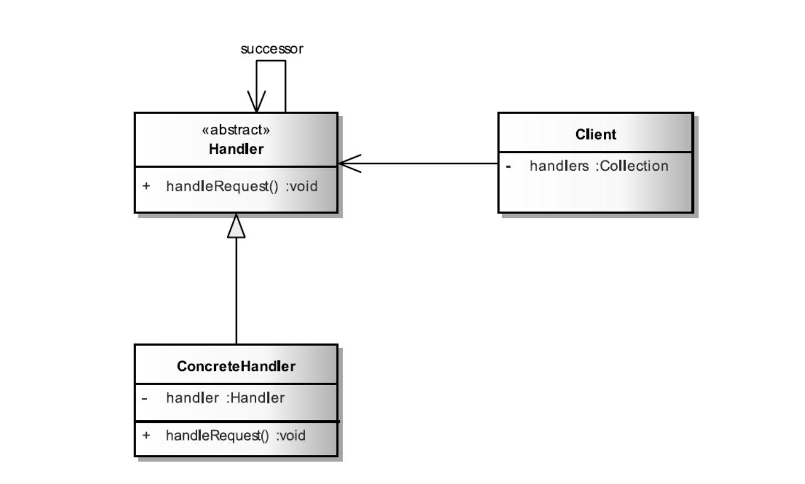
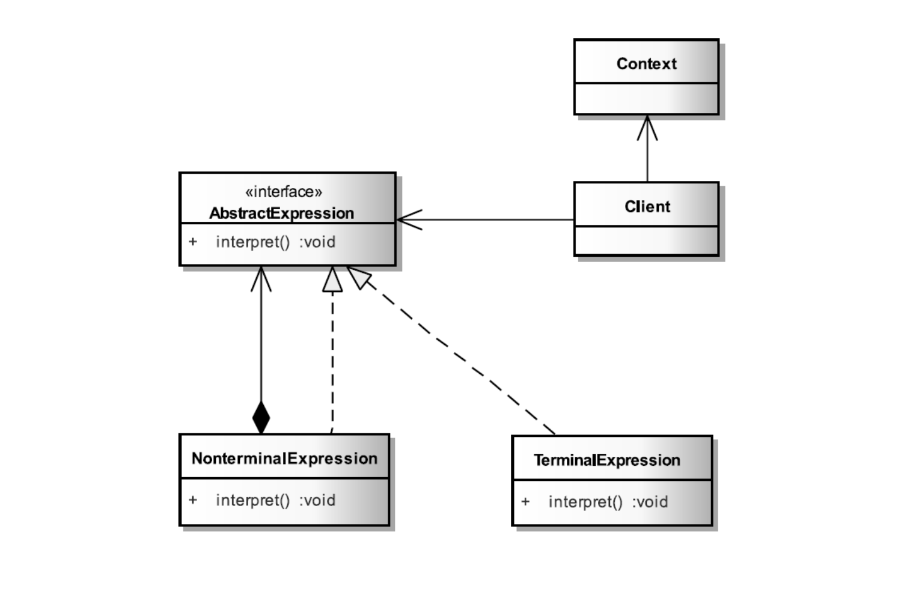

# Behavioral Design Patterns

## Chain of Responsibility

As the name suggests, the chain of responsibility pattern creates a chain of receiver objects for a request. This
pattern decouples sender and receiver of a request based on type of request. In this pattern, normally each receiver
contains reference to another receiver. If one object cannot handle the request then it passes the same to the next
receiver and so on.

### Chain of responsibility UML:



```java
public interface Parser {
    Composite parse(String text);
}

public abstract class AbstractParser implements Parser {
    private Parser successor;

    AbstractParser(Parser successor) {
        this.successor = successor;
    }

    protected Parser getSuccessor() {
        return successor;
    }
}

public class TextParser extends AbstractParser {
    private static final String SPLITTER = "\n";

    public TextParser(Parser successor) {
        super(successor);
    }

    public Composite parse(String text) {
        Composite composite = new Composite();
        String[] parts = text.split(SPLITTER);
        for (String part : parts) {
            Composite inner = getSuccessor().parse(part);
            composite.add(inner);
        }
        return composite;
    }
}

public class ChainBuilder {
    public Parser build() {
        return new TextParser(new ParagraphParser(...));
    }
}

public class TextProcessor {
    public Composite parseText(String text) {
        Parser parser = new ChainBuilder().build();
        return parser.parse(text);
    }
}
```

## Interpreter

Interpreter pattern provides a way to evaluate language grammar or expression. This pattern involves implementing an
expression interface which tells to interpret a particular context. This pattern is used in SQL parsing, symbol
processing engine etc.

### Interpreter UML



```java
public interface Expression {
    void interpret(Context context);
}

public class Context {
    private Deque<Integer> contextValues = new ArrayDeque<>();

    public Integer popValue() {
        return contextValues.pop();
    }

    public void pushValue(Integer value) {
        this.contextValues.push(value);
    }
}

public class NonterminalExpression implements Expression {
    private int number;

    public NonterminalExpression(int number) {
        this.number = number;
    }

    public void interpret(Context context) {
        context.pushValue(number);
    }
}

public class TerminalDivideExpression implements Expression {
    public void interpret(Context context) {
        context.pushValue(context.popValue() / context.popValue());
    }
}

public class Calculator {
    private List<Expression> parse(String expression) {
        List<Expression> expressions = new ArrayList<>();
        for (String lexeme : expression.split("\\s+")) {
            if (lexeme.isEmpty()) {
                continue;
            }
            char temp = lexeme.charAt(0);
            switch (temp) {
                case '+':
                    expressions.add(new TerminalPlusExpression());
                    break;
                case '-':
                    expressions.add(new TerminalMinusExpression());
                    break;
                case '*':
                    expressions.add(new TerminalMultiplyExpression());
                    break;
                case '/':
                    expressions.add(new TerminalDivideExpression());
                    break;
                default:
                    Scanner scan = new Scanner(lexeme);
                    if (scan.hasNextInt()) {
                        expressions.add(
                                new NonterminalExpression(scan.nextInt()));
                    }
            }
        }
        return expressions;
    }

    public int calculate(String expression) {
        Context context = new Context();
        List<Expression> expressions = parse(expression);
        for (Expression terminal : expressions) {
            terminal.interpret(context);
        }
        return context.popValue();
    }
} 
```

## Strategy

In Strategy pattern, a class behavior or its algorithm can be changed at run time. In Strategy pattern, we create
objects which represent various strategies and a context object whose behavior varies as per its strategy object. The
strategy object changes the executing algorithm of the context object.


```java
public interface Strategy {
    int execute(int a, int b);
}

public class ConcreteStrategyAdd implements Strategy {
    @Override
    public int execute(int a, int b) {
        System.out.println("Called ConcreteStrategyAdd's execute()");
        return a + b;
    }
}

public class ConcreteStrategySubtract implements Strategy {
    @Override
    public int execute(int a, int b) {
        System.out.println("Called ConcreteStrategySubtract's execute");
        return a - b;
    }
}

public class ConcreteStrategyMultiply implements Strategy {
    @Override
    public int execute(int a, int b) {
        System.out.println("Called ConcreteStrategyMultiply's execute");
        return a * b;
    }
}

public class Context {
    private Strategy strategy;

    public Context(Strategy strategy) {
        this.strategy = strategy;
    }

    public int executeStrategy(int a, int b) {
        return strategy.execute(a, b);
    }
}

public class Example {
    public static void main(String[] args) {
        Context context;
        // Three contexts following different strategies
        context = new Context(new ConcreteStrategyAdd());
        System.out.println(String.format("Result using add strategy: %s", context.executeStrategy(3, 4)));
        context = new Context(new ConcreteStrategySubtract());
        System.out.println(String.format("Result using subtract strategy: %s", context.executeStrategy(3, 4)));
        context = new Context(new ConcreteStrategyMultiply());
        System.out.println(String.format("Result using multiply strategy: %s", context.executeStrategy(3, 4)));
    }
}
```

Output:
> Called ConcreteStrategyAdd's execute()  
> Result using add strategy: 7  
> Called ConcreteStrategySubtract's execute  
> Result using subtract strategy: -1  
> Called ConcreteStrategyMultiply's execute  
> Result using multiply strategy: 12

## State

The state pattern is a behavioral software design pattern that allows an object to alter its behavior when its internal
state changes. This pattern is close to the concept of finite-state machines. The state pattern can be interpreted as a
strategy pattern, which is able to switch a strategy through invocations of methods defined in the pattern's interface.
The state pattern is used in computer programming to encapsulate varying behavior for the same object, based on its
internal state. This can be a cleaner way for an object to change its behavior at runtime without resorting to
conditional statements and thus improve maintainability.


```java
public interface DoorState {
    void action();

    DoorState getNextState();
}

public class OpenState implements DoorState {
    private static DoorState nextState = new ClosedState();

    @Override
    public void action() {
        System.out.println("The door was closed.");
    }

    @Override
    public DoorState getNextState() {
        return nextState;
    }
}

public class ClosedState implements DoorState {
    private static DoorState nextState = new OpenState();

    @Override
    public void action() {
        System.out.println("The door was opened.");
    }

    @Override
    public DoorState getNextState() {
        return nextState;
    }
}

public class Context {
    private DoorState currentState = new ClosedState();

    public void action() {
        currentState.action();
        DoorState nextState = currentState.getNextState();
        setCurrentState(nextState);
    }

    public void setCurrentState(DoorState currentState) {
        this.currentState = currentState;
    }
}

public class Example {
    public static void main(String[] args) {
        Context context = new Context();
        for (int i = 0; i < 5; i++) {
            context.action();
        }
    }
}
```

Output:
> The door was opened.  
> The door was closed.  
> The door was opened.  
> The door was closed.  
> The door was opened.

## Observer

The observer pattern is a software design pattern in which an object, named the subject, maintains a list of its
dependents, called observers, and notifies them automatically of any state changes, usually by calling one of their
methods. It is mainly used for implementing distributed event handling systems, in "event driven" software.  
The Observer pattern addresses the following problems:

- A one-to-many dependency between objects should be defined without making the objects tightly coupled.
- It should be ensured that when one object changes state, an open-ended number of dependent objects are updated
  automatically.
- It should be possible that one object can notify an open-ended number of other objects.

### Observer UML


```java
public interface Observable {
    void addObserver(Observer o);

    void removeObserver(Observer o);

    void notifyObserver();
}

public interface Observer {
    void handleEvent(CubeEvent event);
}

public class CubeEvent extends EventObject {

    public CubeEvent(Object source) {
        super(source);
    }

    @Override
    public Cube getSource() {
        return (Cube) super.getSource();
    }
}

public class Cube implements Observable {
    private int side;
    private List<Observer> observers = new ArrayList<>();

    public Cube(int side) {
        this.side = side;
    }

    public int getSide() {
        return side;
    }

    public void setSide(int side) {
        this.side = side;
        notifyObserver();
    }

    @Override
    public void addObserver(Observer o) {
        observers.add(o);
    }

    @Override
    public void removeObserver(Observer o) {
        observers.remove(o);
    }

    @Override
    public void notifyObserver() {
        CubeEvent event = new CubeEvent(this);
        observers.forEach(observer -> observer.handleEvent(event));
    }
}

public class VolumeObserver implements Observer {
    @Override
    public void handleEvent(CubeEvent event) {
        Cube cube = event.getSource();
        int side = cube.getSide();
        int volume = side * side * side;
        System.out.println("Volume = " + volume);
    }
}

public class SurfaceSquareObserver implements Observer {
    @Override
    public void handleEvent(CubeEvent event) {
        Cube cube = event.getSource();
        int side = cube.getSide();
        int surfaceSquare = side * side * 6;
        System.out.println("Surface square = " + surfaceSquare);
    }
}

public class Example {
    public static void main(String[] args) {
        Cube cube = new Cube(3);
        cube.addObserver(new VolumeObserver());
        cube.addObserver(new SurfaceSquareObserver());
        cube.setSide(5);
        System.out.println("================================");
        cube.setSide(7);
    }
}
```

Output:
> Volume = 125  
> Surface square = 150  
> ================================  
> Volume = 343  
> Surface square = 294

## Command

Command pattern is a data driven design pattern and falls under behavioral pattern category. A request is wrapped under
an object as command and passed to invoker object. Invoker object looks for the appropriate object which can handle this
command and passes the command to the corresponding object which executes the command.

### Command UML


```java
public interface Command {
    void execute();
}

public class Light {
    public void turnOn() {
        System.out.println("Light is on ");
    }

    public void turnOff() {
        System.out.println("Light is off");
    }
}

public class TurnOnCommand implements Command {
    private Light light;

    public TurnOnCommand(Light light) {
        this.light = light;
    }

    @Override
    public void execute() {
        light.turnOn();
    }
}

public class TurnOffCommand implements Command {
    private Light light;

    public TurnOffCommand(Light light) {
        this.light = light;
    }

    @Override
    public void execute() {
        light.turnOff();
    }
}

public class LightSwitcher {
    private Command turnOnCommand;
    private Command turnOffCommand;

    public LightSwitcher(Command turnOnCommand, Command turnOffCommand) {
        this.turnOnCommand = turnOnCommand;
        this.turnOffCommand = turnOffCommand;
    }

    public void on() {
        turnOnCommand.execute();
    }

    public void off() {
        turnOffCommand.execute();
    }
}

public class Invoker {
    public static void main(String[] args) {
        Light light = new Light();
        TurnOnCommand turnOnCommand = new TurnOnCommand(light);
        TurnOffCommand turnOffCommand = new TurnOffCommand(light);
        LightSwitcher lightSwitcher = new LightSwitcher(turnOnCommand, turnOffCommand);
        lightSwitcher.on();
        lightSwitcher.off();
    }
}
```

## Template

In Template pattern, an abstract class exposes defined way(s)/template(s) to execute its methods. Its subclasses can
override the method implementation as per need but the invocation is to be in the same way as defined by an abstract
class.


```java
abstract class CheckBackground {
    public abstract void checkBank();

    public abstract void checkCredit();

    public abstract void checkLoan();

    public abstract void checkStock();

    public abstract void checkIncome();

    //work as template method
    public void check() {
        checkBank();
        checkCredit();
        checkLoan();
        checkStock();
        checkIncome();
    }
}
```
