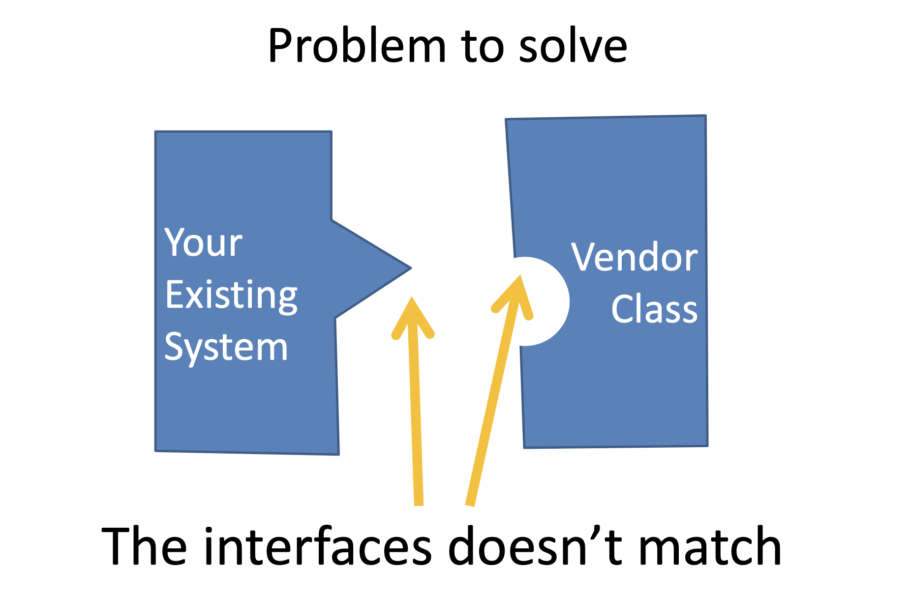
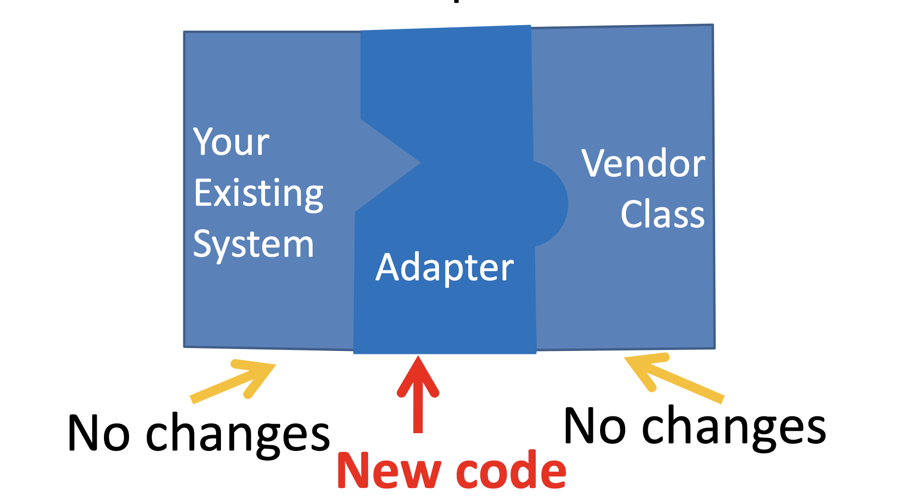
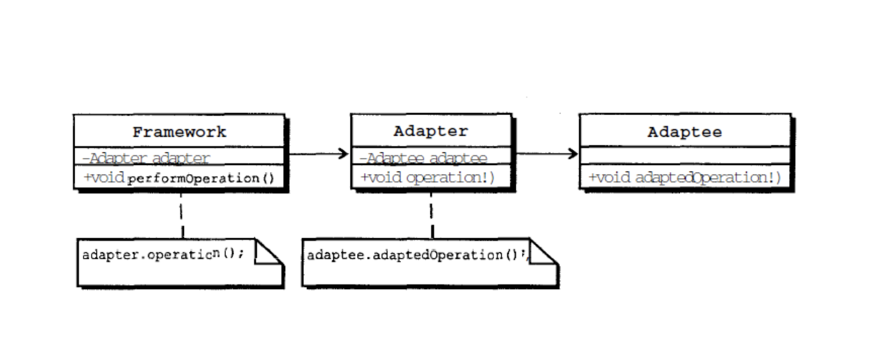
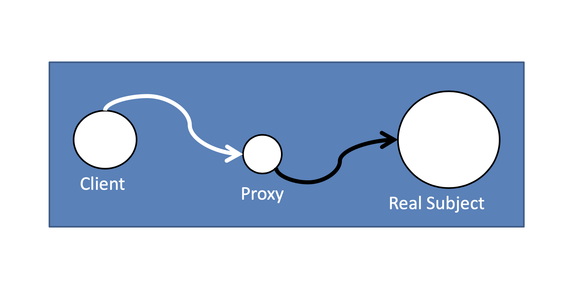
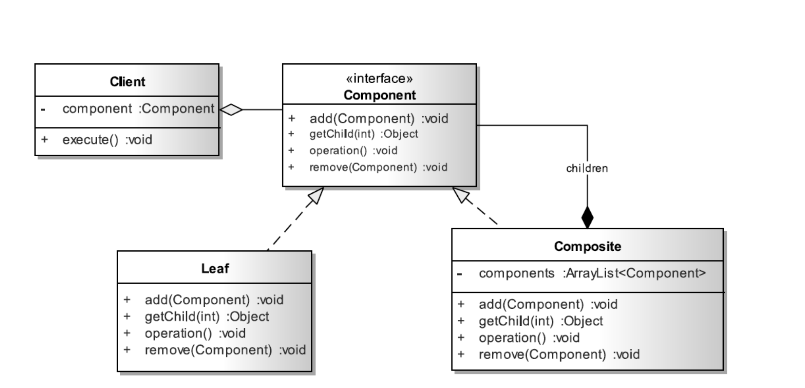
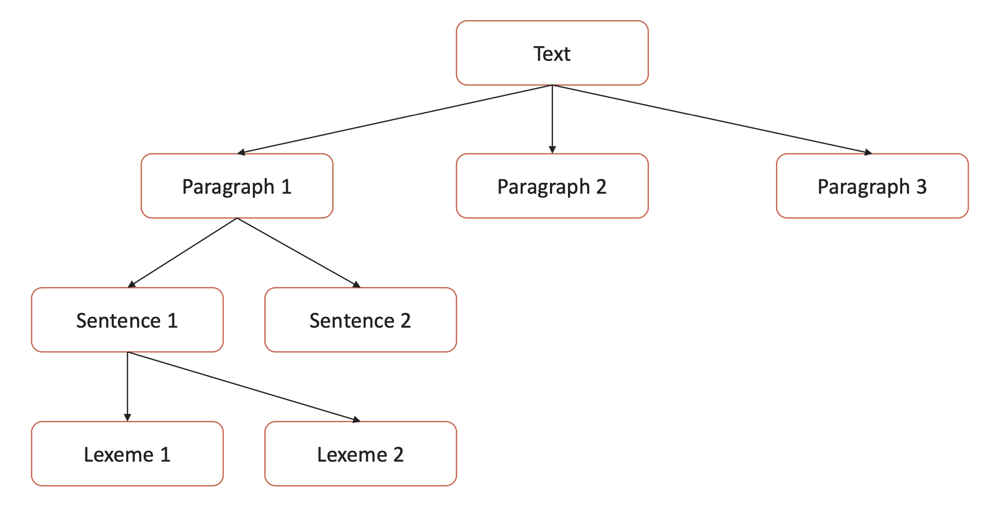

# Structural Design Patterns

## Adapter Pattern

Adapter pattern works as a bridge between two incompatible interfaces. This type of design pattern comes under
structural pattern as this pattern combines the capability of two independent interfaces.




### Adapter UML



### Example:

We have two interfaces and some implementations:

```java
public interface Duck {
    public void quack();

    public void fly();
}

public interface Turkey {
    public void gobble();

    public void fly();
}

public class MallardDuck implements Duck {
    @Override
    public void quack() {
        System.out.println("Quack");
    }

    @Override
    public void fly() {
        System.out.println("I'm flying");
    }
}

public class WildTurkey implements Turkey {
    @Override
    public void gobble() {
        System.out.println("Gobble gobble");
    }

    @Override
    public void fly() {
        System.out.println("I'm flying a short distance");
    }
}
```

### Apply Adapter pattern

```java
public class TurkeyAdapter implements Duck {
    private Turkey turkey;

    public TurkeyAdapter(Turkey turkey) {
        this.turkey = turkey;
    }

    @Override
    public void quack() {
        turkey.gobble();
    }

    @Override
    public void fly() {
        for (int i = 0; i < 5; i++) {
            turkey.fly();
        }
    }
}
```

## Proxy

Proxy is a structural design pattern that provides an object that acts as a substitute for a real service object used by
a client.
A proxy receives client requests, does some work (access control, caching, etc.) and then passes the request to a
service object.


What problems can the Proxy design pattern solve?

1. The access to an object should be controlled.
2. Additional functionality should be provided when accessing an object.

When accessing sensitive objects, for example, it should be possible to check that clients have the needed access
rights.

What solution does the Proxy design pattern describe?  
Define a separate Proxy object that can be used as substitute for another object (Subject) and implements additional
functionality to control the access to this subject.
This makes it possible to work through a Proxy object to perform additional functionality when accessing a subject.
For example, to check the access rights of clients accessing a sensitive object.  
To act as substitute for a subject, a proxy must implement the Subject interface. Clients can't tell whether they work
with a subject or its proxy.

```java
public interface Car {
    void driveCar();
}

public class RealCar implements Car {
    @Override
    public void driveCar() {
        System.out.println("Car has been driven!");
    }
}

public class ProxyCar implements Car {
    private Driver driver;
    private RealCar car;

    public ProxyCar(Driver driver) {
        this.driver = driver;
        car = new RealCar();
    }

    @Override
    public void driveCar() {
        if (driver.getAge() < 18) {
            System.out.println("The driver is too young to drive!");
        } else {
            car.driveCar();
        }
    }
}

public class Driver {
    private int age;

    public Driver(int age) {
        this.age = age;
    }
    // getters and setters
}

public class Main {
    public static void main(String[] args) {
        Car car = new ProxyCar(new Driver(15));
        car.driveCar();

        car = new ProxyCar(new Driver(20));
        car.driveCar();
    }
}
```

Output:
> The driver is too young to drive!  
> Car has been driven!

## Facade

Facade pattern hides the complexities of the system and provides an interface to the client using which the client can
access the system.
This type of design pattern comes under structural pattern as this pattern adds an interface to existing system to hide
its complexities.
This pattern involves a single class which provides simplified methods required by client and delegates calls to methods
of existing system classes.

### Facade UML and Sequence diagrams


**Facade Design Pattern Important Points:**

1. Facade design pattern is more like a helper for client applications, it doesn’t hide subsystem interfaces from the
   client. Whether to use Facade or not is completely dependent on client code.
2. Facade design pattern can be applied at any point of development, usually when the number of interfaces grow and
   system gets complex.
3. Subsystem interfaces are not aware of Facade, and they shouldn’t have any reference of the Facade interface.
4. Facade design pattern should be applied for similar kind of interfaces, its purpose is to provide a single interface
   rather than multiple interfaces that does the similar kind of jobs.
5. We can use Factory pattern with Facade to provide better interface to client systems.

### Example:

```java
public class HomeTheaterFacade {
    private Amplifier amplifier;
    private Tuner tuner;
    private DvdPlayer dvdPlayer;
    private CdPlayer cdPlayer;
    private Projector projector;
    private TheaterLights lights;
    private Screen screen;
    private PopcornPopper popper;

    public HomeTheaterFacade(Amplifier amplifier,
                             Tuner tuner,
                             DvdPlayer dvdPlayer,
                             CdPlayer cdPlayer,
                             Projector projector,
                             TheaterLights lights,
                             TheaterLights lights,
                             Screen screen,
                             PopcornPopper popper) {
        this.amplifier = amplifier;
        this.tuner = tuner;
        this.dvdPlayer = dvdPlayer;
        this.cdPlayer = cdPlayer;
        this.projector = projector;
        this.lights = lights;
        this.screen = screen;
        this.popper = popper;
    }

    public void watchMovie(String movie) {
        popper.on();
        popper.pop();
        lights.dim(10);
        screen.down();
        projector.on();
        projector.wideScreenMode();
        amplifier.on();
        amplifier.setDvd(dvdPlayer);
        amplifier.setSurroundSound();
        amp.setVolume(5);
        dvdPlayer.on();
        dvdPlayer.play(movie);
    }

    public void endMovie() {
        popper.off();
        lights.on();
        screen.up();
        projector.off();
        amplifier.off();
        dvdPlayer.stop();
        dvdPlayer.eject();
        dvdPlayer.off();
    }
}
```

## Composite

Composite pattern is used where we need to treat a group of objects in similar way as a single object. Composite pattern
composes objects in term of a tree structure to represent part as well as whole hierarchy.
This type of design pattern comes under structural pattern as this pattern creates a tree structure of group of objects.
This pattern creates a class that contains group of its own objects. This class provides ways to modify its group of
same objects.

**Component**:

- is the abstraction for all components, including composite ones
- declares the interface for objects in the composition
- (optional) defines an interface for accessing a component's parent in the recursive structure, and implements it if
  that's appropriate

**Leaf**:

- represents leaf objects in the composition
- implements all Component methods

**Composite**:

- represents a composite Component (component having children)
- implements methods to manipulate children
- implements all Component methods, generally by delegating them to its children

### Example, how we can use composite pattern:



```java
public interface Component {
    void operation();

    void add(Component c);

    void remove(Component c);

    Object getChild(int index);
}

public class Composite implements Component {
    private List<Component> components = new ArrayList<Component>();

    @Override
    public void operation() {
        System.out.println("Composite -> Call children operations");
        int size = components.size();
        for (Component component : components) {
            component.operation();
        }
    }

    @Override
    public void add(Component component) {
        System.out.println("Composite -> Adding component");
        components.add(component);
    }

    @Override
    public void remove(Component component) {
        System.out.println("Composite -> Removing component");
        components.remove(component);
    }

    @Override
    public Object getChild(int index) {
        System.out.println("Composite -> Getting component");
        return components.get(index);
    }
}

public class Leaf implements Component {
    @Override
    public void operation() {
        System.out.println("Leaf -> Performing operation");
    }

    @Override
    public void add(Component c) {
        System.out.println("Leaf -> add. Doing nothing");
// generate an exception or return false if method is not 'void'
    }

    @Override
    public void remove(Component c) {
        System.out.println("Leaf -> remove. Doing nothing");
// generate an exception or return false if method is not 'void'
    }

    public Object getChild(int index) {
        throw new UnsupportedOperationException();
    }
}
```
