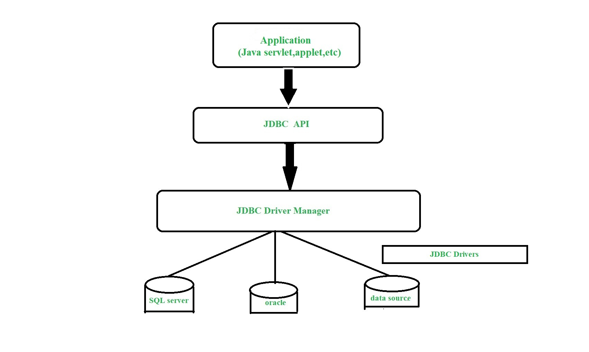
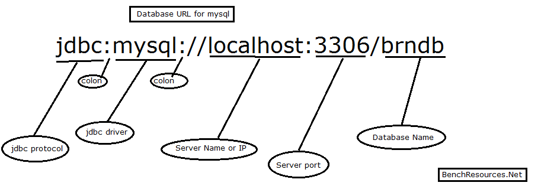

## JDBC.

___
___

### Introduction to JDBC (Java Database Connectivity)

Java Database Connectivity (JDBC) is an application programming interface (API) for the programming language Java, which
defines how a client may access a database. It is a Java-based data access technology used for Java database
connectivity. It is part of the Java Standard Edition platform, from Oracle Corporation. It provides methods to query
and update data in a database, and is oriented toward relational databases. A JDBC-to-ODBC bridge enables connections to
any ODBC-accessible data source in the Java virtual machine (JVM) host environment.

### Definition of JDBC(Java Database Connectivity)

JDBC is an API(Application programming interface) used in java programming to interact with databases. The classes and
interfaces of JDBC allow the application to send requests made by users to the specified database.

### Components of JDBC

There are generally four main components of JDBC through which it can interact with a database. They are as mentioned
below:

1. JDBC API: It provides various methods and interfaces for easy communication with the database. It provides two
   packages as follows, which contain the java SE and Java EE platforms to exhibit WORA(write once run anywhere)
   capabilities.

The JDBC API is comprised of two packages:

````java
java.sql 
javax.sql
````

You automatically get both packages when you download the Java Platform Standard Edition.

2. It also provides a standard to connect a database to a client application.

3. JDBC Driver manager: It loads a database-specific driver in an application to establish a connection with a database.
   It is used to make a database-specific call to the database to process the user request.

4. JDBC Test suite: It is used to test the operation(such as insertion, deletion, updation) being performed by JDBC
   Drivers.

5. JDBC-ODBC Bridge Drivers: It connects database drivers to the database. This bridge translates the JDBC method call
   to the ODBC function call. It makes use of the sun.jdbc.odbc package which includes a native library to access ODBC
   characteristics.

### Architecture of JDBC



Description:

1. Application: It is a java applet or a servlet that communicates with a data source.
2. The JDBC API: The JDBC API allows Java programs to execute SQL statements and retrieve results. Some of the important
   classes and interfaces defined in JDBC API are as follows:
3. DriverManager: It plays an important role in the JDBC architecture. It uses some database-specific drivers to
   effectively connect enterprise applications to databases.
4. JDBC drivers: To communicate with a data source through JDBC, you need a JDBC driver that intelligently communicates
   with the respective data source. JDBC Driver is a software component that enables java application to interact with
   the database. There are 4 types of JDBC drivers:
    - JDBC-ODBC bridge driver
    - Native-API driver (partially java driver)
    - Network Protocol driver (fully java driver)
    - Thin driver (fully java driver)

### Types of JDBC Architecture(2-tier and 3-tier)

The JDBC architecture consists of two-tier and three-tier processing models to access a database. They are as described
below:

1. Two-tier model: A java application communicates directly to the data source. The JDBC driver enables the
   communication between the application and the data source. When a user sends a query to the data source, the answers
   for those queries are sent back to the user in the form of results. The data source can be located on a different
   machine on a network to which a user is connected. This is known as a client/server configuration, where the user’s
   machine acts as a client, and the machine has the data source running acts as the server.

2. Three-tier model: In this, the user’s queries are sent to middle-tier services, from which the commands are again
   sent to the data source. The results are sent back to the middle tier, and from there to the user. This type of model
   is found very useful by management information system directors.

### Java Database Connectivity with 5 Steps

There are 5 steps to connect any java application with the database using JDBC. These steps are as follows:

1. Register the Driver class
2. Create connection
3. Create statement
4. Execute queries
5. Close connection

#### 1.Register the driver class

The forName() method of Class class is used to register the driver class. This method is used to dynamically load the
driver class. Syntax of forName() method

```java
public static void forName(String className)throws ClassNotFoundException;

        Class.forName("oracle.jdbc.driver.OracleDriver");  
```

_Note: Since JDBC 4.0, explicitly registering the driver is optional. We just need to put vender's Jar in the classpath,
and then JDBC driver manager can detect and load the driver automatically._

#### 2.Create connection

The getConnection() method of DriverManager class is used to establish connection with the database.

A Connection is a session between a Java application and a database. It helps to establish a connection with the database.

The Connection interface is a factory of Statement, PreparedStatement, and DatabaseMetaData, i.e., an object of Connection can be used to get the object of Statement and DatabaseMetaData. 

The Connection interface provide many methods for transaction management like commit(), rollback(), setAutoCommit(), setTransactionIsolation(), etc.

Syntax of getConnection() method

```java
public static Connection getConnection(String url)throws SQLException
public static Connection getConnection(String url, String name, String password)throws SQLException
public static Connection getConnection(String url, java.util.Properties info)
```

Example to establish connection with the Oracle database

```java
Connection con=DriverManager.getConnection(
        "jdbc:mysql://localhost:3306:brndb","system","password");  
```



Commonly used methods of Connection interface:
1) public Statement createStatement(): creates a statement object that can be used to execute SQL queries.

2) public Statement createStatement(int resultSetType,int resultSetConcurrency): Creates a Statement object that will generate ResultSet objects with the given type and concurrency.

3) public void setAutoCommit(boolean status): is used to set the commit status. By default, it is true.

4) public void commit(): saves the changes made since the previous commit/rollback is permanent.

5) public void rollback(): Drops all changes made since the previous commit/rollback.

6) public void close(): closes the connection and Releases a JDBC resources immediately.

#### 3.Create statement
The createStatement() method of Connection interface is used to create statement. The object of statement is responsible to execute queries with the database.

Syntax of createStatement() method
```java
public Statement createStatement()throws SQLException 
```
Example to create the statement object
```java
Statement stmt=con.createStatement();  
```
The Statement interface provides methods to execute queries with the database. The statement interface is a factory of ResultSet i.e. it provides factory method to get the object of ResultSet.

The important methods of Statement interface are as follows:

1) public ResultSet executeQuery(String sql): is used to execute SELECT query. It returns the object of ResultSet.
2) public int executeUpdate(String sql): is used to execute specified query, it may be create, drop, insert, update, delete etc.
3) public boolean execute(String sql): is used to execute queries that may return multiple results.
4) public int[] executeBatch(): is used to execute batch of commands.

The send SQL instructions to the database, we can use instances of type Statement, PreparedStatement, or CallableStatement, which we can obtain using the Connection object.

Both Statement and PreparedStatement can be used to execute SQL queries. These interfaces look very similar. However, they differ significantly from one another in features and performance:

Statement – Used to execute string-based SQL queries
PreparedStatement – Used to execute parameterized SQL queries
CallableStatement - The interface used to execute SQL stored procedures.

1. The Statement interface contains the essential functions for executing SQL commands.

First, let's create a Statement object:

```java
String sqlQueryCreate = "CREATE TABLE IF NOT EXISTS employees";

try (Statement stmt = con.createStatement()) {
        stmt.execute(sqlQueryCreate);
}
```

We can retrieve the records from the table using the executeQuery() method which returns an object of type ResultSet:

```java
String selectSql = "SELECT * FROM employees"; 
try (ResultSet resultSet = stmt.executeQuery(selectSql)) {
    // use resultSet here
}
```

Again, we should work with Statements inside a try-with-resources block for automatic resource management.

Anyway, executing SQL instructions can be done through the use of three methods:

executeQuery() for SELECT instructions
executeUpdate() for updating the data or the database structure
execute() can be used for both cases above when the result is unknown

We should make sure to close the ResultSet instances after use. Otherwise, we may keep the underlying cursor open for a much longer period than expected. To do that, it's recommended to use a try-with-resources block, as in our example above.

2. PreparedStatement objects contain precompiled SQL sequences. They can have one or more parameters denoted by a question mark.

Let's create a PreparedStatement which updates records in the employees table based on given parameters:

```java
String updatePositionSql = "UPDATE employees SET position=? WHERE emp_id=?";
try (PreparedStatement pstmt = con.prepareStatement(updatePositionSql)) {
        pstmt.setString(1, "lead developer");
        pstmt.setInt(2, 1);
        int rowsAffected = pstmt.executeUpdate();
        
}
```

To add parameters to the PreparedStatement, we can use simple setters – setX() – where X is the type of the parameter, and the method arguments are the order and value of the parameter.
The statement is executed with one of the same three methods described before: executeQuery(), executeUpdate(), execute() without the SQL String parameter.

3. The CallableStatement interface allows calling stored procedures.

To create a CallableStatement object, we can use the prepareCall() method of Connection:

```java
String preparedSql = "{call insertEmployee(?,?,?,?)}";
try (CallableStatement cstmt = con.prepareCall(preparedSql)) {
        cstmt.setString(2, "ana");
        cstmt.setString(3, "tester");
        cstmt.setDouble(4, 2000);
        cstmt.registerOutParameter(1, Types.INTEGER);
        cstmt.execute();
        int new_id = cstmt.getInt(1);
}
```
Setting input parameter values for the stored procedure is done like in the PreparedStatement interface, using setX() methods.
If the stored procedure has output parameters, we need to add them using the registerOutParameter() method.

#### 4.Execute queries

The executeQuery() method of Statement interface is used to execute queries to the database. This method returns the object of ResultSet that can be used to get all the records of a table.

Syntax of executeQuery() method:

```java
public ResultSet executeQuery(String sql)throws SQLException  
```

After executing a query, the result is represented by a ResultSet object, which has a structure similar to a table, with lines and columns.

The ResultSet uses the next() method to move to the next line.

Let's first create an Employee class to store our retrieved records:

```java
public class Employee {
    private int id;
    private String name;
    private String position;
    private double salary;
 
    // standard constructor, getters, setters
}
```
Next, let's traverse the ResultSet and create an Employee object for each record:

```java
String selectSql = "SELECT * FROM employees"; 
try (ResultSet resultSet = stmt.executeQuery(selectSql)) {
    List<Employee> employees = new ArrayList<>(); 
    while (resultSet.next()) { 
        Employee emp = new Employee(); 
        emp.setId(resultSet.getInt("emp_id")); 
        emp.setName(resultSet.getString("name")); 
        emp.setPosition(resultSet.getString("position")); 
        emp.setSalary(resultSet.getDouble("salary")); 
        employees.add(emp); 
    }
}
```

Retrieving the value for each table cell can be done using methods of type getX() where X represents the type of the cell data.

The getX() methods can be used with an int parameter representing the order of the cell, or a String parameter representing the name of the column. The latter option is preferable in case we change the order of the columns in the query.

To navigate this type of ResultSet, we can use one of the methods:

- first(), last(), beforeFirst(), beforeLast() – to move to the first or last line of a ResultSet or to the line before these
- next(), previous() – to navigate forward and backward in the ResultSet
- getRow() – to obtain the current row number
- moveToInsertRow(), moveToCurrentRow() – to move to a new empty row to insert and back to the current one if on a new row
- absolute(int row) – to move to the specified row
- relative(int nrRows) – to move the cursor the given number of rows

Updating the ResultSet can be done using methods with the format updateX() where X is the type of cell data. These methods only update the ResultSet object and not the database tables.

To persist the ResultSet changes to the database, we must further use one of the methods:

- updateRow() – to persist the changes to the current row to the database
- insertRow(), deleteRow() – to add a new row or delete the current one from the database
- refreshRow() – to refresh the ResultSet with any changes in the database
- cancelRowUpdates() – to cancel changes made to the current row

Let's take a look at an example of using some of these methods by updating data in the employee's table:

```java
try (Statement updatableStmt = con.createStatement(
  ResultSet.TYPE_SCROLL_INSENSITIVE, ResultSet.CONCUR_UPDATABLE)) {
    try (ResultSet updatableResultSet = updatableStmt.executeQuery(selectSql)) {
        updatableResultSet.moveToInsertRow();
        updatableResultSet.updateString("name", "mark");
        updatableResultSet.updateString("position", "analyst");
        updatableResultSet.updateDouble("salary", 2000);
        updatableResultSet.insertRow();
    }
}
```

#### 5.Close the connection object

By closing connection object statement and ResultSet will be closed automatically. The close() method of Connection interface is used to close the connection.

Syntax of close() method:

```java
public void close()throws SQLException  
```

When we're no longer using it, we need to close the connection to release database resources.

We can do this using the close() API:

```java
con.close();
```

However, if we're using the resource in a try-with-resources block, we don't need to call the close() method explicitly, as the try-with-resources block does that for us automatically.

The same is true for the Statements, PreparedStatements, CallableStatements, and ResultSets.