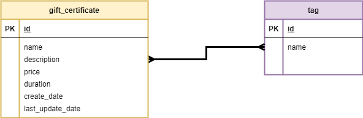

# REST API Basics

## READING

1. [Getting started with Spring Core. Reading (30 mins)](https://www.manning.com/books/spring-in-action-fourth-edition) 
2. [Getting started with Spring Core. Reading (25 mins)](https://www.tutorialspoint.com/spring/spring_beans_autowiring.htm) 
3. [Getting started with Spring MVC. Reading (30 mins)](https://www.manning.com/books/spring-in-action-fourth-edition) 
4. [Best practices for REST API design. Reading (10 mins)](https://hackernoon.com/restful-api-designing-guidelines-the-best-practices-60e1d954e7c9) 
5. [Spring Web Application Structure. Reading (20 mins)](https://www.petrikainulainen.net/software-development/design/understanding-spring-web-application-architecture-the-classic-way/) 
6. [Create REST API with Spring MVC. Reading (30 mins)](https://livebook.manning.com/#!/book/spring-in-action-fourth-edition/chapter-16)
7. [Connection Pool (10 mins)](https://habr.com/ru/post/101342/)
8. [Testing. Well-known approaches (10 mins)](https://habr.com/ru/post/81226/) 
9. [JUnit (overview guid)](https://junit.org/junit5/docs/current/user-guide/)

## Practice

### Task

#### Recommended Timeline
The recommended timeline for the whole module is 2 weeks.

#### Business requirements
1. Develop web service for Gift Certificates system with the following entities (many-to-many):
\
    - *CreateDate*, *LastUpdateDate* - format *ISO 8601* (https://en.wikipedia.org/wiki/ISO_8601). Example: 2018-08-29T06:12:15.156. More discussion here: https://stackoverflow.com/questions/3914404/how-to-get-current-moment-in-iso-8601-format-with-date-hour-and-minute 
    - *Duration* - in days (expiration period)
2. The system should expose REST APIs to perform the following operations:
    - CRUD operations for GiftCertificate. If new tags are passed during creation/modification – they should be created in the DB. For update operation - update only fields, that pass in request, others should not be updated. Batch insert is out of scope.
    - CRD operations for Tag.
    - Get certificates with tags (all params are optional and can be used in conjunction):
        - by tag name (ONE tag)
        - search by part of name/description (can be implemented, using DB function call)
        - sort by date or by name ASC/DESC (extra task: implement ability to apply both sort type at the same time).

#### Application requirements

1. JDK version: 8 – use Streams, java.time.*, etc. where it is possible. (the JDK version can be increased in agreement with the mentor/group coordinator/run coordinator) 
2. Application packages root: com.epam.esm
3. Any widely-used connection pool could be used. 
4. JDBC / Spring JDBC Template should be used for data access. 
5. Use transactions where it’s necessary. 
6. Java Code Convention is mandatory (exception: margin size – 120 chars). 
7. Build tool: Maven/Gradle, latest version. Multi-module project. 
8. Web server: Apache Tomcat/Jetty. 
9. Application container: Spring IoC. Spring Framework, the latest version. 
10. Database: PostgreSQL/MySQL, latest version.
11. Testing: JUnit 5.+, Mockito. 
12. Service layer should be covered with unit tests not less than 80%. 
13. Repository layer should be tested using integration tests with an in-memory embedded database (all operations with certificates).    

#### General requirements

1. Code should be clean and should not contain any “developer-purpose” constructions.  
2. App should be designed and written with respect to OOD and SOLID principles. 
3. Code should contain valuable comments where appropriate. 
4. Public APIs should be documented (Javadoc). 
5. Clear layered structure should be used with responsibilities of each application layer defined.  
6. JSON should be used as a format of client-server communication messages.  
7. Convenient error/exception handling mechanism should be implemented: all errors should be meaningful and localized on backend side. Example: handle 404 error: 

        • HTTP Status: 404
        • response body    
        • {
        • “errorMessage”: “Requested resource not found (id = 55)”,
        • “errorCode”: 40401
        • }
         
    where *errorCode” is your custom code (it can be based on http status and requested resource - certificate or tag) 
8. Abstraction should be used everywhere to avoid code duplication. 
9. Several configurations should be implemented (at least two - dev and prod).

#### Application restrictions

It is forbidden to use:
1. Spring Boot.
2. Spring Data Repositories.
3. JPA.
4. Powermock (your application should be testable).

Mentee can use lombok when agreed with mentor.

## Demo
### Practical part

1. Demonstrate API using Postman tool (prepare for demo Postman collection with APIs) 
2. (Optional) Build & run application using command line

### Theoretical part

Mentee should be able to answer questions during demo session.

## Extra Materials

1. **Java 8**
   * **Overview**
     * https://oz.by/books/more10885929.html - Java SE 8 by Cay S. Horstmann (Book I and II)
     *	https://www.amazon.com/OCP-Certified-Professional-Programmer-1Z0-809/dp/1119067901 - Chapter 3 “Generics and Collections” (“Additions in Java 8” section, Page 152)
   * **Functional Interfaces**
     *	https://docs.oracle.com/javase/specs/ - The Java Language Specification, Java SE 8 Edition, Chapter 9.8 “Functional Interfaces” (Page 321)
     *	https://docs.oracle.com/javase/specs/ - The Java Language Specification, Java SE 8 Edition, Chapter 9.9 Function Types (Page 325)
     *	http://tutorials.jenkov.com/java-functional-programming/index.html - Java Functional Programming from Chapter 1 to 4 (Java Functional Programming, Java Higher Order Functions, Java Functional Interfaces, Java Functional Composition) 
     *	https://www.amazon.com/OCP-Certified-Professional-Programmer-1Z0-809/dp/1119067901 - Chapter 4 “Functional Programming” (Page 171 to “Checking Functional Interfaces” section, Page 182)
   * **Lambdas, Method references**
     *	https://docs.oracle.com/javase/specs/ - The Java Language Specification, Java SE 8 Edition, Chapter 15.27 “Lambda Expressions” (page 601)
   * **1.3.Stream API**
     *	https://www.amazon.com/OCP-Certified-Professional-Programmer-1Z0-809/dp/1119067901 - Chapter 4 “Functional Programming” (From “Using Strebams” section, Page 185 – 223)
     *	http://tutorials.jenkov.com/java-functional-programming/streams.html - Chapter 5 (Java Stream API)
     *	https://habr.com/ru/company/luxoft/blog/270383/ - Java Stream API Overview
    * **Optional**
      *	https://www.amazon.com/OCP-Certified-Professional-Programmer-1Z0-809/dp/1119067901 - Chapter 4 “Functional Programming” (“Returning Optional” section, Page 182)
      *	https://habr.com/ru/post/346782/
    * **Date/Time API, TemporalAdjuster**
      *	https://www.amazon.com/OCP-Certified-Professional-Programmer-1Z0-809/dp/1119067901 - Chapter 5 “Dates, Strings, and Localization” (“Working with Dates And Times” section, Page 286) 
      *	https://habr.com/ru/post/274905/
      *	https://www.baeldung.com/java-8-date-time-intro
2. **Coding best practices**
    * **Overview**
      *	https://www.amazon.com/Clean-Code-Handbook-Software-Craftsmanship/dp/0132350882 - “Clean Code” by Robert C. Martin
      *	https://www.youtube.com/watch?v=otrfSgeK3JI – good lection about Clean Code
      *	https://learn.epam.com/detailsPage?id=1ad7fd02-311b-4b96-845d-599b177ad928 – course on eLearning portal
    * **Java Code Convention**
      *	https://www.oracle.com/technetwork/java/codeconventions-150003.pdf
      *	https://medium.com/@thusharaj/java-code-convention-simplified-f476bd8aa719
    * **OOD, SOLID, YAGNI, DRY principles**
      *	https://www.baeldung.com/solid-principles - SOLID Principles
      *	https://youtu.be/rtmFCcjEgEw - lection by Katerina Trajchevska
             Transcription:
             1. Single Responsibility Principle: 7:04
             2. Open/Closed Principle: 13:53
             3. Liskov Substitution Principle: 20:42
             4. Interface Segregation Principle: 27:18
             5. Dependency Inversion Principle: 31:21
      *	https://habr.com/ru/post/348286/ - article in Russian about SOLID
      *	https://habr.com/ru/post/144611/  - article about principles	
    * **Comments best practice**
      *	https://dzone.com/articles/5-best-practices-commenting
      *	https://javarevisited.blogspot.com/2011/08/code-comments-java-best-practices.html
3. **Exception handling**
   * **Overview**
     *	https://oz.by/books/more10885929.html - Java SE 8 by Cay S. Horstmann (Book I) or Java SE 7 by Cay S. Horstmann (Book I), Chapter “Exception Handling”
     *	https://www.amazon.com/OCP-Certified-Professional-Programmer-1Z0-809/dp/1119067901 - Chapter 5 “Dates, Strings, and Localization” (“Working with Dates And Times” section, Page 286) 
     *	https://www.amazon.com/OCP-Certified-Professional-Programmer-1Z0-809/dp/1119067901 - Chapter 6 “Exceptions and Assertions”, Page 283
     *	https://learn.epam.com/detailsPage?id=be65b7d2-7fb0-45dc-9d1c-db8e2b84a37f – course on eLearning portal
   * **Checked vs. Runtime (Unchecked) Exceptions**
     *	https://www.amazon.com/OCP-Certified-Professional-Programmer-1Z0-809/dp/1119067901 - Chapter 6 “Exceptions and Assertions”, Page 283 (“Categories of Exceptions” section, Page 285)
     *	https://www.geeksforgeeks.org/checked-vs-unchecked-exceptions-in-java/
     *	https://howtodoinjava.com/java/exception-handling/checked-vs-unchecked-exceptions-in-java/
   * **Exception handling best practices**
     *	https://stackabuse.com/exception-handling-in-java-a-complete-guide-with-best-and-worst-practices/
     *	https://dzone.com/articles/9-best-practices-to-handle-exceptions-in-java
     *	https://howtodoinjava.com/best-practices/java-exception-handling-best-practices/
4. **Layered Architecture**
     * https://teams.microsoft.com/l/file/F2772F35-D74A-43EC-B9BA-2E72724C0550?tenantId=b41b72d0-4e9f-4c26-8a69-f949f367c91d&fileType=pptx&objectUrl=https%3A%2F%2Fepam.sharepoint.com%2Fsites%2FJavaEduPrograms%2FShared%20Documents%2FSchool%2FPilot%20run%2C%20May%202020%2FLayered_Arcitecture.pptx&baseUrl=https%3A%2F%2Fepam.sharepoint.com%2Fsites%2FJavaEduPrograms&serviceName=teams&threadId=19:a8c2e7c0a857429b9aafa5587f649beb@thread.skype&groupId=3cf270ee-6fd5-439c-9aa2-34c54596090d – Presentation about Layered Architecture
5. **Spring Framework**
   * **Overview:**
     *	https://www.youtube.com/watch?v=BmBr5diz8WA - Spring-потрошитель, часть 1
     *	https://www.youtube.com/watch?v=cou_qomYLNU - Spring-потрошитель, часть 2
     *	https://www.youtube.com/watch?v=nGfeSo52_8A -  Spring – Глубоко и не очень
   * **Spring Core: Wiring beans**
     *	https://www.manning.com/books/spring-in-action-fourth-edition
   * **Core concepts – Chapter 2: Wiring beans;**
   * **Core concepts –Chapter 3: Advanced Wiring;**
     *	https://www.tutorialspoint.com/spring/spring_beans_autowiring.htm
   * **Building Spring web applications: Spring MVC**
     *	https://www.manning.com/books/spring-in-action-fourth-edition
	      MVC –  Chapter 5: Building Spring web applications
	      MVC – Chapter 7: Advanced Spring MVC
6. **REST API Fundamentals**
   * **Overview:**
     * https://bookauthority.org/books/best-rest-api-books - list of books for additional learning
   * **RESTful Architecture**
     * https://www.vinaysahni.com/best-practices-for-a-pragmatic-restful-api
     * https://dzone.com/refcardz/rest-foundations-restful?chapter=1
   * **REST APIs with Spring**
     * https://www.manning.com/books/spring-in-action-fourth-edition
         REST – Chapter 16: Creating REST APIs with Spring
     * https://habr.com/ru/post/101342/
7. **Connection Pool**
    *	https://habr.com/ru/post/101342/
8. **Maven**
    *	https://maven.apache.org/guides/getting-started/maven-in-five-minutes.html
    *	https://habr.com/ru/post/77382/
    *	https://www.baeldung.com/maven
9. **Testing**
   * **Well-known approaches**
     * https://habr.com/ru/post/81226/
     * https://habr.com/ru/post/358950/
     * https://habr.com/ru/company/jugru/blog/323920/
     * https://www.petrikainulainen.net/programming/spring-framework/unit-testing-of-spring-mvc-controllers-rest-api/
   * **Junit**
     * https://habr.com/ru/post/120101
     * https://junit.org/junit4/
   * **Mockito**
     * https://www.journaldev.com/21816/mockito-tutorial
     * https://habr.com/ru/post/444982/
     * https://site.mockito.org/
     * https://www.petrikainulainen.net/programming/spring-framework/unit-testing-of-spring-mvc-controllers-configuration/
10. **Postman**
     * https://habr.com/ru/company/kolesa/blog/351250/