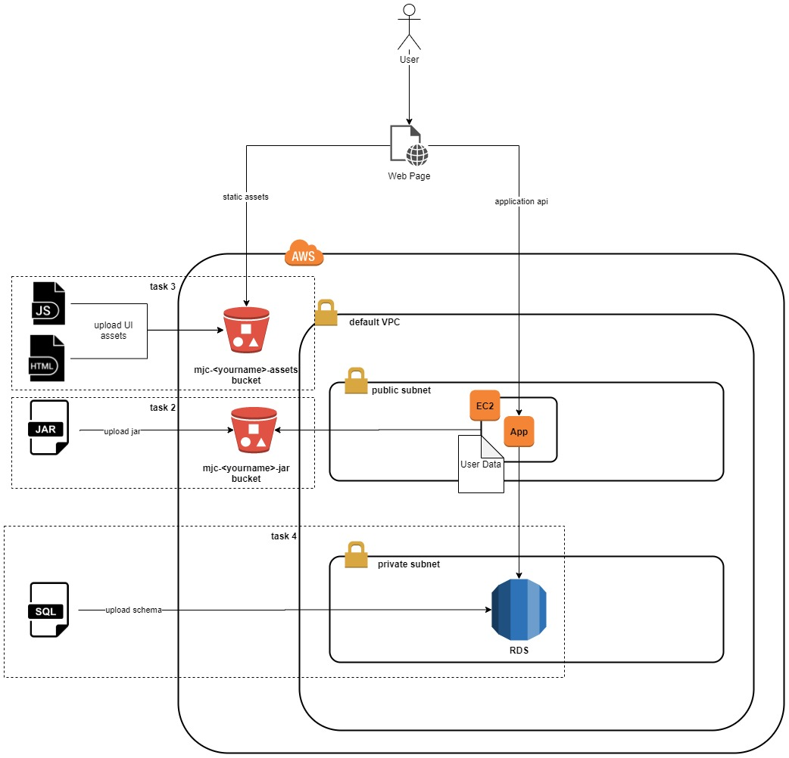

# AWS

## Materials

1. [Cloud Computing Fundamentals](https://youtu.be/uroryFU78gM)
2. [AWS Tutorial for Begginers](https://youtu.be/IT1X42D1KeA)
3. [AWS Identity and Access Management (IAM)](https://aws.amazon.com/iam/)
4. [Getting started with S3](https://docs.aws.amazon.com/AmazonS3/latest/gsg/GetStartedWithS3.html)
5. [Getting Started with Amazon RDS](https://docs.aws.amazon.com/AmazonRDS/latest/UserGuide/CHAP_GettingStarted.html)
6. [Tutorial: Getting started with Amazon EC2 Linux instances](https://docs.aws.amazon.com/AWSEC2/latest/UserGuide/EC2_GetStarted.html)
7. [Regions, Availability Zones, and Local Zones](https://docs.aws.amazon.com/AWSEC2/latest/UserGuide/using-regions-availability-zones.html)
8. [Running commands on your Linux instance at launch](https://docs.aws.amazon.com/AWSEC2/latest/UserGuide/user-data.html)
9. [Getting started with Amazon VPC](https://docs.aws.amazon.com/vpc/latest/userguide/vpc-getting-started.html)

## Practice

### Recommended Timeline
The recommended timeline for the whole module is 1 week.

### Task

The goal of the exercise to make your familiar with AWS console, base components available in AWS such as Virtual Private Cloud (VPC), Security Group, EC2, RDS and S3. You also are expected to deploy you application within cloud facilities: web application on top of EC2 instance and static assets within S3 bucket. It also required to integrate with managed database instance (RDS). The deployment flow is not expected to be fully automated and most provision is to be done manually.

1. AWS Account Creation
AWS gives you an option to create a free account to browse, discover and use the main services it offers.
To accomplish the  task follow the link [AWS Free Tier](https://aws.amazon.com/free) and complete registration.

2. Application Role Creation
In order to access S3 bucket from within your application deployed in EC2 you must make it under authorized identity.
The common approach is to assign a service role that we are to create beforehand.
     - Go to IAM section and navigate to Roles section.
     - Under the section Common use cases select EC2 and assign AmazonS3ReadOnlyAccess permission policy on Role.
     - Save just created Role.

3. Upload Application Jar to AWS S3
     - Create mjc-<yourname>-jar S3 bucket.
     - Make sure the bucket is available for the role created on the step above only. It might be achieved through Bucket Policy.
     - Upload your application jar file to the newly created bucket.

4. Launch RDS instance
     - Start launching RDS instance available within Free Tier (MySQL or PostgreSQL).
     - Select default VPC, Subnet and Security Group. 
     - Make sure Security Group is configured to permit access by port your database is running on.
     - Configure your database with application specific data: schema, tables, data.
5. Launch EC2 instance
     - Start launching t2.micro EC2 instance based on Amazon Linux 2 image with default VPC settings. 
     - Assign the Role created in step 2.
     - Within User Data section add the script that downloads your application from S3 bucket and launchs it. Use aws cli command: aws s3 cp s3://BUCKET-NAME/FILENAME . 
     - In security group settings open the port your application will be running on.
*6. Terminate or remove all created resources/services once you finished the module and showed a demo.*

#### General requirements

Before starting the module please make sure you understand the principles of AWS cloud pricing. Pay attention to resources that you create, the module should be accomplished using AWS Free Tier. It's your responsibility to take care of the costs minimization. If you are not sure about the costs of some resource/service please contact your mentor. Please never commit your account credentials into the git. Do not keep EC2 instances running, stop or terminate instances if you don’t use them.

## Demo
### Practical part

[upd]

### Theoretical part

Mentee should be able to answer questions during demo session.

## Extra Materials

1. [AWS Official Documentation](https://docs.aws.amazon.com/index.html)
2. [AWS Essentials](https://www.youtube.com/playlist?list=PLv2a_5pNAko0Mijc6mnv04xeOut443Wnk)
3. [AWS Concepts](https://www.youtube.com/playlist?list=PLv2a_5pNAko2Jl4Ks7V428ttvy-Fj4NKU)
4. [Best Practices in IAM](https://docs.aws.amazon.com/IAM/latest/UserGuide/best-practices.html)
5. [Amazon S3](https://aws.amazon.com/s3/)
6. [Amazon Relational Database Service (RDS)](https://aws.amazon.com/rds/)
7. [Amazon EC2](https://aws.amazon.com/ec2/)
8. [Setting up with Amazon EC2](https://docs.aws.amazon.com/AWSEC2/latest/UserGuide/get-set-up-for-amazon-ec2.html)
9. [Amazon Virtual Private Cloud](https://aws.amazon.com/vpc/)
10. [What is Amazon VPC?](https://docs.aws.amazon.com/vpc/latest/userguide/what-is-amazon-vpc.html)
11. [Examples for VPC](https://docs.aws.amazon.com/vpc/latest/userguide/VPC_Scenarios.html)
12. [Elastic IP addresses](https://docs.aws.amazon.com/AWSEC2/latest/UserGuide/elastic-ip-addresses-eip.html)