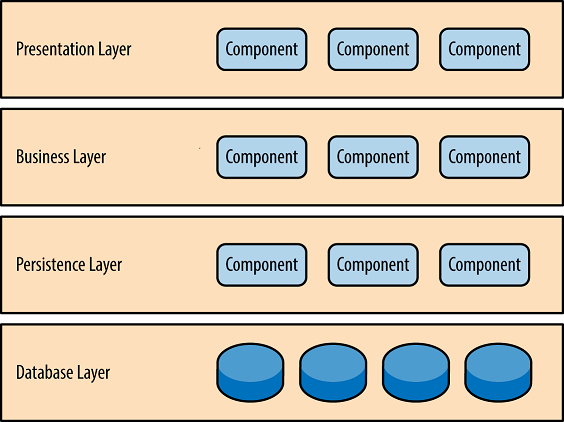
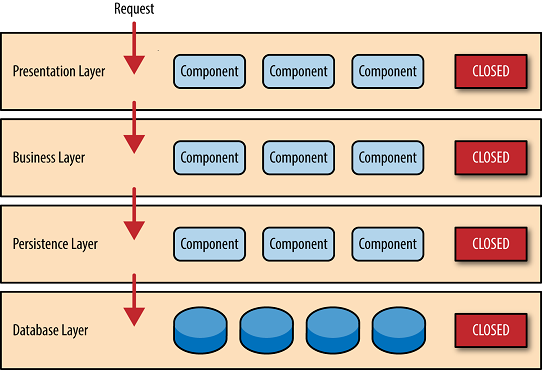
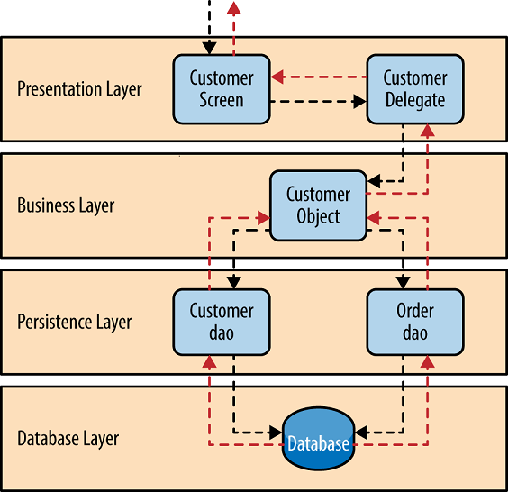

# Layered Architecture

## Materials
+ Pattern Description
+ Key Concepts
+ Pattern Example
+ Architecture sinkhole anti-pattern
+ Summary

## Pattern Description

Layered architecture patterns are n-tier patterns where the components are organized in horizontal layers and each layer has a specific role in the application (e.g. presentation logic or business logic). It means to be self-independent. All components should be interconnected, but not dependent on each other.

Although the layered architecture pattern does not specify the number and types of layers that must exist in the pattern, most layered architectures consist of four standard layers: presentation, business, persistence, and database.

In some cases, the business layer and persistence layer are combined into a single business layer, particularly when the persistence logic (e.g. SQL or HSQL) is embedded within the business layer components. Thus, smaller applications may have only three layers, whereas larger and more complex business applications may contain five or more layers.

One of the powerful features of the layered architecture pattern is the separation of concerns among components. Components within a specific layer deal only with logic that pertains to that layer. For example, components in the presentation layer deal only with presentation logic, whereas components residing in the business layer deal only with business logic. This type of component classification makes it easy to build effective roles and responsibility models into architecture, and also makes it easy to develop, test and maintain applications.

## Key Concepts
Each level in the architecture marked as closed. This is a very important concept in the layered architecture pattern. A closed layer means that as a request moves from layer to layer, it must go through the layer right below it to get to the next layer below that one. For example, a request originating from the presentation layer must first go through the business layer and then to the persistence layer before finally hitting the database layer. 

So why not allow the presentation layer direct access to either the persistence layer or database layer? After all, direct database access from the presentation layer is much faster than going through a bunch of unnecessary layers just to retrieve or save database information. The answer to this question lies in a key concept known as **_layers of isolation_**.

The **_layers of isolation_** concept means that changes made in one layer of the architecture generally don't impact or affect components in other layers. For example, If you allow the presentation layer direct access to the persistence layer, then changes made to SQL within the persistence layer would impact both the business layer and the presentation layer, thereby producing a very tightly coupled application with lots of interdependencies between components. This type of architecture then becomes very hard and expensive to change.
The **_layers of isolation_** concept also means that each layer is independent of the other layers, thereby having little or no knowledge of the inner workings of other layers in the architecture.

Sometimes there are cases when layers can be opened and called directly, but we will not cover it in the scope of this lesson.

## Pattern Example
Consider a request from a business user to get customer information for a specific person.

The customer screen is responsible for accepting the request and displaying the customer information. It does not know where the data is, how it is retrieved, or how many database tables must be queries to get the data. 

Once the customer screen receives a request to get customer information for a particular individual, it then forwards that request onto the customer delegate module.

This module is responsible for knowing which modules in the business layer can process that request and also how to get to that module and what data it needs. 

The customer object in the business layer is responsible for aggregating all of the information needed by the business request.

This module calls out to the customer dao (data access object) module in the persistence layer to get customer data, and also the order dao module to get order information. 

These modules in turn execute SQL statements to retrieve the corresponding data and pass it back up to the customer object in the business layer. Once the customer object receives the data, it aggregates the data and passes that information back up to the customer delegate, which then passes that data to the customer screen to be presented to the user.

## Architecture sinkhole anti-pattern

This anti-pattern describes the situation where requests flow through multiple layers of the architecture as simple pass-through processing with little or no logic performed within each layer.

For example, assume the presentation layer responds to a request from the user to retrieve customer data. The presentation layer passes the request to the business layer, which simply passes the request to the persistence layer, which then makes a simple SQL call to the database layer to retrieve the customer data. The data is then passed all the way back up the stack with no additional processing or logic to aggregate, calculate, or transform the data. 

Every layered architecture will have at least some scenarios that fall into the architecture sinkhole anti-pattern. The key, however, is to analyze the percentage of requests that fall into this category. The 80-20 rule is usually a good practice to follow to determine whether or not you are experiencing the architecture sinkhole anti-pattern. It is typical to have around 20 percent of the requests as simple pass-through processing and 80 percent of the requests having some business logic associated with the request. However, if you find that this ratio is reversed and a majority of your requests are simple pass-through processing, you might want to consider making some of the architecture layers open, keeping in mind that it will be more difficult to control change due to the lack of layer isolation. 

## Summary
The layered architecture pattern is a solid general-purpose pattern, making it a good starting point for most applications, particularly when you are not sure what architecture pattern is best suited for your application.

