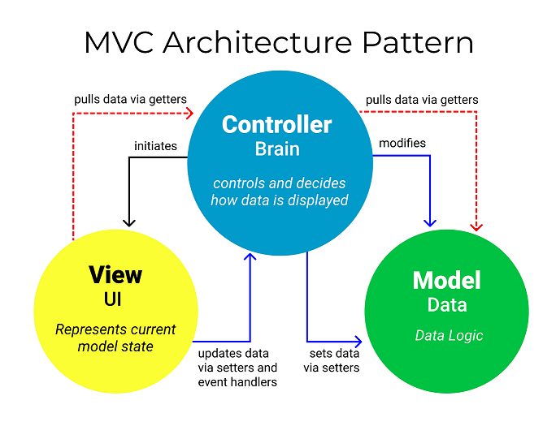
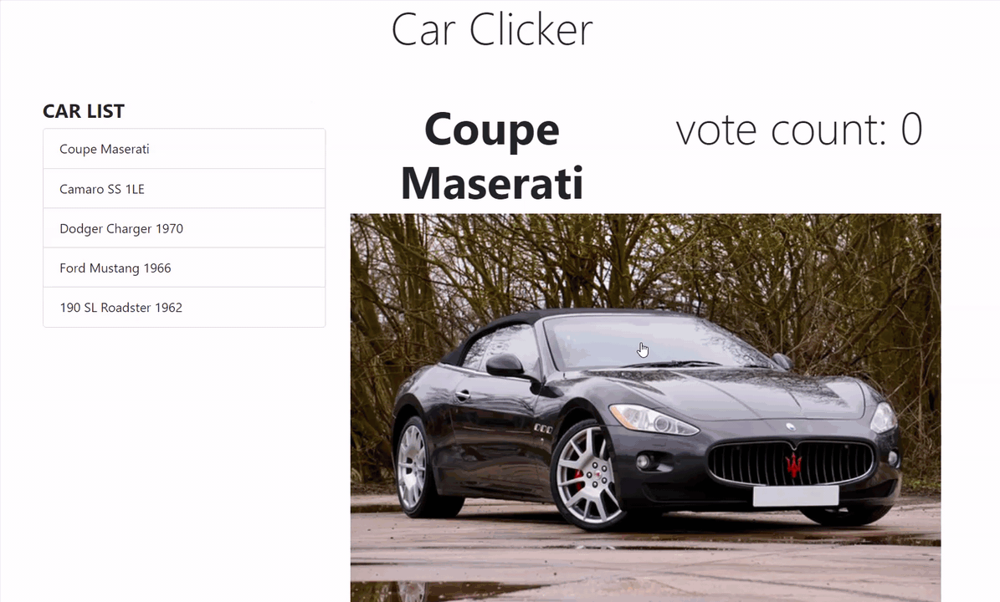

# MVC (Model–view–controller)

## Materials
+ Pattern Description
+ Key Concepts
+ Pattern Example
+ Advantages
+ Disadvantages
+ Summary

## Pattern Description

MVC stands for model-view-controller. Here's what each of those components mean:

* Model: The backend that contains all the data logic.
  > The model's job is to simply manage the data. Whether the data is from a database, API, or a JSON object, the model is responsible for managing it.
* View: The frontend or graphical user interface (GUI).
  > The view is a visual representation of the data like a chart, diagram, table, form.
    The view contains all functionality that directly interacts with the user like clicking a button, or an enter event.
* Controller: The brains of the application that controls how data is displayed.
  > The controller connects the model and view. The controller converts inputs from the view to demands to retrieve/update data in the model.
  The controller receives input from view, uses logic to translate the input to a demand for the model, the model grabs the data, the controller passes data from the model back to the view for the user to see in a display.

The concept of MVCs was first introduced by Trygve Reenskaug, who proposed it as a way to develop desktop application [GUIs](https://folk.universitetetioslo.no/trygver/themes/mvc/mvc-index.html).

## Key concepts
### Separation of Concerns

MVC design allows for Separation of Concerns - dividing the logic up between the 3 buckets, so that each bucket can act independently.
The model, view, and controller don’t depend on each other. Why does this matter? Generally, software is worked on by teams - a team might have a designer, engineer, and database architect. Separation of concerns means each team member can work on their piece at the same time, because logic has been separated into buckets. Separation of concerns is also great for maitenance - developers can fix a bug in one piece of code, without having to check out the other pieces of code.

### Loose Coupling

Loose Coupling means that each piece: the model, view and controller, act independently of each other.
Developers can modify one of the pieces, and the other 2 pieces should keep working and not require modifications. When designing MVC software – the logic in each of the three buckets is independent. Everything in View acts independently of the model – and vice verse, the view won’t have any logic dependent on the model.
Making independent models and views makes code organization simple and easy to understand and keeps maintenance easier. Programmers can fix a bug in the view without changing the model code.

### Easier to re-use
Since Components are isolated and have very explicit communication semantics, they are ideally suited for re-use.

## Pattern example
To better illustrate the MVC pattern, lets look at this application.

[Gir repository](https://github.com/RafaelDavisH/car-clicker/blob/main/README.md) |
[Live version](https://rafaeldavish.github.io/car-clicker/)

Here are some of the major differences in app:

### Model (data)
In the Car Clicker application, the model object contains an array of car objects with all the information (data) needed for the app.
It also manages the current car being displayed.

### Views (UI)
The view's job is to decide what the user will see on their screen, and how.

The Car Clicker app has two views: <i><b>carListView</b></i> and <i><b>CarView</b></i>.

Both views have two critical functions that define what each view wants to initialize and render.
These functions are where the app decides what the user will see and how.

### Controller

The controller's responsibility is to pull, modify, and provide data to the user. Essentially, the controller is the link between the view and model.
Through getter and setter functions, the controller pulls data from the model and initializes the views.
If there are any updates from the views, it modifies the data with a setter function.

## Advantages
* Multiple developers can work with the three layers (Model, View, and Controller) simultaneously.
* Offers improved scalability, that supplements the ability of the application to grow.
* As components have a low dependency on each other, they are easy to maintain.
* A model can be reused by multiple views which provides reusability of code.
* Adoption of MVC makes an application more expressive and easy to understand.
* Each part can be tested independently (Model, view, controller)

## Disadvantages
* The framework navigation can be complex because it introduces new layers of abstraction and requires users to adapt to the decomposition criteria of MVC.
* Knowledge on multiple technologies becomes the norm. Developers using MVC need to be skilled in multiple technologies.

## Summary
This technology allows creating reusable and separate models that can be easily upgraded. Time taken to develop applications become less, and the developers create an efficient application. The MVC theory is a basic concept of computer programming and helps in giving several web development services and projects.

