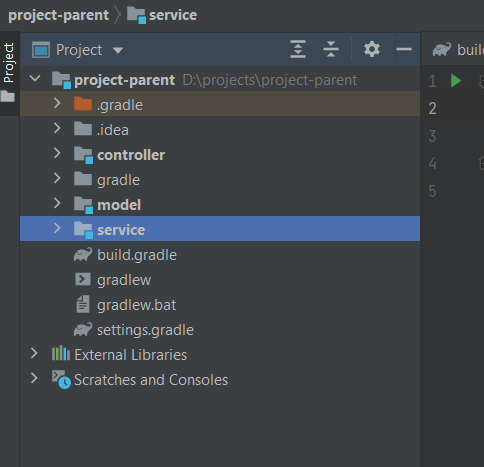
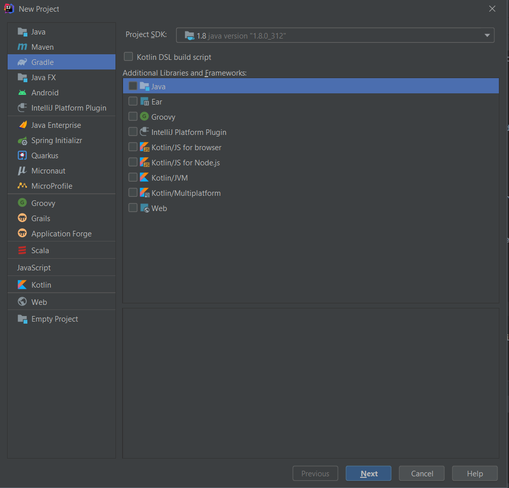
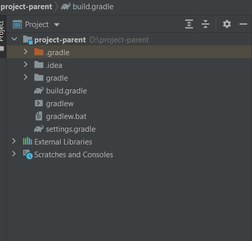
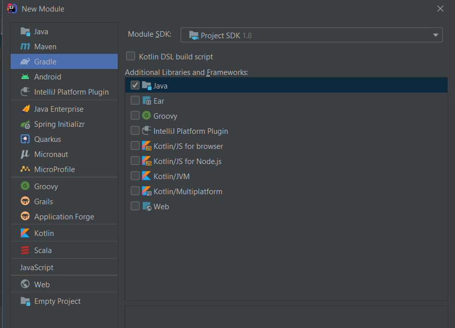
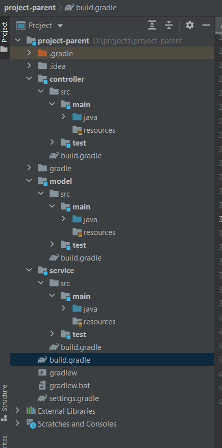
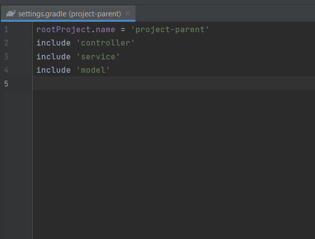
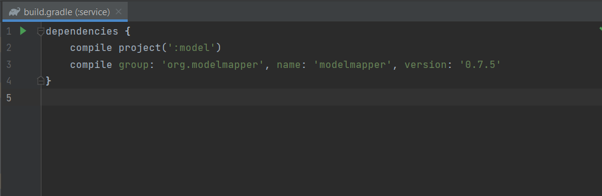

# Gradle Modules

## Materials
+ The main reasons for using multiple modules
+ Advantage
+ Downside

## The main reasons for using multiple modules

When projects become bigger, however, we might want to split our codebase into multiple build modules for better maintainability and understandability.

## Advantage

* <b>Reuse</b> - The main advantage of using multiple modules is that they are reusable, while individual modules often contain multiple functionality that is not necessarily related to each other and is impractical for reuse. It depends on the size of the project, but for larger projects, multiple modules are more beneficial.

* <b>Updating and modifying</b> - Updating Several modules also make it easy to update and change the system. If any error is found, only the module containing it will need to be updated, not the entire system.

* <b>Compile time</b> - Better for a system with a large number of modules, since they do not have to be compiled for small changes.

* <b>Testing</b> Testing small units can reduce bugs as they can be precisely tied to a particular unit.

* <b>Replacing</b> - Replacing a module with another depending on the interface.

## Downside
* Multiple modules can be more difficult to maintain. If they exist in large numbers and are not well documented, tracking dependencies can also be challenging. 

For a better understanding of the multi modules in gradle let's create a gradle project that will be the parent for all modules and contain the main configuration of the project.

This simple application consists of three modules:
1. project-parent - Root of the project. Includes all modules. Used for general configuration of the project.
2. Module1. Controller - Accepts the test request and returns the response.
3. Module2. Service - Simulates the execution of logic and converts data.
4. Module3. Model - The main component for getting data from the database. By analogy, you can use a repository module that returns a model.



Go to File -> New -> Project



Click to Gradle (Project builder). Make sure that all additional libraries are checked out as they will not be needed for the project root.

Click next and enter the name of the project. After that apply changes.

After building we can see the next structure of the project.



The next steps will involve creating modules.

Go to Root of the project -> New -> Module



Click to Gradle (Project builder). Make sure that additional library "Java" is checked.

Click next and enter the name of the module. After that apply changes.

For each module, the same actions must be provided but with a different module names.

After completing all the steps, the project structure should look like this.



settings.gradle file of the root project should include all modules.




Next, we need to configure the gradle.build for the parent-project, which will consist of three chats: *buildscript*, *allprojects*, *subprojects*.
```groovy
    buildscript {

    ext {
        springBootVersion = '2.1.15.RELEASE'
    }

    repositories {
        mavenCentral()
    }

    dependencies {
        classpath("org.springframework.boot:spring-boot-gradle-plugin:${springBootVersion}")
    }
}

allprojects {
    group 'com.gradle.project'
    version '1.0-SNAPSHOT'
}

subprojects {
    apply plugin: 'java'
    apply plugin: 'idea'
    apply plugin: 'io.spring.dependency-management'

    ext {
        springBootVersion = '2.1.15.RELEASE'
        lombokVersion = '1.18.22'
    }

    sourceCompatibility = 1.8
    targetCompatibility = 1.8

    repositories {
        mavenCentral()
    }

    dependencies{
        compile("org.springframework.boot:spring-boot-starter:${springBootVersion}")
        compileOnly group: 'org.projectlombok', name: 'lombok', version: "${lombokVersion}"
        annotationProcessor group: 'org.projectlombok', name: 'lombok', version: "${lombokVersion}"
        testCompile group: 'junit', name: 'junit', version: '4.12'
    }
}
```

* *buildscript* - Specifies how the project will be built.
* *allprojects* - Group and version assignment for all modules.
* *subprojects* - Using plugins, dependencies and the main repository to get them for all sub modules.

For example: The model and service uses the lombok library, which is moved to the project root to avoid duplication. Also, all sub-modules use spring dependencies, all of them will be received from mavenCentral repository. All plugins will be applied to modules, which allow us to run the application, inherit versions of dependencies and apply gradle tasks in them.


To add the required dependencies to a specific module, we can specify them in the dependencies block build.gradle file of a specific module.



How we can see this module also depends on the *model* sub-project. Whose dependencies are required for the service module. In this case, we are not talking about libraries, but about specific objects located in the model module.

This way we can separate the logic located in different modules and link the modules together, avoiding duplication of dependencies and code. We can also replace one module to another, observing the interface of a particular module.

As in the previous example, each module has only those dependencies that it needs. All common dependencies are moved into the root of the project.
