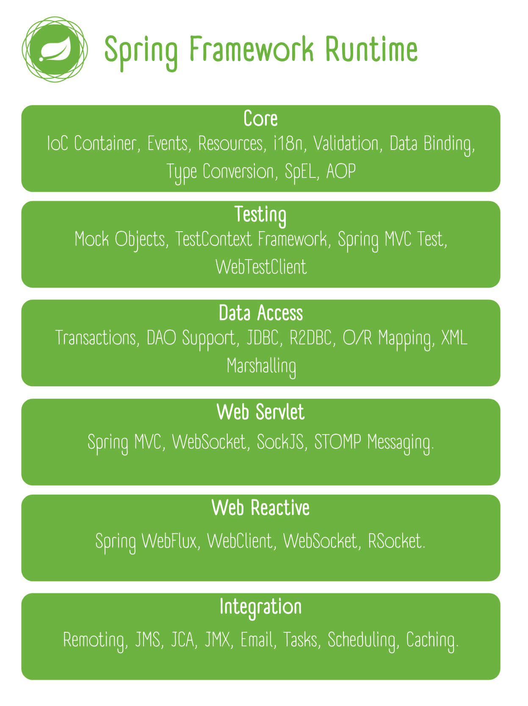

# Spring Architecture

## Materials
+ Design Philosophy
+ Modules

## Design Philosophy

When you learn about a framework, it’s important to know not only what it does but what principles it follows. Here are
the guiding principles of the Spring Framework:

* Provide choice at every level. Spring lets you defer design decisions as late as possible. For example, you can switch
  persistence providers through configuration without changing your code. The same is true for many other infrastructure
  concerns and integration with third-party APIs.
* Accommodate diverse perspectives. Spring embraces flexibility and is not opinionated about how things should be done.
  It supports a wide range of application needs with different perspectives.
* Maintain strong backward compatibility. Spring’s evolution has been carefully managed to force few breaking changes
  between versions. Spring supports a carefully chosen range of JDK versions and third-party libraries to facilitate
  maintenance of applications and libraries that depend on Spring.
* Care about API design. The Spring team puts a lot of thought and time into making APIs that are intuitive and that
  hold up across many versions and many years.
* Set high standards for code quality. The Spring Framework puts a strong emphasis on meaningful, current, and accurate
  javadoc. It is one of very few projects that can claim clean code structure with no circular dependencies between
  packages.

## Modules

The Spring Framework is divided into modules. Applications can choose which modules they need. At the heart are the
modules of the core container, including a configuration model and a dependency injection mechanism. Beyond that, the
Spring Framework provides foundational support for different application architectures, including messaging,
transactional data and persistence, and web. It also includes the Servlet-based Spring MVC web framework and, in
parallel, the Spring WebFlux reactive web framework.

### Core

The [Core][1] consists of the Core, Beans, Context, and Expression Language modules.

The [Core and Beans][1] modules provide the fundamental parts of the framework, including the IoC and Dependency
Injection features. The BeanFactory is a sophisticated implementation of the factory pattern. It removes the need for
programmatic singletons and allows you to decouple the configuration and specification of dependencies from your actual
program logic.

The [Context][2] module builds on the solid base provided by the [Core and Beans][1] modules: it is a means to access
objects in a framework-style manner that is similar to a JNDI registry. The Context module inherits its features from
the Beans module and adds support for internationalization (using, for example, resource bundles), event-propagation,
resource-loading, and the transparent creation of contexts by, for example, a servlet container. The Context module also
supports Java EE features such as EJB, JMX ,and basic remoting. The ApplicationContext interface is the focal point of
the Context module.

The [Expression Language][3] module provides a powerful expression language for querying and manipulating an object
graph at runtime. It is an extension of the unified expression language (unified EL) as specified in the JSP 2.1
specification. The language supports setting and getting property values, property assignment, method invocation,
accessing the context of arrays, collections and indexers, logical and arithmetic operators, named variables, and
retrieval of objects by name from Spring’s IoC container. It also supports list projection and selection as well as
common list aggregations.

### Data Access/Integration

The Data Access/Integration layer consists of the JDBC, ORM, OXM, JMS and Transaction modules.

The [JDBC][4] module provides a JDBC-abstraction layer that removes the need to do tedious JDBC coding and parsing of
database-vendor specific error codes.

The [ORM][5] module provides integration layers for popular object-relational mapping APIs, including JPA, JDO, and
Hibernate. Using the ORM package you can use all of these O/R-mapping frameworks in combination with all of the other
features Spring offers, such as the simple declarative transaction management feature mentioned previously.

The [OXM][6] module provides an abstraction layer that supports Object/XML mapping implementations for JAXB, Castor,
XMLBeans, JiBX and XStream.

The Java Messaging Service ([JMS][7]) module contains features for producing and consuming messages.

The [Transaction][8] module supports programmatic and declarative transaction management for classes that implement
special interfaces and for all your POJOs (plain old Java objects).

### Web

The Web layer consists of the Web, Web Servlet and Web Reactive modules.

Spring’s Web module provides basic web-oriented integration features such as multipart file-upload functionality and the
initialization of the IoC container using servlet listeners and a web-oriented application context. It also contains the
web-related parts of Spring’s remoting support.

The Web-Servlet module contains Spring’s model-view-controller ([MVC][9]) implementation for web applications. Spring’s
MVC framework provides a clean separation between domain model code and web forms, and integrates with all the other
features of the Spring Framework.

Parallel to Spring Web MVC, Spring Framework 5.0 introduced a reactive-stack web framework whose
name, [“Spring WebFlux”][10]
is also based on its source module.

### AOP and Instrumentation

Spring’s [AOP][11] module provides an AOP Alliance-compliant aspect-oriented programming implementation allowing you to
define, for example, method-interceptors and pointcuts to cleanly decouple code that implements functionality that
should be separated. Using source-level metadata functionality, you can also incorporate behavioral information into
your code, in a manner similar to that of .NET attributes.

The separate Aspects module provides integration with AspectJ.

The Instrumentation module provides class instrumentation support and classloader implementations to be used in certain
application servers.

### Test

The [Test][12] module supports the testing of Spring components with JUnit or TestNG. It provides consistent loading of
Spring ApplicationContexts and caching of those contexts. It also provides mock objects that you can use to test your
code in isolation.

### A note about modules

Spring’s framework jars allow for deployment to JDK 9’s module path ("Jigsaw"). For use in Jigsaw-enabled applications,
the Spring Framework 5 jars come with "Automatic-Module-Name" manifest entries which define stable language-level module
names ("spring.core", "spring.context", etc.) independent from jar artifact names (the jars follow the same naming
pattern with "-" instead of ".", e.g. "spring-core" and "spring-context"). Of course, Spring’s framework jars keep
working fine on the classpath on both JDK 8 and 9+.

[1]: https://docs.spring.io/spring-framework/docs/5.3.x/reference/html/core.html#spring-core

[2]: https://docs.spring.io/spring-framework/docs/5.3.x/reference/html/core.html#context-introduction

[3]: https://docs.spring.io/spring-framework/docs/5.3.x/reference/html/core.html#expressions

[4]: https://docs.spring.io/spring-framework/docs/5.3.x/reference/html/data-access.html#jdbc

[5]: https://docs.spring.io/spring-framework/docs/5.3.x/reference/html/data-access.html#orm

[6]: https://docs.spring.io/spring-framework/docs/5.3.x/reference/html/data-access.html#oxm

[7]: https://docs.spring.io/spring-framework/docs/5.3.x/reference/html/integration.html#jms

[8]: https://docs.spring.io/spring-framework/docs/5.3.x/reference/html/data-access.html#transaction

[9]: https://docs.spring.io/spring-framework/docs/5.3.x/reference/html/web.html#mvc

[10]: https://docs.spring.io/spring-framework/docs/5.3.x/reference/html/web-reactive.html#spring-webflux

[11]: https://docs.spring.io/spring-framework/docs/5.3.x/reference/html/core.html#aop

[12]: https://docs.spring.io/spring-framework/docs/5.3.x/reference/html/testing.html#testing
